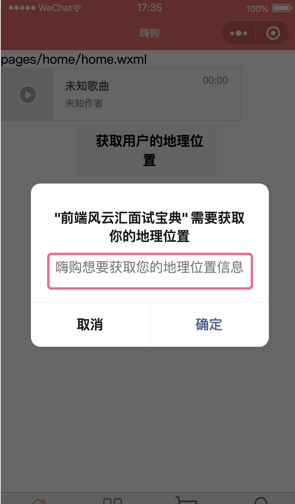
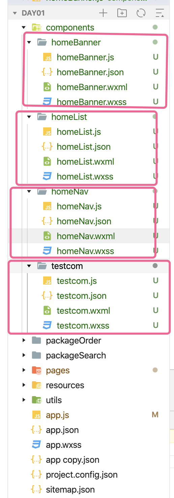
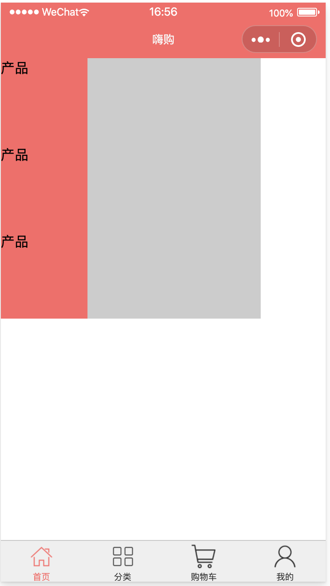
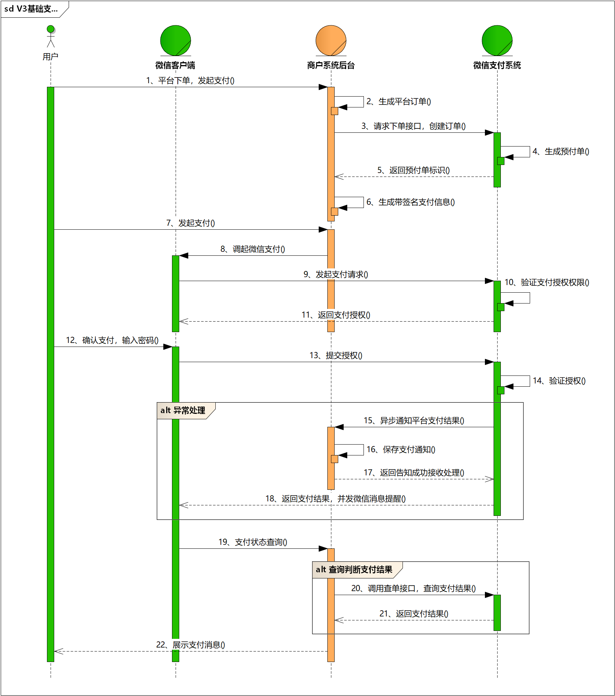
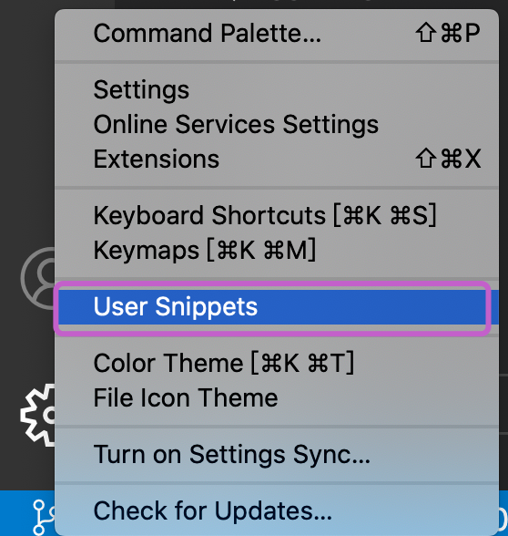
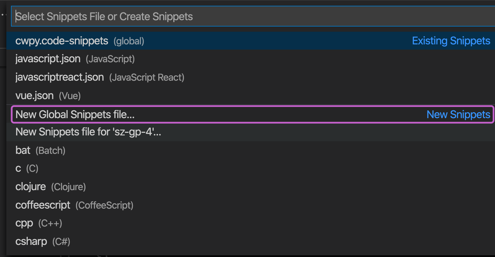

# 一.小程序项目
## 1.创建小程序项目

## 2.了解目录结构

```
pages // 小程序页面
utils // 工具
	app.js // 全局逻辑文件
	app.json // 全局的配置文件
	app.wxss // 全局的样式文件
	project.config.json // 项目的配置文件
	sitemap.json // 小程序被搜索的设置
```

## 3.全局配置

### 1.[pages](https://developers.weixin.qq.com/miniprogram/dev/reference/configuration/app.html#pages)

创建各个页面

pages选项代表项目的各个页面的路径列表，可以理解为vue以及react的路由配置文件

pages第一个元素就是小程序的默认页面

```json
{
	"pages": [
    "pages/home/home",
    "pages/index/index",
    "pages/logs/logs",
    "pages/kind/kind",
    "pages/cart/cart",
    "pages/user/user",
    "pages/login/login",
    "pages/register/register",
    "pages/detail/detail",
    "pages/search/search",
    "pages/order/order"
  ]
}
```

### 2.[entryPagePath](https://developers.weixin.qq.com/miniprogram/dev/reference/configuration/app.html#entryPagePath)

小程序工具中的 添加编译模式的 代码实现

为了调试方便而增加的功能

```json
{
	"entryPagePath": "pages/home/home"
}
```

### 3.[window](https://developers.weixin.qq.com/miniprogram/dev/reference/configuration/app.html#window)

全局的默认窗口表现

```json
{
	"window": {
		"navigationBarBackgroundColor": "#f66", // 导航栏的背景颜色
    "navigationBarTextStyle": "white",	 // 导航栏的标题颜色，只支持 black / white
    "navigationBarTitleText": "嗨购", // 导航栏文字标题内容
    "navigationStyle": "custom", // 需要自定义导航的头部内容，默认值为default,一般不在全局设置，可以根据业务页面单独设置
    "backgroundColor": "#00ff00", // 窗口的背景颜色，可以和 enablePullDownRefresh 配合查看效果，默认值为#ffffff
    "enablePullDownRefresh": true, // 开启全局的下拉刷新， 一般不在全局设置，根据业务需求单独在页面设置
    "backgroundTextStyle": "black", // 下拉loading的样式，仅支持 dark / light
    "onReachBottomDistance": 100, // 页面触发上拉触底事件时距离底部的距离，数据类型为 number 类型，默认为 50
    "pageOrientation": "portrait" // 横竖屏浏览 portrait竖屏  landscape横屏 auto跟随系统的横竖屏切换，默认值为auto
	}
}
```

本项目配置为：

```json
{
	"window": {
    "backgroundTextStyle": "light",
    "navigationBarBackgroundColor": "#f66",
    "navigationBarTitleText": "嗨购",
    "navigationBarTextStyle": "white"
  }
}
```

### 4.[tabBar](https://developers.weixin.qq.com/miniprogram/dev/reference/configuration/app.html#tabBar)

底部 `tab` 栏的表现

配合阿里字体图标 -> 加入购物车->选择下载素材->填写字体颜色以及图标的大小

```json
{
  "tabBar": {
    "color": "#333",
    "selectedColor": "#f66",
    "backgroundColor": "#efefef",
    "borderStyle": "black", // 上边框的颜色
    "custom": true, // 自定义底部tab栏， 一般不设置
    “position: "top", // 顶部的选项卡，图标要自动小时
    "list": [
      {
        "text": "首页",
        "pagePath": "pages/home/home",
        "iconPath": "resources/tabs/home.png", // 图标不支持网络地址，建议81*81px，不超过40KB
        "selectedIconPath": "resources/tabs/home-active.png"
      },
      {
        "text": "分类",
        "pagePath": "pages/kind/kind",
        "iconPath": "resources/tabs/kind.png",
        "selectedIconPath": "resources/tabs/kind-active.png"
      },
      {
        "text": "购物车",
        "pagePath": "pages/cart/cart",
        "iconPath": "resources/tabs/cart.png",
        "selectedIconPath": "resources/tabs/cart-active.png"
      },
      {
        "text": "我的",
        "pagePath": "pages/user/user",
        "iconPath": "resources/tabs/user.png",
        "selectedIconPath": "resources/tabs/user-active.png"
      }
    ]
  }
}
```

### 5.[networkTimeout](https://developers.weixin.qq.com/miniprogram/dev/reference/configuration/app.html#networkTimeout)

网络超时时间,默认值都为 60000，也就是60秒

```json
{
	"networkTimeout": {
    "request": 6000,
    "uploadFile": 6000,
    "downloadFile": 6000,
    "connectSocket": 6000
  },
}
```

### 6.[debug](https://developers.weixin.qq.com/miniprogram/dev/reference/configuration/app.html#debug)

是否开启debug模式，默认是关闭的

```json
{
	"debug": true
}
```

### 7.[functionalPages](https://developers.weixin.qq.com/miniprogram/dev/reference/configuration/app.html#functionalPages)

是否开启插件功能页

```json
{
	"functionalPages": false,
}
```

### 8.[subpackages](https://developers.weixin.qq.com/miniprogram/dev/reference/configuration/app.html#subpackages)

分包结构的配置

启用[分包加载](https://developers.weixin.qq.com/miniprogram/dev/framework/subpackages.html)时，声明项目分包结构。

目前小程序分包大小有以下限制：

- 整个小程序所有分包大小不超过 16M ---- 开发者工具说是20M
- 单个分包/主包大小不能超过 2M

对小程序进行分包，可以优化小程序首次启动的下载时间，以及在多团队共同开发时可以更好的解耦协作。

#### 1.[使用分包](https://developers.weixin.qq.com/miniprogram/dev/framework/subpackages/basic.html)


```json
{
  "entryPagePath": "packageSearch/pages/search/search", // 入口文件的配置
  "pages": [
    "pages/home/home",
    "pages/index/index",
    "pages/logs/logs",
    "pages/kind/kind",
    "pages/cart/cart",
    "pages/user/user",
    "pages/login/login",
    "pages/register/register",
    "pages/detail/detail",
    "pages/activity/activity"
  ],
  "subPackages": [ // 分包加载，配置完成自动添加 小程序的页面
    {
      "root": "packageOrder", // 分包根目录
      "name": "order", // 分包别名，分包预下载时可以使用
      "independent": true, // 是否采用独立分包
      "pages": [ // 分包页面路径，相对与分包根目录
        "pages/order/order" 
      ]
    },
    {
      "root": "packageSearch",
      "name": "search",
      "pages": [
        "pages/search/search"
      ]
    }
  ]
}
```

#### 2.[独立分包](https://developers.weixin.qq.com/miniprogram/dev/framework/subpackages/independent.html)

从独立分包中页面进入小程序时，不需要下载主包

当用户进入普通分包或主包内页面时，主包才会被下载。

当小程序从普通的分包页面启动时，需要首先下载主包

独立分包不依赖主包即可运行

很大程度上提升分包页面的启动速度

独立分包中暂时不支持使用插件

#### 3.[分包预下载](https://developers.weixin.qq.com/miniprogram/dev/framework/subpackages/preload.html)

```json
{
  "entryPagePath": "pages/home/home",
  "pages": [
    "pages/home/home",
    "pages/index/index",
    "pages/logs/logs",
    "pages/kind/kind",
    "pages/cart/cart",
    "pages/user/user",
    "pages/login/login",
    "pages/register/register",
    "pages/detail/detail",
    "pages/activity/activity"
  ],
  "subPackages": [
    {
      "root": "packageOrder",
      "name": "order",
      "pages": [
        "pages/order/order"
      ]
    },
    {
      "root": "packageSearch",
      "name": "search",
      "independent": true,
      "pages": [
        "pages/search/search"
      ]
    }
  ],
  "preloadRule": {
    "pages/home/home": { // 当访问程序的主包 pages/home/home页面时，预下载 search 的分包（）
      "network": "wifi", // all 不限制网络， wifi 仅在wifi下 预下载
      "packages": ["search"] // packages 可以是 分包中的name 属性或者是 root
    }
  }
  
}
```

同一个分包中的页面享有共同的预下载大小限额 2M，限额会在工具中打包时校验。

如，页面 A 和 B 都在同一个分包中，A 中预下载总大小 0.5M 的分包，B中最多只能预下载总大小 1.5M 的分包。

### 9.[workers](https://developers.weixin.qq.com/miniprogram/dev/reference/configuration/app.html#workers)

使用 [Worker](https://developers.weixin.qq.com/miniprogram/dev/framework/workers.html) 处理多线程任务时，设置 `Worker` 代码放置的目录

视需求而定是否使用 postMessage / onMessage

### 10.[requiredBackgroundModes](https://developers.weixin.qq.com/miniprogram/dev/reference/configuration/app.html#requiredBackgroundModes)

申明需要后台运行的能力，类型为数组。目前支持以下项目：

- `audio`: 后台音乐播放
- `location`: 后台定位

```json
{
	"requiredBackgroundModes": ["audio", "location"]
}
```

Pages/home/home

```html
<audio controls src="https://isure.stream.qqmusic.qq.com/C400004Hob7602cvbM.m4a?guid=8332585312&vkey=DD8DA0FD37AE111655A7DBA2AE9EC3630E371F1D7D3622120DBF86690245E52C299DC4622A62C78AC084144E423C6C6F985A6AB5499BCC45&uin=7825&fromtag=66"></audio>
```

### 11.[plugins](https://developers.weixin.qq.com/miniprogram/dev/reference/configuration/app.html#plugins)

声明小程序需要使用的[插件](https://developers.weixin.qq.com/miniprogram/dev/framework/plugin/using.html)。


### 12.[usingComponents](https://developers.weixin.qq.com/miniprogram/dev/reference/configuration/app.html#usingComponents)

全局[自定义组件](https://developers.weixin.qq.com/miniprogram/dev/reference/configuration/(custom-component/README))配置

### 13.[permission](https://developers.weixin.qq.com/miniprogram/dev/reference/configuration/app.html#permission)

小程序接口权限的相关设置，字段类型为 `Object`

```
{
	"permission": {
    "scope.userLocation": {
      "desc": "嗨购想要获取您的地理位置信息"
    }
  },
}
```

Pages/home/home.wxml

```
<button bindtap="getLocation">获取用户的地理位置</button>
```

Pages/home/home.js

```
Page({
	data () {},
	getLocation () {
    wx.getLocation({
      success: (res) => {
        console.log(res)
      }
    })
  },
})
```



## 4.框架

全局的对象 App

页面的对象 Page

组件的对象 Component

### 1.小程序App

注册小程序，必须在 app.js 中调用，必须调用且只能调用一次。

| 属性                                                         | 类型     | 默认值 | 必填 | 说明                                                         | 最低版本                                                     |
| :----------------------------------------------------------- | :------- | :----- | :--- | :----------------------------------------------------------- | :----------------------------------------------------------- |
| [onLaunch](https://developers.weixin.qq.com/miniprogram/dev/reference/api/App.html#onLaunch-Object-object) | function |        | 否   | 生命周期回调——监听小程序初始化。                             |                                                              |
| [onShow](https://developers.weixin.qq.com/miniprogram/dev/reference/api/App.html#onShow-Object-object) | function |        | 否   | 生命周期回调——监听小程序启动或切前台。                       |                                                              |
| [onHide](https://developers.weixin.qq.com/miniprogram/dev/reference/api/App.html#onHide) | function |        | 否   | 生命周期回调——监听小程序切后台。                             |                                                              |
| [onError](https://developers.weixin.qq.com/miniprogram/dev/reference/api/App.html#onError-String-error) | function |        | 否   | 错误监听函数。                                               |                                                              |
| [onPageNotFound](https://developers.weixin.qq.com/miniprogram/dev/reference/api/App.html#onPageNotFound-Object-object) | function |        | 否   | 页面不存在监听函数。                                         | [1.9.90](https://developers.weixin.qq.com/miniprogram/dev/framework/compatibility.html) |
| [onUnhandledRejection](https://developers.weixin.qq.com/miniprogram/dev/reference/api/App.html#onUnhandledRejection-Object-object) | function |        | 否   | 未处理的 Promise 拒绝事件监听函数。                          | [2.10.0](https://developers.weixin.qq.com/miniprogram/dev/framework/compatibility.html) |
| [onThemeChange](https://developers.weixin.qq.com/miniprogram/dev/reference/api/App.html#onThemeChange-Object-object) | function |        | 否   | 监听系统主题变化                                             | [2.11.0](https://developers.weixin.qq.com/miniprogram/dev/framework/compatibility.html) |
| 其他                                                         | any      |        | 否   | 开发者可以添加任意的函数或数据变量到 `Object` 参数中，用 `this` 可以访问 |                                                              |

页面中通过 getApp() 获取到全局的 App的实例对象

### 2.Page

注册小程序的页面

| 属性                                                         | 类型     | 默认值 | 必填 | 说明                                                         |
| :----------------------------------------------------------- | :------- | :----- | :--- | :----------------------------------------------------------- |
| [data](https://developers.weixin.qq.com/miniprogram/dev/reference/api/Page.html#data) | Object   |        |      | 页面的初始数据                                               |
| options                                                      | Object   |        |      | 页面的组件选项，同 [`Component` 构造器](https://developers.weixin.qq.com/miniprogram/dev/reference/api/Component.html) 中的 `options` ，需要基础库版本 [2.10.1](https://developers.weixin.qq.com/miniprogram/dev/framework/compatibility.html) |
| [onLoad](https://developers.weixin.qq.com/miniprogram/dev/reference/api/Page.html#onLoad-Object-query) | function |        |      | 生命周期回调—监听页面加载                                    |
| [onShow](https://developers.weixin.qq.com/miniprogram/dev/reference/api/Page.html#onShow) | function |        |      | 生命周期回调—监听页面显示                                    |
| [onReady](https://developers.weixin.qq.com/miniprogram/dev/reference/api/Page.html#onReady) | function |        |      | 生命周期回调—监听页面初次渲染完成                            |
| [onHide](https://developers.weixin.qq.com/miniprogram/dev/reference/api/Page.html#onHide) | function |        |      | 生命周期回调—监听页面隐藏                                    |
| [onUnload](https://developers.weixin.qq.com/miniprogram/dev/reference/api/Page.html#onUnload) | function |        |      | 生命周期回调—监听页面卸载                                    |
| [onPullDownRefresh](https://developers.weixin.qq.com/miniprogram/dev/reference/api/Page.html#onPullDownRefresh) | function |        |      | 监听用户下拉动作                                             |
| [onReachBottom](https://developers.weixin.qq.com/miniprogram/dev/reference/api/Page.html#onReachBottom) | function |        |      | 页面上拉触底事件的处理函数                                   |
| [onShareAppMessage](https://developers.weixin.qq.com/miniprogram/dev/reference/api/Page.html#onShareAppMessage-Object-object) | function |        |      | 用户点击右上角转发                                           |
| [onShareTimeline](https://developers.weixin.qq.com/miniprogram/dev/reference/api/Page.html#onShareTimeline) | function |        |      | 用户点击右上角转发到朋友圈                                   |
| [onAddToFavorites](https://developers.weixin.qq.com/miniprogram/dev/reference/api/Page.html#onAddToFavorites-Object-object) | function |        |      | 用户点击右上角收藏                                           |
| [onPageScroll](https://developers.weixin.qq.com/miniprogram/dev/reference/api/Page.html#onPageScroll-Object-object) | function |        |      | 页面滚动触发事件的处理函数                                   |
| [onResize](https://developers.weixin.qq.com/miniprogram/dev/reference/api/Page.html#onResize-Object-object) | function |        |      | 页面尺寸改变时触发，详见 [响应显示区域变化](https://developers.weixin.qq.com/miniprogram/dev/framework/view/resizable.html#在手机上启用屏幕旋转支持) |
| [onTabItemTap](https://developers.weixin.qq.com/miniprogram/dev/reference/api/Page.html#onTabItemTap-Object-object) | function |        |      | 当前是 tab 页时，点击 tab 时触发                             |
| 其他                                                         | any      |        |      | 开发者可以添加任意的函数或数据到 `Object` 参数中，在页面的函数中用 `this` 可以访问 |

#### getCurrentPages()

获取当前页面栈。数组中第一个元素为首页，最后一个元素为当前页面。


### 3.Component

创建自定义组件，接受一个 Object 类型的参数。


#### 1.创建组件



#### 2.页面内使用

注册组件，在页面配置中注册组件

```json
// pages/home/home.json
{
  "usingComponents": {
    "testcom": "/components/testcom/testcom"
  }
}
```

```html
// pages/home/home.wxml
<testcom></testcom>
```

#### 3.分享补充

````js
this.loading = true
$.ajax({
	url: '',
	method: '',
	success: function() {}, // promise.then()
	fail: function () {}, // promise.catch()
	complete: function () { this.loading = false } // promise.finally()
})


new Vue({
  data: {
    obj: {
      a: 10
    }
  },
  mounted () {
    this.obj.a = 20
  },
  watch: {
    obj: function (newVal) {
      console.log(newVal)
    }
  }
})
````

#### 4.自定义组件的属性

```js
// components/testcom/testcom.js
Component({
  /**
   * 组件的属性列表
   */
  properties: { // 类似于vue的props作用
    num: String
  },

  /**
   * 组件的初始数据
   */
  data: {
    msg: 'hello minpro',
    count: 0,
    obj: {
      a: 10
    }
  },
  /**
   * 组件生命周期函数-在组件实例刚刚被创建时执行
   * 注意此时不能调用 setData
   */
  created () {

  },
  /**
   * 组件生命周期函数-在组件布局完成后执行
   */
  ready () {

  },
  /**
   * 组件生命周期函数-在组件实例被移动到节点树另一个位置时执行
   */
  moved () {

  },
  /**
   * 组件生命周期函数-在组件实例被从页面节点树移除时执行 --
   * destoryed
   */
  detached () {},
  /**
   * 组件生命周期函数-在组件实例进入页面节点树时执行
   * 理解为mounted
   */
  attached () {
    this.setData({
      count: this.data.count + 1
    })
  },
  /**
   * 组件数据字段监听器，用于监听 properties 和 data 的变化
   * 类似于vue的watch
   * 
   */
  observers: {
    'count': function (val) {
      console.log(val)
    },
    'obj': function (val) {
      console.log('11', val)
    }
  },
  /**
   * 组件的方法列表
   */
  methods: {
    addcount () {
      // this.setData({
      //   count: this.data.count + 1
      // })
      this.setData({
        obj: {
          a: 20
        }
      })
    }
  }
})

```

#### 5.behaviors ---- vue的mixins

```js
// mybehaviors.js
module.exports = Behavior({
  /**
   * 组件的属性列表
   */
  properties: { // 类似于vue的props作用
    num: String
  },

  /**
   * 组件的初始数据
   */
  data: {
    msg: 'hello minpro',
    count: 0,
    obj: {
      a: 10
    }
  },
  /**
   * 组件生命周期函数-在组件实例进入页面节点树时执行
   * 理解为mounted
   */
  attached () {
    this.setData({
      count: this.data.count + 1
    })
  },
  /**
   * 组件数据字段监听器，用于监听 properties 和 data 的变化
   * 类似于vue的watch
   * 
   */
  observers: {
    'count': function (val) {
      console.log(val)
    },
    'obj': function (val) {
      console.log('11', val)
    }
  },
  /**
   * 组件的方法列表
   */
  methods: {
    addcount () {
      // this.setData({
      //   count: this.data.count + 1
      // })
      this.setData({
        obj: {
          a: 20
        }
      })
    }
  }
})
```

```js
// components/testcom/testcom.js
const mybehavior = require('./mybehavior')
Component({
  behaviors: [mybehavior] // mixins: [MyMixins]
})

```

#### 6.relations --- 

demo

```html
<!-- components/testcom/testcom.wxml -->
<custom-ul>
  <custom-li>11111</custom-li>
  <custom-li>22222</custom-li>
</custom-ul>
```

```json
// components/testcom/testcom.json
{
  "component": true,
  "usingComponents": {
    "custom-ul": "/components/customul/customul",
    "custom-li": "/components/customli/customli"
  }
}
```

```js
// components/customul/customul.js
Component({
  relations: {
    './../customli/customli': {
      type: 'child'
    }
  }
})

```

```js
// components/custonli/customli.js
Component({
  relations: {
    './../customul/customul': {
      type: 'parent'
    }
  }
})

```

```html
<!-- components/customul/customul.wxml -->
<view>
  <slot></slot>
</view>
```

```html
<!-- components/customli/customli.wxml -->
<view>
   这里是li<slot></slot>
</view>
```

#### 7.自定义UI组件

小程序没有ul与li标签，自定义ul与li的标签

创建 myui/ul/ul 组件 和 myui/li/li 组件

全局注册了组件

```json
// app.json
{
	"usingComponents": {
    "ul": "/myui/ul/ul",
    "li": "/myui/li/li"
  }
}
```

```html
<!-- pages/home/home.wxml -->

<ul>
  <li></li>
  <li></li>
  <li></li>
</ul>
```

```html
<!-- myui/ul/ul.wxml -->
<view>
  <slot></slot>
</view>
```

```html
<!-- myui/li/li.wxml -->
<view>
  <slot></slot>
</view>
```

如果在首页给li添加了 组件的使用 homeList

```json
// pages/home/home.json
{
  "usingComponents": {
    "homeList": "/components/homeList/homeList"
  }
}
```

```html
<!-- pages/home/home.wxml -->
<ul>
  <li><homeList /></li>
  <li><homeList /></li>
  <li><homeList /></li>
</ul>
```

如果要给ul和li添加样式处理，需要注意，小程序的组件的样式彼此之间不可以共享

此时需要使用 小程序的 组件 需要 **接受的外部样式类**

```css
/* pages/home/home.wxss */
.prolist {
  width: 300px;
  height: 300px;
  background-color: #ccc;
}

.proitem {
  width: 100px;
  height: 100px;
  background-color: #f66;
}
```

```html
<!-- pages/home/home.wxml -->
<ul className="prolist">
  <li className="proitem"><homeList /></li>
  <li className="proitem"><homeList /></li>
  <li className="proitem"><homeList /></li>
</ul>
```

```js
// myui/ul/ul.js
Component({
  options: { // 使组件可以使用父级 的样式
    styleIsolation: 'apply-shared'
  },
  properties: {
    className: String
  }
})

```

```js
// myui/li/li.js
Component({
  options: {
    styleIsolation: 'apply-shared'
  },
  properties: {
    className: String
  }
})

```




#### 8.生命周期

组件的生命周期新写法lifetimes，组件所在页面的生命周期声明对象pageLifetimes


#### 9.定义段过滤器，用于自定义组件扩展

需要配合behaviors 实现

官方 计算属性 库： https://github.com/wechat-miniprogram/computed

## 5.开始项目构建

### 1.清空首页的代码

### 2.注册首页的组件

```json
// pages/home/home.json
{
  "usingComponents": {
    "homeBanner": "/components/homeBanner/homeBanner",
    "homeNav": "/components/homeNav/homeNav",
    "homeList": "/components/homeList/homeList"
  }
}
```

### 3.使用组件

```html
<!-- pages/home/home.wxml -->
<homeBanner></homeBanner>
<homeNav></homeNav>
<homeList></homeList>

```

### 4. 定义[轮播图组件](https://developers.weixin.qq.com/miniprogram/dev/component/swiper.html)

```html
<!-- components/homeBanner/homeBanner.wxml-->
<view class="swiper">
  <swiper indicator-dots="{{true}}"
  autoplay="{{false}}" interval="{{4000}}" duration="{{400}}" circular="{{ true}}">
  <swiper-item>
    1111
  </swiper-item>
  <swiper-item>
    2222
  </swiper-item>
  <swiper-item>
    3333
  </swiper-item>
</swiper>
</view>

```

```
// components/homeBanner.js
Component({
  options: {
    styleIsolation: 'apply-shared'
  },
})

```

Pages/home/home.wxss

```
/* components/homeBanner.wxss */
.swiper .wx-swiper-dot{ width: 30px;height: 10px;border-radius: 10px;}

.swiper .wx-swiper-dot.wx-swiper-dot-active{ background-color: orange}
```

### 5.封装数据请求

小程序要求数据请求 必须是https协议，域名必须添加到 安全域名中 

目前本地开发项目，选择详情- 本地设置- 勾选 不校验合法域名

utils/request.js

```js
const baseUrl ="http://localhost:3001"
export default {
  get (url, data) {
    wx.showLoading()
    return new Promise((resolve, reject) => {
      wx.request({
        url: baseUrl + url,
        data: data || {},
        method: 'GET',
        success: (res) => {
          resolve(res)
        },
        fail: () => {
          reject()
        },
        complete: () => {
          wx.hideLoading()
        }
      })
    })

  },
  post (url, data) {
    return new Promise((resolve, reject) => {
      wx.request({
        url: baseUrl + url,
        data: data || {},
        method: 'POST',
        success: (res) => {
          resolve(res)
        },
        fail: () => {
          reject()
        },
        complete: () => {
          wx.hideLoading()
        }
      })
    })
  }
}
```

### 6.封装 数据请求的 接口

```js
// api/banner.js
import request from './../utils/request'

export function getBannerlist () {
  return request.get('/api/banner')
}
```

### 7.首页请求数据以及传递数据

```js
// pages/home/home.js
// pages/home/home.js
import { getBannerlist } from './../../api/banner'
Page({

  /**
   * 页面的初始数据
   */
  data: {
    bannerlist: []
  },
  /**
   * 生命周期函数--监听页面加载
   */
  onLoad: function (options) {
    getBannerlist().then(res => {
      console.log(res)
      this.setData({
        bannerlist: res.data.data
      })
    })
  },

})
```

```html
<!-- pages/home/home.wxml-->

<homeBanner bannerlist="{{bannerlist}}"></homeBanner>
<homeNav></homeNav>
<homeList></homeList>

```

### 8.组件接收数据以及渲染

```js
// components/homeBanner/homeBanner.js
Component({
  options: {
    styleIsolation: 'apply-shared'
  },
  /**
   * 组件的属性列表
   */
  properties: { // props: {}
    bannerlist: Array
  }
})

```

```html
<!--// components/homeBanner/homeBanner.wxml-->
<view class="swiper">
  <swiper indicator-dots="{{true}}"
  autoplay="{{false}}" interval="{{4000}}" duration="{{400}}" circular="{{ true}}">
  <!-- *this -->
  <!-- index -->
  <!-- bannerid -->
  <swiper-item wx:for="{{bannerlist}}" wx:key="bannerid">
    <image src="{{item.bannerimg}}" />
  </swiper-item>
</swiper>
</view>

```

[调整图片的样式](https://developers.weixin.qq.com/miniprogram/dev/component/image.html)

```
<image src="{{item.bannerimg}}" mode="aspectFill" class="img"/>

.img { width: 100%;height:100%}
```

### 9.自定义轮播图的指示

小程序的自定义事件的传递参数的形式

```html
<!--// components/homeBanner/homeBanner.wxml-->
<view class="swiper">
  <swiper indicator-dots="{{true}}"
  current="{{current}}"
  autoplay="{{true}}" interval="{{4000}}" duration="{{400}}" circular="{{ true}}"
  bindchange="changeBanner" easing-function="easeInOutCubic">
  <!-- *this -->
  <!-- index -->
  <!-- bannerid -->
  <swiper-item wx:for="{{bannerlist}}" wx:key="bannerid">
    <image src="{{item.bannerimg}}" mode="aspectFill" class="img"/>
  </swiper-item>
</swiper>
<view class="my-dots">
  <!-- 小程序传递参数 使用  dataset   data-param   e.target.dataset.param  -->
  <view wx:for="{{dotarr}}" data-index="{{index}}" bindtap="changeSwiper" wx:key="index" class="{{ current === index ? 'my-dots-item active' : 'my-dots-item'}}">{{ item}} </view>
</view>
</view>

```

```js
// components/homeBanner.js
Component({
  options: {
    styleIsolation: 'apply-shared'
  },
  properties: { // props: {}
    bannerlist: Array
  },
  data: {
    dotarr: [],
    current: 0
  },
  
  observers: {
    bannerlist (arr) {
      // console.log('val', arr)
      const dotarr = []
      arr.forEach(item => {
        dotarr.push(item.alt)
      })
      // console.log(dotarr)
      this.setData({ dotarr })
    }
  },
  methods: {
    changeBanner (e) {
      // console.log(e.detail)
      this.setData({
        current: e.detail.current
      })
    },
    changeSwiper (e) {
      console.log(e)
      this.setData({
        current: e.target.dataset.index
      })
    }
  }
})

```

```css
.img { width: 100%; height: 100%;}
.my-dots { display: flex;}
.my-dots .my-dots-item { flex: 1; display: flex;justify-content: center;background-color:rgba(0, 0, 0, 0.7); color: #fff; }
.my-dots .my-dots-item.active { background-color: #f66; }
```

## 6首页导航组件

数据一般不可变，可以考虑将其放入本地存储中

```js
// api/nav.js
import request from './../utils/request'

export function getNavlist () {
  return request.get('/api/nav/navlist')
}
```

```js
// pages/home/home.js
// pages/home/home.js
import { getBannerlist } from './../../api/banner'
import { getNavlist } from './../../api/nav' // ++++++++++
Page({

  /**
   * 页面的初始数据
   */
  data: {
    bannerlist: [],
    navlist: [] // ++++++++++
  },
  /**
   * 生命周期函数--监听页面加载
   */
  onLoad: function (options) {
    getBannerlist().then(res => {
      console.log(res)
      this.setData({
        bannerlist: res.data.data
      })
    })
    getNavlist().then(res => { // ++++++++++
      this.setData({
        navlist: res.data.data
      })
    })
  },

})
```

```html
<!-- pages/home/home.wxml -->

<homeBanner bannerlist="{{bannerlist}}"></homeBanner>
<homeNav navlist="{{navlist}}"></homeNav>
<homeList></homeList>

```

```js
// components/homeNav/homeNav.js
Component({
  /**
   * 组件的属性列表
   */
  properties: {
    navlist: Array
  },
})

```

```css
/* components/homeNav/homeNav.wxss */
.navlist {
  display: flex;
  flex-wrap: wrap;
  margin: 20px 0;
}
.navlist .navitem {
  width: 20%;
  height: 60px;
  display: flex;
  flex-direction: column;
  justify-content: center;
  align-items: center;
  margin-bottom: 10px;
}
.navlist .navitem .itemimg{
  width: 40px;
  height: 40px;
}
.navlist .navitem .itemimg .img{
  width: 40px;
  height: 40px;
  /* border: 1rpx solid #ccc; */
}
.navlist .navitem .itemtitle{
  height: 20px;
  font-size: 12px;
  line-height: 20px;
  margin-top: 5px;
}
```

```jsx
<!-- components/homeNav/homeNav.wxml -->
<view class="navlist">
  <view class="navitem" wx:for="{{navlist}}"
  wx:key="categoryid" wx:if="{{index < 10}}"
  >
    <view class="itemimg">
      <image src="{{item.icon}}" class="img"></image>
    </view>
    <view class="itemtitle">{{ item.name }}</view>
  </view>
</view>
```

思考：本身变化的频率不是很高，可以考虑使用[本地存储](https://developers.weixin.qq.com/miniprogram/dev/api/storage/wx.setStorageSync.html)

封装 小程序的 本地存储

```js
// utils/storage.js
export function setItem(key, value) {
  wx.setStorageSync(key, value)
}

export function getItem(key) {
  return wx.getStorageSync(key)
}

export function removeItem(key) {
  wx.removeStorageSync(key)
}

export function clear() {
  wx.clearStorageSync()
}
```

```js
// pages/home/home.js
// pages/home/home.js
import { getBannerlist } from './../../api/banner'
import { getNavlist } from './../../api/nav'
import { getItem, setItem } from './../../utils/storage'
Page({

  /**
   * 页面的初始数据
   */
  data: {
    bannerlist: [],
    navlist: []
  },
  /**
   * 生命周期函数--监听页面加载
   */
  onLoad: function (options) {
    getBannerlist().then(res => {
      console.log(res)
      this.setData({
        bannerlist: res.data.data
      })
    })
    getItem('navlist') ? 
    this.setData({
      navlist: getItem('navlist')
    }) :
    getNavlist().then(res => {
      this.setData({
        navlist: res.data.data
      })
      setItem('navlist', res.data.data.splice(0, 10)) // 只保存10个
    })
  },

})
```

## 7.自定义商品列表组件

考虑到不通的展示形式，参考京东切换形式

```html
<!-- components/homeList/homeList.wxml-->
<view class="prolist cols_2">
  <view class="proitem">
    <view class="itemimg">
      <image src="" class="image"></image>
    </view>
    <view class="iteminfo">
      <view class="title">这里是产品名称这里是产品名称这里是产品名称这里是产品名称</view>
      <view class="price">¥<text>1999</text>.00</view>
      <view class="category">手机</view>
    </view>
  </view>
</view>
```

```css
/* components/homeList/homeList.wxss */
/* 左图右文 */
.cols_1 .proitem {
  width: 100%;
  height: 110px;
  border-bottom: 1rpx solid #ccc;
  display: flex;
}
.cols_1 .proitem .itemimg{
  width: 100px;
  height: 100px;
  margin: 5px;
}
.proitem .itemimg .image{
  width: 100%;
  height: 100%;
  border: 1rpx solid #ccc;
}
.cols_1 .proitem .iteminfo{
  padding: 5px 8px;
  flex: 1;
}
/* 公用*/
.proitem .iteminfo .title{
  font-weight: 600;
  color: #333;
  letter-spacing: 2px;
  /* 超出2行省略号 */
  display: -webkit-box;
  overflow: hidden;
  text-overflow: ellipsis;
  -webkit-line-clamp: 2;
  -webkit-box-orient: vertical;
}
.proitem .iteminfo .price{
  color:#f66;
  font-size: 12px;
}
.proitem .iteminfo .price text{
  font-size: 18px;
  font-weight: 600;
}
.proitem .iteminfo .category{
  font-size: 12px;
  font-weight: normal;
  color: #999;
}
/* 上图下文 */
.cols_2 {
  display: flex;
  flex-wrap: wrap;
}
.cols_2 .proitem {
  width: 48%;
  margin: 1%;
  height: 300px;
}
.cols_2 .proitem .itemimg{
  width: 100%;
  height: 170px;
}

.cols_2 .proitem .iteminfo{
  padding: 5px 8px;
}
```

## 8.请求渲染首页列表的数据

```js
// api/pro.js
import request from './../utils/request'

export function getProlist (params) {
  return request.get('/api/pro/list', params)
}
```

```js
// pages/home/home.js
import { getBannerlist } from './../../api/banner'
import { getNavlist } from './../../api/nav'
import { getProlist } from './../../api/pro'
import { getItem, setItem } from './../../utils/storage'
Page({

  /**
   * 页面的初始数据
   */
  data: {
    bannerlist: [],
    navlist: [],
    prolist: []
  },
  /**
   * 生命周期函数--监听页面加载
   */
  onLoad: function (options) {
    getBannerlist().then(res => {
      console.log(res)
      this.setData({
        bannerlist: res.data.data
      })
    })
    getItem('navlist') ? 
    this.setData({
      navlist: getItem('navlist')
    }) :
    getNavlist().then(res => {
      this.setData({
        navlist: res.data.data
      })
      setItem('navlist', res.data.data.splice(0, 10))
    })
    getProlist().then(res => {
      // 处理数据
      const arr = res.data.data
      arr.map(item => {
        const price = (item.originprice * item.discount / 10).toFixed(2) + ''
        price.indexOf('.') !== -1 ? (item.showPrice = price.split('.')[0]) : (item.showPrice = price)
        price.indexOf('.') !== -1 ? item.otherPrice = price.split('.')[1] : item.otherPrice = '00'
      })
      this.setData({
        prolist: arr
      })
    })
  },

})
```

```html
<!-- pages/home/home.wxml -->

<homeBanner bannerlist="{{bannerlist}}"></homeBanner>
<homeNav navlist="{{navlist}}"></homeNav>
<homeList prolist = "{{prolist}}"></homeList>

```

```js
// components/homeList/homeList.js
Component({
  /**
   * 组件的属性列表
   */
  properties: {
    prolist: Array
  },

})

```

```html
<!-- components/homeList/homeList.wxml-->
<view class="prolist cols_1">
  <view class="proitem" wx:for="{{prolist}}" wx:key="proid">
    <view class="itemimg">
      <image src="{{item.img1}}" class="image"></image>
    </view>
    <view class="iteminfo">
      <view class="title">{{ item.proname }}</view>
      <view class="price">¥<text>{{ item.showPrice }}</text>.{{ item.otherPrice }} </view>
      <view class="category">{{ item.category }}</view>
    </view>
  </view>
</view>

```

以后就可以通过修改 cols_1 或者 cols_2 切换效果图

## 9.上拉加载下拉刷新

```json
// pages/home/home.json
{
  "usingComponents": {
    "homeBanner": "/components/homeBanner/homeBanner",
    "homeNav": "/components/homeNav/homeNav",
    "homeList": "/components/homeList/homeList"
  },
  "enablePullDownRefresh": true,
  "backgroundTextStyle": "dark"
}
```

```js
// pages/home/home.js
import { getBannerlist } from './../../api/banner'
import { getNavlist } from './../../api/nav'
import { getProlist } from './../../api/pro'
import { getItem, setItem } from './../../utils/storage'
Page({

  /**
   * 页面的初始数据
   */
  data: {
    bannerlist: [],
    navlist: [],
    prolist: [],
    count: 2
  },
  ...,
  /**
   * 页面相关事件处理函数--监听用户下拉动作
   */
  onPullDownRefresh: function () {
    getProlist().then(res => {
      const arr = res.data.data
      arr.map(item => {
        const price = (item.originprice * item.discount / 10).toFixed(2) + ''
        
        price.indexOf('.') !== -1 ? (item.showPrice = price.split('.')[0]) : (item.showPrice = price)
        price.indexOf('.') !== -1 ? item.otherPrice = price.split('.')[1] : item.otherPrice = '00'
      })
      this.setData({
        prolist: arr,
        count: 2  // 一定要重置页码
      })
      // 一定要记住 停止本次下拉刷新功能
      wx.stopPullDownRefresh()
    })
  },

  /**
   * 页面上拉触底事件的处理函数
   */
  onReachBottom: function () {
    getProlist({ count: this.data.count }).then(res => {
      // 处理数据 --- 价格的展示
      const arr = res.data.data
      arr.map(item => {
        const price = (item.originprice * item.discount / 10).toFixed(2) + ''
        price.indexOf('.') !== -1 ? (item.showPrice = price.split('.')[0]) : (item.showPrice = price)
        price.indexOf('.') !== -1 ? item.otherPrice = price.split('.')[1] : item.otherPrice = '00'
      })

      res.data.data.length > 0 ?
      this.setData({
        prolist: [ ...this.data.prolist, ...arr],
        count: this.data.count + 1
      })
      : 
      wx.showToast({
        title: '没有更多数据了',
        icon: 'none'
      })
    })
  }
})
```

## 10.返回顶部

```html
<!--pages/home/home.wxml-->
<homeBanner bannerlist="{{bannerlist}}"></homeBanner>
<homeNav navlist="{{navlist}}"></homeNav>
<homeList prolist = "{{prolist}}"></homeList>
<!-- 返回顶部 -->
<view wx:if="{{flag}}" class="backtop" bindtap="backtop">
    <icon class="backtopicon" type="download" size="36" color="pink"></icon>
</view>
```

```css
/* components/homeBanner.wxss */
.swiper .wx-swiper-dot{ width: 30px;height: 10px;border-radius: 10px;}

/* .swiper .wx-swiper-dot.wx-swiper-dot-active{ background-color: orange} */
.backtopicon {
  transform: rotate(180deg);
}
.backtop {
  width: 36px;
  height: 36px;
  background-color: #fff;
  position: fixed;
  bottom: 10px;
  right: 10px;
  border-radius: 50%;
  box-shadow: 0 0 5px #000;
}
```


```js
// pages/home/home.js
import { getBannerlist } from './../../api/banner'
import { getNavlist } from './../../api/nav'
import { getProlist } from './../../api/pro'
import { getItem, setItem } from './../../utils/storage'
Page({

  /**
   * 页面的初始数据
   */
  data: {
    bannerlist: [],
    navlist: [],
    prolist: [],
    count: 2,
    flag: false
  },
  // 监听滚动条距离
  onPageScroll ({ scrollTop }) {
    // console.log(scrollTop)
    scrollTop > 300 ? this.setData({ flag: true }) : this.setData({ flag: false })
  },
  // 返回顶部
  backtop () {
    wx.pageScrollTo({
      scrollTop: 0,
      duration: 300
    })
  },
  
})
```

## 11.自定义头部

获取状态栏的高度

```js
// app.js
//app.js
App({
  onLaunch: function () {
    wx.getSystemInfo({
      success: (result) => {
        console.log(result.statusBarHeight)
        this.globalData.top = result.statusBarHeight
      },
    })
    
  },
  globalData: { // 类似于状态管理器
    userInfo: null,
    top: 20
  }
})
```


````html
<!-- pages/home/home.wxml -->
<view class="my-header" style="padding-top: {{ top + 'px'}}">
  <view class="serarchbox" >
    <icon class="serarchboxicon" bindtap="goSearch" type="search" size="28" color="pink"></icon>
    <view class="searhSwiper" bindtap="goSearch">
        <swiper  vertical autoplay="{{true}}" interval="{{2000}}" circular>
            <swiper-item>五粮液</swiper-item>
            <swiper-item>茅台</swiper-item>
            <swiper-item>汾酒</swiper-item>
            <swiper-item>老白干</swiper-item>
            <swiper-item>二锅头</swiper-item>
        </swiper>
    </view>
    <image class="serarchboxicon2" bindtap="scancode" src="/resources/icons/camera.png"></image>
  </view>
</view>
<!--空隙抹平-->
<view style="height: {{ top + 42 + 'px'}}"></view>
<homeBanner bannerlist="{{bannerlist}}"></homeBanner>
<homeNav navlist="{{navlist}}"></homeNav>
<homeList prolist = "{{prolist}}"></homeList>
<!-- 返回顶部 -->
<view wx:if="{{flag}}" class="backtop" bindtap="backtop">
    <icon class="backtopicon" type="download" size="36" color="pink"></icon>
</view>

````

```js
// pages/home/home.js

const app = getApp()
Page({

  /**
   * 页面的初始数据
   */
  data: {
    bannerlist: [],
    navlist: [],
    prolist: [],
    count: 2,
    flag: false,
    top: app.globalData.top
  },
})
```

```css
/* components/homeBanner.wxss */
.swiper .wx-swiper-dot{ width: 30px;height: 10px;border-radius: 10px;}

/* .swiper .wx-swiper-dot.wx-swiper-dot-active{ background-color: orange} */
.backtopicon {
  transform: rotate(180deg);
}
.backtop {
  width: 36px;
  height: 36px;
  background-color: #fff;
  position: fixed;
  bottom: 10px;
  right: 10px;
  border-radius: 50%;
  box-shadow: 0 0 5px #000;
}
.my-header {
  height: 42px;
  background-color: #f66;
  position:fixed;top:0;width:100%;left:0;z-index: 9999;
}
.serarchbox {
  width: 64%;
  margin: 6px 10px;
  height: 30px;
  border-radius: 30px;
  background-color: #fff;
  padding-left: 10px;
  display: flex;
  /* justify-content: center; */
  align-items: center;
  color: #999;
  font-size: 12px;
  position: relative;
}
.serarchboxicon2 {
  width: 20px;
  height: 20px;
  position: absolute;
  right: 10px;
}
.searhSwiper, .searhSwiper swiper{
  height: 30px;
  width: 50%;
  float: left;
  line-height: 30px;
}
```

## 12.点击列表进入详情页面

### 1.[声明式导航跳转](https://developers.weixin.qq.com/miniprogram/dev/component/navigator.html)

```html
<!--components/homeList/homeList.wxml-->
<!-- 声明式导航跳转 -->
<view class="prolist cols_2">
  <navigator url="/pages/detail/detail?proid={{item.proid}}" class="proitem" wx:for="{{prolist}}" wx:key="proid">
    <view class="itemimg">
      <image src="{{item.img1}}" class="image"></image>
    </view>
    <view class="iteminfo">
      <view class="title">{{ item.proname }}</view>
      <view class="price">¥<text>{{ item.showPrice }}</text>.{{ item.otherPrice }} </view>
      <view class="category">{{ item.category }}</view>
    </view>
  </navigator>
</view>
```

### 2.详情请求数据

```js
// api/pro.js
import request from './../utils/request'

export function getProlist (params) {
  return request.get('/api/pro/list', params)
}

export function getProDetail(params) {
  return request.get('/api/pro/detail', params)
}
```

```js
// pages/detail/detail.js
import { getProDetail } from './../../api/pro'
Page({

  /**
   * 页面的初始数据
   */
  data: {
    banners: [],
    proid: '',
    brand: '',
    category: '',
    proname: '',
    originprice: 0,
    discount: 0,
    desc: '',
    sales: 0,
    stock: 0
  },

  /**
   * 生命周期函数--监听页面加载
   */
  onLoad: function (options) {
    console.log(options)
    getProDetail({ proid: options.proid }).then(res => {
      console.log(res.data.data)
      this.setData({
        banners: res.data.data[0].banners,
        proid: options.proid,
        brand: res.data.data[0].brand,
        category: res.data.data[0].category,
        proname: res.data.data[0].proname,
        originprice: res.data.data[0].originprice,
        discount: res.data.data[0].discount,
        desc: res.data.data[0].desc,
        sales: res.data.data[0].sales,
        stock: res.data.data[0].stock
      })
    })
  },
})
```

### 3.渲染数据

```js
//app.js
//app.js
App({
  onLaunch: function () {
    wx.getSystemInfo({
      success: (result) => {
        console.log(result.statusBarHeight)
        this.globalData.top = result.statusBarHeight
        this.globalData.screenWidth = result.screenWidth // ------
        this.globalData.screenHeight = result.screenHeight // ------
      },
    })
  },
  globalData: { // 类似于状态管理器
    userInfo: null,
    top: 20,
    screenWidth: 100, // ------
    screenHeight: 100  // ------
  }
})
```

```js
// pages/detail/detail.js
import { getProDetail } from './../../api/pro'
const app = getApp() // ------
Page({

  /**
   * 页面的初始数据
   */
  data: {
    banners: [],
    proid: '',
    brand: '',
    category: '',
    proname: '',
    originprice: 0,
    discount: 0,
    desc: '',
    sales: 0,
    stock: 0,
    screenWidth: app.globalData.screenWidth, // ------
    current: 0 // ------
  },
  changeIndex (event) { // ------
    this.setData({
      current: event.detail.current
    })
  },
})
```

```html
<!--pages/detail/detail.wxml-->
<view class="detailbanner">
  <swiper 
    style="height: {{ screenWidth + 'px'}}"
    circular="{{true}}"
    current="{{current}}"
    bindchange="changeIndex"
  >
    <swiper-item wx:for="{{ banners }}" wx:key="*this">
      <image src="{{item}}" 
        style="width:  {{ screenWidth + 'px'}};height: {{ screenWidth + 'px'}}"
      ></image>
    </swiper-item>
    
  </swiper>
  <view class="bannerTip">
    <text>{{ current + 1 }}</text>/{{ banners.length}}
  </view>
</view>
```

```css
/* pages/detail/detail.wxss */
.detailbanner { position: relative;}
.bannerTip {
  position: absolute;
  bottom: 20px;
  right: -10px;
  width: 60px;
  height: 20px;
  background-color: rgba(0, 0, 0, 0.5);
  text-align: center;
  color: #fff;
  border-radius: 20px;
  font-size: 12px;
}
.bannerTip text {
  font-size: 16px;
}
```

### 4.预览图片

```html
<view class="detailbanner">
  <swiper 
    style="height: {{ screenWidth + 'px'}}"
    circular="{{true}}"
    current="{{current}}"
    bindchange="changeIndex"
  >
    <!-- bindtap="previewImage" -->
    <swiper-item wx:for="{{ banners }}" wx:key="*this" bindtap="previewImage">
      <image src="{{item}}" 
        style="width:  {{ screenWidth + 'px'}};height: {{ screenWidth + 'px'}}"
      ></image>
    </swiper-item>
    
  </swiper>
  <view class="bannerTip">
    <text>{{ current + 1 }}</text>/{{ banners.length}}
  </view>
</view>
```

```js
// pages/detail/detail.js
Page({
  previewImage (e) {
    wx.previewImage({
      urls: this.data.banners,
      current: this.data.banners[this.data.current]
    })
  },
})
```

### 5.解析带有标签的代码

```html
<view class="detailbanner">
  <swiper 
    style="height: {{ screenWidth + 'px'}}"
    circular="{{true}}"
    current="{{current}}"
    bindchange="changeIndex"
  >
    <swiper-item wx:for="{{ banners }}" wx:key="*this" bindtap="previewImage">
      <image src="{{item}}" 
        style="width:  {{ screenWidth + 'px'}};height: {{ screenWidth + 'px'}}"
      ></image>
    </swiper-item>
    
  </swiper>
  <view class="bannerTip">
    <text>{{ current + 1 }}</text>/{{ banners.length}}
  </view>
</view>
<!-- 产品信息 -->
<view>
  ¥{{ showprice  }}
</view>
<view style="font-weight: bold">
  {{ proname }}
</view>
<rich-text nodes="{{desc}}"></rich-text>
```

## 13.微信小程序使用 UI库

小程序默认使用的是 [weui](https://developers.weixin.qq.com/miniprogram/dev/extended/weui/) 的ui库

修复轮播图自定义指示器bug

```js
// components/homeBanner.js
Component({
  options: {
    styleIsolation: 'apply-shared'
  },
  /**
   * 组件的属性列表
   */
  properties: { // props: {}
    bannerlist: Array
  },

  /**
   * 组件的初始数据
   */
  data: {
    dotarr: [],
    current: 0,
    autoplayflag: true,
    timer: null
  },
  /**
   * 组件的方法列表
   */
  methods: {
  ...,
    changeSwiper (e) {
      clearTimeout(this.data.timer)
      console.log(e)
      this.setData({
        current: e.target.dataset.index,
        autoplayflag: false
      })
      this.setData({
        timer: setTimeout(() => {
          console.log(1111)
          this.setData({
            autoplayflag: true
          })
        }, 4000)
      })
    }
  }
})

```

```html
<view class="swiper">
  <swiper indicator-dots="{{true}}"
  indicator-active-color="#f66"
  current="{{current}}"
  
  autoplay="{{autoplayflag}}" interval="{{4000}}" duration="{{400}}" circular="{{ true}}"
  bindchange="changeBanner" easing-function="easeInOutCubic">
  <!-- *this -->
  <!-- index -->
  <!-- bannerid -->
  <swiper-item wx:for="{{bannerlist}}" wx:key="bannerid">
    <image src="{{item.bannerimg}}" mode="aspectFill" class="img"/>
  </swiper-item>
</swiper>
<view class="my-dots" bindtouchstart="stopautoplay" bindtouchmove="stopautoplay" bindtouchend="startautoplay">
  <!-- 小程序传递参数 使用  dataset   data-param   e.target.dataset.param  -->
  <view wx:for="{{dotarr}}" data-index="{{index}}" bindtap="changeSwiper" wx:key="index" class="{{ current === index ? 'my-dots-item active' : 'my-dots-item'}}">{{ item}} </view>
</view>
</view>

```


### 1.使用[vantweapp](https://youzan.github.io/vant-weapp) 组件库

```
yarn add @vant/weapp --production
```

去除 app.json 中的 `style:"v2"`

打开微信开发者工具，点击 **工具 -> 构建 npm**，并勾选 **使用 npm 模块** 选项，构建完成后，即可引入组件。


### 2.使用组件


详情页面使用组件

```json
// pages/detail/detail.json
{
  "usingComponents": {
    "van-goods-action": "@vant/weapp/goods-action/index",
    "van-goods-action-icon": "@vant/weapp/goods-action-icon/index",
    "van-goods-action-button": "@vant/weapp/goods-action-button/index"
  }
}
```

```html
<view class="detailbanner">
  <swiper 
    style="height: {{ screenWidth + 'px'}}"
    circular="{{true}}"
    current="{{current}}"
    bindchange="changeIndex"
  >
    <swiper-item wx:for="{{ banners }}" wx:key="*this" bindtap="previewImage">
      <image src="{{item}}" 
        style="width:  {{ screenWidth + 'px'}};height: {{ screenWidth + 'px'}}"
      ></image>
    </swiper-item>
    
  </swiper>
  <view class="bannerTip">
    <text>{{ current + 1 }}</text>/{{ banners.length}}
  </view>
</view>
<!-- 产品信息 -->
<view>
  ¥{{ showprice  }}
</view>
<view style="font-weight: bold">
  {{ proname }}
</view>
<rich-text nodes="{{desc}}"></rich-text>
<view style="height: 50px"></view>
<van-goods-action>
  <van-goods-action-icon icon="chat-o" text="客服" dot />
  <van-goods-action-icon icon="cart-o" text="购物车" info="5" />
  <van-goods-action-icon icon="shop-o" text="店铺" />
  <van-goods-action-button text="加入购物车" type="warning" />
  <van-goods-action-button text="立即购买" />
</van-goods-action>
```

参考二.2

## 14.前端的登录

### 1.构建登录页面

```json
{
  "usingComponents": {
    "van-field": "@vant/weapp/field/index",
    "van-button": "@vant/weapp/button/index"
  }
}
```

```html

<van-cell-group>
  <van-field
    value="{{ username }}"
    clearable
    placeholder="用户名/手机号"
    bind:change = "changeLoginname"
  />

  <van-field
    value="{{ password }}"
    type="password"
    placeholder="请输入密码"
    border="{{ true }}"
    bind:change = "changePassword"
  />
</van-cell-group>
<button 
disabled="{{ flag }}"
type="warn"
bindtap="login"
>登录</button>
```

```js
// pages/login/login.js
Page({

  /**
   * 页面的初始数据
   */
  data: {
    flag: true,
    loginname: '',
    password: ''
  },
  changeLoginname (e) {
    console.log(e.detail)
    this.setData({
      loginname: e.detail
    })
    if (this.data.loginname.length === 0 || this.data.password.length === 0) {
      this.setData({
        flag: true
      })
    } else {
      this.setData({
        flag: false
      })
    }
  },
  changePassword (e) {
    console.log(e.detail)
    this.setData({
      password: e.detail
    })
    if (this.data.loginname.length === 0 || this.data.password.length === 0) {
      this.setData({
        flag: true
      })
    } else {
      this.setData({
        flag: false
      })
    }
  },
  login () {
    console.log('login')
  },
})
```


```js
// api/user.js
import request from './../utils/request'


export function login(params) {
  return request.post('/api/users/login', params)
}
```

```js
// app.js
import { getItem } from './utils/storage'
App({
  globalData: { // 类似于状态管理器
    ...,
    username: getItem('username'),
    token: getItem('token'),
    loginState: getItem('loginState'),
    userid: getItem('userid')
  }
})
```

```js
// pages/login/login.js
import { login } from './../../api/user'
import { setItem } from './../../utils/storage'
const app = getApp()
console.log(app)
Page({
  login () {
    console.log('login')
    login({
      loginname: this.data.loginname,
      password: this.data.password
    }).then(res => {
      if (res.data.code === '10007') {
        wx.showToast({
          title: '该用户还未注册',
          icon: 'none'
        })
      } else if (res.data.code === '10008') {
        wx.showToast({
          title: '密码错误',
          icon: 'none'
        })
      } else {
        wx.showToast({
          title: '登录成功',
          icon: 'none'
        })
        const data = res.data.data
        console.log(data)
        setItem('username', data.username)
        setItem('token', data.token)
        setItem('userid', data.userid)
        setItem('loginState', true)
        app.globalData.username = data.username
        app.globalData.token = data.token
        app.globalData.userid = data.userid
        app.globalData.loginState = true
        wx.navigateBack()
      }
    })
  },
})
```

## 15.详情加入购物车

```html

<van-goods-action>
  <van-goods-action-icon icon="chat-o" text="客服" dot />
  <van-goods-action-icon icon="cart-o" text="购物车" info="5" />
  <van-goods-action-icon icon="shop-o" text="店铺" />
  <van-goods-action-button text="加入购物车" type="warning" bind:click="addCart" />
  <van-goods-action-button text="立即购买" />
</van-goods-action>
```

```js
// pages/detail/detail.js
import { getProDetail } from './../../api/pro'
const app = getApp()
Page({
  addCart () {
    if (app.globalData.loginState) {
      console.log('加入购物车')
    } else {
      wx.showToast({
        title: '请先登录',
        icon: 'none'
      })
      wx.navigateTo({
        url: '/pages/login/login',
      })
    }
  },
})
```

参考二.3

## 16.调用加入购物车接口

验证用户的登录状态

```js
// api/cart.js
import request from './../utils/request'

export function addCart (params) {
  return request.post('/api/cart/addCart', params)
}
```

```js
// pages/detail/detail.js
import { getProDetail } from './../../api/pro'
import { addCartFn } from './../../api/cart'
const app = getApp()
Page({
  addCart () {
    if (app.globalData.loginState) {
      console.log('加入购物车')
      addCartFn({
        userid: app.globalData.userid,
        proid: this.data.proid,
        num: 10,
        token: app.globalData.token
      }).then(res => {
        if (res.data.code === '10119') {
          wx.showToast({
            title: '请先登录',
            icon: 'none'
          })
          wx.navigateTo({
            url: '/pages/login/login',
          })
        } else {
          wx.showToast({
            title: '加入购物车成功',
            icon: 'none'
          })
        }
      })
    } else {
      wx.showToast({
        title: '请先登录',
        icon: 'none'
      })
      wx.navigateTo({
        url: '/pages/login/login',
      })
    }
  },
})
```

## 17.查看购物车

参考二.4

### 1.请求数据

```js
// api/cart.js
import request from './../utils/request'

export function addCartFn (params) {
  return request.post('/api/cart/addCart', params)
}

export function getPersonalCart (params) {
  return request.get('/api/cart/getPersonalCart', params)
}
```

```
// pages/cart/cart.js
// pages/cart/cart.js
import { getPersonalCart } from './../../api/cart'
const app = getApp()
Page({

  /**
   * 页面的初始数据
   */
  data: {
    cartlist: [],
    emptyFlag: true
  },

  /**
   * 生命周期函数--监听页面显示
   */
  onShow: function () {
    getPersonalCart({
      token: app.globalData.token,
      userid: app.globalData.userid
    }).then(res => {
      console.log(res.data)
      if (res.data.code === '10119') {
        wx.navigateTo({
          url: '/pages/login/login',
        })
      }
      
      if (res.data.code === '10009') {
        this.setData({
          emptyFlag: true
        })
      } else {
        this.setData({
          cartlist: res.data.data,
          emptyFlag: false
        })
      }
    })
  },
})
```

### 2.渲染数据

```html

<van-empty wx:if="{{emptyFlag}}" description="购物车空空如也" />
<view wx:else>
  <van-swipe-cell  wx:for="{{cartlist}}" wx:key="cartid" right-width="{{ 65 }}">
  <van-card
      price="{{item.originprice}}"
      title="{{item.proname}}"
      thumb="{{ item.img1 }}"
    >
      <view slot="num">
        <van-stepper value="{{ item.num }}" bind:change="onChange" />
      </view>
    </van-card>
  <view style="background-color:#f66;width:65px;height:100%;color:#fff;text-align:center;line-height: 100px" slot="right">删除</view>
</van-swipe-cell>
</view>


```

## 18.购物车页面布局

将购物车的列表封装成一个组件

```html
<!--components/cartlist/cartlist.wxml-->
<van-swipe-cell  wx:for="{{cartlist}}" wx:key="cartid" right-width="{{ 65 }}">
  <van-card
      
    >
      <view class="cartitem" slot="thumb">
        <van-checkbox value="{{ item.flag }}" bind:change="onItemChange">  
        </van-checkbox>
        <image src="{{item.img1}}" style="width:80px;height:80px"></image>
      </view>
      <view class="itemtitle" slot="title">
        {{ item.proname }}
      </view>
      <view class="itemprice" slot="price">
        {{ item.originprice }}
      </view>
      <view class="itemright" slot="num">
        <van-stepper value="{{ item.num }}" bind:change="onChange" />
      </view>
    </van-card>
  <view style="background-color:#f66;width:65px;height:100%;color:#fff;text-align:center;line-height: 100px" slot="right">删除</view>
</van-swipe-cell>
<van-submit-bar
  price="{{ 3050 }}"
  button-text="提交订单"
  bind:submit="onClickButton"
>
  <van-checkbox > 全选
  </van-checkbox>
</van-submit-bar>
```

```json
// components/cartlist/cartlist.json
{
  "component": true,
  "usingComponents": {
    "van-card": "@vant/weapp/card/index",
    "van-stepper": "@vant/weapp/stepper/index",
    "van-swipe-cell": "@vant/weapp/swipe-cell/index",
    "van-checkbox": "@vant/weapp/checkbox/index",
    "van-submit-bar": "@vant/weapp/submit-bar/index"
  }
}
```

```js
// components/cartlist/cartlist.js
Component({
  /**
   * 组件的属性列表
   */
  properties: {
    cartlist: Array
  },

  /**
   * 组件的初始数据
   */
  data: {

  },

  /**
   * 组件的方法列表
   */
  methods: {

  }
})

```

```css
/* components/cartlist/cartlist.wxss */
.cartitem { display: flex; width: 120px;}
.cartitem van-checkbox {display: flex; align-items: center; margin-right: 5px;}
.van-card__header .van-card__thumb { width: 128px;}
.itemright {margin-left: 30px;}
.itemtitle {margin-left: 30px !important}
.itemprice { margin-left: 30px; color:#f66}
```

```html
<!--pages/cart/cart.wxml -->

<van-empty wx:if="{{emptyFlag}}" description="购物车空空如也" />
<view wx:else>
  <cartlist cartlist="{{cartlist}}"></cartlist>
</view>


```

```json
// pages/cart/cart.json
{
  "usingComponents": {
    "van-empty": "@vant/weapp/empty/index",
    "cartlist": "/components/cartlist/cartlist"
  }
}
```


## 19.购物车的删除

Vantweapp 中不可以在组件中使用 dialog 弹出框

可以在 app.json 或者 page.json中注册组件

然后在page.wxml中 使用组件

在组件的js中引入 dialog.js模块

```json
pages/cart/cart.json
{
  "usingComponents": {
    "van-empty": "@vant/weapp/empty/index",
    "cartlist": "/components/cartlist/cartlist",
    "van-dialog": "@vant/weapp/dialog/index"
  }
}
```

```html
<!--pages/cart/cart.wxml-->

<van-empty wx:if="{{emptyFlag}}" description="购物车空空如也" />
<view wx:else>
  <cartlist cartlist="{{cartlist}}" bind:myevent="getData"></cartlist>
</view>
<van-dialog id="van-dialog" />
```

```js
// components/cartlist/cartlist.js
import Dialog from './../../miniprogram_npm/@vant/weapp/dialog/dialog';
Component({
  /**
   * 组件的属性列表
   */
  properties: {
    cartlist: Array
  },
  methods: {
    deleteItem (e) {
      const { cartid, index } = e.target.dataset 
      console.log(index, cartid)
      // 调用服务器删除数据，删除成功后交给 前端处理视图
      Dialog.confirm({
        title: '标题',
        message: '弹窗内容',
      })
        .then(() => {
          // 请求服务器的删除接口
          console.log(this)
          const arr = this.data.cartlist
          arr.splice(index, 1)
          this.setData({
            cartlist: arr
          })
          this.triggerEvent('myevent', this.data.cartlist.length)
        })
        .catch(() => {
          // on cancel
          console.log(index)
        });
    }
  }
})

```

```html
<!--components/cartlist/cartlist.wxml-->
<van-swipe-cell  wx:for="{{cartlist}}" wx:key="cartid" right-width="{{ 65 }}">
  <van-card
      
    >
      <view class="cartitem" slot="thumb">
        <van-checkbox value="{{ item.flag }}" bind:change="onItemChange">  
        </van-checkbox>
        <image src="{{item.img1}}" style="width:80px;height:80px"></image>
      </view>
      <view class="itemtitle" slot="title">
        {{ item.proname }}
      </view>
      <view class="itemprice" slot="price">
        {{ item.originprice }}
      </view>
      <view class="itemright" slot="num">
        <van-stepper value="{{ item.num }}" bind:change="onChange" />
      </view>
    </van-card>
  <view style="background-color:#f66;width:65px;height:100%;color:#fff;text-align:center;line-height: 100px" slot="right" data-cartid="{{item.cartid}}" data-index="{{index}}" bindtap="deleteItem">删除</view>
</van-swipe-cell>
<van-submit-bar
  price="{{ 3050 }}"
  button-text="提交订单"
  bind:submit="onClickButton"
>
  <van-checkbox > 全选
  </van-checkbox>
</van-submit-bar>

```

因为删除会涉及到将数据全部删除，显示购物车空空如也，但是为空的状态在父组件，删除操作在子组件 ---- 子组件给父组件传值 --- 事件

父组件在调用子组件的地方，绑定一个自定义的事件，事件的参数重含有子组件传给父组件的值

```html
<!--pages/cart/cart.wxml-->
<van-empty wx:if="{{emptyFlag}}" description="购物车空空如也" />
<view wx:else>
	<!--bind:myevent="getData"></cartlist>-->
  <cartlist cartlist="{{cartlist}}" bind:myevent="getData"></cartlist>
</view>
<van-dialog id="van-dialog" />
```

```js
// pages/cart/cart.js
import { getPersonalCart } from './../../api/cart'

const app = getApp()
Page({
  getData (e) {
    console.log('111111', e)
    this.setData({
      emptyFlag: e.detail === 0
    })
  },
})
```

子组件中通过 this.triggerEvent(自定义时间名， 参数)完成子组件给父组件传值

```js
// components/cartlist/cartlist.js
import Dialog from './../../miniprogram_npm/@vant/weapp/dialog/dialog';
Component({
  /**
   * 组件的属性列表
   */
  properties: {
    cartlist: Array
  },
  methods: {
    deleteItem (e) {
      const { cartid, index } = e.target.dataset 
      console.log(index, cartid)
      // 调用服务器删除数据，删除成功后交给 前端处理视图
      Dialog.confirm({
        title: '标题',
        message: '弹窗内容',
      })
        .then(() => {
          // 请求服务器的删除接口
          console.log(this)
          const arr = this.data.cartlist
          arr.splice(index, 1)
          this.setData({
            cartlist: arr
          })
        // **********************************
          this.triggerEvent('myevent', this.data.cartlist.length)
        })
        .catch(() => {
          // on cancel
          console.log(index)
        });
    }
  }
})
```

## 20 计算总价和总数量

```
<!--components/cartlist/cartlist.wxml-->
<van-submit-bar
  price="{{ totalPrice * 100 }}"
  button-text="去结算({{totalNum}}+)"
  bind:submit="onClickButton"
>
  <van-checkbox > 全选
  </van-checkbox>
</van-submit-bar>

```

```js
// components/cartlist/cartlist.js
import Dialog from './../../miniprogram_npm/@vant/weapp/dialog/dialog';
Component({
  /**
   * 组件的初始数据
   */
  data: {
    totalPrice: 0,
    totalNum: 0
  },
  observers: {
    "cartlist": function (cartlist) {
      const totalPrice = cartlist.reduce((sum, item) => {
        return item.originprice * item.num + sum
      }, 0)
      const totalNum = cartlist.reduce((sum, item) => {
        return item.num + sum
      }, 0)
      this.setData({
        totalPrice,
        totalNum
      })
    }
  }
})

```


## 21 购物车的数量更新

```html
<!--components/cartlist/cartlist.wxml-->

<van-stepper value="{{ item.num }}" data-index="{{index}}" bind:change="onNumChange" />
  

```

```js
// components/cartlist/cartlist.js
import Dialog from './../../miniprogram_npm/@vant/weapp/dialog/dialog';
Component({
  /**
   * 组件的方法列表
   */
  methods: {
    onNumChange (e) {
      const num = e.detail
      const index = e.target.dataset.index
      // 先修改服务器的数量
      const arr = this.data.cartlist
      arr[index].num = num
      this.setData({
        cartlist: arr
      })

    }
  }
})

```

## 22.全选

全选 选中，遍历更新所有的数据全部选中，反之亦然

单个选项选中，判断其他的有没有被选中，如果被选中，全选也要被选中，如果有没有被选中的，全选不被选中


### 1.全选 与 全不选

```wxml

  <van-checkbox value="{{allFlag}}" bind:change="selectAll" > 全选
  </van-checkbox>
```

```js
// components/cartlist/cartlist.js
import Dialog from './../../miniprogram_npm/@vant/weapp/dialog/dialog';
Component({
  /**
   * 组件的属性列表
   */
  properties: {
    cartlist: Array
  },

  /**
   * 组件的初始数据
   */
  data: {
    totalPrice: 0,
    totalNum: 0,
    allFlag: true
  },
  observers: {
    "cartlist": function (cartlist) {
      const totalPrice = cartlist.reduce((sum, item) => {
        return item.flag ? item.originprice * item.num + sum : sum + 0
      }, 0)
      const totalNum = cartlist.reduce((sum, item) => {
        return item.flag ? item.num + sum : sum + 0
      }, 0)
      this.setData({
        totalPrice,
        totalNum
      })
    }
  },
  /**
   * 组件的方法列表
   */
  methods: {
    selectAll (e) {
      console.log(e.detail)
      const arr = this.data.cartlist
      arr.forEach(item => {
        item.flag = e.detail
      })
      this.setData({
        allFlag: e.detail,
        cartlist: arr
      })
    },
  }
})

```

### 2.单个选择以及不选择

```html
<van-checkbox value="{{ item.flag }}" data-index="{{index}}" bind:change="selectItem">  
</van-checkbox>
```

```
// components/cartlist/cartlist.js
import Dialog from './../../miniprogram_npm/@vant/weapp/dialog/dialog';
Component({
  /**
   * 组件的属性列表
   */
  properties: {
    cartlist: Array
  },

  /**
   * 组件的初始数据
   */
  data: {
    totalPrice: 0,
    totalNum: 0,
    allFlag: true
  },
  observers: {
    "cartlist": function (cartlist) {
      const totalPrice = cartlist.reduce((sum, item) => {
        return item.flag ? item.originprice * item.num + sum : sum + 0
      }, 0)
      const totalNum = cartlist.reduce((sum, item) => {
        return item.flag ? item.num + sum : sum + 0
      }, 0)
      this.setData({
        totalPrice,
        totalNum
      })
    }
  },
  /**
   * 组件的方法列表
   */
  methods: {
    selectItem (e) {
      const arr = this.data.cartlist
      const index = e.target.dataset.index
      arr[index].flag = e.detail
      const allFlag = arr.every(item => {
        return item.flag
      })
      
      this.setData({
        cartlist: arr,
        allFlag
      })
      
    },
  }
})

```

### 3.删除完数据也要判断全选状态

```js
deleteItem (e) {
      const { cartid, index } = e.target.dataset 
      console.log(index, cartid)
      // 调用服务器删除数据，删除成功后交给 前端处理视图
      Dialog.confirm({
        title: '标题',
        message: '弹窗内容',
      })
        .then(() => {
          // 请求服务器的删除接口
          console.log(this)
          const arr = this.data.cartlist
          arr.splice(index, 1)
        // 判断全选的状态
          const allFlag = arr.every(item => {
            return item.flag
          })
          this.setData({
            cartlist: arr,
            allFlag
          })
          this.triggerEvent('myevent', this.data.cartlist.length)

        })
        .catch(() => {
          // on cancel
          console.log(index)
        });
    }
  }
```

### 4.没有选中数据不可点击结算以及数量大于99 显示 99+

```html
<van-submit-bar
  price="{{ totalPrice * 100 }}"
  button-text="去结算({{ totalNum > 99 ? '99+' : totalNum}})"
  bind:submit="onClickButton"
  disabled = "{{ totalNum === 0}}"
>
  <van-checkbox value="{{allFlag}}" bind:change="selectAll" > 全选
  </van-checkbox>
</van-submit-bar>
```

参考二.5 实现购物车的相关接口

## 23.结合接口完善购物车

```js
// api/cart.js
import request from './../utils/request'

export function addCartFn (params) {
  return request.post('/api/cart/addCart', params)
}

export function getPersonalCart (params) {
  return request.get('/api/cart/getPersonalCart', params)
}

export function deleteCart (params) {
  return request.get('/api/cart/deleteCart', params)
}

export function updateCartNum (params) {
  return request.get('/api/cart/updateCartNum', params)
}

export function updateCartFlag (params) {
  return request.get('/api/cart/updateCartFlag', params)
}

export function updateCartAllFlag (params) {
  return request.get('/api/cart/updateCartAllFlag', params)
}


```

```js
// components/cartlist/cartlist.js
import Dialog from './../../miniprogram_npm/@vant/weapp/dialog/dialog';
import { deleteCart, updateCartNum, updateCartFlag, updateCartAllFlag } from './../../api/cart'
const app = getApp()
console.log(app)
Component({
  /**
   * 组件的属性列表
   */
  properties: {
    cartlist: Array
  },
  lifetimes: {
    attached () { // 初次进入购物车时的全选的判断
      const flag = this.data.cartlist.every(item => item.flag)
      this.setData({
        allFlag: flag
      })
    }
  },
  /**
   * 组件的方法列表
   */
  methods: {
    onClickButton () {
      console.log(1111)
    },
    selectItem (e) {
      const arr = this.data.cartlist
      const index = e.target.dataset.index
      arr[index].flag = e.detail
      updateCartFlag({
        cartid: arr[index].cartid,
        flag: e.detail,
        token: app.globalData.token
      }).then(() => {
        const allFlag = arr.every(item => {
          return item.flag
        })
        
        this.setData({
          cartlist: arr,
          allFlag
        })
      })
    },
    selectAll (e) {
      console.log(e.detail)
      const arr = this.data.cartlist
      updateCartAllFlag({
        flag: e.detail,
        userid: app.globalData.userid,
        token: app.globalData.token
      }).then(() => {
        arr.forEach(item => {
          item.flag = e.detail
        })
        this.setData({
          allFlag: e.detail,
          cartlist: arr
        })
      })
    },
    onNumChange (e) {
      const num = e.detail
      const index = e.target.dataset.index
      const arr = this.data.cartlist
      // 先修改服务器的数量
      console.log( arr[index].cartid)
      updateCartNum({
        cartid: arr[index].cartid,
        num,
        token: app.globalData.token
      }).then(() => {
        arr[index].num = num
        this.setData({
          cartlist: arr
        })
      })
    },
    deleteItem (e) {
      const { cartid, index } = e.target.dataset 
      console.log(index, cartid)
      // 调用服务器删除数据，删除成功后交给 前端处理视图
      Dialog.confirm({
        title: '标题',
        message: '弹窗内容',
      })
        .then(() => {
          // 请求服务器的删除接口
          console.log(this)
          const arr = this.data.cartlist
          deleteCart({
            cartid,
            token: app.globalData.token
          }).then(() => {
            arr.splice(index, 1)
            const allFlag = arr.every(item => {
              return item.flag
            })
            this.setData({
              cartlist: arr,
              allFlag
            })
            this.triggerEvent('myevent', this.data.cartlist.length)
          })
        })
        .catch(() => {
          // on cancel
          console.log(index)
        });
    }
  }
})

```

## 24.购物车的推荐商品的实现

```json
// pages/cart/cart.json
{
  "usingComponents": {
    "van-empty": "@vant/weapp/empty/index",
    "cartlist": "/components/cartlist/cartlist",
    "van-dialog": "@vant/weapp/dialog/index",
    "prolist": "./../../components/homeList/homeList",
    "van-divider": "@vant/weapp/divider/index"
  }
}
```

```js
// pages/cart/cart.js
import { getPersonalCart, cartRecommend } from './../../api/cart'

const app = getApp()
Page({

  /**
   * 页面的初始数据
   */
  data: {
    cartlist: [],
    recommendlist: [],
    emptyFlag: true
  },

  /**
   * 生命周期函数--监听页面显示
   */
  onShow: function () {
    cartRecommend({
      token: app.globalData.token,
    }).then(res => {
      const arr = res.data.data
      arr.map(item => {
        const price = (item.originprice * item.discount / 10).toFixed(2) + ''
        
        price.indexOf('.') !== -1 ? (item.showPrice = price.split('.')[0]) : (item.showPrice = price)
        price.indexOf('.') !== -1 ? item.otherPrice = price.split('.')[1] : item.otherPrice = '00'
      })
      this.setData({
        recommendlist: res.data.data
      })
    })
  },

})
```

```html
<!--pages/cart/cart.wxml-->
<van-empty wx:if="{{emptyFlag}}" description="购物车空空如也" />
<view wx:else>
  <cartlist cartlist="{{cartlist}}" bind:myevent="getData"></cartlist>
</view>
<van-dialog id="van-dialog" />

<van-divider contentPosition="center">猜你喜欢</van-divider>
<prolist prolist="{{ recommendlist }}"/>
```

## 25.商品数量的同步

```js
// app.js
import { getItem } from './utils/storage'
import { getPersonalCart } from './api/cart'
App({
  onShow() {
    getPersonalCart({
      userid: this.globalData.userid,
      token: this.globalData.token
    }).then(res => {
      this.globalData.totalNum = res.data.data.reduce((sum, item) => {
        return item.flag ? sum + item.num : sum + 0
      }, 0)
      console.log('22222', this.globalData.totalNum )
    })
  },
  globalData: { // 类似于状态管理器
    totalNum: 100
  }
})
```

```js
// pages/detail/detail.js
import { getProDetail } from './../../api/pro'
import { addCartFn } from './../../api/cart'
const app = getApp()
Page({

  /**
   * 页面的初始数据
   */
  data: {
    totalNum: 0,
  },
  addCart () {
    if (app.globalData.loginState) {
      console.log('加入购物车')
      addCartFn({
        userid: app.globalData.userid,
        proid: this.data.proid,
        num: 1,
        token: app.globalData.token
      }).then(res => {
        if (res.data.code === '10119') {
          wx.showToast({
            title: '请先登录',
            icon: 'none'
          })
          wx.navigateTo({
            url: '/pages/login/login',
          })
        } else {
          wx.showToast({
            title: '加入购物车成功',
            icon: 'none'
          })
          // ++++++++++++++++++++++++++++++++++
          this.setData({
            totalNum: app.globalData.totalNum + 1
          })
          app.globalData.totalNum += 1
        }
      })
    } else {
      wx.showToast({
        title: '请先登录',
        icon: 'none'
      })
      wx.navigateTo({
        url: '/pages/login/login',
      })
    }
  },
  /**
   * 生命周期函数--监听页面加载
   */
  onLoad: function (options) {
    console.log(options)
    getProDetail({ proid: options.proid }).then(res => {
      console.log(res.data.data)
      this.setData({
        totalNum: app.globalData.totalNum, // +++++++++++++++++++++++++
        banners: res.data.data[0].banners,
        proid: options.proid,
        brand: res.data.data[0].brand,
        category: res.data.data[0].category,
        proname: res.data.data[0].proname,
        originprice: res.data.data[0].originprice,
        discount: res.data.data[0].discount,
        desc: res.data.data[0].desc,
        sales: res.data.data[0].sales,
        stock: res.data.data[0].stock,
        showprice: (res.data.data[0].originprice * res.data.data[0].discount / 10).toFixed(2)
      })
    })
  },
})
```

```js
// components/cartlist/cartlist.js
import Dialog from './../../miniprogram_npm/@vant/weapp/dialog/dialog';
import { deleteCart, updateCartNum, updateCartFlag, updateCartAllFlag } from './../../api/cart'
const app = getApp()
console.log(app)
Component({
  /**
   * 组件的属性列表
   */
  properties: {
    cartlist: Array
  },
  lifetimes: {
    attached () {
      const flag = this.data.cartlist.every(item => item.flag)
      this.setData({
        allFlag: flag
      })
    }
  },
  /**
   * 组件的初始数据
   */
  data: {
    totalPrice: 0,
    totalNum: 0,
    allFlag: true
  },
  observers: {
    "cartlist": function (cartlist) {
      const flag = this.data.cartlist.every(item => item.flag)
      const totalPrice = cartlist.reduce((sum, item) => {
        return item.flag ? item.originprice * item.num + sum : sum + 0
      }, 0)
      const totalNum = cartlist.reduce((sum, item) => {
        return item.flag ? item.num + sum : sum + 0
      }, 0)
      app.globalData.totalNum = totalNum // ++++++++++++++++++++++++++++
      this.setData({
        totalPrice,
        totalNum,
        allFlag: flag
      })
    }
  },
})

```

## 26.实现订单确认页面

分包创建确认订单页面

```css
/* packageOrder/pages/confirm/confirm.wxss */
.borderbg {
  width: 100%;
  height: 4px;
  /* border: 8px solid transparent;
  border-bottom: 0;
  border-radius: 50%;
  border-image: url(data:image/png;base64,iVBORw0KGgoAAAANSUhEUgAAAIAAAAAKBAMAAACOO0tGAAAABGdBTUEAALGPC/xhBQAAAAFzUkdCAK7OHOkAAAAnUExURf///4u16Oxtbezz/J3B7NDh9vSmprjS8vGNjfjDw/vd3f7w8O57e0EOI68AAABSSURBVCjPY2CAAE4l7GACVJ4hUBArEIXJL8KuXw0mz4xdv2ABVJ77EHYDGmAGmGDXLwKT58CuX2cDTIEjdgOcYfJJ2A3Qgsmz4/CBwWgQUiMIAXzCOFELLk/nAAAAAElFTkSuQmCC) 8 8 round; */
  background: url(data:image/png;base64,iVBORw0KGgoAAAANSUhEUgAAAIAAAAAKBAMAAACOO0tGAAAABGdBTUEAALGPC/xhBQAAAAFzUkdCAK7OHOkAAAAnUExURf///4u16Oxtbezz/J3B7NDh9vSmprjS8vGNjfjDw/vd3f7w8O57e0EOI68AAABSSURBVCjPY2CAAE4l7GACVJ4hUBArEIXJL8KuXw0mz4xdv2ABVJ77EHYDGmAGmGDXLwKT58CuX2cDTIEjdgOcYfJJ2A3Qgsmz4/CBwWgQUiMIAXzCOFELLk/nAAAAAElFTkSuQmCC) center repeat-x;
  border-radius: 8px;
}
```

```
// packageOrder/pages/confirm/confirm.json
{
  "navigationBarTitleText": "确认订单",
  "usingComponents": {
    "van-cell": "@vant/weapp/cell/index"
  }
}
```

```html

<!-- packageOrder/pages/confirm/confirm.wxml -->

<van-cell wx:if="{{flag}}" title="吴勋勋 18813007814" size="large" center is-link label="吧啦吧啦吧啦吧啦吧啊吧啦" />
<van-cell wx:else title="请添加地址" size="large"  center is-link />
<view class="borderbg"></view>
```

## 27.点击地址进入地址选择页面

创建分包 packageOrder/pages/address

```json
// packageOrder/pages/address/address.json
{
  "navigationBarTitleText": "订单地址选择",
  "usingComponents": {
    "van-cell": "@vant/weapp/cell/index",
    "van-checkbox": "@vant/weapp/checkbox/index"
  }
}
```

```html
<!--packageOrder/pages/address/address.wxml-->
<van-cell center use-label-slot>
  <text style="color: #f66">编辑</text>
  <view slot="title">
    <text>吴勋勋</text>
    <text>18813007814</text>
  </view>
  <view slot="label" >
    <text>吧啦吧啦吧啦吧啦吧啊吧啦</text>
  </view>
  <view slot="icon" style="margin-right: 15px">
    <van-checkbox value="true" checked-color="#f66"></van-checkbox>
  </view>
</van-cell>

<view class="addressbottom">
  <view bindtap="importfromwx">微信导入</view>
  <view bindtap="toAddAddress">新增收获地址</view>
</view>
```

```css
/* packageOrder/pages/address/address.wxss */
.addressbottom {
  position: fixed;
  height: 50px;
  bottom: 0;
  width: 100%;
  left: 0;
  display: flex;
}

.addressbottom view {
  height: 42px;
  border: 1rpx solid #ccc;
  border-radius: 42px;
  text-align: center;
  flex: 1;
  line-height: 42px;
  margin: 0 2% 4px;
}
.addressbottom view:nth-child(1) {
  margin-right: 1%;
}
.addressbottom view:nth-child(2) {
  margin-left: 1%;
  background-color: #f66;
  color: #fff;
}
```

```
// packageOrder/pages/address/address.js
Page({
  importfromwx () {
    wx.chooseAddress({
      success: res => {
        console.log(res)
        wx.navigateTo({
          url: '/packageOrder/pages/addAddress/addAddress',
        })
      }
    })
  },
  toAddAddress () {
    wx.navigateTo({
      url: '/packageOrder/pages/addAddress/addAddress',
    })
  },
})
```

点击微信导入 打开微信默认的收货地址，选择收货地址跳转到 添加收货地址的页面 --- 需要传递 数据

点击新增收货地址，跳转到 添加收货地址的页面 --- 不需要传递数据


## 28.新增收货地址的布局

```html
<!--packageOrder/pages/addAddress/addBtn/addBtn.wxml-->

<van-cell-group>
  <van-field
    value="{{ userName }}"
    bind:change="changeUserName"
    required
    clearable
    label="收货人"
    placeholder="姓名"
    icon="orders-o"
    bind:click-icon="getContact"
  />
  <van-field
    value="{{ telNumber }}"
    bind:change="changeTelNumber"
    required
    clearable
    label="联系方式"
    placeholder="手机号码"
  />
  <van-field
    value="{{ pcc  }}"
    required
    label="所在地区"
    placeholder="请选择"
    bindtap="showAddressPicker"
    readonly
  />
  <van-field
    value="{{ detailInfo  }}"
    required
    clearable
    label="详细地址"
    bind:change="changeDetailInfo"
    autosize
    placeholder="请填写街道，小区，楼栋号，单元室等"
  />
  <van-cell title="设置默认地址" size="large" center use-label-slot>
    <view slot="label" style="font-size: 12px;min-width: 210px">提醒：每次下单会默认推荐使用该地址</view>
    <van-switch active-color="#f66" checked="{{ isDefault }}" bind:change="changeDefault" />
  </van-cell>
</van-cell-group>
<van-overlay show="{{ visiable }}" catch:click="onClickHide">
  <view class="wrapper" catch:tap="noop">
    <van-area 
    area-list="{{ areaList }}" 
    columns-placeholder="{{ ['请选择', '请选择', '请选择'] }}"
    bind:confirm = "getAddress"
    bind:cancel = "cancelAddress"
    />

  </view>
</van-overlay>
<addBtn 
userName="{{userName}}" 
telNumber="{{telNumber}}" 
provinceName="{{provinceName}}"
cityName="{{cityName}}"
countyName="{{countyName}}"
detailInfo="{{detailInfo}}"
isDefault="{{isDefault}}"
/>
<van-button disabled="{{flag}}" round block color="#f66" custom-style="width: 90%;margin-top: 10px" bind:click="saveAddress">
  添加并且保存该地址
</van-button>

```

```json
// packageOrder/pages/addAddress/addBtn/addBtn.json
{
  "component": true,
  "usingComponents": {
    "van-field": "@vant/weapp/field/index",
    "van-cell-group": "@vant/weapp/cell-group/index",
    "van-switch": "@vant/weapp/switch/index",
    "van-cell": "@vant/weapp/cell/index",
    "van-area": "@vant/weapp/area/index",
    "van-overlay": "@vant/weapp/overlay/index"
  }
}
```

```js
// packageOrder/pages/addAddress/addBtn/addBtn.js
import areaList from './../../../../utils/area'
Component({
  /**
   * 组件的属性列表
   */
  properties: {
  },

  /**
   * 组件的初始数据
   */
  data: {
    userName: '',
    telNumber: '',
    provinceName: '',
    cityName: '',
    countyName: '',
    detailInfo: '',
    isDefault: false,
    areaList: areaList,
    visiable: false,
    pcc: '',
    flag: true
  },
  observers: {
    "userName, telNumber, provinceName, cityName, countyName, detailInfo": function (userName, telNumber, provinceName, cityName, countyName, detailInfo) {
      console.log('asdalsfkjdhgkjsdhgkj')
      this.setData({
        flag: !(userName.trim() && telNumber.trim() && provinceName && cityName && countyName && detailInfo.trim())
      })
    }
  },
  /**
   * 组件的方法列表
   */
  methods: {
    saveAddress () {
      console.log('点击')
    },
    changeUserName (e) {
      this.setData({userName: e.detail})
    },
    changeTelNumber (e) {
      this.setData({telNumber: e.detail})
    },
    changeDetailInfo (e) {
      this.setData({detailInfo: e.detail})
    },
    changeDefault (e) {
      this.setData({ isDefault: e.detail})
    },
    showAddressPicker () {
      this.setData({
        visiable: true
      })
    },
    onClickHide () {
      this.setData({
        visiable: false
      })
    },
    noop () {},
    getAddress ( e ) {
      console.log(e.detail.values)
      if (e.detail.values[0].name === '') {
        wx.showToast({
          title: '请选择省份',
          icon:'none'
        })
      } else {
        if (e.detail.values[1].name === '') {
          wx.showToast({
            title: '请选择城市',
            icon:'none'
          })
        } else {
          if (e.detail.values[2].name === '') {
            wx.showToast({
              title: '请选择区县',
              icon:'none'
            })
          } else {
            this.setData({
              visiable: false,
              provinceName: e.detail.values[0].name,
              cityName: e.detail.values[1].name,
              countyName: e.detail.values[2].name
            })
        
            if (this.data.provinceName === this.data.cityName) {
              this.setData({
                pcc: this.data.provinceName + this.data.countyName
              })
            } else {
              this.setData({
                pcc: this.data.provinceName + this.data.cityName + this.data.countyName
              })
            }
          }
        }
      }
      
      
    },
    cancelAddress () {
      this.setData({
        visiable: false
      })
    },
    getContact () {
      // 获取手机通讯录
  
    },
  }
})

```

```css
/* packageOrder/pages/addAddress/addBtn/addBtn.wxss */
.wrapper {
  position: fixed;
  bottom: 0;
  width: 100%;
}
```

```
// 获取地理位置的数据源： https://github.com/youzan/vant/blob/dev/src/area/demo/area.js

utils/area.js

```

```json
// packageOrder/pages/addAddress/addAddress.json
{
  "navigationBarTitleText": "新增收获地址",
  "usingComponents": {
    "addBtn": "/packageOrder/pages/addAddress/addBtn/addBtn"
  }
}
```

```
<!--packageOrder/pages/addAddress/addAddress.wxml-->
<addBtn />
```

参考二.6实现地址相关的接口

## 29.添加地址

```js
// api/address.js
import request from './../utils/request'

export function addAddress (params) {
  return request.post('/api/address/addAddress', params)
}
```

```js
// packageOrder/pages/addAddress/addBtn/addBtn.js
// packageOrder/pages/addAddress/addBtn/addBtn.js
import areaList from './../../../../utils/area'
import { addAddress } from './../../../../api/address'
const app = getApp()
console.log(app)
Component({
  /**
   * 组件的初始数据
   */
  data: {
    userName: '吴勋勋',
    telNumber: '18813007814',
    provinceName: '',
    cityName: '',
    countyName: '',
    detailInfo: '学习项目',
    isDefault: false,
    areaList: areaList,
    visiable: false,
    pcc: '',
    flag: true
  },
  ...,
  /**
   * 组件的方法列表
   */
  methods: {
    saveAddress () {
      console.log('点击')
      addAddress({
        userid: app.globalData.userid,
        token: app.globalData.token,
        userName: this.data.userName, 
        telNumber: this.data.telNumber, 
        provinceName: this.data.provinceName, 
        cityName:this.data.cityName, 
        countyName: this.data.countyName, 
        detailInfo: this.data.detailInfo,
        isDefault: this.data.isDefault
      }).then(res=>{
        if (res.data.code==='10119') {
          wx.showToast({
            title: '请先登录',
            icon: 'none'
          })
          wx.navigateTo({
            url: '/pages/login/login',
          })
        } else {
          wx.showToast({
            title: '添加成功',
            icon: 'none'
          })
          // 确认订单页面 ---- 地址列表的选择页面 ---- 添加地址页面
          // 修改订单的地址，再返回
          wx.navigateBack({
            delta: 2
          })
        }
      })
    },
    ...
  }
})

```

## 30.地址列表

```js
// api/address.js
import request from './../utils/request'

export function addAddress (params) {
  return request.post('/api/address/addAddress', params)
}

export function addresslist (params) {
  return request.get('/api/address/addresslist', params)
}
```

```js
// packageOrder/pages/address/address.js
import { addresslist } from './../../../api/address'
const app = getApp()
Page({

  /**
   * 页面的初始数据
   */
  data: {
    addresslist: [],
    current: 0
  },
  selectAddress (e) {
    // 选择地址，修改订单的地址，返回上一页
    this.setData({
      current: e.target.dataset.index
    })
    // wx.navigateBack()
  },
})
```

```html
<!--packageOrder/pages/address/address.wxml-->
<van-cell center use-label-slot wx:for="{{addresslist}}" wx:key="addressid" bind:click="selectAddress" data-addressid="{{item.addressid}}">
  <text style="color: #f66">编辑</text>
  <view slot="title">
    <text>{{ item.userName }}</text>
    <text>{{ item.telNumber }}</text>
  </view>
  <view slot="label" style="min-width: 210px">
    <van-tag wx:if="{{item.isDefault}}" type="danger">默认</van-tag><text>{{ item.pcc }}</text>
  </view>
  <view slot="icon" style="margin-right: 15px">
    <van-checkbox value="{{ current === index  }}" checked-color="#f66"></van-checkbox>
  </view>
</van-cell>

<view class="addressbottom">
  <view bindtap="importfromwx">微信导入</view>
  <view bindtap="toAddAddress">新增收获地址</view>
</view>
```

```json
// packageOrder/pages/address/address.json
{
  "navigationBarTitleText": "订单地址选择",
  "usingComponents": {
    "van-cell": "@vant/weapp/cell/index",
    "van-checkbox": "@vant/weapp/checkbox/index",
    "van-tag": "@vant/weapp/tag/index"
  }
}
```

参考二.7


## 31.订单相关

### 1.点击去结算进入确认订单页面

```js
// api/order.js
import request from './../utils/request'

export function addOrder (params) {
  return request.post('/api/order/addOrder', params)
}

export function confirmOrder (params) {
  return request.get('/api/order/confirmOrder', params)
}


export function updateOrderAddress (params) {
  return request.post('/api/order/updateOrderAddress', params)
}
```

```js
// components/cartlist/cartlist.js
import { addOrder } from './../../api/order'
const app = getApp()
Component({
  /**
   * 组件的方法列表
   */
  methods: {
    onClickButton () {
      addOrder({
        userid: app.globalData.userid,
        token: app.globalData.token
      }).then(res => {
        console.log(res.data)
        wx.navigateTo({
          url: '/packageOrder/pages/confirm/confirm?createTime=' +  res.data.createTime,
        })
      })
      
    }
  }
})

```

### 2.确认订单页面展示地址信息

```js
// packageOrder/pages/confirm/confirm.js
import { confirmOrder } from './../../../api/order'
const app = getApp()
Page({

  /**
   * 页面的初始数据
   */
  data: {
    createTime: ''
  },
  
  onLoad: function (options) {
    this.setData({
      createTime: options.createTime
    })
  },

  /**
   * 生命周期函数--监听页面显示
   */
  onShow: function () {
    // 请求 哪个用户在哪个时间段内 添加的订单
    confirmOrder({
      userid: app.globalData.userid,
      token: app.globalData.token,
      createTime: this.data.createTime
    }).then(res => {
      console.log(res.data)
      this.setData({
        flag: res.data.flag
      })
      if (res.data.flag) {
        this.setData( {
          userName: res.data.address.userName,
          telNumber:  res.data.address.telNumber,
          provinceName:  res.data.address.provinceName, 
          cityName:  res.data.address.cityName,
          countyName: res.data.address.countyName,
          detailInfo: res.data.address.detailInfo,
          pcc: (res.data.address.provinceName === res.data.address.cityName) ? 
          (res.data.address.provinceName  +  res.data.address.countyName + res.data.address.detailInfo) : (res.data.address.provinceName  + res.data.address.cityName +  res.data.address.countyName + res.data.address.detailInfo) 
        })
      }
    })
  },
})
```

```html

<!-- packageOrder/pages/confirm/confirm.wxml -->
<van-cell bindtap="toAddresslist" wx:if="{{flag}}" title="{{ userName + ' ' + telNumber }} " size="large" center is-link label="{{pcc}}" />
<van-cell bindtap="toAddresslist" wx:else title="请添加地址" size="large"  center is-link />
<view class="borderbg"></view>
```

### 3.新添加地址修改订单地址并且返回

```js
// packageOrder/pages/addAddress/addBtn/addBtn.js

import { updateOrderAddress } from './../../../../api/order'
const app = getApp()
console.log(app)
Component({
  properties: {
    createTime: String // 父组件传值过来
  },
  /**
   * 组件的方法列表
   */
  methods: {
    saveAddress () {
      console.log('点击')
      addAddress({
        userid: app.globalData.userid,
        token: app.globalData.token,
        userName: this.data.userName, 
        telNumber: this.data.telNumber, 
        provinceName: this.data.provinceName, 
        cityName:this.data.cityName, 
        countyName: this.data.countyName, 
        detailInfo: this.data.detailInfo,
        isDefault: this.data.isDefault
      }).then(res=>{
        if (res.data.code==='10119') {
          wx.showToast({
            title: '请先登录',
            icon: 'none'
          })
          wx.navigateTo({
            url: '/pages/login/login',
          })
        } else {
          wx.showToast({
            title: '添加成功',
            icon: 'none'
          })
          // 确认订单页面 ---- 地址列表的选择页面 ---- 添加地址页面
          // 修改订单的地址，再返回
          updateOrderAddress({ // *******************
            userid: app.globalData.userid,
            token: app.globalData.token,
            createTime: this.data.createTime,
            userName: this.data.userName, 
            telNumber: this.data.telNumber, 
            provinceName: this.data.provinceName, 
            cityName:this.data.cityName, 
            countyName: this.data.countyName, 
            detailInfo: this.data.detailInfo
          }).then(() => {
            wx.navigateBack({
              delta: 2
            })
          })
          
        }
      })
    },
  }
})

```

注意该组件的 createTime字段是由父组件提供

```js
// packageOrder/pages/addAddress/addAddress.js
import areaList from './../../../utils/area'
Page({

  /**
   * 页面的初始数据
   */
  data: {
    createTime: ''
  },
  
  /**
   * 生命周期函数--监听页面加载
   */
  onLoad: function (options) {
    this.setData({ createTime: options.createTime })
  },
})
```

```html
<!--packageOrder/pages/addAddress/addAddress.wxml-->

<addBtn createTime="{{createTime}}"/>
```

### 4.地址列表选择修改订单的地址

```js
// packageOrder/pages/address/address.js
import { addresslist } from './../../../api/address'
import { updateOrderAddress, confirmOrder } from './../../../api/order'
const app = getApp()
Page({

  /**
   * 页面的初始数据
   */
  data: {
    addresslist: [],
    current: 0,
    createTime: ''
  },

  /**
   * 生命周期函数--监听页面加载
   */
  onLoad: function (options) {
    this.setData({
      createTime: options.createTime
    })
  },

  /**
   * 生命周期函数--监听页面初次渲染完成
   */
  onReady: function () {

  },

  /**
   * 生命周期函数--监听页面显示
   */
  onShow: function () {
    addresslist({
      userid: app.globalData.userid,
      token: app.globalData.token
    }).then(res => {
      console.log(res.data.data)
      res.data.data.forEach(item => {
        let pcc = ''
        if (item.provinceName === item.cityName) {
          pcc = item.provinceName + item.countyName + item.detailInfo
        } else {
          pcc =  item.provinceName + item.cityName + item.countyName  + item.detailInfo

        }
        item.pcc = pcc
      })
			// *******************2222222***********************
      // 有地址时进入地址选择页面选中刚才的地址
      confirmOrder({
        userid: app.globalData.userid,
        token: app.globalData.token,
        createTime: this.data.createTime,
      }).then(res1 => {
        console.log('111', res1.data.address)
        const orderAddress = res1.data.address // 得到刚才的地址
        const index = res.data.data.findIndex(item => { // 获取对应的索引值
          return item.userName === orderAddress.userName &&
            item.telNumber === orderAddress.telNumber &&
            item.provinceName === orderAddress.provinceName &&
            item.cityName === orderAddress.cityName &&
            item.countyName === orderAddress.countyName &&
            item.detailInfo === orderAddress.detailInfo
        })
        this.setData({
          addresslist: res.data.data,
          current: index // 选中的状态
        })
      })

      
    })
  },
  selectAddress (e) {
    // 选择地址，修改订单的地址，返回上一页
    const index = e.target.dataset.index
    this.setData({
      current: index
    })
    // ***************11111111******************
    updateOrderAddress({
      userid: app.globalData.userid,
      token: app.globalData.token,
      createTime: this.data.createTime,
      userName: this.data.addresslist[index].userName,  // 因为已经有数据了。只需要通过索引值获取即可
      telNumber: this.data.addresslist[index].telNumber, 
      provinceName: this.data.addresslist[index].provinceName, 
      cityName:this.data.addresslist[index].cityName, 
      countyName: this.data.addresslist[index].countyName, 
      detailInfo: this.data.addresslist[index].detailInfo
    }).then(() => {
      wx.navigateBack()
    })
  },
})
```


### 5.渲染确认订单页面的列表

```json
// packageOrder/pages/confirm/confirm.json
{
  "navigationBarTitleText": "确认订单",
  "usingComponents": {
    "van-cell": "@vant/weapp/cell/index",
    "van-card": "@vant/weapp/card/index",
    "van-submit-bar": "@vant/weapp/submit-bar/index",
    "van-sticky": "@vant/weapp/sticky/index"
  }
}
```

```js
// packageOrder/pages/confirm/confirm.js
import { confirmOrder } from './../../../api/order'
const app = getApp()
Page({

  /**
   * 页面的初始数据
   */
  data: {
    flag: true,
    createTime: '',
    userName: '',
    telNumber: '',
    provinceName: '', cityName: '', countyName: '',detailInfo: '',
    orderlist: [], // ++++
    totalPrice: 0 // ++++
  },
  toAddresslist () {
    wx.navigateTo({
      url: '/packageOrder/pages/address/address?createTime=' + this.data.createTime,
    })
    // wx.chooseAddress({
    //   success: (result) => {
    //     console.log(result)
    //   },
    // })
  },
  /**
   * 生命周期函数--监听页面加载
   */
  onLoad: function (options) {
    this.setData({
      createTime: options.createTime
    })
  },

  /**
   * 生命周期函数--监听页面显示
   */
  onShow: function () {
    // 请求 哪个用户在哪个时间段内 添加的订单
    confirmOrder({
      userid: app.globalData.userid,
      token: app.globalData.token,
      createTime: this.data.createTime
    }).then(res => {
      console.log(res.data)
      // +++++++
      const totalPrice = res.data.data.reduce((sum, item) => sum + item.num * item.originprice * item.discount, 0)
      this.setData({
        flag: res.data.flag,
        orderlist: res.data.data, // ++++
        totalPrice // ++++++
      })
      if (res.data.flag) {
        this.setData( {
          userName: res.data.address.userName,
          telNumber:  res.data.address.telNumber,
          provinceName:  res.data.address.provinceName, 
          cityName:  res.data.address.cityName,
          countyName: res.data.address.countyName,
          detailInfo: res.data.address.detailInfo,
          pcc: (res.data.address.provinceName === res.data.address.cityName) ? 
          (res.data.address.provinceName  +  res.data.address.countyName + res.data.address.detailInfo) : (res.data.address.provinceName  + res.data.address.cityName +  res.data.address.countyName + res.data.address.detailInfo) 
        })
      }
    })
  },
})
```

```html
<!--packageOrder/pages/confirm/confirm.wxml-->

<!-- 地址 -->
<van-sticky>
  <van-cell bindtap="toAddresslist" wx:if="{{flag}}" title="{{ userName + ' ' + telNumber }} " size="large" center is-link label="{{pcc}}" />
  <van-cell bindtap="toAddresslist" wx:else title="请添加地址" size="large"  center is-link />
  <view class="borderbg"></view>
</van-sticky>
<!-- 列表 -->
<van-card
  wx:for="{{orderlist}}"
  wx:key="orderid"
  num="{{item.num}}"
  price="{{ item.originprice * item.discount/10 }}"
  title="{{ item.proname }}"
  thumb="{{ item.img1 }}"
/>
<view>
  <view style="float:left">商品总额</view>
  <view style="float:right">¥{{totalPrice}}</view>
</view>
<view style="clear:both">
  <view style="float:left">运费</view>
  <view style="float:right">¥6</view>
</view>
<view style="height: 140px"></view>
<van-submit-bar
  price="{{ totalPrice * 100 }}"
  button-text="微信支付"
  bind:submit="onSubmit"
  disabled="{{!flag}}"
>
  <!--可以先进入列表页面，也可以直接跳转到添加地址的页面，如果是后者，传递参数 key = 1-->
  <view wx:if="{{!flag}}" slot="tip">请先添加一个收获地址， <navigator style="float:right;color: yellowGreen" url="/packageOrder/pages/addAddress/addAddress?key=1&createTime={{createTime}}">立即添加</navigator></view>
</van-submit-bar>
```

```js
// packageOrder/pages/addAddress/addAddress.js
import areaList from './../../../utils/area'
Page({

  /**
   * 页面的初始数据
   */
  data: {
    createTime: '',
    key: 0 // ++++++++
  },
  
  /**
   * 生命周期函数--监听页面加载
   */
  onLoad: function (options) {
    this.setData({ createTime: options.createTime, key: options.key  // ++++++
  },
})
```

````js
<!-- packageOrder/pages/addAddress/addAddress.wxml-->
<addBtn createTime="{{createTime}}" key="{{key}}"/>
````

```js
// packageOrder/pages/addAddress/addBtn/addBtn.js
import areaList from './../../../../utils/area'
import { addAddress } from './../../../../api/address'
import { updateOrderAddress } from './../../../../api/order'
const app = getApp()
console.log(app)
Component({
  lifetimes: {
    attached() {
      console.log(this)
    }
  },
  /**
   * 组件的属性列表
   */
  properties: {
    createTime: String,
    key: Number // ++++++
  },
  /**
   * 组件的方法列表
   */
  methods: {
    saveAddress () {
      console.log('点击')
      addAddress({
        userid: app.globalData.userid,
        token: app.globalData.token,
        userName: this.data.userName, 
        telNumber: this.data.telNumber, 
        provinceName: this.data.provinceName, 
        cityName:this.data.cityName, 
        countyName: this.data.countyName, 
        detailInfo: this.data.detailInfo,
        isDefault: this.data.isDefault
      }).then(res=>{
        if (res.data.code==='10119') {
          wx.showToast({
            title: '请先登录',
            icon: 'none'
          })
          wx.navigateTo({
            url: '/pages/login/login',
          })
        } else {
          wx.showToast({
            title: '添加成功',
            icon: 'none'
          })
          // 确认订单页面 ---- 地址列表的选择页面 ---- 添加地址页面
          // 修改订单的地址，再返回
          updateOrderAddress({
            userid: app.globalData.userid,
            token: app.globalData.token,
            createTime: this.data.createTime,
            userName: this.data.userName, 
            telNumber: this.data.telNumber, 
            provinceName: this.data.provinceName, 
            cityName:this.data.cityName, 
            countyName: this.data.countyName, 
            detailInfo: this.data.detailInfo
          }).then(() => {
          // ++++++++
            this.data.key === 1 ? wx.navigateBack() : wx.navigateBack({
              delta: 2
            })
          })
          
        }
      })
    },
      
      
    },
  }
})

```


## 32.微信支付

编写后端中删除购物车数据接口

```js
// api/order.js
router.get('/deleteCartItem', (req, res, next) => {
  const { userid } = req.query
  sql.delete(Cart, { userid, flag: true }, 1).then(() => {
    res.status(200).send({
      code:'200',
      message: '支付时删除购物车选中的数据'
    })
  })
})

```

```js
// packageOrder/pages/confirm/confirm.js
import { confirmOrder, deleteCartItem } from './../../../api/order'
const app = getApp()
Page({
  onSubmit () {
    // 删除购物车中之前选中的数据
    // 跳转至支付页面
    deleteCartItem({
      userid: app.globalData.userid,
      token: app.globalData.token
    }).then(res => {
      wx.redirectTo({
        url: '/packageOrder/pages/pay/pay?createTime=' + this.data.createTime + '&total_fee=' + (this.data.totalPrice + 6) + '&body=' + this.data.orderlist.length + '件商品'  ,
      })
    })
    
  },
})
```

创建支付页面

```
// packageOrder/pages/pay/pay.js
import { payment } from './../../../api/order'
Page({

  /**
   * 页面的初始数据
   */
  data: {
    url: ''
  },

  /**
   * 生命周期函数--监听页面加载
   */
  onLoad: function (options) {
    const { createTime, total_fee, body } = options
    payment({
      out_trade_no: createTime,
      total_fee,
      body
    }).then(res => {
      this.setData({
        url: res.data.url
      })
    })
  },
})
```

```html
<!--packageOrder/pages/pay/pay.wxml-->
<image src="{{url}}" style="width: 200px;height: 200px"></image>
```


# 二.后台接口

## 1.获取产品的详情的接口

```js
// api/pro.js
router.get('/detail', (req, res, next) => {
  sql.find(Product, { proid: req.query.proid }, { _id:0, __v:0}).then(data => {
    res.status(200).send({
      code: '200',
      message: '获取商品的详情',
      data
    })
  })
})
```

## 2.实现登录接口

```js
// utils/index.js
checkEncryption (password, hash) {
	return bcrypt.compare(password, hash)
},
```

```js
// api/user.js
/**
 * @api {post} /api/users/login 登录
 * @apiName PostUserLogin
 * @apiGroup User
 * 
 * @apiParam {string} loginname 手机号/用户名
 * @apiParam {string} password 密码
 * 
 * @apiSuccess {String} code 状态码.
 * @apiSuccess {String} message  描述
 *
 * @apiSuccessExample Success-Response:
 *     HTTP/1.1 200 OK
 *     {
 *       "code": "10007||200||10008",
 *       "message": "该用户还未注册||登录成功||密码错误"
 *     }
 * @apiSampleRequest /api/users/login
 */
router.post('/login', (req, res, next) => {
  let {loginname, password} = req.body
  sql.find(User, { $or: [{ username: loginname}, 
    { tel: loginname }]}, { _id: 0, __v: 0}).then(data => {
      if (data.length === 0) {
        res.status(200).send({
          code: '10007',
          message: '该用户还未注册'
        })
      } else {
        utils.checkEncryption(password, data[0].password).then((result) => {
          if (result) {
            const token = utils.createToken({ tel: data[0].tel }, '嗨购-admin', {
              expiresIn: 7 * 24 * 60 * 60 // 单位为 秒
            })
            res.status(200).send({
              code: '200',
              message: '登录成功',
              data: {
                username: data[0].username,
                token,
                userid: data[0].userid,
              }
            })
          } else {
            res.status(200).send({
              code: '10008',
              message: '密码错误'
            })
          }
        })
      }
  })
  
})
```

修改注册bug

```js
router.post('/sendCode', (req, res, next) => {
  const { tel } = req.body
  // 严格来讲，还需要验证一次手机号的可用性
  const telcode = utils.randomCode()
  utils.sendCode(tel, telcode)
    .then(() => {
      // 发送短信验证码成功  ----  插入数据
      // 如果手机号不存在  ---- 插入数据
      // 如果手机号存在  密码不存在   --- 更新数据
      sql.find(User, { tel }, { _id: 0, __v: 0 }).then(data1 => {
        if (data1.length === 0) {// 如果手机号不存在  ---- 插入数据
          const insertData = {
            userid: 'user_' + utils.getUuid(),
            username: '',
            nickname: utils.randomNickname(),
            tel,
            telcode,
            password: '',
            email: '',
            sex: -1,
            birthday: '',
            avatar: 'https://ss2.bdstatic.com/70cFvnSh_Q1YnxGkpoWK1HF6hhy/it/u=1488280602,1416445856&fm=26&gp=0.jpg',
            regtime: new Date(),
            flag: 1
          }
          console.log(insertData)
          sql.insert(User, insertData).then(() => [
            res.status(200).send({
              code: '200',
              message: '短信验证码已发送'
            })
          ])
        } else {
        // data1[0].password    修改bug ******************************************
          if (data1[0].password === '') {// 如果手机号存在  密码不存在   --- 更新数据
            sql.update(User, { tel }, { $set: { telcode }}).then(() => {
              res.status(200).send({
                code: '200',
                message: '短信验证码已发送'
              })
            })
          }
        }
      })
    })
})
```

参考一.14 完成前端登录

## 3.加入购物车

### 1.设计购物车的集合

```js
// sql/models/Cart.js
const mongoose = require('../db')
const Schema = mongoose.Schema

const schema = new Schema({
  cartid: { type: String, required: true },
  userid: { type: String, required: true },
  proid: { type: String, required: true },
  num: { type: Number, required: true },
  flag: { type: Boolean, required: true }
})

module.exports = mongoose.model('Cart', schema)
```

### 2.添加购物车相关接口

有则更新，无则插入

```
// api/cart.js
const router = require('express').Router()
const sql = require('./../sql')
const User = require('./../sql/models/User')
const Product = require('./../sql/models/Product')
const Cart = require('./../sql/models/Cart')
const utils = require('./../utils')
router.post('/addCart', (req, res, next) => {
  let { proid, userid, num } = req.body
  num = num * 1 || 1
  sql.find(Cart, {proid, userid}, {_id:0, __v:0}).then(data1 => {
    if (data1.length === 0) {
      // 插入
      const insertData = {
        cartid: 'cart_' + utils.getUuid(),
        userid,
        proid,
        num,
        flag: true
      }
      sql.insert(Cart, insertData).then(() => {
        res.status('200').send({
          code: '200',
          message: '加入购物车成功'
        })
      })
    } else {
      // 更新
      sql.update(Cart, { userid, proid }, { $inc: { num: num }}).then(() => {
        res.status('200').send({
          code: '200',
          message: '加入购物车成功'
        })
      })
    }
  })
})
module.exports = router
```

```js
// app.js


// restful api
var bannerApi = require('./api/banner')
var navApi = require('./api/nav')
var proApi = require('./api/pro')
var userApi = require('./api/users')
var adminApi = require('./api/admin')
var statisticsApi = require('./api/statistics')
var cartApi = require('./api/cart')

var app = express();


app.all('/api/*', (req, res, next) => {
  if (req.url !== '/api/admin/login') {
    const token = req.headers.token || req.query.token || req.body.token
    console.log('token', token)
    if (token) {
      utils.validateToken(token, '嗨购-admin')
        .then((decoded) => {
          // req.decoded = decoded
          next()
        })
        .catch(() => {
          res.status(200).send({
            code: '10119',
            message: '无效的token'
          })
        })
    } else {
      res.status(200).send({
        code: '10119',
        message: '无效的token'
      })
    }
  } else {
    next()
  }
})
app.all('/api/cart/*', (req, res, next) => {
  const token = req.headers.token || req.query.token || req.body.token
  console.log('token', token)
  if (token) {
    utils.validateToken(token, '嗨购-admin')
      .then((decoded) => {
        // req.decoded = decoded
        next()
      })
      .catch(() => {
        res.status(200).send({
          code: '10119',
          message: '无效的token'
        })
      })
  } else {
    res.status(200).send({
      code: '10119',
      message: '无效的token'
    })
  } 
  
})
// 注册接口
app.use('/api/banner', bannerApi)
app.use('/api/nav', navApi)
app.use('/api/pro', proApi)
app.use('/api/users', userApi)
app.use('/api/admin', adminApi)
app.use('/api/statistics', statisticsApi)
app.use('/api/cart', cartApi)

module.exports = app;

```

参考 一.16

## 4.查看个人购物车

```js

router.get('/getPersonalCart', (req, res, next) => {
  const { userid } = req.query
  sql.find(Cart, { userid }, { _id: 0, __v: 0}).then(data1 => {
    if (data1.length === 0) {
      res.status('200').send({
        code: '10009',
        message: '购物车空空如也'
      })
    } else {
      const arr = []
      data1.forEach(item => {
        arr.push(sql.find(Product, { proid: item.proid }))
      })
      Promise.all(arr).then(result => {
        // result [[{}], []]
        const data = []
        result.forEach((item, index) => {
          data.push({
            userid: userid,
            proid: item[0].proid,
            proname: item[0].proname,
            originprice: item[0].originprice,
            discount: item[0].discount,
            img1: item[0].img1,
            num: data1[index].num,
            flag: data1[index].flag,
            cartid: data1[index].cartid
          })
        })
        res.status('200').send({
          code: '200',
          message: '',
          data: data
        })
      })
    }
  })
})
```

参考一.17.1

## 5.购物车其他接口

```js
// api/cart.js
const router = require('express').Router()
const sql = require('./../sql')
const User = require('./../sql/models/User')
const Product = require('./../sql/models/Product')
const Cart = require('./../sql/models/Cart')
const utils = require('./../utils')
// 购物车的推荐接口
router.get('/cartRecommend', (req, res, next) => {
  sql.find(Product, { isrecommend: 1 }, { _id: 0, __v: 0 }).then(data => {
    res.status('200').send({
      code: '200',
      message: '购物车的推荐商品',
      data
    })
  })
})

router.get('/deleteCart', (req, res, next) => {
  const { cartid } = req.query
  sql.delete(Cart, { cartid }).then(() => {
    res.status('200').send({
      code: '200',
      message: '删除购物车数据'
    })
  })
})

router.get('/updateCartNum', (req, res, next) => {
  let { cartid, num } = req.query
  console.log(num, cartid)
  num = num * 1
  sql.update(Cart, { cartid }, { $set: { num }}).then(() => {
    res.status('200').send({
      code: '200',
      message: '更新购物车数量'
    })
  })
})

router.get('/updateCartFlag', (req, res, next) => {
  let { cartid, flag } = req.query
  sql.update(Cart, { cartid }, { $set: { flag }}).then(() => {
    res.status('200').send({
      code: '200',
      message: '更新购物车选中状态'
    })
  })
})

router.get('/updateCartAllFlag', (req, res, next) => {
  let { userid, flag } = req.query
  sql.update(Cart, {userid}, { $set: { flag }}, 1).then(() => {
    res.status('200').send({
      code: '200',
      message: '更新购物车全选状态'
    })
  })
})

router.get('/getPersonalCart', (req, res, next) => {
  const { userid } = req.query
  sql.find(Cart, { userid }, { _id: 0, __v: 0}).then(data1 => {
    if (data1.length === 0) {
      res.status('200').send({
        code: '10009',
        message: '购物车空空如也'
      })
    } else {
      const arr = []
      data1.forEach(item => {
        arr.push(sql.find(Product, { proid: item.proid }))
      })
      Promise.all(arr).then(result => {
        // result [[{}], []]
        const data = []
        result.forEach((item, index) => {
          data.push({
            userid: userid,
            proid: item[0].proid,
            proname: item[0].proname,
            originprice: item[0].originprice,
            discount: item[0].discount,
            img1: item[0].img1,
            num: data1[index].num,
            flag: data1[index].flag,
            cartid: data1[index].cartid
          })
        })
        res.status('200').send({
          code: '200',
          message: '购物车列表',
          data: data
        })
      })
    }
  })
})

router.post('/addCart', (req, res, next) => {
  let { proid, userid, num } = req.body
  num = num * 1 || 1
  sql.find(Cart, {proid, userid}, {_id:0, __v:0}).then(data1 => {
    if (data1.length === 0) {
      // 插入
      const insertData = {
        cartid: 'cart_' + utils.getUuid(),
        userid,
        proid,
        num,
        flag: true
      }
      sql.insert(Cart, insertData).then(() => {
        res.status('200').send({
          code: '200',
          message: '加入购物车成功'
        })
      })
    } else {
      // 更新
      sql.update(Cart, { userid, proid }, { $inc: { num: num }}).then(() => {
        res.status('200').send({
          code: '200',
          message: '加入购物车成功'
        })
      })
    }
  })
})
module.exports = router
```

## 6.地址相关的管理

### 1.创建集合

```js
// sql/models/Address.js
const mongoose = require('./../db')
const Schema = mongoose.Schema

const schema = new Schema({
  addressid: { type: String, required: true },
  userid: { type: String, required: true },
  userName: { type: String, required: true },
  telNumber: { type: String, required: true },
  provinceName: { type: String, required: true },
  cityName: { type: String, required: true },
  countyName: { type: String, required: true },
  detailInfo: { type: String, required: true },
  isDefault: { type: Boolean, required: true },
  createTime: { type: Date, required: true, default: Date.now}
})

module.exports = mongoose.model('Address', schema)
```

### 2.设计接口

```js
// sql/index.js
count (CollectionName, whereData) {
    whereData = whereData || {}
    return new Promise(resolve => {
      // count() 在某些 版本 不可用
      // countDocuments() ok
      // estimatedDocumentCount() ok
      CollectionName.find(whereData).estimatedDocumentCount((err, len) => {
        if (err) throw err
        resolve(len)
      })
    })
  },
 sort (CollectionName, whereData, showData, sortData) {
    return new Promise((resolve) => {
      CollectionName.find(whereData, showData).sort(sortData).exec((err, data) => {
        if (err) throw err
        resolve(data)
      })
    })
  }
```

```js
// api/address.js
const router = require('express').Router();
const sql = require('./../sql')
const Address = require('./../sql/models/Address')
const utils = require('./../utils')

router.get('/addresslist', (req, res, next) => {
  const { userid } = req.query
  // 新添加的地址在最上面
  sql.sort(Address, { userid }, { _id:0, __V:0}, { createTime: -1}).then(data => {
    // 默认的地址要在第一个
    data.sort((a, b) => b.isDefault - a.isDefault)
    res.status('200').send({
      code: '200',
      message: '地址列表',
      data
    })
  })
})

router.post('/addAddress', (req, res, next) => {
  const insertData = req.body // 
  // 如果当前地址是第一个添加的地址，不管用户如果选择，都将被设置为默认地址
  // 判断用户添加的是不是默认地址
  // 如果是，先更新所有的地址为 非默认地址
  // 然后再添加新的地址
  insertData.addressid = utils.getUuid()

  sql.count(Address, { userid: insertData.userid }).then(len => {
    if (len === 0) {
      // 第一次添加的地址
      insertData.isDefault = true
      sql.insert(Address, insertData).then(() => {
        res.status('200').send({
          code: '200',
          message: '添加地址'
        })
      })
    } else {
      // 判断用户添加的是不是默认地址
      if (insertData.isDefault) {
        // 添加的是默认地址
        // 更新所有的地址为非默认地址
        sql.update(Address, { userid: insertData.userid }, {$set: {isDefault: false}},1).then(() => {
          // 再添加地址
          sql.insert(Address, insertData).then(() => {
            res.status('200').send({
              code: '200',
              message: '添加地址'
            })
          })
        })

      } else {
        // 添加的不是默认地址 --- 直接添加
        sql.insert(Address, insertData).then(() => {
          res.status('200').send({
            code: '200',
            message: '添加地址'
          })
        })
      }
    }
  })
  
})


module.exports = router
```

```js
//app.js


// restful api
var addressApi = require('./api/address')
app.all('/api/cart/*', (req, res, next) => {
})
app.all('/api/address/*', (req, res, next) => {
  // console.log('11111', req)
  const token = req.headers.token || req.query.token || req.body.token
  console.log('token', token)
  if (token) {
    utils.validateToken(token, '嗨购-admin')
      .then((decoded) => {
        // req.decoded = decoded
        next()
      })
      .catch(() => {
        res.status(200).send({
          code: '10119',
          message: '无效的token'
        })
      })
  } else {
    res.status(200).send({
      code: '10119',
      message: '无效的token'
    })
  } 
  
})

// 注册接口

app.use('/api/address', addressApi)

module.exports = app;

```

参考一.29


## 7.订单相关的设计

### 1.设计数据库集合

```js
// sql/models/Order.js
const mongoose = require('../db')
const Schema = mongoose.Schema

const schema = new Schema({
  orderid: { type: String, required: true },
  userid: { type: String, required: true },
  proid: { type: String, required: true },
  proname: { type: String, required: true },
  discount: { type: Number, required: true },
  originprice: { type: Number, required: true },
  img1: { type: String, required: true },
  num: { type: Number, required: true },
  // list: { type: Array, required: true },
  // 0 未支付 1 待发货 2 待收获 3 待评价 4 已完成
  status: { type: Number, required: true }, 
  userName: { type: String, required: false },
  telNumber: { type: String, required: false },
  provinceName: { type: String, required: false },
  cityName: { type: String, required: false },
  countyName: { type: String, required: false },
  detailInfo: { type: String, required: false },
  createTime: { type: String, required: true}
})

module.exports = mongoose.model('Order', schema)
```

### 2.添加订单

```js
// api/order.js
const router = require('express').Router()
const sql = require('./../sql')
const Cart = require('./../sql/models/Cart')
const Address = require('./../sql/models/Address')
const Order = require('./../sql/models/Order')
const Product = require('./../sql/models/Product')
const utils = require('./../utils')

router.post('/addOrder', (req, res, next) => {
  const insertData = req.body // { userid, token }
  // 以购物车选中的商品为基准值，添加其他的字段（如果A用户和B用户共用同一个账号 ---- 这样的情况不允许 ---- 单点登录）
  sql.find(Cart, { userid: insertData.userid, flag: true },
    { _id: 0,
      proid: 1,
      num: 1
    }).then(data => {
      // data  [{proid: '', num: }, {proid: '', num}, { proid: '', num}]
      // 遍历数据查询产品的信息
      const arr = []
      data.forEach(item => {
        // 注意要显示的字段 --- 商品信息量太大，不需要全部读取数据
        arr.push(sql.find(Product, { proid: item.proid}, { 
          _id: 0,proid: 1, proname: 1, discount: 1, originprice: 1, img1: 1
        }))
      })
      Promise.all(arr).then(result => {
        // result [[{}], [{}]]
        const dataarr = []
        result.forEach(item => { // 组合数据
          dataarr.push(item[0])
        })
        // dataarr [{proid: '', proname: '', discount: '', originprice: '', img1: ''}, {}]
        // 判断用户有没有默认地址，有的话就把订单的地址设置为默认地址
        sql.find(Address, { userid: insertData.userid, isDefault: true }).then(data1 => {
          let obj = {}
          if (data1.length === 0) {
            // 没有默认地址  ---- 用户还没有添加过地址
            obj = { // 此次确认订单页面的所有商品的公共 地址数据
              userName: '',
              telNumber: '',
              provinceName: '',
              cityName: '',
              countyName: '',
              detailInfo: '',
            }
          } else {
            obj = { // 此次确认订单页面的所有商品的公共 地址数据
              userName: data1[0].userName,
              telNumber: data1[0].telNumber,
              provinceName: data1[0].provinceName,
              cityName: data1[0].cityName,
              countyName: data1[0].countyName,
              detailInfo: data1[0].detailInfo,
            }
          }
          const resultarr = [] // 存入数据库的数据
          const createTime = new Date().getTime() + '' // 确认订单/地址选择/添加地址的依据
          // 遍历dataarr 添加其他的数据
          dataarr.forEach((item, index) => {
            resultarr.push({
              userName: obj.userName,
              telNumber: obj.telNumber,
              provinceName: obj.provinceName,
              cityName: obj.cityName,
              countyName: obj.countyName,
              detailInfo: obj.detailInfo,
              orderid: 'order_' + utils.getUuid(), // ****************
              userid: insertData.userid,
              status: 0, // *******************
              proname: item.proname,
              proid: item.proid,
              originprice: item.originprice,
              img1: item.img1,
              discount: item.discount,
              num: data[index].num, // *****num值在原始数据中*******
              createTime
            })
          })
          console.log(1111111)
          // 插入数据
          sql.insert(Order, resultarr).then(() => {
            console.log(222222)
            res.status(200).send({
              code: '200',
              message: '添加订单',
              createTime // 一定要把时间传递回去
            })
          })
          
        })
        
      })
      
    })
})

module.exports = router
```

### 3.app.js中注册订单接口

```js
// restful api
var orderApi = require('./api/order')

var app = express();
app.all('/api/order/*', (req, res, next) => {
  // console.log('11111', req)
  const token = req.headers.token || req.query.token || req.body.token
  console.log('token', token)
  if (token) {
    utils.validateToken(token, '嗨购-admin')
      .then((decoded) => {
        // req.decoded = decoded
        next()
      })
      .catch(() => {
        res.status(200).send({
          code: '10119',
          message: '无效的token'
        })
      })
  } else {
    res.status(200).send({
      code: '10119',
      message: '无效的token'
    })
  } 
  
})

// 注册接口
app.use('/api/banner', bannerApi)
app.use('/api/nav', navApi)
app.use('/api/pro', proApi)
app.use('/api/users', userApi)
app.use('/api/admin', adminApi)
app.use('/api/statistics', statisticsApi)
app.use('/api/cart', cartApi)
app.use('/api/address', addressApi)
app.use('/api/order', orderApi)


module.exports = app;

```

### 4.获取确认订单的信息

```js
router.get('/confirmOrder', (req, res, next) => {
  const { userid, createTime } = req.query
  sql.find(Order, { userid, createTime }, { _id: 0, __v: 0}).then(data => {
    // 查询该订单有没有地址信息
    var flag = false
    let obj = {}
    if (data[0].telNumber === '') { // 订单最重要的就是 手机号码
      flag = false
    } else {
      flag = true
      obj = {
        userName: data[0].userName,
        telNumber: data[0].telNumber,
        provinceName: data[0].provinceName,
        cityName: data[0].cityName,
        countyName: data[0].countyName,
        detailInfo: data[0].detailInfo,
      }
    }
    const sendObj = {
      code: '200',
      message: '获取确认订单的信息',
      flag,
      data
    }
    flag && (sendObj.address = obj)
    res.status(200).send(sendObj)
  })
})
```

### 5.更新订单的地址信息

```js
router.post('/updateOrderAddress', (req, res, next) => {
  const { userid, createTime, userName, telNumber, 
    provinceName, cityName, countyName,detailInfo} = req.body
  // 更新多个订单信息
  sql.update(Order, { userid, createTime }, { $set: {userName, telNumber, 
    provinceName, cityName, countyName,detailInfo} }, 1).then(() => {
      res.status(200).send({
        code: '200',
        message: '修改订单的地址'
      })
    })

})
```

参照一.31

## 8.微信支付

2020.05.26 微信支付升级为V3版本



步骤一 用户下单发起支付，商户可通过微信支付《[APP下单](https://pay.weixin.qq.com/wiki/doc/apiv3/wxpay/pay/transactions/chapter3_1.shtml) 、 [JSAPI支付](https://pay.weixin.qq.com/wiki/doc/apiv3/wxpay/pay/transactions/chapter3_2.shtml)、[Native下单](https://pay.weixin.qq.com/wiki/doc/apiv3/wxpay/pay/transactions/chapter3_3.shtml)、[H5下单](https://pay.weixin.qq.com/wiki/doc/apiv3/wxpay/pay/transactions/chapter3_4.shtml)》创建支付订单。


步骤二 商户通过小程序《[APP调起支付](https://pay.weixin.qq.com/wiki/doc/apiv3/wxpay/pay/transactions/chapter3_7.shtml)、[JS调起支付](https://pay.weixin.qq.com/wiki/doc/apiv3/wxpay/pay/transactions/chapter3_8.shtml)、[Native调起支付](https://pay.weixin.qq.com/wiki/doc/apiv3/wxpay/pay/transactions/chapter3_9.shtml)、[H5调起支付](https://pay.weixin.qq.com/wiki/doc/apiv3/wxpay/pay/transactions/chapter3_10.shtml)》调起微信支付，发起支付请求。


步骤三 用户支付成功后，商户可接收到微信支付支付结果通知《[支付结果通知](https://pay.weixin.qq.com/wiki/doc/apiv3/wxpay/pay/transactions/chapter3_11.shtml)》。


步骤四 商户也可主动调用《[查询订单](https://pay.weixin.qq.com/wiki/doc/apiv3/wxpay/pay/transactions/chapter3_5.shtml)》查询支付结果。


### 1.Native下单 ---- 选择V2版本 https://pay.weixin.qq.com/wiki/doc/api/native.php?chapter=6_5&index=3

业务流程说明：

（1）商户后台系统根据用户选购的商品生成订单。

（2）用户确认支付后调用微信支付【统一下单API】生成预支付交易；

（3）微信支付系统收到请求后生成预支付交易单，并返回交易会话的二维码链接code_url。

（4）商户后台系统根据返回的code_url生成二维码。

（5）用户打开微信“扫一扫”扫描二维码，微信客户端将扫码内容发送到微信支付系统。

（6）微信支付系统收到客户端请求，验证链接有效性后发起用户支付，要求用户授权。

（7）用户在微信客户端输入密码，确认支付后，微信客户端提交授权。

（8）微信支付系统根据用户授权完成支付交易。

（9）微信支付系统完成支付交易后给微信客户端返回交易结果，并将交易结果通过短信、微信消息提示用户。微信客户端展示支付交易结果页面。

（10）微信支付系统通过发送异步消息通知商户后台系统支付结果。商户后台系统需回复接收情况，通知微信后台系统不再发送该单的支付通知。

（11）未收到支付通知的情况，商户后台系统调用【查询订单API】。

（12）商户确认订单已支付后给用户发货。

[统一下单接口文档](
https://pay.weixin.qq.com/wiki/doc/api/native.php?chapter=9_1)

注意属性表，只拿到了最基本的数据，其余数据查看api

| 属性 | 作用  | 备注  |
| --- | --- | --- |
| appid | 公众号id | 从配置中获取 |
| mch_id | 商户号  | 从配置中获取 |
| nonce_str | 随机字符串 | 随机字符串，长度要求在32位以内。推荐[随机数生成算法](https://pay.weixin.qq.com/wiki/doc/api/native.php?chapter=4_3) |
| sign | 签名 | 通过签名算法计算得出的签名值，详见[签名生成算法](https://pay.weixin.qq.com/wiki/doc/api/native.php?chapter=4_3) |
| body | 商品描述 | 商品简单描述，该字段请按照规范传递，具体请见[参数规定](https://pay.weixin.qq.com/wiki/doc/api/native.php?chapter=4_2) |
| out_trade_no |  商户订单号 | 商户系统内部订单号，要求32个字符内，只能是数字、大小写字母_-以及* 且在同一个商户号下唯一。|
| total_fee | 标价金额 | 订单总金额，单位为分 |
| notify_url | 通知地址 | 从配置中获取 |
| trade_type | 交易类型 | JSAPI -JSAPI支付NATIVE -Native支付APP -APP支付 |

准备基本数据

```js
	const appid = 'wx100749d4612ea385' // 公众号id
  const mch_id = '1448624302' // 商户号
  const body = '一瓶肥宅水1111111111sdalkhdkashkfdshgksh' // 商品描述
  const out_trade_no = 'haigou_haigou_00002' // 商户的订单编号
  // 这个地址必须是线上的地址
  const notify_url = "https://walter666.cn/wxpay/notify" // 支付结果回调地址
  const total_fee = 1 // 总金额 单位为分 
  const nonce_str = randomstring.generate(32) // 随机字符串
  const trade_type = 'NATIVE' // 交易类型 JSAPI APP
```

依据以上数据 生成签名

```js
	
function getSign () {
  function getSign (M) {
  // 将集合M内非空参数值的参数按照参数名ASCII码从小到大排序（字典序）
  const sortM = Object.keys(M).sort().reduce((obj, key) => {
    obj[key] = M[key]
    return obj
  }, {})

  // 使用URL键值对的格式（即key1=value1&key2=value2…）拼接成字符串stringA。
  // querystring
  // const stringA = querystring.stringify(sortM) // 希望不要转码  中文以及符号转码
  const stringA = querystring.stringify(sortM,null,null, {
    encodeURIComponent (value) {
      return decodeURIComponent(value) // 不要转码
    }
  })
  // 在stringA最后拼接上key得到stringSignTemp字符串
  const stringSignTemp = stringA + "&key=T8NHKqOfKWtqZPnQm8K77PtQtaRXluU8"
  // 并对stringSignTemp进行MD5运算，再将得到的字符串所有字符转换为大写，得到sign值signValue。
  const md5str = md5(stringSignTemp)
  const signValue = md5str.toUpperCase()
  return signValue
}
}

const appid = 'wx100749d4612ea385' // 公众号id
  const mch_id = '1448624302' // 商户号
  // const body = '一瓶肥宅水1111111111sdalkhdkashkfdshgksh' // 商品描述
  // const out_trade_no = 'haigou_haigou_00002' // 商户的订单编号
  // 这个地址必须是线上的地址
  const notify_url = "https://walter666.cn/wxpay/notify" // 支付结果回调地址
  total_fee = 1 // 总金额 单位为分 
  const nonce_str = randomstring.generate(32) // 随机字符串
  const trade_type = 'NATIVE' // 交易类型 JSAPI APP
  // 组合数据 设所有发送或者接收到的数据为集合M
  const M = { appid, mch_id, body, out_trade_no, notify_url, total_fee, nonce_str, trade_type }
  // 签名
  const sign = getSign(M)
```

将js文件转换为xml格式，应为提交的必须是xml格式的数据

```js
function getXml (M, sign) {
  const obj = {
    xml: { // <xml>
      ...M, sign // <appid></appid>
    }
  }
  var builder = new xml2js.Builder();
  return builder.buildObject(obj)
}

	let {body, out_trade_no, total_fee  } = req.query
  const appid = 'wx100749d4612ea385' // 公众号id
  const mch_id = '1448624302' // 商户号
  // const body = '一瓶肥宅水1111111111sdalkhdkashkfdshgksh' // 商品描述
  // const out_trade_no = 'haigou_haigou_00002' // 商户的订单编号
  // 这个地址必须是线上的地址
  const notify_url = "https://walter666.cn/wxpay/notify" // 支付结果回调地址
  total_fee = 1 // 总金额 单位为分 
  const nonce_str = randomstring.generate(32) // 随机字符串
  const trade_type = 'NATIVE' // 交易类型 JSAPI APP
  // 组合数据 设所有发送或者接收到的数据为集合M
  const M = { appid, mch_id, body, out_trade_no, notify_url, total_fee, nonce_str, trade_type }
  // 签名
  const sign = getSign(M)
  // 准备 统一下单接口的  xml格式的参数
  const xmlbody = getXml(M, sign) // xml格式的数据
```

请求生成二维码链接

```js
let {body, out_trade_no, total_fee  } = req.query
  const appid = 'wx100749d4612ea385' // 公众号id
  const mch_id = '1448624302' // 商户号
  // const body = '一瓶肥宅水1111111111sdalkhdkashkfdshgksh' // 商品描述
  // const out_trade_no = 'haigou_haigou_00002' // 商户的订单编号
  // 这个地址必须是线上的地址
  const notify_url = "https://walter666.cn/wxpay/notify" // 支付结果回调地址
  total_fee = 1 // 总金额 单位为分 
  const nonce_str = randomstring.generate(32) // 随机字符串
  const trade_type = 'NATIVE' // 交易类型 JSAPI APP
  // 组合数据 设所有发送或者接收到的数据为集合M
  const M = { appid, mch_id, body, out_trade_no, notify_url, total_fee, nonce_str, trade_type }
  // 签名
  const sign = getSign(M)
  // 准备 统一下单接口的  xml格式的参数
  const xmlbody = getXml(M, sign)

  // console.log(xmlbody)
  // 请求统一下单接口
  axios({
    url: 'https://api.mch.weixin.qq.com/pay/unifiedorder',
    method: 'POST',
    data: xmlbody
  }).then(response => {
    res.send(response.data) // 输出的是一个xml格式的文件，需要使用控制台-》network =〉查看效果
  })
```

需要将链接查找出来并且生成二维码

```js
const router = require('express').Router()
const axios = require('axios') // 安装
const randomstring = require('randomstring')// 安装
const querystring = require('querystring')
const md5 = require('md5')// 安装
const xml2js = require('xml2js')// 安装
const qrcode = require('qrcode')// 安装06 
var parseString = xml2js.parseString

function getSign (M) {
  // 将集合M内非空参数值的参数按照参数名ASCII码从小到大排序（字典序）
  const sortM = Object.keys(M).sort().reduce((obj, key) => {
    obj[key] = M[key]
    return obj
  }, {})

  // 使用URL键值对的格式（即key1=value1&key2=value2…）拼接成字符串stringA。
  // querystring
  // const stringA = querystring.stringify(sortM) // 希望不要转码  中文以及符号转码
  const stringA = querystring.stringify(sortM,null,null, {
    encodeURIComponent (value) {
      return decodeURIComponent(value) // 不要转码
    }
  })
  // 在stringA最后拼接上key得到stringSignTemp字符串
  const stringSignTemp = stringA + "&key=T8NHKqOfKWtqZPnQm8K77PtQtaRXluU8"
  // 并对stringSignTemp进行MD5运算，再将得到的字符串所有字符转换为大写，得到sign值signValue。
  const md5str = md5(stringSignTemp)
  const signValue = md5str.toUpperCase()
  return signValue
}

function getXml (M, sign) {
  const obj = {
    xml: { // <xml>
      ...M, sign // <appid></appid>
    }
  }
  var builder = new xml2js.Builder();
  return builder.buildObject(obj)
}
router.get('/payment', (req, res, next) => {
  let {body, out_trade_no, total_fee  } = req.query
  const appid = 'wx100749d4612ea385' // 公众号id
  const mch_id = '1448624302' // 商户号
  // const body = '一瓶肥宅水1111111111sdalkhdkashkfdshgksh' // 商品描述
  // const out_trade_no = 'haigou_haigou_00002' // 商户的订单编号
  // 这个地址必须是线上的地址
  const notify_url = "https://walter666.cn/wxpay/notify" // 支付结果回调地址
  total_fee = 1 // 总金额 单位为分 
  const nonce_str = randomstring.generate(32) // 随机字符串
  const trade_type = 'NATIVE' // 交易类型 JSAPI APP
  // 组合数据 设所有发送或者接收到的数据为集合M
  const M = { appid, mch_id, body, out_trade_no, notify_url, total_fee, nonce_str, trade_type }
  // 签名
  const sign = getSign(M)
  // 准备 统一下单接口的  xml格式的参数
  const xmlbody = getXml(M, sign)

  // console.log(xmlbody)
  // 请求统一下单接口
  axios({
    url: 'https://api.mch.weixin.qq.com/pay/unifiedorder',
    method: 'POST',
    data: xmlbody
  }).then(response => {
    // res.send(response.data) 
    /**
     * <xml><return_code><![CDATA[SUCCESS]]></return_code>
      <return_msg><![CDATA[OK]]></return_msg>
      <appid><![CDATA[wx100749d4612ea385]]></appid>
      <mch_id><![CDATA[1448624302]]></mch_id>
      <nonce_str><![CDATA[EZAFTyrEw2oWmkqI]]></nonce_str>
      <sign><![CDATA[89F46FFEA4507BF8714367A7ABB7ADCE]]></sign>
      <result_code><![CDATA[SUCCESS]]></result_code>
      <prepay_id><![CDATA[wx1714541260240694f1d11556858f8e0000]]></prepay_id>
      <trade_type><![CDATA[NATIVE]]></trade_type>
      <code_url><![CDATA[weixin://wxpay/bizpayurl?pr=A1LQ8qI00]]></code_url>
      </xml>
     */
    // 需要将xml格式转换为 js对象，通过js对象 获取code_url支付地址
    parseString(response.data, (err, result) => {
      const code_url = result.xml.code_url[0]
      // 生成二维码
      qrcode.toDataURL(code_url, (err, url) => {
        if(err) throw err
        res.status(200).send({
          code: '200',
          message: '支付二维码',
          url: url
        })
      })
    })
  })
  
})

module.exports = router
```

## 9.微信支付的回调

微信支付成功，调用本接口，接收到支付的结果（支付结果中包含的签名 与 删除签名之后重新生成的签名对比）相同支付成功，修改数据库的订单的状态，不相同不做修改，再通过轮询或者socket通讯告知微信小程序前端，前端执行不同的业务逻辑（跳转到支付成功/失败的页面）

```js
// routes/index.js  为了匹配回调地址
var express = require('express');
var router = express.Router();
const getRawBody = require('raw-body')
const ContentType = require('content-type')
const xml2js = require('xml2js')
var parseString = xml2js.parseString
/* GET home page. */
router.get('/', function(req, res, next) {
  res.render('index', { title: 'Express' });
});
function getSign (M) {
  // 将集合M内非空参数值的参数按照参数名ASCII码从小到大排序（字典序）
  const sortM = Object.keys(M).sort().reduce((obj, key) => {
    obj[key] = M[key]
    return obj
  }, {})

  // 使用URL键值对的格式（即key1=value1&key2=value2…）拼接成字符串stringA。
  // querystring
  // const stringA = querystring.stringify(sortM) // 希望不要转码  中文以及符号转码
  const stringA = querystring.stringify(sortM,null,null, {
    encodeURIComponent (value) {
      return decodeURIComponent(value) // 不要转码
    }
  })
  // 在stringA最后拼接上key得到stringSignTemp字符串
  const stringSignTemp = stringA + "&key=T8NHKqOfKWtqZPnQm8K77PtQtaRXluU8"
  // 并对stringSignTemp进行MD5运算，再将得到的字符串所有字符转换为大写，得到sign值signValue。
  const md5str = md5(stringSignTemp)
  const signValue = md5str.toUpperCase()
  return signValue
}
router.post('/wxpay/notify', (req, res, next) => {
  getRawBody(req, {
    length: req.headers['content-length'],
    limit: '1mb',
    encoding: contentType.parse(req).parameters.charset
  }).then(result => {
    // result 是一个xml文件
    let notifyResult = ''
    parseString(result.toString(), (err, resl) => {
      notifyResult = resl
      let sign = notifyResult.sign
      delete notifyResult.sign // 删除这个属性
      let mySign = getSign(notifyResult)
      if (mySign === sign) {
        console.log('支付成功')
        // 更新数据库，更新status字段值为1
        // 支付成功
        res.header('Content-type', 'text/plain')
        res.send('<xml><return_code><![CDATA[SUCCESS]]></return_code><return_msg><![CDATA[OK]]></return_msg></xml>')
      } else {
        console.log('支付失败')
        // 支付失败
        res.send('<xml><return_code><![CDATA[FAIL]]></return_code><return_msg><![CDATA[ERROR]]></return_msg></xml>')
      }
    })
  })
})
module.exports = router;

```


# 三.项目流程

## 1.购物车业务逻辑

* 1.加入购物车（谁加了几件商品，加的是哪一个商品，加的商品的属性有哪些）
* 2.查看购物车（查询谁的购物车）
* 3.计算总价和总数（考虑优惠券的使用）
* 4.删除购物车数据
* 5.数量的更新
* 6.全选以及单选，删除影响全选
* 7.没有选中不可以跳转
* 8.数量过多显示 99+
* 9.平台数量更新有最大数量
* 10.店铺限购
* 11.购物车数据按照店铺分类
* 12.使用店铺的优惠券
* 13.推荐列表数据

## 2.订单的业务逻辑

* 1.地址管理（订单地址，默认地址，请添加地址）

  进入页面，首先判断有没有订单的地址，如果没有订单的地址，查询有没有默认的地址，如果没有默认的地址，显示请添加地址

  如果没有订单的地址，但是有默认的地址，先显示默认地址，点击去支付时首先要更新默认地址为订单的地址，跳转到支付页面

  点击地址处，可以跳转到 地址的列表选择页面，或者是添加地址的页面（如果没有设置过地址时）

  微信小程序中（点击地址直接调用微信的地址管理接口）

  地址列表页面选择完先更新 订单地址，再返回上一个页面

  添加地址页面添加完，先更新订单地址，再返回上一个页面

  添加地址 如果是由 地址列表页面进入，应该使用 replace，或者是返回上两页

# 四.[性能](https://developers.weixin.qq.com/miniprogram/dev/framework/performance/)

1. 缓存定期更新
2. 预加载
3.  ZSTD 算法压缩代码
4. 分包
5. 使用 V8 引擎的 Code Caching 技术对代码编译结果进行缓存，降低二次注入时的编译耗时。
6. 。。。。。

# 五.微信小程序云开发

空目录下创建项目，点击云开发


## 1.创建集合以及插入数据

可视化创建集合，点击添加记录即可

## 2.导入数据

```json
// users.json
{
  "username": "江滔滔",
  "password": "123321"
}
{
  "username": "江某人",
  "password": "987654"
}
{
  "username": "江某某",
  "password": "abcdef"
}
{
  "username": "江某滔",
  "password": "qwert"
}
{
  "username": "江滔滔（化名）",
  "password": "lkjhgf"
}

```

点击导入，选择 `Upsert` 导入即可

一定要记得修改权限

```js
// 1. 获取数据库引用
const db = wx.cloud.database()

// 2. 构造查询语句
// collection 方法获取一个集合的引用
// where 方法传入一个对象，数据库返回集合中字段等于指定值的 JSON 文档。API 也支持高级的查询条件（比如大于、小于、in 等），具体见文档查看支持列表
// get 方法会触发网络请求，往数据库取数据
db.collection('User').get({
  success: res => {
    console.log(res)
  }
})
```


## 3.插入数据

```js
db.collection('').add({
	data: {
		key1: value1,
		key2: value2
	},
	success: (res) => {
		// 插入成功
	}
})

db.collection('').add({
	data: {
		key1: value1,
		key2: value2
	}
}).then((res) => {
	// 插入成功
})
```

## 4.删除

```js
// 删除单条数据 doc后传入的必须是 数据库中的 _id 字段的值
db.collection('todos').doc('_id的值').remove({
  success: function(res) {
    console.log(res.data)
  }
})

// 删除多条数据
db.collection('').where({ key: value }).remove()

```

## 5.更新数据

```js
const _ = db.command
// db.collection('Product').doc('5fc0e582a9881c0807519232').update({
//   data: {
//     originprice: _.inc(100)
//   }
// }).then(() => {
//   console.log('更新成功')
// })
// db.collection('Product').doc('5fc0e582a9881c0807519232').update({
//   data: {
//     originprice: _.set(50000)
//   }
// }).then(() => {
//   console.log('更新成功')
// })
db.collection('Product').doc('5fc0e582a9881c0807519232').update({
  data: {
    originprice: 4999
  }
}).then(() => {
  console.log('更新成功')
})
```

记得修改数据库的权限，使用自定义权限规则

## 6.查询数据

```js
{
	_id: '',
	obj: {
		a: 1,
		b: 2
	},
	key: value
}

db.collection().get().then(res => {}) // 查询集合的所有的数据

db.collection().doc('_id').get().then(res => {}) // 查询 _id字段的值的数据
 
db.collection.where({key: value}).get().then(res => {}) // 查询某个条件的数据

db.collection.where({ 'obj.a': 1}).get().then(res => {}) // 嵌套查询数据
```

导出本地数据：

```
mongoexport -h localhost:27017 -d dbname -c collectionname -o url

eg:

./mongoexport -h localhost:27017 -d sz-gp-4 -c products -o /Users/wudaxun/Desktop/workspace/code/sz-gp-4/week7/products.json

```

## 7.存储

上传与下载

```js
updateAvatar () {
    wx.chooseImage({
      success: chooseResult => {
        console.log(chooseResult.tempFilePaths[0])
        // 存入云存储，并且要更新数据库的相关字段
        wx.cloud.uploadFile({
          cloudPath: 'my-photo.png',
          filePath: chooseResult.tempFilePaths[0],
          success: res => {
            console.log(res)
            // res.fileID 就是云存储的路径，可以更新数据库字段
            // 保存到本地
            this.setData({
              url: chooseResult.tempFilePaths[0]
            })
          }
        })
        
      }
    })
  },
    
 wx.cloud.downloadFile({
  fileID: '', // 文件 ID 从数据库中获取
  success: res => {
    // 返回临时文件路径
    console.log(res.tempFilePath)
  },
  fail: console.error
})

```

## 8.云函数

其实就相当于 之前的后端的接口

测试添加add云函数,上传本地测试

```js
// 云函数入口文件
const cloud = require('wx-server-sdk')

cloud.init()

// 云函数入口函数
exports.main = async (event, context) => {
  // event 包含了调用端（小程序端）调用该函数时传过来的参数，
  // 同时还包含了可以通过 getWXContext 方法获取的用户登录态 `openId` 和小程序 `appId` 信息
  console.log(event)
  console.log(context)
  const { a, b } = event
  const sum = a + b

  return {
    sum
  }
}
```

```html
小程序页面测试
<input type="text" value="{{a}}" bindblur="changeParamsa"></input> + 
<input type="text" value="{{b}}" bindblur="changeParamsb"></input> = {{ sum }}
```

```js
changeParamsa (e) {
    console.log(this.data.a)
    this.setData({a: e.detail.value * 1})
    wx.cloud.callFunction({
      name: 'add',
      data: {
        a: this.data.a,
        b: this.data.b
      }
    }).then(res => {
      console.log(res)
      this.setData({sum: res.result.sum})
    })
  },
  changeParamsb (e) {
    console.log(this.data.a)
    this.setData({b: e.detail.value * 1})
    wx.cloud.callFunction({
      name: 'add',
      data: {
        a: this.data.a,
        b: this.data.b
      }
    }).then(res => {
      console.log(res)
      this.setData({sum: res.result.sum})
    })
  },
```


使用云函数操作数据库 getProlist

```js
// 云函数入口文件
const cloud = require('wx-server-sdk')
cloud.init()

const db = cloud.database()

// 云函数入口函数
exports.main = async (event, context) => {
  const wxContext = cloud.getWXContext()
  const { count, limit } = event
  const result = await db.collection('Product').skip((count - 1) * limit).limit(limit).get()

  return {
    event,
    result,
    openid: wxContext.OPENID,
    appid: wxContext.APPID,
    unionid: wxContext.UNIONID,
  }
}
```

```
wx.cloud.callFunction({
  name: 'getProlist',
  data: {
    limit: 5,
    count: 1
  }
}).then(res => {
	console.log(res.result.result.data)
})
```

也可以封装起来

```js
// utils/request.js
export function request (name, params) {
  return wx.cloud.callFunction({
    name: name,
    data: params
  })
}
```

```js
// api/pro.js
import {request} from './../utils/request'
export function getProlist (params) {
  return request('getProlist', params)
}
```

```js
// 页面js
// mypages/user/user.js
import { getProlist } from './../../api/pro'
Page(
  /**
   * 生命周期函数--监听页面加载
   */
  onLoad: function (options) {
    getProlist({ limit: 10, count: 1}).then(res => {
      console.log(res.result.result.data)
    })
  },
})
```

# 六框架开发小程序

## 1.vue类型的框架

[wepy](https://wepyjs.gitee.io/wepy-docs/)

[mpvue](http://mpvue.com/)

[uniapp](https://uniapp.dcloud.net.cn/)


### 1.wepy

```
yarn add --global @wepy/cli
npm i @wepy/cli -g


wepy init standard wepy-app
```

使用vscode自定义快速插入的模版





```
{
	"cwpy": {
		"prefix": "cwpy",
		"body": [
			
		]
	}
}
```

```js
{
	"cwpy": {
		"prefix": "cwpy",
		"body": [
			"<style lang='less'>",
"</style>",
"<template>",
"  <view></view>",
"</template>",
"<script>",
"import wepy from '@wepy/core';",
"",
"wepy.page({",
"",
"})",
"</script>",
"<config>",
"{",
"  \"navigationBarTitleText\": \"wepy\",",
"  \"usingComponents\": {",
	  "  ",
"  }",
"}",
"</config>",
		]
	}
}
```

创建组件的快捷方式

```js
{
	"cwpycom": {
		"prefix": "cwpycom",
		"body": [
			"<style lang='less'>",
"</style>",
"<template>",
"  <view></view>",
"</template>",
"<script>",
"import wepy from '@wepy/core';",
"",
"wepy.component({",
"",
"})",
"</script>",
"<config>",
"{",
"  \"component\": true,",
"  \"usingComponents\": {",
	  "  ",
"  }",
"}",
"</config>",
		]
	}
}
```

**创建homebanner/homeNav/homelist组件**

`cwpycom`

**创建页面 pages/home.wpy** `cwpy`

引入组件的方式不同于vue，采用的原生小程序的引入方式

```html
<style lang='less'>
</style>
<template>
  <view>
    <homeBanner />
    <homeNav />
    <homeList />
  </view>
</template>
<script>
import wepy from '@wepy/core';

wepy.page({
  data: {},
  methods: {},
  computed: {},
})
</script>
<config>
{
  "navigationBarTitleText": "wepy",
  "usingComponents": {
    "homeBanner": "../components/homebanner",
    "homeNav": "../components/homeNav",
    "homeList": "../components/homelist"
  }
}
</config>
```

```js
// utils/request.js
/* eslint-disable prefer-promise-reject-errors */
const baseUrl = 'http://localhost:3001'
export default {
  get (url, data, header) {
    wx.showLoading()
    return new Promise((resolve, reject) => {
      wx.request({
        url: baseUrl + url,
        data: data || {},
        method: 'GET',
        success: (res) => {
          resolve(res)
        },
        fail: () => {
          reject()
        },
        complete: () => {
          wx.hideLoading()
        }
      })
    })
  },
  post (url, data, header) {
    return new Promise((resolve, reject) => {
      wx.request({
        url: baseUrl + url,
        data: data || {},
        method: 'POST',
        success: (res) => {
          resolve(res)
        },
        fail: () => {
          reject()
        },
        complete: () => {
          wx.hideLoading()
        }
      })
    })
  }
}

```

```js
// api/home.js
import request from './../utils/request'

export function getBannerlist () {
  return request.get('/api/banner')
}
export function getNavlist () {
  return request.get('/api/nav/navlist')
}
export function getProlist () {
  return request.get('/api/pro/list')
}

```

```html
// pages/home.wepy
<style lang='less'>
</style>
<template>
  <view>
    <homeBanner />
    <homeNav />
    <homeList :prolist="prolist"/>
  </view>
</template>
<script>
import wepy from '@wepy/core';
import { getProlist, getBannerlist, getNavlist } from '@/api/home'
wepy.page({
  data: {
    prolist: []
  },
  methods: {},
  computed: {},
  onLoad () {
    getProlist().then(res => {
      console.log(res.data)
      this.prolist = res.data.data
    })
  }
})
</script>
<config>
{
  "navigationBarTitleText": "wepy",
  "usingComponents": {
    "homeBanner": "../components/homebanner",
    "homeNav": "../components/homeNav",
    "homeList": "../components/homelist"
  }
}
</config>
```

```html
// components/homelist.wpy
<style lang='less'>
</style>
<template>
  <view>
    <!--如果是编程式导航 @tap="todetial(item.proid)"-->
    <navigator :url="'/pages/detail?proid=' + item.proid" v-for="(item, index) of prolist" :key="item.proid">
      {{ index + 1}} -{{ item.proname }}
    </navigator>
  </view>
</template>
<script>
import wepy from '@wepy/core';

wepy.component({
  props: ['prolist']
})
</script>
<config>
{
  "usingComponents": {
  
  }
}
</config>
```

添加 kind/cart/user的页面，配置底部选项卡

```js
// app.wpy
<style lang="less">
// 编译为 app.wxss
.container {
  height: 100%;
  display: flex;
  flex-direction: column;
  align-items: center;
  justify-content: space-between;
  box-sizing: border-box;
}
</style>

<script>
// 编译为app.js
import wepy from '@wepy/core';
import eventHub from './common/eventHub';
import vuex from '@wepy/x';

wepy.use(vuex);


wepy.app({
  hooks: {
    // App 级别 hook，对整个 App 生效
    // 同时存在 Page hook 和 App hook 时，优先执行 Page hook，返回值再交由 App hook 处
    'before-setData': function (dirty) {
      console.log('setData dirty: ', dirty);
      return dirty;
    }
  },
  globalData: {
    userInfo: null
  },

  onLaunch() {
    this.testAsync();
    eventHub.$on('app-launch', (...args) => {
      console.log('app-launch event emitted, the params are:');
      console.log(args);
    });
  },

  methods: {

    sleep (s) {
      return new Promise((resolve, reject) => {
        setTimeout(() => {
          resolve('promise resolved')
        }, s * 1000)
      })
    },

    async testAsync () {
      let d = await this.sleep(3);
      console.log(d);
    }
  }
});
</script>
<!--编译为 app.json-->
<config>
{
    pages: [
      'pages/home',
      'pages/detail',
      'pages/kind',
      'pages/cart',
      'pages/user',
      'pages/index'
    ],
    window: {
      backgroundTextStyle: 'light',
      navigationBarBackgroundColor: '#f66',
      navigationBarTitleText: '嗨购-wepy',
      navigationBarTextStyle: 'white'
    },
    "tabBar": {
    "color": "#333",
    "selectedColor": "#f66",
    "backgroundColor": "#efefef",
    "borderStyle": "black",
    "list": [
      {
        "text": "首页",
        "pagePath": "pages/home",
        "iconPath": "resources/tabs/home.png",
        "selectedIconPath": "resources/tabs/home-active.png"
      },
      {
        "text": "分类",
        "pagePath": "pages/kind",
         "iconPath": "resources/tabs/kind.png",
        "selectedIconPath": "resources/tabs/kind-active.png"
      },
      {
        "text": "购物车",
        "pagePath": "pages/cart",
         "iconPath": "resources/tabs/cart.png",
        "selectedIconPath": "resources/tabs/cart-active.png"
      },
      {
        "text": "我的",
        "pagePath": "pages/user",
         "iconPath": "resources/tabs/user.png",
        "selectedIconPath": "resources/tabs/user-active.png"
      }
    ]
  },
}
</config>

```

目前图片资源处在项目的根目录，如果想要将其放入小程序打包的目录，修改静态资源的目录

```js
// wepy.config.js
const path = require('path');
var prod = process.env.NODE_ENV === 'production';

module.exports = {
  wpyExt: '.wpy',
  eslint: true,
  cliLogs: !prod,
  static: ['static', 'resources'], // ****************************************
  build: {
  },
  resolve: {
    alias: {
      counter: path.join(__dirname, 'src/components/counter'),
      '@': path.join(__dirname, 'src')
    },
    aliasFields: ['wepy', 'weapp'],
    modules: ['node_modules']
  },
  compilers: {
    less: {
      compress: prod
    },
    babel: {
      sourceMap: true,
      presets: [
        '@babel/preset-env'
      ],
      plugins: [
        '@wepy/babel-plugin-import-regenerator'
      ]
    }
  },
  plugins: [],
  appConfig: {
    noPromiseAPI: ['createSelectorQuery']
  }
}


```


### 2.mpvue

```
cnpm i vue-cli -g
vue init mpvue/mpvue-quickstart mpvue-app

小程序中导入项目 --- 根目录

```

复制resources文件夹至项目的根目录，注意与static同级

```js
// build/webpack.base.conf.js
function resolve (dir) {
  return path.join(__dirname, '..', dir)
}

function getEntry (rootSrc) {
  var map = {};
  glob.sync(rootSrc + '/pages/**/main.js')
  .forEach(file => {
    var key = relative(rootSrc, file).replace('.js', '');
    map[key] = file;
  })
   return map;
}

const appEntry = { app: resolve('./src/main.js') }
const pagesEntry = getEntry(resolve('./src'), 'pages/**/main.js')
const entry = Object.assign({}, appEntry, pagesEntry)

let baseWebpackConfig = {
  ...,
  plugins: [
    // api 统一桥协议方案
    new webpack.DefinePlugin({
      'mpvue': 'global.mpvue',
      'mpvuePlatform': 'global.mpvuePlatform'
    }),
    new MpvuePlugin(),
    new CopyWebpackPlugin([{
      from: '**/*.json',
      to: ''
    }], {
      context: 'src/'
    }),
    new CopyWebpackPlugin([
      {
        from: path.resolve(__dirname, '../static'),
        to: path.resolve(config.build.assetsRoot, './static'),
        ignore: ['.*']
      },
      { // *********************************************************
        from: path.resolve(__dirname, '../resources'),
        to: path.resolve(config.build.assetsRoot, './resources'),
        ignore: ['.*']
      }
    ])
  ]
}

// 针对百度小程序，由于不支持通过 miniprogramRoot 进行自定义构建完的文件的根路径
// 所以需要将项目根路径下面的 project.swan.json 拷贝到构建目录
// 然后百度开发者工具将 dist/swan 作为项目根目录打
const projectConfigMap = {
  tt: '../project.config.json',
  swan: '../project.swan.json'
}

const PLATFORM = process.env.PLATFORM
if (/^(swan)|(tt)$/.test(PLATFORM)) {
  baseWebpackConfig = merge(baseWebpackConfig, {
    plugins: [
      new CopyWebpackPlugin([{
        from: path.resolve(__dirname, projectConfigMap[PLATFORM]),
        to: path.resolve(config.build.assetsRoot)
      }])
    ]
  })
}

module.exports = baseWebpackConfig

```

配置代码片段指令

```js
{
	"cvue": {
		"prefix": "cvue",
		"body": [
			"<style>",
"</style>",
"<template>",
"  <view></view>",
"</template>",
"<script>",
"",
"export default {",
"  data: {},",
"  methods: {},",
"  computed: {},",
"}",
"</script>"
		]
	}
}
```

创建。home / kind / cart / user / detail 五个页面

```html
// pages/home/index.vue
<template>
  <div>首页</div>
</template>
<script lang="js">
export default {
  
}
</script>

```

```js
// pages/home/main.js
import Vue from 'vue'
import App from './index'

// add this to handle exception
Vue.config.errorHandler = function (err) {
  if (console && console.error) {
    console.error(err)
  }
}

const app = new Vue(App)
app.$mount()
```

配置底部的选项卡，注意最后打包时针对 微信以及支付宝的地步选项卡的不同

```json
// src/app.json
{
  "pages": [
    "pages/home/main",
    "pages/kind/main",
    "pages/cart/main",
    "pages/user/main",
    "pages/detail/main",
    "pages/index/main",
    "pages/logs/main",
    "pages/counter/main"
  ],
  "window": {
    "backgroundTextStyle": "light",
    "navigationBarBackgroundColor": "#fff",
    "navigationBarTitleText": "WeChat",
    "navigationBarTextStyle": "black"
  },
  "tabBar": {
    "color": "#333",
    "backgroundColor": "#fafafa",
    "selectedColor": "#f66",
    "borderStyle": "white",

    "list": [{
      "text": "首页",
      "pagePath": "pages/home/main",
      "iconPath": "resources/tabs/home.png",
      "selectedIconPath": "resources/tabs/home-active.png"
    }, {
      "text": "分类",
      "pagePath": "pages/kind/main",
      "iconPath": "resources/tabs/kind.png",
      "selectedIconPath": "resources/tabs/kind-active.png"
    }, {
      "text": "购物车",
      "pagePath": "pages/cart/main",
      "iconPath": "resources/tabs/cart.png",
      "selectedIconPath": "resources/tabs/cart-active.png"
    }, {
      "text": "我的",
      "pagePath": "pages/user/main",
      "iconPath": "resources/tabs/user.png",
      "selectedIconPath": "resources/tabs/user-active.png"
    }],

    "items": [{
      "name": "首页",
      "pagePath": "pages/home/main",
      "icon": "resources/tabs/home.png",
      "activeIcon": "resources/tabs/home-active.png"
    }, {
      "name": "分类",
      "pagePath": "pages/kind/main",
      "icon": "resources/tabs/kind.png",
      "activeIcon": "resources/tabs/kind-active.png"
    }, {
      "name": "购物车",
      "pagePath": "pages/cart/main",
      "icon": "resources/tabs/cart.png",
      "activeIcon": "resources/tabs/cart-active.png"
    }, {
      "name": "我的",
      "pagePath": "pages/user/main",
      "icon": "resources/tabs/user.png",
      "activeIcon": "resources/tabs/user-active.png"
    }],
    "position": "bottom"
  }
}

```

app.json 有全局的配置，那么页面的配置呢？

页面的配置 写在页面中 main.json,支付宝标题使用的是 defaultTitle

```json
// pages/home/main.json
{
  "navigationBarTitleText": "首页",
  "defaultTitle": "my-首页"
} 
```


请求首页的数据以及渲染

```html
// components/homelist.vue
<template>
  <ul>
    <li v-for="item of prolist" :key="item.proid" @tap="toDetail(item.proid)">
      {{ item.proname }}
    </li>
  </ul>
</template>

<script>
export default {
  props: {
    prolist: Array
  },
  methods: {
    toDetail (proid) {
      mpvue.navigateTo({
        url: '/pages/detail/main?proid=' + proid // 指定页面的url
      })
    }
  }
}
</script>

```

```html
// pages/home/main.vue

<template>
  <div>
    <homelist :prolist = "prolist" ></homelist>
  </div>
</template>
<script lang="js">
import homelist from '@/components/homelist.vue'
export default {
  data () {
    return {
      prolist: []
    }
  },
  components: {
    homelist
  },
  mounted () {
    console.log(mpvue)
    // url 与 uri 的区别
    mpvue.request({
      url: 'http://localhost:3001/api/pro/list',
      data: {
        limitNum: 5,
        count: 1
      },
      success: res => {
        console.log(res.data.data)
        this.prolist = res.data.data
      }
    })
  }
}
</script>

```

```html
// pages/detail/index.vue
<template>
  <div>详情</div>
</template>
<script lang="js">
export default {
  mounted () {
    console.log(this.$root.$mp.query.proid)
  }
}
</script>

```

## 2.uniapp

### 1.创建项目

### 2.创建各个页面

pages文件夹右键点击新建页面，自动配置新页面到pages.json

### 3.配置底部选项卡

```json
{
	"pages": [{
            "path" : "pages/home/home",
            "style" : {}
        },{
			"path": "pages/index/index",
			"style": {
				"navigationBarTitleText": "uni-ui基础项目"
			}
		},{
            "path" : "pages/kind/kind",
            "style" : {}
        }
        ,{
            "path" : "pages/cart/cart",
            "style" : {}
        }
        ,{
            "path" : "pages/user/user",
            "style" : {}
        }
        ,{
            "path" : "pages/detail/detail",
            "style" : {}
        }
    ],
	"globalStyle": {
		"navigationBarTextStyle": "white",
		"navigationBarTitleText": "uni-app",
		"navigationBarBackgroundColor": "#FF6666",
		"backgroundColor": "#FFFFFF"
	},
	"tabBar": {
	    "color": "#333",
	    "selectedColor": "#f66",
	    "backgroundColor": "#efefef",
	    "borderStyle": "black",
	    "list": [
	      {
	        "text": "首页",
	        "pagePath": "pages/home/home",
	        "iconPath": "static/resources/tabs/home.png",
	        "selectedIconPath": "static/resources/tabs/home-active.png"
	      },
	      {
	        "text": "分类",
	        "pagePath": "pages/kind/kind",
	        "iconPath": "static/resources/tabs/kind.png",
	        "selectedIconPath": "static/resources/tabs/kind-active.png"
	      },
	      {
	        "text": "购物车",
	        "pagePath": "pages/cart/cart",
	        "iconPath": "static/resources/tabs/cart.png",
	        "selectedIconPath": "static/resources/tabs/cart-active.png"
	      },
	      {
	        "text": "我的",
	        "pagePath": "pages/user/user",
	        "iconPath": "static/resources/tabs/user.png",
	        "selectedIconPath": "static/resources/tabs/user-active.png"
	      }
	    ]
	  }
}
```

### 4.使用分包

```
"subPackages": [
		{
			"root": "pagesA",
			"pages": [
				{
				    "path" : "confirmorder/confirmorder",
				    "style" : {}
				}
				,{
				    "path" : "address/address",
				    "style" : {}
				}
				,{
				    "path" : "addAddress/addAddress",
				    "style" : {}
				}
			]
		}
	],
```

### 5.首页效果的展示

```json
{
	"pages": [
		{
    "path" : "pages/home/home",
    "style" : {
				"enablePullDownRefresh": true
     }
    }]
}
```

```html
<!--pages/home/home.vue-->
<template>
	<view>
		<view class="swiper">
			<swiper :indicator-dots="true" 
			:autoplay="true" :interval="3000" :duration="300"
			indicator-color="#333"
			indicator-active-color="#f66"
			>
				<swiper-item v-for="item of bannerlist" :key="item.bannerid" >
					<image :src="item.bannerimg" mode="aspectFill" class="swiperimg"></image>
				</swiper-item>
			</swiper>
		</view>
		<uni-grid :column="5" :show-border="false"  :square="false">
		    <uni-grid-item  v-if="index < 10"  v-for="(item, index) of navlist" :key="item.navid">
		        <view class="navitem">
					<image :src="item.icon" mode="aspectFit" class="navimg"></image>
					<view class="navname">{{item.name}}</view>
				</view>
		    </uni-grid-item>
		</uni-grid>	
		<view class="prolist cols_2">
		  <view class="proitem" v-for="item of prolist" :key="item.proid">
		    <view class="itemimg">
		      <image :src="item.img1" class="image"></image>
		    </view>
		    <view class="iteminfo">
		      <view class="title">{{ item.proname }}</view>
		      <view class="price">¥<text>{{ item.showPrice }}</text>.{{ item.otherPrice }} </view>
		      <view class="category">{{ item.category }}</view>
		    </view>
		  </view>
		</view>
	</view>
</template>

<script>
	import uniGrid from "@/components/uni-grid/uni-grid.vue"
	import uniGridItem from "@/components/uni-grid-item/uni-grid-item.vue"
	import { getBannerlist } from '../../api/banner.js'
	import { getNavlist } from '../../api/nav.js'
	import { getProlist } from '../../api/pro.js'
	import { filterPrice } from '../../utils/index.js'
	export default {
		components: {
			uniGrid,uniGridItem
		},
		data() {
			return {
				bannerlist: [],
				navlist: [],
				prolist: [],
				count: 2
			}
		},
		mounted () {
			getBannerlist().then(res => this.bannerlist = res.data.data)
			getNavlist().then(res => this.navlist = res.data.data)
			getProlist().then(res => this.prolist = filterPrice(res.data.data))
		},
		onPullDownRefresh () {
			getProlist().then(res => {
				this.prolist = filterPrice(res.data.data)
				this.count = 2
				uni.stopPullDownRefresh()
			})
		},
		onReachBottom () {
			getProlist({ count: this.count }).then(res => {
				if (res.data.data.length === 0) {
					uni.showToast({
						title: '没有更多的数据了',
						icon: 'none'
					})
				} else {
					this.prolist = [...this.prolist, ...filterPrice(res.data.data)]
				}
				this.count++
			})	
		},
		methods: {
			
		}
	}
</script>

<style>

.swiperimg {
	width: 100%;
	height: 100%;
}
/* #ifdef MP-WEIXIN */
.swiper .wx-swiper-dot { width: 30px; height: 10px; border-radius: 10px;}
/* #endif */

.navimg {
	width: 40px;
	height: 40px;
}
.navname {
	font-size: 14px;
	margin-top: 5px;
}
.navitem { display: flex; flex-direction: column; justify-content: center;align-items: center;margin: 10px 0;}
.cols_1 .proitem {
  width: 100%;
  height: 110px;
  border-bottom: 1rpx solid #ccc;
  display: flex;
  background-color: #fff;
}
.cols_1 .proitem .itemimg{
  width: 100px;
  height: 100px;
  margin: 5px;
}
.proitem .itemimg .image{
  width: 100%;
  height: 100%;
  border: 1rpx solid #ccc;
}
.cols_1 .proitem .iteminfo{
  padding: 5px 8px;
  flex: 1;
}
.proitem .iteminfo .title{
  /* font-weight: 600; */
  color: #333;
  /* letter-spacing: 2px; */
  /* 超出2行省略号 */
  display: -webkit-box;
  overflow: hidden;
  text-overflow: ellipsis;
  -webkit-line-clamp: 2;
  -webkit-box-orient: vertical;
}
.proitem .iteminfo .price{
  color:#f66;
  font-size: 12px;
}
.proitem .iteminfo .price text{
  font-size: 18px;
  font-weight: 600;
}
.proitem .iteminfo .category{
  font-size: 12px;
  font-weight: normal;
  color: #999;
}
/* 上图下文 */
.cols_2 {
  display: flex;
  flex-wrap: wrap;
}
.cols_2 .proitem {
  width: 48%;
  margin: 1%;
  height: 300px;
}
.cols_2 .proitem .itemimg{
  width: 100%;
  height: 170px;
}

.cols_2 .proitem .iteminfo{
  padding: 5px 8px;
}
</style>

```

### 6.返回顶部

```js
<view class="backtop" v-if="flag" @click="backtop">
	<uni-icons type="arrowthinup" size="30"></uni-icons>
</view>
		
import uniIcons from "@/components/uni-icons/uni-icons.vue"
		
components: {
  uniGrid,uniGridItem, uniIcons
},
onPageScroll ({ scrollTop }) {
	this.flag = scrollTop > 300
},
methods: {
	backtop () {
		uni.pageScrollTo({
			scrollTop: 0,
			duration: 300
		})
	}
}


.backtop {
	position: fixed;
	bottom: 10px;
	/* #ifdef H5 */
	bottom: 60px;
	/* #endif */
	right: 10px;
	width: 30px;
	height: 30px;
	background-color: #efefef;
	border-radius: 50%;
}
```

### 7.自定义头部

```js
<view class="status_bar">
	<!-- 这里是状态栏 -->
</view>
<view class="header">
	<view class="search">请输入搜索内容</view>
</view>


.header {
	height: 44px;
	background-color: #4CD964;
  overflow: hidden;
}

.status_bar {
	height: var(--status-bar-height);
	width: 100%;
	background-color: #4CD964;
}

.search {
	/* #ifdef APP-PLUS */
	width: 90%;
	/* #endif */
	/* #ifdef H5 */
	width: 90%;
	/* #endif */
	/* #ifdef MP-WEIXIN */
	width: 64%;
	/* #endif */
	/* #ifdef MP-ALIPAY */
	width: 50%;
	/* #endif */
	margin: 0 5%;
	height: 30px;
	background-color: #fff;
	margin-top: 6px;
}
```

### 8.分类

界面布局

```js
<template>
	<view class="kindbox">
		<view class="left" :style="{ height: height + 'px'}">
			<ul :style="{ height: height + 'px'}">
				<li>01</li>
				<li>02</li>
				<li>03</li>
				<li>04</li>
				<li>05</li>
				<li>06</li>
				<li>07</li>
				<li>08</li>
				<li>09</li>
				<li>10</li>
				<li>11</li>
				<li>12</li>
				<li>13</li>
				<li>14</li>
				<li>15</li>
				<li>16</li>
				<li>17</li>
				<li>18</li>
				<li>19</li>
				<li>20</li>	<li>16</li>
				<li>17</li>
				<li>18</li>
				<li>19</li>
				<li>20</li>
			</ul>	
		</view>
		<view class="right" :style="{ height: height + 'px'}">
			<view class="test">11111</view>
		</view>
	</view>
</template>

<script>
	export default {
		data() {
			return {
				height: 0
			}
		},
		mounted () {
			const result = uni.getSystemInfoSync()
			console.log(result)
			this.height = result.windowHeight
		},
		methods: {
			
		}
	}
</script>

<style>
.left::-webkit-scrollbar {
  display:none;
    width:0;
    height:0;
    color:transparent; 
}
.right.left::-webkit-scrollbar {
  display:none;
    width:0;
    height:0;
    color:transparent;
}
.kindbox {
	display: flex;
}
.left { width: 80px;border-right: 1rpx solid #ccc; overflow: auto; }
.left ul{ height: 100%; overflow: auto;}
.left ul li{
	height: 30px;
}
.right { flex: 1; overflow: auto;}
.test {height: 1000px; }
</style>

```

### 9.点击跳转至搜索界面

注意 支付宝小程序的自定义头部的点击穿透的设置

```json
{
            "path" : "pages/home/home",
            "style" : {
				// #ifdef MP-ALIPAY
				"navigationBarTitleText":"",
				"titlePenetrate": "YES", // ***************************
				// #endif
				"enablePullDownRefresh": true,
				"navigationStyle":"custom",
				"transparentTitle": "always",
				"mp-alipay": {
					"allowsBounceVertical": "YES"
				}
			}
        }
```

### 10.搜索的布局

```js
<template>
	<view>
		<view class="status_bar">
			<!-- 这里是状态栏 -->
		</view>
		<!-- #ifdef MP-WEIXIN -->
		<view class="topcontent">
			搜索
		</view>
		<!-- #endif -->
		<view class="searchbox">
			<view class="left">
				<uni-icons type="arrowleft" size="30"></uni-icons>
			</view>
			<view class="title">
				<uni-icons class="searchicon" type="search" size="16"></uni-icons>
				<input :value="keyword" @input="getKeyword" :maxlength="15" class="searchinput" placeholder="请输入需要搜索的内容" />
				<view class="clearbtn" v-if="clearflag" @click.stop="clearFn"  >
					<uni-icons type="closeempty" size="18"></uni-icons>
				</view>
				
			</view>
			<view class="right">
				<view class="searchbtn">搜&nbsp;索</view>
			</view>
		</view>
	</view>
</template>

<script>
	import uniIcons from "@/components/uni-icons/uni-icons.vue"
	import uniSearchBar from '@/components/uni-search-bar/uni-search-bar.vue'
	export default {
		components: {uniSearchBar, uniIcons},
		data() {
			return {
				keyword: '',
			}
		},
		computed: {
			clearflag () {
				return this.keyword.length > 0
			}
		},
		methods: {
			clearFn (e) {
				console.log(this.keyword)
				this.keyword = ''
			},
			getKeyword (event) {
				this.keyword = event.detail.value
			}
		}
	}
</script>

<style>
.searchbox {
	display: flex;
	height: 44px;
	/* background-color: #f66; */
	color: #fff;
	border-bottom: 1rpx solid #efefef;
}

.left {
	width: 50px;
	display: flex;
	justify-content: center;
	align-items: center;
}
.right {
	width: 50px;
	display: flex;
	align-items: center;
	justify-content: center;
	font-size: 14px;
}
.title {
	flex: 1;
	display: flex;
	align-items: center;
	position: relative;
}
.searchinput {
	width: 100%;
	border: 1rpx solid #efefef;
	border-radius: 30px;
	text-indent: 40px;
	height: 30px;
	color: #333;
	/* #ifdef MP-WEIXIN */
	padding-left: 40px;
	text-indent: 0px;
	/* #endif */
}
.clearbtn {
	position: absolute;
	right: 12px;
	width: 24px;
	height: 24px;
	background-color: #ccc;
	border-radius: 50%;
	color: #fff;
	display: flex;
	justify-content: center;
	align-items: center;
	z-index: 999;
}
.searchicon {
	position: absolute;
	left: 12px;
	width: 24px;
	height: 24px;
	border-radius: 50%;
	display: flex;
	justify-content: center;
	align-items: center;
}

.searchbtn {
	background-color: #f66;
	color: #fff;
	width: 46px;
	height: 30px;
	border-radius: 10px;
	display: flex;
	justify-content: center;
	align-items: center;
}
.topcontent {
	height: 44px;
	background-color: #f66;
	display: flex;
	justify-content: center;
	align-items: center;
	color: #fff;
}
</style>

```

```js

// app.vue
<script>
export default {
	onLaunch: function() {
		console.log('App Launch');
	},
	onShow: function() {
		console.log('App Show');
	},
	onHide: function() {
		console.log('App Hide');
	}
};
</script>

<style>
/* 解决头条小程序组件内引入字体不生效的问题 */
/* #ifdef MP-TOUTIAO */
@font-face {
	font-family: uniicons;
	src: url('/static/uni.ttf');
}
/* #endif */

.status_bar { // ************* 
	height: var(--status-bar-height);
	/* #ifdef MP-WEIXIN */
	background-color: #f66;
	/* #endif */
}
</style>

```

搜索页面状态栏颜色为白色，看不到

```js
mounted () {
	uni.setNavigationBarColor({
		frontColor: "#000000", // 仅支持。#ffffff 和 #000000
	})
},
```

```js
<template>
	<view class="searchBody">
		<view class="status_bar">
			<!-- 这里是状态栏 -->
		</view>
		<!-- #ifdef MP-WEIXIN -->
		<view class="topcontent">
			搜索
		</view>
		<!-- #endif -->
		<view class="searchbox">
			<view class="left" @click="back">
				<uni-icons type="arrowleft" size="30"></uni-icons>
			</view>
			<view class="title">
				<uni-icons class="searchicon" type="search" size="16"></uni-icons>
				<input :value="keyword" @input="getKeyword" :maxlength="15" class="searchinput" placeholder="请输入需要搜索的内容" />
				<view class="clearbtn" v-if="clearflag" @click.stop="clearFn"  >
					<uni-icons type="closeempty" size="18"></uni-icons>
				</view>
				
			</view>
			<view class="right">
				<view class="searchbtn">搜&nbsp;索</view>
			</view>
		</view>
		<view style="background-color: #fff">搜索历史</view>
		<view style="background-color: #fff">热门搜索</view>
		<view class="searchBoxList" v-if="clearflag" :style="{ top: top + 'px'}">
			<view class="mylist">
				<view class="myitem">
					<view class="itemleft">小米</view>
					<view class="itemright">
						<view>手机</view>
						<view>粮食</view>
					</view>
				</view>
				<view class="myitem">
					<view class="itemleft">小米</view>
					<view class="itemright">
						<view>手机</view>
						<view>粮食</view>
					</view>
				</view>
				<view class="myitem">
					<view class="itemleft">小米</view>
					<view class="itemright">
						<view>手机</view>
						<view>粮食</view>
					</view>
				</view>
			</view>
		</view>
	</view>
</template>

<script>
	import uniIcons from "@/components/uni-icons/uni-icons.vue"
	import uniSearchBar from '@/components/uni-search-bar/uni-search-bar.vue'
	export default {
		components: {uniSearchBar, uniIcons},
		mounted () {
			uni.setNavigationBarColor({
				frontColor: "#000000",
			})
			const result = uni.getSystemInfoSync()
			
			this.top = result.statusBarHeight + 44
			// #ifdef MP-WEIXIN
			this.top = result.statusBarHeight + 88
			// #endif
		},
		data() {
			return {
				keyword: '',
				top: 44
			}
		},
		computed: {
			clearflag () {
				return this.keyword.length > 0
			}
		},
		methods: {
			back () {
				uni.navigateBack()
			},
			clearFn (e) {
				console.log(this.keyword)
				this.keyword = ''
			},
			getKeyword (event) {
				this.keyword = event.detail.value
			}
		}
	}
</script>

<style>
	.searchBody {
		background-color: #efefef;
		height: 100%;
	}
.searchbox {
	display: flex;
	height: 44px;
	background-color: #fff;
	color: #fff;
	border-bottom: 1rpx solid #efefef;
}

.left {
	width: 50px;
	display: flex;
	justify-content: center;
	align-items: center;
}
.right {
	width: 50px;
	display: flex;
	align-items: center;
	justify-content: center;
	font-size: 14px;
}
.title {
	flex: 1;
	display: flex;
	align-items: center;
	position: relative;
}
.searchinput {
	width: 100%;
	border: 1rpx solid #efefef;
	border-radius: 30px;
	text-indent: 40px;
	height: 30px;
	color: #333;
	/* #ifdef MP-WEIXIN */
	padding-left: 40px;
	text-indent: 0px;
	/* #endif */
}
.clearbtn {
	position: absolute;
	right: 12px;
	width: 24px;
	height: 24px;
	background-color: #ccc;
	border-radius: 50%;
	color: #fff;
	display: flex;
	justify-content: center;
	align-items: center;
	z-index: 999;
}
.searchicon {
	position: absolute;
	left: 12px;
	width: 24px;
	height: 24px;
	border-radius: 50%;
	display: flex;
	justify-content: center;
	align-items: center;
}

.searchbtn {
	background-color: #f66;
	color: #fff;
	width: 46px;
	height: 30px;
	border-radius: 10px;
	display: flex;
	justify-content: center;
	align-items: center;
}
.topcontent {
	height: 44px;
	background-color: #f66;
	display: flex;
	justify-content: center;
	align-items: center;
	color: #fff;
}
.searchBoxList {
	position: fixed;
	height: 560px;
	width: 100%;
	background-color: #f66;
}
.mylist {}
.mylist .myitem { padding: 0 15px; display: flex; border-bottom: 1rpx solid #ccc;height: 32px;line-height: 32px;font-size: 12px;}
.mylist .myitem .itemleft{flex: 1; display: flex; justify-content: flex-start;}
.mylist .myitem .itemright{ flex: 2; display: flex; justify-content: flex-end;}
.mylist .myitem .itemright view{ border-radius: 5px;height: 24px; background-color: #efefef; line-height: 24px; margin: 4px; padding: 0 8px;}
</style>

```


## 3.react类型的框架

taro