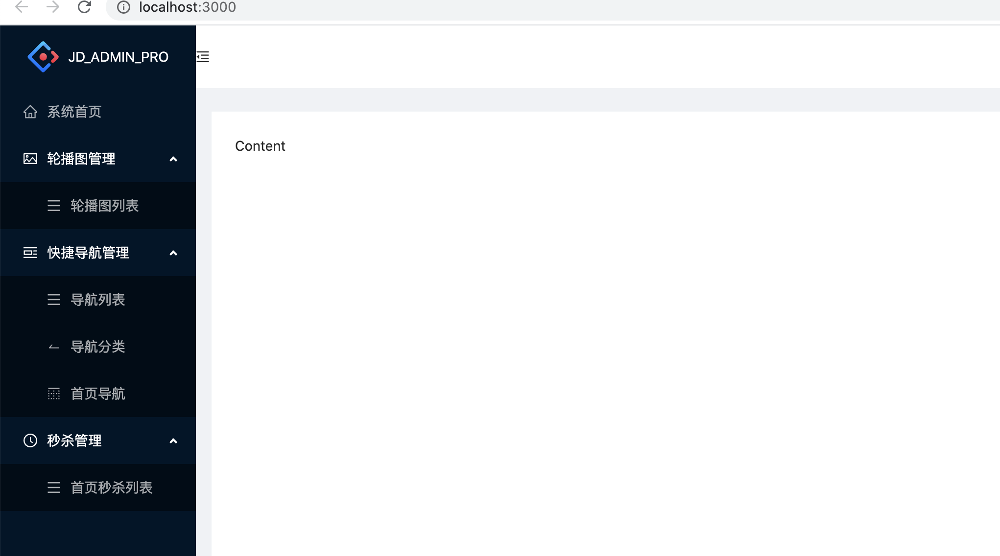
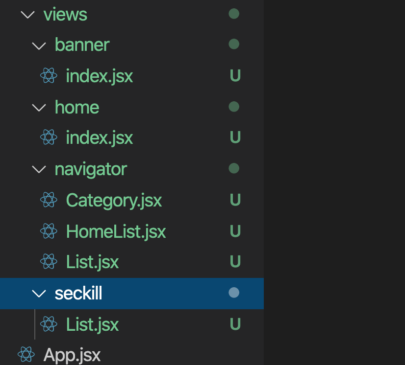
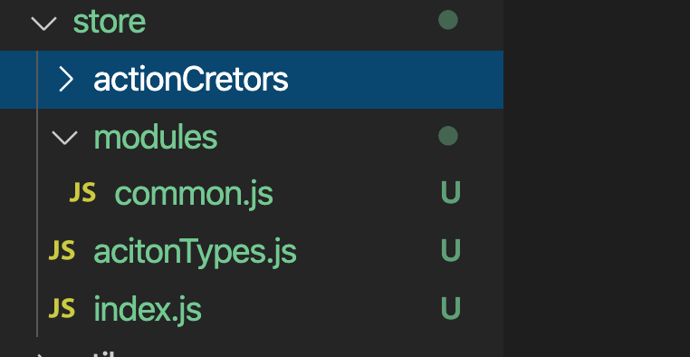
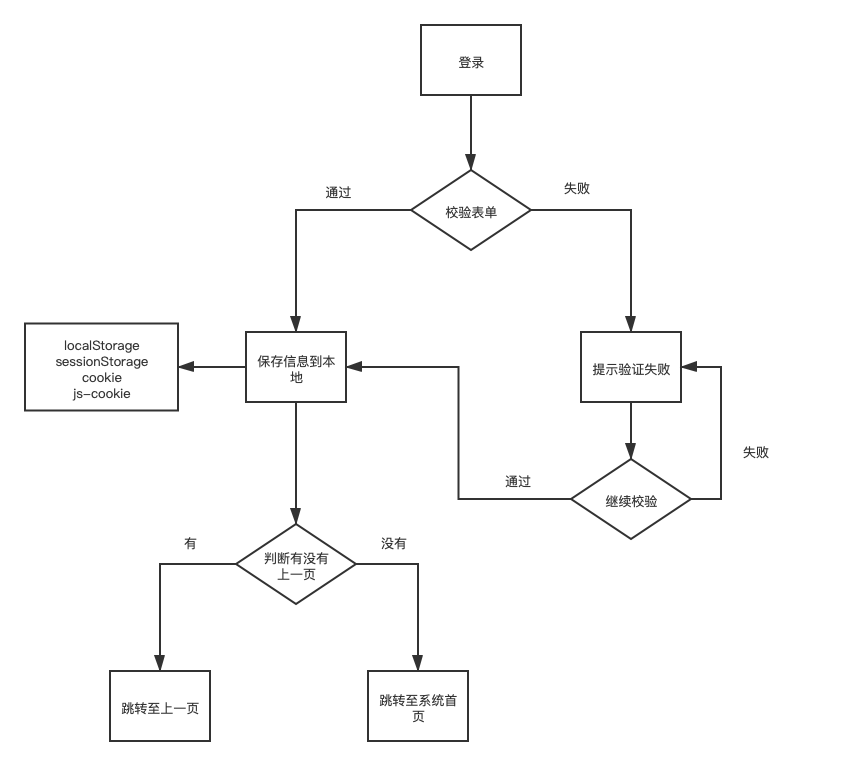
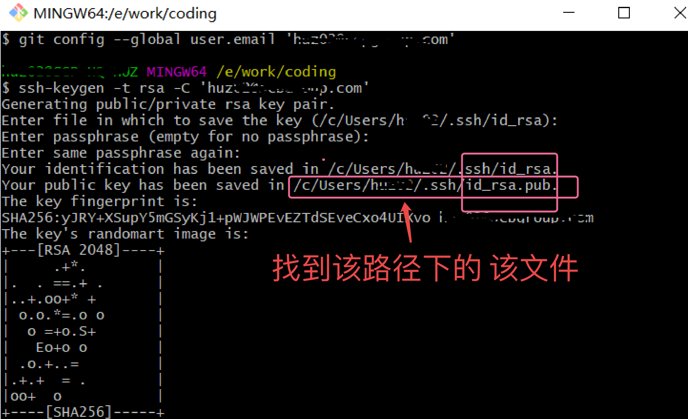
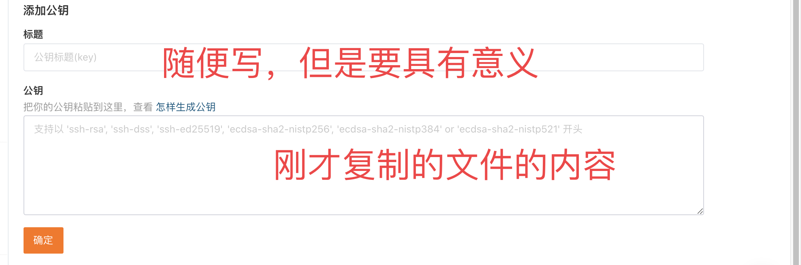

# 一.react后台管理系统

## 1.创建项目

```node
npx create-react-app jd-admin

```

##  2.配置装饰器(但不是必须)

安装模块

```
cnpm i @babel/plugin-proposal-decorators customize-cra react-app-rewired -D
yarn add @babel/plugin-proposal-decorators customize-cra react-app-rewired -D
```

根目录下创建config-overrides.js

```js
// 参考配置连接：https://www.npmjs.com/package/customize-cra
const {override,addDecoratorsLegacy}=require("customize-cra");

module.exports=override(
    addDecoratorsLegacy(),//配置装饰器模式
);
```

修改package.json运行命令

```json
...,
"scripts": {
	"start": "react-app-rewired start", // update
	"build": "react-app-rewired build", // update
	"test": "react-app-rewired test",  // update
	"eject": "react-scripts eject"
},
...
```

## 3.配置UI库

https://ant.design/index-cn 查看文档

https://ant.design/docs/react/use-with-create-react-app-cn 查看具体的使用文档

```
cnpm i antd -S 
yarn add antd -S
```

删除src文件内容，添加index.css 以及 index.js

index.css

```css
@import '~antd/dist/antd.css';

```

index.js

```js
import React from 'react'
import ReactDOM from 'react-dom'

import App from './App'
import './index.css'
ReactDOM.render(
  <App />,
  document.querySelector('#root')
)
```

测试UI库 App.jsx

```js
import React from 'react'
import { Button } from 'antd'
const App = () => {
  return (
    <>
      <Button  type="primary">hello</Button>
    </>
  )
}

export default App
```

## 4.修改目录结构

```
src
	api
	components
	layout
	router
	store
	utils
	views
```


## 5.搭建项目的主结构

查看Layout 组件，修改App.jsx

```js
import React from 'react'
import { Layout, Menu } from 'antd';
import {
  MenuUnfoldOutlined,
  MenuFoldOutlined,
  UserOutlined,
  VideoCameraOutlined,
  UploadOutlined,
} from '@ant-design/icons';

import logo from './logo.svg'

const { Header, Sider, Content } = Layout;

class App extends React.Component {
  state = {
    collapsed: false,
  };

  toggle = () => {
    this.setState({
      collapsed: !this.state.collapsed,
    });
  };

  render() {
    return (
      <Layout>
        <Sider trigger={null} collapsible collapsed={this.state.collapsed}>
          <div className="logo" />
          <Menu theme="dark" mode="inline" defaultSelectedKeys={['1']}>
            <Menu.Item key="1" icon={<UserOutlined />}>
              nav 1
            </Menu.Item>
            <Menu.Item key="2" icon={<VideoCameraOutlined />}>
              nav 2
            </Menu.Item>
            <Menu.Item key="3" icon={<UploadOutlined />}>
              nav 3
            </Menu.Item>
          </Menu>
        </Sider>
        <Layout className="site-layout">
          <Header className="site-layout-background" style={{ padding: 0 }}>
            {React.createElement(this.state.collapsed ? MenuUnfoldOutlined : MenuFoldOutlined, {
              className: 'trigger',
              onClick: this.toggle,
            })}
          </Header>
          <Content
            className="site-layout-background"
            style={{
              margin: '24px 16px',
              padding: 24,
              minHeight: 280,
            }}
          >
            Content
          </Content>
        </Layout>
      </Layout>
    );
  }
}

export default App
```

添加logo

```js
<Sider trigger={null} collapsible collapsed={this.state.collapsed}>
  // ++++++++
  <div className="logo">
    
      { this.state.collapsed ? null : <span>JD_ADMIN_PRO</span>  }
  </div>
  // ++++++++
  <Menu theme="dark" mode="inline" defaultSelectedKeys={['1']}>
    <Menu.Item key="1" icon={<UserOutlined />}>
       nav 1
		</Menu.Item>
    <Menu.Item key="2" icon={<VideoCameraOutlined />}>
      nav 2
    </Menu.Item>
    <Menu.Item key="3" icon={<UploadOutlined />}>
      nav 3
    </Menu.Item>
	</Menu>
</Sider>
        
```

相关样式 index.css

```css
@import '~antd/dist/antd.css';
html, body, #root, .ant-layout { height: 100%;}

.logo {
  width: 100%;
  height: 64px;
  /* background: url('./logo.svg') no-repeat center center; */
  display: flex;
  justify-content: center;
  align-items: center;
  color: #fff;
}
#components-layout-demo-custom-trigger .trigger {
  font-size: 18px;
  line-height: 64px;
  padding: 0 24px;
  cursor: pointer;
  transition: color 0.3s;
}

#components-layout-demo-custom-trigger .trigger:hover {
  color: #1890ff;
}

#components-layout-demo-custom-trigger .logo {
  height: 32px;
  background: rgba(255, 255, 255, 0.3);
  margin: 16px;
}

.site-layout .site-layout-background {
  background: #fff;
}
```

移植App.jsx代码至 layout/main/Index.jsx,**`注意logo的路径`**


安装路由模块

```
yarn add react-router-dom -S
```

修改App.jsx

```js
import React from 'react'
import { BrowserRouter as Router, Route, Switch } from 'react-router-dom'
import Main from './layout/main/Index'
const App = () => {
  return (
    <Router >
      <Switch>
        <Route path="/" component = { Main } />
      </Switch>
    </Router>
  )
}

export default App
```


## 6.设计左侧菜单栏


* Min

## 7.左侧菜单


生成左侧菜单的基本配置信息 router/menus.js

```js
import {
  HomeOutlined,
  PictureOutlined,
  MenuOutlined,
  PicLeftOutlined,
  SwapLeftOutlined,
  BorderTopOutlined,
  ClockCircleOutlined
} from '@ant-design/icons'
const menus = [
  {
    path: '/',
    title: '系统首页',
    icon: <HomeOutlined />
  },
  {
    path: '/bannermanager',
    title: '轮播图管理',
    icon: <PictureOutlined />,
    children: [
      {
        path: '/bannermanager/list',
        title: '轮播图列表',
        icon: <MenuOutlined />
      }
    ]
  },
  {
    path: '/navigatormanager',
    title: '快捷导航管理',
    icon: <PicLeftOutlined />,
    children: [
      {
        path: '/navigatormanager/list',
        title: '导航列表',
        icon: <MenuOutlined />
      },
      {
        path: '/navigatormanager/category',
        title: '导航分类',
        icon: <SwapLeftOutlined />
      },
      {
        path: '/navigatormanager/homelist',
        title: '首页导航',
        icon: <BorderTopOutlined />
      }
    ]
  },
  {
    path: '/seckillmanager',
    title: '秒杀管理',
    icon: <ClockCircleOutlined />,
    children: [
      {
        path: '/seckillmanager/list',
        title: '首页秒杀列表',
        icon: <MenuOutlined />
      }
    ]
  },
]

export default  menus
```


配置左侧菜单栏(抽离左侧菜单栏组件 SideMenu.jsx)

```js
import React, { Component } from 'react'
import { Menu } from 'antd';
import menus from './../../router/menus'
const { SubMenu } = Menu // 二级菜单标识
export default class SideMenu extends Component {

  renderMenu = (menus) => {
    return (
      <>
        {
          menus.map( item => {
            if (item.children) { // 有多级菜单
              return (
                <SubMenu key={item.path} icon={item.icon} title={item.title}>
                  {
                    this.renderMenu(item.children)
                  }
                </SubMenu>
              )
            } else { // 只有一级菜单
              return (
                <Menu.Item key={item.path} icon={ item.icon }>
                  { item.title }
                </Menu.Item>
              )
            }
          })
        }
      </>
    )
  }

  render() {
    return (
      <Menu theme="dark" mode="inline" defaultSelectedKeys={['1']}>
        {
      		// 方便做多级菜单 --- 递归的设计思想
          this.renderMenu(menus)
        }
      </Menu>
    )
  }
}

```




## 8.创建页面对应的组件



点击左侧菜单跳转至页面

## 9.配置路由


使用 路由的 懒加载 - lazy + Suspense

```jsx
import React, { lazy, Suspense } from 'react'
import { Layout, Spin } from 'antd';

// layout/main/Index.jsx
<Content
  className="site-layout-background"
  style={{
    margin: '24px 16px',
    padding: 24,
    minHeight: 280,
    position: 'relative' // 一定要设置父元素的相对布局，子元素才能绝对布局
  }}
  >
  <Suspense fallback={<div className="loading"><Spin size="large" /></div>} >
    <Switch>
      <Route path="/" exact component = { lazy(() => import('../../views/home/Index'))} />
    </Switch>
  </Suspense>
</Content>

// 不要轻易修改组件的样式，可以根据自己业务需求添加额外的标签
// index.css
/* 页面加载的loading位置 */
.loading {
  position: absolute;
  top: 50%;
  left: 50%;
  transform: translate(-50%, -50%);
}
```

结合路由的 route config，修改 router/menus.js

```js
import React, { lazy } from 'react'
import {
  HomeOutlined,
  PictureOutlined,
  MenuOutlined,
  PicLeftOutlined,
  SwapLeftOutlined,
  BorderTopOutlined,
  ClockCircleOutlined,
  UserOutlined
} from '@ant-design/icons'
const menus = [
  {
    path: '/',
    title: '系统首页',
    icon: <HomeOutlined />,
    component: lazy(() => import('./../views/home/Index')) // **********
  },
  {
    path: '/bannermanager',
    title: '轮播图管理',
    icon: <PictureOutlined />,
    children: [
      {
        path: '/bannermanager/list',
        title: '轮播图列表',
        icon: <MenuOutlined />,
        component: lazy(() => import('./../views/banner/Index'))
      }
    ]
  },
  {
    path: '/navigatormanager',
    title: '快捷导航管理',
    icon: <PicLeftOutlined />,
    children: [
      {
        path: '/navigatormanager/list',
        title: '导航列表',
        icon: <MenuOutlined />,
        component: lazy(() => import('./../views/navigator/List'))
      },
      {
        path: '/navigatormanager/category',
        title: '导航分类',
        icon: <SwapLeftOutlined />,
        component: lazy(() => import('./../views/navigator/Category'))
      },
      {
        path: '/navigatormanager/homelist',
        title: '首页导航',
        icon: <BorderTopOutlined />,
        component: lazy(() => import('./../views/navigator/HomeList'))
      }
    ]
  },
  {
    path: '/seckillmanager',
    title: '秒杀管理',
    icon: <ClockCircleOutlined />,
    children: [
      {
        path: '/seckillmanager/list',
        title: '首页秒杀列表',
        icon: <MenuOutlined />,
        component: lazy(() => import('./../views/seckill/List'))
      }
    ]
  },
]

export default  menus
```

页面配置路由 layout/main/Index.jsx

```jsx
import menus from './../../router/menus'
class Index extends React.Component{
	renderRoute = (menus) => {
    return menus.map(item => {
      if (item.children) {
        return this.renderRoute(item.children)
      } else {
        return item.path === '/' ? null : <Route
          path={ item.path }
          exact
          component = { item.component } />
        }
    })
  }
  
  render () {
    return (
    	...
      <Content
            className="site-layout-background"
            style={{
              margin: '24px 16px',
              padding: 24,
              minHeight: 280,
              position: 'relative'
            }}
          >
            <Suspense fallback={<div className="loading"><Spin size="large" /></div>} >
              <Switch>
                {
                  this.renderRoute(menus)
                }
                {/* <Route path="/" exact component = { lazy(() => import('../../views/home/Index'))} /> */}
              </Switch>
            </Suspense>
          </Content>
    )
  }
}
```

添加用户管理以及用户列表的页面

添加路由测试 menus.js

```js
{
    path: '/usermanager',
    title: '用户管理',
    icon: <UserOutlined />,
    children: [
      {
        path: '/usermanager/list',
        title: '用户列表',
        icon: <MenuOutlined />,
        component: lazy(() => import('./../views/user/List'))
      }
    ]
  },
```


进一步优化项目 --- 设置 路由的显示组件 --- 类比vue的router-view

router/RouterView.jsx

```jsx
import React, { Suspense } from 'react'
import { Spin } from 'antd'
import { Switch, Route } from 'react-router-dom'
import menus from './menus'
function RouterView() {
  const renderRoute = (menus) => {
    return menus.map(item => {
      if (item.children) {
        return renderRoute(item.children)
      } else {
        return <Route
          path={ item.path }
          key={item.path}
          exact
          component = { item.component } />
        }
    })
  }
  return (
    <Suspense fallback={<div className="loading"><Spin size="large" /></div>} >
      <Switch>
        {
          renderRoute(menus)
        }
        {/* <Route path="/" exact component = { lazy(() => import('../../views/home/Index'))} /> */}
      </Switch>
    </Suspense>
 )
}

export default RouterView

```

Layout/main/Index.jsx

```jsx

import RouterView from './../../router/RouterView'

class Index extends React.Component {
  
  render() {
    return (
          <Content
            className="site-layout-background"
            style={{
              margin: '24px 16px',
              padding: 24,
              minHeight: 280,
              position: 'relative'
            }}
          >
            <RouterView />
          </Content>
    );
  }
}

export default Index
```

**疑问：如果有的页面不需要在左侧菜单栏出现，如何处理**

先配置路由选项

```js
{
    path: '/setting',
    title: '设置',
    icon: <MenuOutlined />,
    component: lazy(() => import('../views/setting/Index')),
    meta: {
      hidden: true
    }
  }
```

SideMenu.jsx

```jsx
import React from 'react'
import { Menu } from 'antd';
import menus from './../../router/menus'
const { SubMenu } = Menu // 二级菜单标识
const SideMenu = () => {

  const renderMenu = (menus) => {
    return (
      <>
        {
          menus.map( item => {
            if (item.children) { // 有多级菜单
              return (
                <SubMenu key={item.path} icon={item.icon} title={item.title}>
                  {
                    renderMenu(item.children)
                  }
                </SubMenu>
              )
            } else { // 只有一级菜单
              // 此处判断要不要在侧边栏出现该路由**********************
              return  item.meta && item.meta.hidden ? null : <Menu.Item key={item.path} icon={ item.icon }>
              { item.title }
            </Menu.Item>
            }
          })
        }
      </>
    )
  }

  return (
    <Menu theme="dark" mode="inline" defaultSelectedKeys={['1']}>
      {
        // 方便做多级菜单 --- 递归的设计思想
        renderMenu(menus)
      }
    </Menu>
  )
}

export default SideMenu
```

## 10.点击菜单栏跳转页面

```jsx
import React from 'react'
import { Menu } from 'antd';
import { withRouter, useHistory } from 'react-router-dom' // ******************
import menus from './../../router/menus'
const { SubMenu } = Menu // 二级菜单标识
const SideMenu = withRouter((props) => { // withRouter 包裹是为了 获取 编程式导航的 对象
	const history = useHistory()
  const renderMenu = (menus) => {
    return (
      <>
        {
          menus.map( item => {
            if (item.children) { // 有多级菜单
              return (
                <SubMenu key={item.path} icon={item.icon} title={item.title}>
                  {
                    renderMenu(item.children)
                  }
                </SubMenu>
              )
            } else { // 只有一级菜单
              // 此处判断要不要在侧边栏出现该路由
              return  item.meta && item.meta.hidden ? null : <Menu.Item key={item.path} icon={ item.icon }>
              { item.title }
            </Menu.Item>
            }
          })
        }
      </>
    )
  }
  const goPage = ({ key }) => {
    history.push(key)
  }
  return (
    <Menu 
      theme="dark"
      mode="inline"
      defaultSelectedKeys={['1']}
      onClick={ goPage } // 跳转页面*****************
    >
      {
        // 方便做多级菜单 --- 递归的设计思想
        renderMenu(menus)
      }
    </Menu>
  )
})

export default SideMenu
```

**疑问：点击轮播图列表，刷新以后。选中的状态消失**

```jsx
import React from 'react'
import { Menu } from 'antd';
import { withRouter, useHistory, useLocation } from 'react-router-dom'
import menus from './../../router/menus'
const { SubMenu } = Menu
const SideMenu = withRouter((props) => {
  ....
  // 为了 显示当前左侧菜单选中的 状态  ----  string[ key ] key 就是path
  // defaultSelectedKeys
  // defaultOpenKeys
  const { pathname } = useLocation() // '/usermanager/list'
  const type = '/' + pathname.split('/')[1]
  return (
    <Menu 
      theme="dark"
      mode="inline"
      defaultSelectedKeys={[pathname]} // {['/usermanager/list']} 数组
      defaultOpenKeys={[type]}  // {['/usermanager‘]} 数组
      onClick={ goPage } 
    >
      {
        // 方便做多级菜单 --- 递归的设计思想
        renderMenu(menus)
      }
    </Menu>
  )
})

export default SideMenu
```

## 11.设计头部

抽离头部组件 main/Index.jsx

```jsx

import MainHeader from './MainHeader';

class Index extends React.Component {
  state = {
    collapsed: false,
  };
  render() {
    return (
      <Layout>
        <Layout className="site-layout">
          {/* <Header className="site-layout-background" style={{ padding: 0 }}>
            {React.createElement(this.state.collapsed ? MenuUnfoldOutlined : MenuFoldOutlined, {
              className: 'trigger',
              onClick: this.toggle,
            })}
          </Header> */}
          <MainHeader />
          <Content></Content>
        </Layout>
      </Layout>
    );
  }
}

export default Index
```

MainHeader.jsx

```jsx
import React, { useState } from 'react'
import { Layout } from 'antd';
import {
  MenuUnfoldOutlined,
  MenuFoldOutlined
} from '@ant-design/icons';
const { Header } = Layout;
function MainHeader() {
  const [ collapsed, setCollapsed ] = useState(false)
  const toggle = () => {
    setCollapsed(!collapsed)
  }
  return (
    <Header className="site-layout-background" style={{ padding: '0 16px' }}>
      { 
        collapsed ? 
        <MenuUnfoldOutlined style={{ fontSize: '24px' }} className="trigger" onClick={toggle}/> : 
        <MenuFoldOutlined style={{ fontSize: '24px' }} className="trigger" onClick={toggle}/>
      } 
    </Header>
  )
}

export default MainHeader

```

此时点击小图标，左侧菜单不会自动打开和关闭

引入状态管理器

```
cnpm i redux react-redux redux-thunk -D
yarn add redux react-redux redux-thunk -D
// 如果需要使用 持久化的数据结构。immutable
cnpm i immutable redux-immutable -D
yarn add immutable redux-immutable -D
```



* 1.创建 分reducer - common

```js
import { Map } from 'immutable'
import * as types from './../acitonTypes'
const reducer = (state = Map({
  collapsed: false
}), action) => {
  switch (action.type) {
    case types.CHANGE_COLLAPSED:
      return state.set('collapsed', !state.get('collapsed'))
    default:
      return state
  }
}

export default reducer

```

* 2.设计actionTypes.js

```js
const CHANGE_COLLAPSED =  'CHANGE_COLLAPSED' // 左侧菜单收缩的变量
export {
  CHANGE_COLLAPSED
}
```

* 3.创建状态管理器 index.js

```js
import { createStore, applyMiddleware } from 'redux'
import { combineReducers } from 'redux-immutable'
import thunk from 'redux-thunk'

import commonReducer from './modules/common'

const reducer = combineReducers({
  common: commonReducer
})

const store = createStore(reducer, applyMiddleware(thunk))

export default store
```

* 4.入口文件引入状态管理器

```js
import React from 'react'
import ReactDOM from 'react-dom'
import { Provider } from 'react-redux' // ******

import App from './App'

import store from './store' // *******

import './index.css'

ReactDOM.render(
  <Provider store = { store }>
     <App />
  </Provider>,
  document.querySelector('#root')
)
```

* 5.MainHeader 组件使用状态以及改变状态

```js
import React, { useState } from 'react'
import { Layout } from 'antd';
import { connect } from 'react-redux' // ******
import * as types from './../../store/acitonTypes' // ******

const { Header } = Layout;
function MainHeader({ collapsed, changeCollapsed }) {
  const toggle = () => { // ******
    changeCollapsed() // ******
  }
  return (
    <Header className="site-layout-background" style={{ padding: '0 16px' }}>
      {/* {React.createElement(collapsed ? MenuUnfoldOutlined : MenuFoldOutlined, {
        className: 'trigger',
        onClick: toggle,
      })} */}
      { 
        // ******
        collapsed ? 
        <MenuUnfoldOutlined style={{ fontSize: '24px' }} className="trigger" onClick={toggle}/> : 
        <MenuFoldOutlined style={{ fontSize: '24px' }} className="trigger" onClick={toggle}/>
      } 
    </Header>
  )
}

export default connect(state => ({ // ******
  collapsed: state.getIn(['common', 'collapsed']) // ***使用immutable获取数据***
}), dispatch => ({
  changeCollapsed () { // 修改状态
    dispatch({
      type: types.CHANGE_COLLAPSED
    })
  }
}))(MainHeader)

```

* 6.主界面要控制侧边栏显示main/Index.jsx

```jsx
import React from 'react'
import { Layout } from 'antd';
import { connect } from 'react-redux' // *****
import logo from './../../logo.svg'
import SideMenu from './SideMenu'
import RouterView from './../../router/RouterView'
import MainHeader from './MainHeader';
const { Sider, Content } = Layout;
// state => { return { collapsed: state.common.collapsed }}
// ({ common }) => ({ collapsed: common.collapsed })
// ({ common: {collapsed} }) => ({collapsed: collapsed})
// ({ common: {collapsed} }) => ({ collapsed })

@connect(state => { // *****
  return {
    collapsed: state.getIn(['common', 'collapsed'])
  }
})
class Index extends React.Component {
  
  render() {
    const { collapsed } = this.props // *****
    console.log('11', collapsed)
    return (
      <Layout>
        <Sider trigger={null} collapsible collapsed={collapsed}>
          <div className="logo">
            
            { collapsed ? null : <span>JD_ADMIN_PRO</span>  }
          </div>
          <SideMenu/>
        </Sider>
        
    );
  }
}

export default Index
```

## 12.只展开一个菜单项

```jsx

// ******* 放在组件外，先得到 哪些有二级菜单 *********
const rootSubmenuKeys = []
menus.forEach(item => {
  item.children && rootSubmenuKeys.push(item.path)
})
const SideMenu = withRouter((props) => {
  // 记录展开的菜单项
  const [openKeys, setOpenKeys ] = useState([])
	...
  const onOpenChange = keys => { // keys [] ,包含上一个和点击之后的那一个
    console.log(keys) //  ["/bannermanager", "/navigatormanager"]
    const latestOpenKey = keys.find(key => openKeys.indexOf(key) === -1);
    console.log(latestOpenKey) // 当前的这一个 /navigatormanager
    if (rootSubmenuKeys.indexOf(latestOpenKey) === -1) {
      setOpenKeys(keys);
    } else {
      setOpenKeys(latestOpenKey ? [latestOpenKey] : []);
    }
  }
  const { pathname } = useLocation() // '/usermanager/list'
  const type = '/' + pathname.split('/')[1]
  return (
    <Menu 
      theme="dark"
      mode="inline"
      defaultSelectedKeys={[pathname]} // {['/usermanager/list']} 数组
      defaultOpenKeys={[type]}  // {['/usermanager‘]} 数组
      openKeys = { openKeys }
      onClick={ goPage } 
      onOpenChange = { onOpenChange }
    >
      {
        // 方便做多级菜单 --- 递归的设计思想
        renderMenu(menus)
      }
    </Menu>
  )
})

export default SideMenu
```

## 13.面包屑导航

选择参考 带路由的模式

```jsx
import React from 'react'
import { Breadcrumb } from 'antd'
import { withRouter, useLocation, Link } from 'react-router-dom'
import menus from './../../router/menus'
const breadcrumbNameMap = {}; // 获取到面包屑导航的选项

const renderBreadcrumbNameMap = (menus) => {
  menus.forEach((item, index) => {
    if (item.children) {
      breadcrumbNameMap[item.path] = item.title
      renderBreadcrumbNameMap(item.children)
    } else {
      breadcrumbNameMap[item.path] = item.title
    }
  })
}
renderBreadcrumbNameMap(menus)
console.log(breadcrumbNameMap)

const BreadcrumbCom = withRouter((props) => {
  // console.log(useLocation(), props.location)
  const location = useLocation()
  //  如果路由地址为 /bannermanager/list
  const pathSnippets = location.pathname.split('/').filter(i => i);
  // console.log(pathSnippets) // ["bannermanager", "list"]
  const extraBreadcrumbItems = pathSnippets.map((_, index) => {
    const url = `/${pathSnippets.slice(0, index + 1).join('/')}`
    return (
      <Breadcrumb.Item key = { url } style={{ lineHeight: '64px'}}>
        <Link to={ url }>{breadcrumbNameMap[url]}</Link>
      </Breadcrumb.Item>
    )
  })
  const breadcrumbItems = [
    <Breadcrumb.Item key = '/'>
      <Link to='/'>首页</Link>
    </Breadcrumb.Item>
  ].concat(extraBreadcrumbItems)
  return (
    <Breadcrumb>{breadcrumbItems}</Breadcrumb>
  )
})

export default BreadcrumbCom
```

```jsx

import Breadcrumb from './Breadcrumb'

function MainHeader({ collapsed, changeCollapsed }) {
  return (
    <Header className="site-layout-background" style={{ padding: '0 16px',display: 'flex' }}>
      <div style={{ width: '50px'}}>
      { 
        collapsed ? 
        <MenuUnfoldOutlined style={{ fontSize: '24px', marginTop: '20px' }} className="trigger" onClick={toggle}/> : 
        <MenuFoldOutlined style={{ fontSize: '24px', marginTop: '20px' }} className="trigger" onClick={toggle}/>
      }
      </div>
      <div style ={{ flex: 1 }}>
        <Breadcrumb />
      </div>
    </Header>
  )
}
```

## 14.路由重定向

```js
import React, { lazy } from 'react'
import {
  HomeOutlined,
  PictureOutlined,
  MenuOutlined,
  PicLeftOutlined,
  SwapLeftOutlined,
  BorderTopOutlined,
  ClockCircleOutlined,
  UserOutlined
} from '@ant-design/icons'
const menus = [
  { 
    path: '/',
    redirect: '/home',
    meta: { // 该路由不出现在左侧菜单栏
      hidden: true
    }
  },
  {
    path: '/home',
    title: '系统首页',
    icon: <HomeOutlined />,
    component: lazy(() => import('./../views/home/Index'))
  },
  {
    path: '/bannermanager',
    title: '轮播图管理',
    icon: <PictureOutlined />,
    redirect: '/bannermanager/list',
    children: [
      {
        path: '/bannermanager/list',
        title: '轮播图列表',
        icon: <MenuOutlined />,
        component: lazy(() => import('./../views/banner/Index'))
      }
    ]
  },
  {
    path: '/navigatormanager',
    title: '快捷导航管理',
    icon: <PicLeftOutlined />,
    redirect: '/navigatormanager/list',
    children: [
      {
        path: '/navigatormanager/list',
        title: '导航列表',
        icon: <MenuOutlined />,
        component: lazy(() => import('./../views/navigator/List'))
      },
      {
        path: '/navigatormanager/category',
        title: '导航分类',
        icon: <SwapLeftOutlined />,
        component: lazy(() => import('./../views/navigator/Category'))
      },
      {
        path: '/navigatormanager/hlist', // 记得改名字
        title: '首页导航',
        icon: <BorderTopOutlined />,
        component: lazy(() => import('./../views/navigator/HomeList'))
      }
    ]
  },
  {
    path: '/seckillmanager',
    title: '秒杀管理',
    icon: <ClockCircleOutlined />,
    redirect: '/seckillmanager/list',
    children: [
      {
        path: '/seckillmanager/list',
        title: '首页秒杀列表',
        icon: <MenuOutlined />,
        component: lazy(() => import('./../views/seckill/List'))
      }
    ]
  },
  {
    path: '/usermanager',
    title: '用户管理',
    icon: <UserOutlined />,
    redirect: '/usermanager/list',
    children: [
      {
        path: '/usermanager/list',
        title: '用户列表',
        icon: <MenuOutlined />,
        component: lazy(() => import('./../views/user/List'))
      },
      
    ]
  },
  {
    path: '/setting',
    title: '设置',
    icon: <MenuOutlined />,
    component: lazy(() => import('../views/setting/Index')),
    meta: { // 该路由不出现在左侧菜单栏
      hidden: true
    }
  }
]

export default  menus
```


```jsx
import React, { Suspense } from 'react'
import { Spin } from 'antd'
import { Switch, Route } from 'react-router-dom'
import RedirectRouterView from './RedirectRouterView'
import menus from './menus'
function RouterView() {
  return (
    <Suspense fallback={<div className="loading"><Spin size="large" /></div>} >
      <Switch>
        {/* <Route path="/" exact component = { lazy(() => import('../../views/home/Index'))} /> */}
        <RedirectRouterView />
        {/* <Redirect path="/bannermanager" to="/bannermanager/list" />
        <Redirect path="/navigatormanager" to="/navigatormanager/list" />
        <Redirect path="/seckillmanager" to="/seckillmanager/list" />
        <Redirect path="/usermanager" to="/usermanager/list" /> */}
      </Switch>
    </Suspense>
)
}

export default RouterView

```

```jsx
import React from 'react'
import { Redirect, Switch } from 'react-router-dom'
import menus from './menus'

const redirectMenus = menus.filter(item => item.redirect)
console.log(redirectMenus)
function RedirectRouterView() {
  return (
    <Switch>
      {
        redirectMenus.map(item => {
          const Item = <Redirect key={ item.path } exact path={ item.path } to={ item.redirect } />
          return Item
        })
      }
    </Switch>
  )
}

export default RedirectRouterView

```

调整左侧菜单的选中样式

```jsx
import React, { useState, useEffect } from 'react'
import { Menu } from 'antd';
import { withRouter, useHistory, useLocation } from 'react-router-dom'
import menus from './../../router/menus'
const { SubMenu } = Menu
const rootSubmenuKeys = []
menus.forEach(item => {
  item.children && rootSubmenuKeys.push(item.path)
})
const SideMenu = withRouter((props) => {
  const [openKeys, setOpenKeys ] = useState([])
  const [selectedKeys, setSelectedKeys ] = useState([])
  const history = useHistory()
  const renderMenu = (menus) => {
    return (
      <>
        {
          menus.map( item => {
            if (item.children) { // 有多级菜单
              return (
                <SubMenu key={item.path} icon={item.icon} title={item.title}>
                  {
                    renderMenu(item.children)
                  }
                </SubMenu>
              )
            } else { // 只有一级菜单
              // 此处判断要不要在侧边栏出现该路由
              return  item.meta && item.meta.hidden ? null : <Menu.Item key={item.path} icon={ item.icon }>
              { item.title }
            </Menu.Item>
            }
          })
        }
      </>
    )
  }
  const goPage = ({ key }) => {
    history.push(key)
  }

  const onOpenChange = keys => { // keys [] ,包含上一个和点击之后的那一个
    console.log(keys) //  ["/bannermanager", "/navigatormanager"]
    const latestOpenKey = keys.find(key => openKeys.indexOf(key) === -1);
    console.log(latestOpenKey) // 当前的这一个 /navigatormanager
    if (rootSubmenuKeys.indexOf(latestOpenKey) === -1) {
      setOpenKeys(keys);
    } else {
      setOpenKeys(latestOpenKey ? [latestOpenKey] : []);
    }
  }
  // 为了 显示当前左侧菜单选中的 状态  ----  string[ key ] key 就是path
  // defaultSelectedKeys
  // defaultOpenKeys
  const { pathname } = useLocation() // '/usermanager/list'
  const type = '/' + pathname.split('/')[1]

  useEffect(() => {
    setOpenKeys([type])
    setSelectedKeys([pathname])
  }, [pathname])
  return (
    <Menu 
      theme="dark"
      mode="inline"
      defaultSelectedKeys={[pathname]} // {['/usermanager/list']} 数组
      defaultOpenKeys={[type]}  // {['/usermanager‘]} 数组
      openKeys = { openKeys }
      selectedKeys = { selectedKeys }
      onClick={ goPage } 
      onOpenChange = { onOpenChange }
    >
      {
        // 方便做多级菜单 --- 递归的设计思想
        renderMenu(menus)
      }
    </Menu>
  )
})

export default SideMenu
```

## 15.轮播图管理

### 1.前端页面构建

```jsx
import React, { Fragment } from 'react'
import { Button, Table, Space } from 'antd'
function BannerList() {
  const dataSource = [
  ];
  
  const columns = [
    {
      title: '序号',
      align: 'center',
      // text表示当前字段的值
      // record 当前的完整的数据对象
      render: (text, record, index) => <span>{ index + 1}</span>
    },
    {
      title: '轮播图',
      align: 'center',
      dataIndex: 'bannerimg',
      key: 'bannerimg',
    },
    {
      title: '链接地址',
      align: 'center',
      dataIndex: 'link',
      key: 'link',
    },
    {
      title: '操作',
      align: 'center',
      render: (text, record, index) => {
        return (
          <Space>
            <span style={{ color: '#00a',}}>编辑</span>
            <span>|</span>
            <span style={{ color: '#f00',}}>删除</span>
          </Space>
        )
      }
    },
  ]
  return (
    <Fragment>
      <Button type="primary" style={{ marginBottom: '10px'}}>
        添加轮播图
      </Button>
      <Table dataSource={dataSource} columns={columns} />
    </Fragment>
  )
}

export default BannerList

```

参照二.1 - 3

### 2.添加轮播图的页面

```jsx
// views/banner/Add.jsx
import React from 'react'

function AddBanner() {
  return (
    <div>
      添加轮播图
    </div>
  )
}

export default AddBanner

```

配置路由

```js
...,
{
    path: '/bannermanager',
    title: '轮播图管理',
    icon: <PictureOutlined />,
    redirect: '/bannermanager/list',
    children: [
      {
        path: '/bannermanager/list',
        title: '轮播图列表',
        icon: <MenuOutlined />,
        component: lazy(() => import('./../views/banner/Index'))
      },
      {
        path: '/bannermanager/add',
        title: '添加轮播图',
        icon: <MenuOutlined />,
        component: lazy(() => import('./../views/banner/Add')),
        meta: { // ***********
          hidden: true
        }
      }
    ]
  },
  ...
```

点击切换至添加页面

```jsx
// views/banner/index.jsx
<Button 
  type="primary" 
  style={{ marginBottom: '10px'}}
  onClick = { () => props.history.push('/bannermanager/add') }>
  添加轮播图
</Button>
```

### 3.布局添加页面

```jsx
import {
  Form,
  Button,
  Upload,
  Input,
  Image
} from 'antd';
import { UploadOutlined } from '@ant-design/icons';
import { useState } from 'react';
const formItemLayout = {
  labelCol: {
    span: 6,
  },
  wrapperCol: {
    span: 14,
  },
};

const AddBanner = () => {
  const [ url, setUrl ]  = useState('')
  const onFinish = (values) => {
    // console.log('Received values of form: ', values.bannerimg[0].thumbUrl);
    values.bannerimg = values.bannerimg[0].thumbUrl
    console.log(values)
  };
  const normFile = (e) => {
    console.log('Upload event:', e);
    setUrl(e.fileList[0].thumbUrl)
    if (Array.isArray(e)) {
      return e;
    }
  
    return e && e.fileList;
  };
  return (
    <Form
      name="validate_other"
      {...formItemLayout}
      onFinish={onFinish}
    >
      <Form.Item
        {...formItemLayout}
        name="link"
        label="跳转页面地址"
        rules={[
          {
            required: true,
            message: '请输入跳转的地址',
          },
        ]}
      >
        <Input placeholder="请输入跳转的地址" />
      </Form.Item>
      <Form.Item
        {...formItemLayout}
        name="alt"
        label="alt"
        rules={[
          {
            required: true,
            message: '请输入图片提示语句',
          },
        ]}
      >
        <Input placeholder="请输入图片提示语句" />
      </Form.Item>
      <Form.Item
        name="bannerimg"
        label="上传图片"
        valuePropName="fileList"
        getValueFromEvent={normFile}
        rules={[
          {
            required: true,
            message: '请选择轮播图片',
          },
        ]}
      >
        <Upload name="logo" listType="picture">
          <Button icon={<UploadOutlined />}>Click to upload</Button>
          <Image src={url} />
        </Upload>
      </Form.Item>

      <Form.Item
        wrapperCol={{
          span: 12,
          offset: 6,
        }}
      >
        <Button type="primary" htmlType="submit">
          Submit
        </Button>
      </Form.Item>
    </Form>
  );
};
export default AddBanner
```

### 4.调用相关的接口

必须得先封装接口 axios

### 5.封装axios

```
yarn add axios
```

```js
// utils/request.js
import axios from 'axios'

const isDev = process.env.NODE_ENV === 'development'

const request = axios.create({
  baseURL: isDev ? 'http://localhost:3333/api' : 'http://www.daxun.com/api'
})

// 设置拦截器

export default request
```

Api/banner.js 处理轮播图相关的接口

```js
import request from './../utils/request'

export function addBanner (params) {
  return request.post('/banner/add', params)
}
```

views/banner/Add.jsx调用接口

```JSX

import { addBanner } from './../../api/banner'

const AddBanner = () => {
  const onFinish = (values) => {
    // console.log('Received values of form: ', values.bannerimg[0].thumbUrl);
    values.bannerimg = values.bannerimg[0].thumbUrl
    console.log(values)
    addBanner(values).then(res => {
      console.log('res', res)
    })
  };
  return (
    <Form
      name="validate_other"
      {...formItemLayout}
      onFinish={onFinish}
    >
      
    </Form>
  );
};
export default AddBanner
```

此时会遇到跨域的问题，

如果你的webpack没有抽离，直接在package.json文件中添加proxy选项

```json
{
  "proxy": "http://localhost:3333/api"
}

```

Utils/request.js

```js
import axios from 'axios'

const isDev = process.env.NODE_ENV === 'development'

const request = axios.create({
  baseURL: isDev ? '' : 'http://www.daxun.com/api'
})

// 设置拦截器

export default request
```

移步到二.3.6

### 6.渲染轮播图列表

添加成功返回轮播图列表页面

```js
props.history.goBack()
```

Api/banner.js

```js
import request from './../utils/request'

export function addBanner (params) {
  return request.post('/banner/add', params)
}

export function getBanner (params) {
  return request.get('/banner', { params })
}
```

Views/banner/Index.jsx

```jsx
import React, { Fragment, useState, useEffect } from 'react'
import { Button, Table, Space, Image } from 'antd'

import { getBanner } from './../../api/banner'
function BannerList(props) {
  const [ bannerlist, setBannerlist ] = useState([])
  useEffect(() => {
    getBanner().then(res => {
      setBannerlist(res.data.data)
    })
  }, [])
  
  const columns = [
    ...
    {
      title: '轮播图',
      align: 'center',
      dataIndex: 'bannerimg',
      key: 'bannerimg',
      render: (text, record, index) => (
        <Image src={ text } />
      )
    },
    ...
  ]
  return (
    <Fragment>
      <Button 
      type="primary" 
      style={{ marginBottom: '10px'}}
      onClick = { () => props.history.push('/bannermanager/add') }>
        添加轮播图
      </Button>
      <Table dataSource={bannerlist} columns={columns} />
    </Fragment>
  )
}

export default BannerList

```

### 7.删除数据

```js
import request from './../utils/request'

...
export function deleteBanner (params) {
  return request.get('/banner/delete', { params })
}
```


```jsx
import React, { Fragment, useState, useEffect } from 'react'
import { Button, Table, Space, Popconfirm } from 'antd'

import { getBanner, deleteBanner } from './../../api/banner'
function BannerList(props) {
 ...
  const deleteItem = (bannerid, index) => () => {
    console.log(bannerid)
    deleteBanner({ bannerid }).then(res => {
      let arr = JSON.parse(JSON.stringify(bannerlist))
      arr.splice(index, 1)
      setBannerlist(arr)
    })
  }
  const cancel = () => {}
  const columns = [
    ...,
    {
      title: '操作',
      align: 'center',
      render: (text, record, index) => {
        return (
          <Space>
            <Popconfirm
              title="确定删除吗?"
              onConfirm={ deleteItem(record.bannerid, index) }
              onCancel={ cancel }
              okText="确定"
              cancelText="取消"
            >
              <span style={{ color: '#f00', cursor: 'pointer'}}>删除</span>
            </Popconfirm>
          </Space>
        )
      }
    },
  ]
  return (
    <Fragment>
      <Button 
      type="primary" 
      style={{ marginBottom: '10px'}}
      onClick = { () => props.history.push('/bannermanager/add') }>
        添加轮播图
      </Button>
      <Table dataSource={bannerlist} columns={columns} rowKey={record => record.bannerid}/>
    </Fragment>
  )
}

export default BannerList

```

自动分页删除第2页的数据，如果splice（index, 1）实际删除成功，但是显示有问题，因为分页之后的序号是单独计算的

删除接口看 二.3.8

第一种解决办法：删除完毕重新请求一次数据

Views/banner/Index.jsx

```jsx
const deleteItem = (bannerid, index) => () => {
    console.log(bannerid)
    deleteBanner({ bannerid }).then(res => {
      // let arr = JSON.parse(JSON.stringify(bannerlist))
      // arr.splice(index, 1)
      // setBannerlist(arr)
      getBanner().then(res => {
        setBannerlist(res.data.data)
      })
    })
  }
```

### 8.配置表格的分页信息

```jsx
import React, { Fragment, useState, useEffect } from 'react'
import { Button, Table, Space, Popconfirm } from 'antd'

import { getBanner, deleteBanner } from './../../api/banner'
function BannerList(props) {
  ...

  // 设置分页
  const [pageSize, setPageSize] = useState(5)
  const [total, setTotal] = useState(0)
  const [current, setCurrent] = useState(1)
  return (
    <Fragment>
      <Button 
      type="primary" 
      style={{ marginBottom: '10px'}}
      onClick = { () => props.history.push('/bannermanager/add') }>
        添加轮播图
      </Button>
      <Table 
      dataSource={bannerlist} 
      columns={columns} 
      rowKey={record => record.bannerid}
      bordered={ true }
      pagination = { {
        position: ['bottomLeft'],
        showSizeChanger: true,
        pageSizeOptions: [5, 10, 15, 20, 50],
        showQuickJumper: true,
        // hideOnSinglePage: true  // 慎用
        pageSize: pageSize,
        showTotal: (total, range) => {
          console.log(total, range)
           setTotal(total)
          return `共有${total} 条数据`
        },
        total: total,
        current: current,
        onChange: (page, pageSize) => {
          setCurrent(page)
        },
        onShowSizeChange: (current, size) => {
          setPageSize(size)
        }
      } }
      />
    </Fragment>
  )
}

export default BannerList

```

此时发现 页码的配置实际上为英文，设置为中文 

Src/index.js

```js
import React from 'react'
import ReactDOM from 'react-dom'
import { Provider } from 'react-redux'
import { ConfigProvider } from 'antd';
// 由于 antd 组件的默认文案是英文，所以需要修改为中文
import zhCN from 'antd/lib/locale/zh_CN';
import App from './App'

import store from './store'

import './index.css'

ReactDOM.render(
  <Provider store = { store }>
    <ConfigProvider locale = { zhCN }>
      <App />
    </ConfigProvider>
  </Provider>,
  document.querySelector('#root')
)
```

删除时不考虑重新请求服务器，纯前端的操作

```jsx
import React, { Fragment, useState, useEffect } from 'react'
import { Button, Table, Space, Popconfirm } from 'antd'

import { getBanner, deleteBanner } from './../../api/banner'
function BannerList(props) {

  const deleteItem = (bannerid, index) => () => {
    console.log(bannerid)
    deleteBanner({ bannerid }).then(res => {
      let arr = JSON.parse(JSON.stringify(bannerlist))
      arr.splice(index, 1)
      setBannerlist(arr)
      setTotal(total-1)
      // console.log(total % pageSize)
      setCurrent((total % pageSize === 1) ? current - 1 : current)
    })
  }
  
  return (
    <Fragment>
      
    </Fragment>
  )
}

export default BannerList

```

###  9.表格的选择框

```jsx

function BannerList(props) {
  ... 
  const [selectedRowKeys, setSelectRowKeys] = useState([])
  const onSelectChange = (selectedRowKeys, selectedRow) => {
    console.log('selectedRowKeys changed: ', selectedRowKeys);
    console.log('selectedRowKeys changed: ', selectedRow);
    setSelectRowKeys(selectedRowKeys);
  };
  const rowSelection = {
    selectedRowKeys, // 当前页面选中的项
    onChange: onSelectChange, // 获取选中的值
  };
  return (
    <Fragment>
      ...
      {
        selectedRowKeys.length > 0 ? 
        <Button 
          type="primary" 
          style={{ marginBottom: '10px', marginLeft: "15px"}}>
            批量删除
          </Button> : null
      }
      <Table 
        rowSelection={rowSelection}
        scroll={{ y: '700px'}}
      />
    </Fragment>
  )
}

export default BannerList

```

参照二.3.9

### 10.批量删除数据

```js
import request from './../utils/request'

export function deleteAllBanner (params) {
  return request.post('/banner/deleteAll', params)
}
```

```jsx
// views/banner/Index.jsx
import { getBanner, deleteBanner, deleteAllBanner } from './../../api/banner'
function BannerList(props) {
  ...
  const [selectedRowKeys, setSelectRowKeys] = useState([])
  const onSelectChange = (selectedRowKeys, selectedRow) => {
    // selectedRowKeys 选中的数据项组成的数组，数组元素对应 rowKey 设置的唯一字段名
    // selectedRow 选中的数据项组成的数组，数组元素对应 每条选中的数据对象
    setSelectRowKeys(selectedRowKeys);
  };
  const rowSelection = {
    selectedRowKeys, // 当前页面选中的项
    onChange: onSelectChange, // 获取选中的值
  };
  const deleteManyItem = () => {
    deleteAllBanner({
      deletearr: selectedRowKeys
    }).then(() => {
      getBanner().then(res => {
        setBannerlist(res.data.data)
      })
    })
  }
  return (
    <Fragment>
    ...
      {
        selectedRowKeys.length > 0 ? 
        <Button 
          type="primary" 
          style={{ marginBottom: '10px', marginLeft: "15px"}}
          onClick={ deleteManyItem }
          >
            批量删除
          </Button> : null
      }
     ...
    </Fragment>
  )
}

export default BannerList

```

## 16.快捷导航的管理

### 1·.抓取数据 - 分类

public/navcategory.json

```json
[{"categoryid":"1","name":"hotFloor","titleColor":"#aaaaaa","titleImg":"https://m.360buyimg.com/mobilecms/jfs/t3058/147/557827947/2449/f103ce30/57ba9dbcNfda13131.png"},{"categoryid":"42","name":"热门推荐M","titleColor":"#aaaaaa","titleImg":"https://m.360buyimg.com/mobilecms/jfs/t19375/228/2147833578/3539/56b9e876/5ae95f90N06fb6b8e.png"},{"categoryid":"38","name":"3C专区","titleColor":"","titleImg":"https://m.360buyimg.com/mobilecms/jfs/t18223/34/1754855975/5488/9ffacd82/5ad8000aNdfd98f23.png"},{"categoryid":"39","name":"超市生活","titleColor":"","titleImg":"https://m.360buyimg.com/mobilecms/jfs/t18631/61/1776041327/5928/de57170f/5ad80054Ndbc865ec.png"},{"categoryid":"43","name":"时尚穿搭","titleColor":"","titleImg":"https://m.360buyimg.com/mobilecms/jfs/t1/42344/26/83/3342/5cc04b47E6adaaf2d/294f1bc4298b752f.jpg"},{"categoryid":"41","name":"特色频道","titleColor":"","titleImg":"https://m.360buyimg.com/mobilecms/jfs/t19456/19/1745795307/6112/d391b68d/5ad8002cN28a96e4a.png"}]
```

### 2.打开命令行窗口

打开数据库连接池，打开链接数据库的终端

```js
./mongo

show dbs

use sz-gp-4

db.createCollection('navcategories')

db.navcategories.insertMany([{"categoryid":"1","name":"hotFloor","titleColor":"#aaaaaa","titleImg":"https://m.360buyimg.com/mobilecms/jfs/t3058/147/557827947/2449/f103ce30/57ba9dbcNfda13131.png"},{"categoryid":"42","name":"热门推荐M","titleColor":"#aaaaaa","titleImg":"https://m.360buyimg.com/mobilecms/jfs/t19375/228/2147833578/3539/56b9e876/5ae95f90N06fb6b8e.png"},{"categoryid":"38","name":"3C专区","titleColor":"","titleImg":"https://m.360buyimg.com/mobilecms/jfs/t18223/34/1754855975/5488/9ffacd82/5ad8000aNdfd98f23.png"},{"categoryid":"39","name":"超市生活","titleColor":"","titleImg":"https://m.360buyimg.com/mobilecms/jfs/t18631/61/1776041327/5928/de57170f/5ad80054Ndbc865ec.png"},{"categoryid":"43","name":"时尚穿搭","titleColor":"","titleImg":"https://m.360buyimg.com/mobilecms/jfs/t1/42344/26/83/3342/5cc04b47E6adaaf2d/294f1bc4298b752f.jpg"},{"categoryid":"41","name":"特色频道","titleColor":"","titleImg":"https://m.360buyimg.com/mobilecms/jfs/t19456/19/1745795307/6112/d391b68d/5ad8002cN28a96e4a.png"}])


```

参照 二.4

### 3.前端显示数据

Api/nav.js

```js
import request from './../utils/request'

export function getNavCategory (params) {
  return request.get('/nav/navcategory', {params})
}

```

参照轮播图列表渲染分类

```jsx
import React, { useState, useEffect } from 'react'
import { Table } from 'antd'
import { getNavCategory } from './../../api/nav'
function NavigatorCategory() {
  const [ categorylist, setCategorylist ] = useState([])
  useEffect(() => {
    getNavCategory().then(res => {
      setCategorylist(res.data.data)
    })
  }, [])

  const columns = [
    {
      title: '序号',
      render: (text, record, index) => <span>{index + 1}</span>
    },
    {
      title: '名称',
      dataIndex: 'name',
      key: 'name'
    }
  ]
  return (
    <>
      <Table 
      dataSource={categorylist} 
      pagination={ false }
      rowKey = { record => record.categoryid }
      columns={columns} />
    </>
  )
}

export default NavigatorCategory

```

Public/nav.json

```json
[
  {
    "categoryid": 42,
    "categoryname": "热门推荐M",
    "titleImg": "https://m.360buyimg.com/mobilecms/jfs/t19375/228/2147833578/3539/56b9e876/5ae95f90N06fb6b8e.png",
    "navid": 579,
    "name": "拼购",
    "icon": "https://m.360buyimg.com/mobilecms/s80x80_jfs/t1/110682/29/897/4880/5e7344b3E8fb10394/9c44e06113d83d21.png",
    "jump": "https://wq.jd.com/webportal/event/27317"
  },
  {
    "categoryid": 42,
    "categoryname": "热门推荐M",
    "titleImg": "https://m.360buyimg.com/mobilecms/jfs/t19375/228/2147833578/3539/56b9e876/5ae95f90N06fb6b8e.png",
    "navid": 572,
    "name": "闪购",
    "icon": "https://m.360buyimg.com/mobilecms/s80x80_jfs/t18802/237/1502687907/7460/2f227c66/5acc51efN1dae98b2.png",
    "jump": "https://wqs.jd.com/portal/wx/seckill_m/brand.shtml"
  },
  {
    "categoryid": 42,
    "categoryname": "热门推荐M",
    "titleImg": "https://m.360buyimg.com/mobilecms/jfs/t19375/228/2147833578/3539/56b9e876/5ae95f90N06fb6b8e.png",
    "navid": 570,
    "name": "5G时代",
    "icon": "https://m.360buyimg.com/mobilecms/s80x80_jfs/t1/72208/35/9347/2600/5d70c50eE77b85cdb/7b6a9fec1067db06.png",
    "jump": "https://prodev.m.jd.com/wq/active/3V2EuUWyrHbEegRC8WqousEuUHrj/index.html"
  },
  {
    "categoryid": 42,
    "categoryname": "热门推荐M",
    "titleImg": "https://m.360buyimg.com/mobilecms/jfs/t19375/228/2147833578/3539/56b9e876/5ae95f90N06fb6b8e.png",
    "navid": 810,
    "name": "唯品会",
    "icon": "https://m.360buyimg.com/mobilecms/s80x80_jfs/t1/106342/37/16553/4901/5e7cc859E4a33be03/f52cec80c8dc344d.png",
    "jump": "https://pro.m.jd.com/mall/active/2aiozXgZK1PUVZA37WNq62KLtjcC/index.html"
  },
  {
    "categoryid": 42,
    "categoryname": "热门推荐M",
    "titleImg": "https://m.360buyimg.com/mobilecms/jfs/t19375/228/2147833578/3539/56b9e876/5ae95f90N06fb6b8e.png",
    "navid": 759,
    "name": "9块9",
    "icon": "https://m.360buyimg.com/mobilecms/s80x80_jfs/t17422/194/2017793180/12782/83f66fd3/5ae13830N1e98ef9c.png",
    "jump": "https://pro.m.jd.com/mall/active/2iUGdzW1FjRDy6zdQoZ55jiyPt1V/index.html?from=jdhy"
  },
  {
    "categoryid": 38,
    "categoryname": "3C专区",
    "titleImg": "https://m.360buyimg.com/mobilecms/jfs/t18223/34/1754855975/5488/9ffacd82/5ad8000aNdfd98f23.png",
    "navid": 588,
    "name": "手机馆",
    "icon": "https://m.360buyimg.com/mobilecms/s80x80_jfs/t18859/148/1985801887/5540/79c57f95/5ae0605bN31eb138b.png",
    "jump": "https://pro.m.jd.com/mall/active/Y9FVe619hMoajzqpxky1CQQJAkk/index.html"
  },
  {
    "categoryid": 38,
    "categoryname": "3C专区",
    "titleImg": "https://m.360buyimg.com/mobilecms/jfs/t18223/34/1754855975/5488/9ffacd82/5ad8000aNdfd98f23.png",
    "navid": 587,
    "name": "玩3C",
    "icon": "https://m.360buyimg.com/mobilecms/s80x80_jfs/t18376/164/1541644268/6421/ead422d3/5acdae58N63f7e1dd.jpg",
    "jump": "https://pro.m.jd.com/mall/active/3JAoyewPmdVBMeRWTBiHDdGH5M36/index.html"
  },
  {
    "categoryid": 38,
    "categoryname": "3C专区",
    "titleImg": "https://m.360buyimg.com/mobilecms/jfs/t18223/34/1754855975/5488/9ffacd82/5ad8000aNdfd98f23.png",
    "navid": 589,
    "name": "京东家电",
    "icon": "https://m.360buyimg.com/mobilecms/s80x80_jfs/t19129/11/1997624184/4584/f1b38046/5ae06098N0fd3a5ac.png",
    "jump": "https://pro.m.jd.com/mall/active/48v7Xzb3FfKt6mKgMaS9EoHrvieE/index.html"
  },
  {
    "categoryid": 38,
    "categoryname": "3C专区",
    "titleImg": "https://m.360buyimg.com/mobilecms/jfs/t18223/34/1754855975/5488/9ffacd82/5ad8000aNdfd98f23.png",
    "navid": 636,
    "name": "电脑办公",
    "icon": "https://m.360buyimg.com/mobilecms/s80x80_jfs/t18301/164/2005078858/4649/c7d7540e/5ae062baN937b5e1d.png",
    "jump": "https://pro.m.jd.com/mall/active/31XPWPTonxJ9e5YoQ85HS7z8XNYQ/index.html"
  },
  {
    "categoryid": 38,
    "categoryname": "3C专区",
    "titleImg": "https://m.360buyimg.com/mobilecms/jfs/t18223/34/1754855975/5488/9ffacd82/5ad8000aNdfd98f23.png",
    "navid": 1019,
    "name": "拍拍验机",
    "icon": "https://m.360buyimg.com/mobilecms/s80x80_jfs/t1/78894/12/9054/6394/5d6e250aE019a121d/d746e2ad3f4d07cc.png",
    "jump": "https://paipai.m.jd.com/direct/?entryid=p005ppyj0jdapp5"
  },
  {
    "categoryid": 38,
    "categoryname": "3C专区",
    "titleImg": "https://m.360buyimg.com/mobilecms/jfs/t18223/34/1754855975/5488/9ffacd82/5ad8000aNdfd98f23.png",
    "navid": 1020,
    "name": "拍拍回收",
    "icon": "https://m.360buyimg.com/mobilecms/s80x80_jfs/t23398/266/591438711/7785/2e4fc95e/5b38409fN0192ac56.png",
    "jump": "https://huishou.m.jd.com/index"
  },
  {
    "categoryid": 39,
    "categoryname": "超市生活",
    "titleImg": "https://m.360buyimg.com/mobilecms/jfs/t18631/61/1776041327/5928/de57170f/5ad80054Ndbc865ec.png",
    "navid": 594,
    "name": "京东超市",
    "icon": "https://m.360buyimg.com/mobilecms/s80x80_jfs/t17749/340/1545725508/7727/738cd479/5acdb885N66a4aec2.png",
    "jump": "https://pro.m.jd.com/mall/active/WDFXanZGBTUPMcNicUEZ8q8nhRF/index.html"
  },
  {
    "categoryid": 39,
    "categoryname": "超市生活",
    "titleImg": "https://m.360buyimg.com/mobilecms/jfs/t18631/61/1776041327/5928/de57170f/5ad80054Ndbc865ec.png",
    "navid": 599,
    "name": "沃尔玛",
    "icon": "https://m.360buyimg.com/mobilecms/s80x80_jfs/t1/87664/20/16561/5314/5e7cc946E7e532dff/678c6520e0d3059b.png",
    "jump": "https://pro.m.jd.com/mall/active/3d34Pm49obpjLEdhhagSZuM5QrwC/index.html"
  },
  {
    "categoryid": 39,
    "categoryname": "超市生活",
    "titleImg": "https://m.360buyimg.com/mobilecms/jfs/t18631/61/1776041327/5928/de57170f/5ad80054Ndbc865ec.png",
    "navid": 600,
    "name": "山姆店",
    "icon": "https://m.360buyimg.com/mobilecms/s80x80_jfs/t18703/92/1540811278/7831/b08d3a2f/5acdb954Na451ebe3.png",
    "jump": "https://shop.m.jd.com/?shopId=598847"
  },
  {
    "categoryid": 39,
    "categoryname": "超市生活",
    "titleImg": "https://m.360buyimg.com/mobilecms/jfs/t18631/61/1776041327/5928/de57170f/5ad80054Ndbc865ec.png",
    "navid": 601,
    "name": "图书音像",
    "icon": "https://m.360buyimg.com/mobilecms/s80x80_jfs/t19120/326/2015194654/5703/bb2c7da9/5ae060d7N7a921d20.png",
    "jump": "https://pro.m.jd.com/mall/active/3u1Q7ZjCfQKrRb52c623WNf3Cjz5/index.html"
  },
  {
    "categoryid": 39,
    "categoryname": "超市生活",
    "titleImg": "https://m.360buyimg.com/mobilecms/jfs/t18631/61/1776041327/5928/de57170f/5ad80054Ndbc865ec.png",
    "navid": 603,
    "name": "美食城",
    "icon": "https://m.360buyimg.com/mobilecms/s80x80_jfs/t19510/99/1997173036/5986/e640aaee/5ae06136N2f38f602.png",
    "jump": "https://pro.m.jd.com/mall/active/46s9NeY97sZFwvirKh1w69xMJfjs/index.html"
  },
  {
    "categoryid": 39,
    "categoryname": "超市生活",
    "titleImg": "https://m.360buyimg.com/mobilecms/jfs/t18631/61/1776041327/5928/de57170f/5ad80054Ndbc865ec.png",
    "navid": 605,
    "name": "中外名酒",
    "icon": "https://m.360buyimg.com/mobilecms/s80x80_jfs/t19684/90/2029898820/5560/748cfaf1/5ae06148Nfde7d99c.png",
    "jump": "https://pro.m.jd.com/mall/active/zGwAUzL3pVGjptBBGeYfpKjYdtX/index.html"
  },
  {
    "categoryid": 39,
    "categoryname": "超市生活",
    "titleImg": "https://m.360buyimg.com/mobilecms/jfs/t18631/61/1776041327/5928/de57170f/5ad80054Ndbc865ec.png",
    "navid": 606,
    "name": "爱美丽",
    "icon": "https://m.360buyimg.com/mobilecms/s80x80_jfs/t17569/222/1962890348/5757/a9d42ee3/5ae06168N529944f3.png",
    "jump": "https://pro.m.jd.com/mall/active/2kmaPNrGDNYo1LKwYtRoaSmsgbj6/index.html"
  },
  {
    "categoryid": 39,
    "categoryname": "超市生活",
    "titleImg": "https://m.360buyimg.com/mobilecms/jfs/t18631/61/1776041327/5928/de57170f/5ad80054Ndbc865ec.png",
    "navid": 608,
    "name": "个护清洁",
    "icon": "https://m.360buyimg.com/mobilecms/s80x80_jfs/t17443/206/2024826859/5801/907d0843/5ae06199Nd92cdfe3.png",
    "jump": "https://pro.m.jd.com/mall/active/icTjaGCfgvk53N36uZFX7WLBoTK/index.html"
  },
  {
    "categoryid": 39,
    "categoryname": "超市生活",
    "titleImg": "https://m.360buyimg.com/mobilecms/jfs/t18631/61/1776041327/5928/de57170f/5ad80054Ndbc865ec.png",
    "navid": 609,
    "name": "爱家",
    "icon": "https://m.360buyimg.com/mobilecms/s80x80_jfs/t19744/311/2046639069/6087/71926b4c/5ae061b2Nd8c5e06b.png",
    "jump": "https://pro.m.jd.com/mall/active/3ERYagkof4iRKmjzVYcxUE7tM8L8/index.html"
  },
  {
    "categoryid": 39,
    "categoryname": "超市生活",
    "titleImg": "https://m.360buyimg.com/mobilecms/jfs/t18631/61/1776041327/5928/de57170f/5ad80054Ndbc865ec.png",
    "navid": 610,
    "name": "家装城",
    "icon": "https://m.360buyimg.com/mobilecms/s80x80_jfs/t20113/188/1953566/6389/fae1eb1/5ae061a5Nf8b362d4.png",
    "jump": "https://pro.m.jd.com/mall/active/387eAn8NbK2b52rdJyJSGA3xpQdT/index.html"
  },
  {
    "categoryid": 39,
    "categoryname": "超市生活",
    "titleImg": "https://m.360buyimg.com/mobilecms/jfs/t18631/61/1776041327/5928/de57170f/5ad80054Ndbc865ec.png",
    "navid": 614,
    "name": "童装馆",
    "icon": "https://m.360buyimg.com/mobilecms/s80x80_jfs/t18757/157/2047065647/5924/3026c3b/5ae061daNf4cc5db7.png",
    "jump": "https://pro.m.jd.com/mall/active/3Af6mZNcf5m795T8dtDVfDwWVNhJ/index.html"
  },
  {
    "categoryid": 39,
    "categoryname": "超市生活",
    "titleImg": "https://m.360buyimg.com/mobilecms/jfs/t18631/61/1776041327/5928/de57170f/5ad80054Ndbc865ec.png",
    "navid": 615,
    "name": "医药保健",
    "icon": "https://m.360buyimg.com/mobilecms/s80x80_jfs/t17503/161/2020273116/5362/51b17c82/5ae061e7N7d13ae46.png",
    "jump": "https://pro.m.jd.com/mall/active/35wTxmGnuC8nLyUmNWA2sKqdmcfo/index.html"
  },
  {
    "categoryid": 39,
    "categoryname": "超市生活",
    "titleImg": "https://m.360buyimg.com/mobilecms/jfs/t18631/61/1776041327/5928/de57170f/5ad80054Ndbc865ec.png",
    "navid": 617,
    "name": "大药房",
    "icon": "https://m.360buyimg.com/mobilecms/s80x80_jfs/t18721/355/1552352057/6451/aac83cfe/5acdbbe8Ndb0625c4.png",
    "jump": "https://pro.m.jd.com/mall/active/2btYJRGQbBERp23M6aXGwm1tve3X/index.html"
  },
  {
    "categoryid": 39,
    "categoryname": "超市生活",
    "titleImg": "https://m.360buyimg.com/mobilecms/jfs/t18631/61/1776041327/5928/de57170f/5ad80054Ndbc865ec.png",
    "navid": 618,
    "name": "汽车用品",
    "icon": "https://m.360buyimg.com/mobilecms/s80x80_jfs/t19726/325/2005987992/6401/2075e896/5ae06206N8412b247.png",
    "jump": "https://pro.m.jd.com/mall/active/2X7RWsf6YroLanMXGz6Z8p3W9jjV/index.html"
  },
  {
    "categoryid": 39,
    "categoryname": "超市生活",
    "titleImg": "https://m.360buyimg.com/mobilecms/jfs/t18631/61/1776041327/5928/de57170f/5ad80054Ndbc865ec.png",
    "navid": 619,
    "name": "爱车生活",
    "icon": "https://m.360buyimg.com/mobilecms/s80x80_jfs/t16603/270/2022426636/7650/199cf9bd/5ae06211N55458fb6.png",
    "jump": "https://pro.m.jd.com/mall/active/dj6us2JJRLMMBb4iDaSK4wxvBMt/index.html"
  },
  {
    "categoryid": 39,
    "categoryname": "超市生活",
    "titleImg": "https://m.360buyimg.com/mobilecms/jfs/t18631/61/1776041327/5928/de57170f/5ad80054Ndbc865ec.png",
    "navid": 1067,
    "name": "工业品",
    "icon": "https://m.360buyimg.com/mobilecms/s80x80_jfs/t1/11450/28/11433/7104/5c889da6Ebb724d42/0a53d60ab3603557.png",
    "jump": "https://pro.m.jd.com/mall/active/4RYbb8NtVAegmT35SuM2N3KKYLWt/index.html"
  },
  {
    "categoryid": 39,
    "categoryname": "超市生活",
    "titleImg": "https://m.360buyimg.com/mobilecms/jfs/t18631/61/1776041327/5928/de57170f/5ad80054Ndbc865ec.png",
    "navid": 873,
    "name": "京东汽车",
    "icon": "https://m.360buyimg.com/mobilecms/s80x80_jfs/t1/3314/29/6094/7416/5ba20dbeE93e7cc02/10349aa463525de5.png",
    "jump": "https://pro.m.jd.com/mall/active/7buZFEUJouLZZywhvvRWkGNSRMS/index.html"
  },
  {
    "categoryid": 43,
    "categoryname": "时尚穿搭",
    "titleImg": "https://m.360buyimg.com/mobilecms/jfs/t1/42344/26/83/3342/5cc04b47E6adaaf2d/294f1bc4298b752f.jpg",
    "navid": 620,
    "name": "服装馆",
    "icon": "https://m.360buyimg.com/mobilecms/s80x80_jfs/t16741/258/1541877121/7017/6e03894b/5acdc628Nf7d6f780.png",
    "jump": "https://pro.m.jd.com/mall/active/3GTca2WsjgRdohGtJCUnWB3bDs8o/index.html"
  },
  {
    "categoryid": 43,
    "categoryname": "时尚穿搭",
    "titleImg": "https://m.360buyimg.com/mobilecms/jfs/t1/42344/26/83/3342/5cc04b47E6adaaf2d/294f1bc4298b752f.jpg",
    "navid": 622,
    "name": "女装馆",
    "icon": "https://m.360buyimg.com/mobilecms/s80x80_jfs/t18544/26/1952502036/6690/15b4ae4c/5ae06227N98bd13c4.png",
    "jump": "https://pro.m.jd.com/mall/active/DpSh7ma8JV7QAxSE2gJNro8Q2h9/index.html"
  },
  {
    "categoryid": 43,
    "categoryname": "时尚穿搭",
    "titleImg": "https://m.360buyimg.com/mobilecms/jfs/t1/42344/26/83/3342/5cc04b47E6adaaf2d/294f1bc4298b752f.jpg",
    "navid": 623,
    "name": "鞋靴箱包",
    "icon": "https://m.360buyimg.com/mobilecms/s80x80_jfs/t17989/84/2013323368/7072/e0a973da/5ae06232Nab1597b5.png",
    "jump": "https://pro.m.jd.com/mall/active/B5nbBHuCjfNkWN1nocNkawR2E8N/index.html"
  },
  {
    "categoryid": 43,
    "categoryname": "时尚穿搭",
    "titleImg": "https://m.360buyimg.com/mobilecms/jfs/t1/42344/26/83/3342/5cc04b47E6adaaf2d/294f1bc4298b752f.jpg",
    "navid": 624,
    "name": "内衣馆",
    "icon": "https://m.360buyimg.com/mobilecms/s80x80_jfs/t19102/69/1987169084/6757/e53b7760/5ae06242Nc044c906.png",
    "jump": "https://pro.m.jd.com/mall/active/4PgpL1xqPSW1sVXCJ3xopDbB1f69/index.html"
  },
  {
    "categoryid": 43,
    "categoryname": "时尚穿搭",
    "titleImg": "https://m.360buyimg.com/mobilecms/jfs/t1/42344/26/83/3342/5cc04b47E6adaaf2d/294f1bc4298b752f.jpg",
    "navid": 626,
    "name": "运动户外",
    "icon": "https://m.360buyimg.com/mobilecms/s80x80_jfs/t19957/358/3216993/6100/3abf816a/5ae06259N29275358.png",
    "jump": "https://pro.m.jd.com/mall/active/oKAAQpTfmbKWmL338JdgxNDeWK2/index.html"
  },
  {
    "categoryid": 43,
    "categoryname": "时尚穿搭",
    "titleImg": "https://m.360buyimg.com/mobilecms/jfs/t1/42344/26/83/3342/5cc04b47E6adaaf2d/294f1bc4298b752f.jpg",
    "navid": 628,
    "name": "珠宝首饰",
    "icon": "https://m.360buyimg.com/mobilecms/s80x80_jfs/t19948/66/3191014/6800/7429b1fd/5ae0629dN6ea95c15.png",
    "jump": "https://pro.m.jd.com/mall/active/zHUHpTHNTaztSRfNBFNVZscyFZU/index.html"
  },
  {
    "categoryid": 43,
    "categoryname": "时尚穿搭",
    "titleImg": "https://m.360buyimg.com/mobilecms/jfs/t1/42344/26/83/3342/5cc04b47E6adaaf2d/294f1bc4298b752f.jpg",
    "navid": 621,
    "name": "男装馆",
    "icon": "https://m.360buyimg.com/mobilecms/s80x80_jfs/t17803/169/1530358935/12101/d01c64c8/5acdc644N509e3ae3.png",
    "jump": "https://pro.m.jd.com/mall/active/32EphPL81Mb6FD4qLCTtYmd31YXr/index.html"
  },
  {
    "categoryid": 43,
    "categoryname": "时尚穿搭",
    "titleImg": "https://m.360buyimg.com/mobilecms/jfs/t1/42344/26/83/3342/5cc04b47E6adaaf2d/294f1bc4298b752f.jpg",
    "navid": 629,
    "name": "钟表馆",
    "icon": "https://m.360buyimg.com/mobilecms/s80x80_jfs/t18856/164/2014839175/6910/a31444be/5ae062a8N64914ce2.png",
    "jump": "https://pro.m.jd.com/mall/active/2BcJPCVVzMEtMUynXkPscCSsx68W/index.html"
  },
  {
    "categoryid": 41,
    "categoryname": "特色频道",
    "titleImg": "https://m.360buyimg.com/mobilecms/jfs/t19456/19/1745795307/6112/d391b68d/5ad8002cN28a96e4a.png",
    "navid": 630,
    "name": "京东拍卖",
    "icon": "https://m.360buyimg.com/mobilecms/s80x80_jfs/t18079/183/1510693228/11548/45734eb3/5acdcd69N09472720.png",
    "jump": "https://mauction.jd.com/home.html"
  },
  {
    "categoryid": 41,
    "categoryname": "特色频道",
    "titleImg": "https://m.360buyimg.com/mobilecms/jfs/t19456/19/1745795307/6112/d391b68d/5ad8002cN28a96e4a.png",
    "navid": 631,
    "name": "京东智能",
    "icon": "https://m.360buyimg.com/mobilecms/s80x80_jfs/t17968/290/1529570480/6438/33c45b16/5acdcda6Nc6a0a289.png",
    "jump": "https://pro.m.jd.com/mall/active/KcfFqWvhb5hHtaQkS4SD1UU6RcQ/index.html?utm_source=pdappwakeupup_20170001"
  },
  {
    "categoryid": 41,
    "categoryname": "特色频道",
    "titleImg": "https://m.360buyimg.com/mobilecms/jfs/t19456/19/1745795307/6112/d391b68d/5ad8002cN28a96e4a.png",
    "navid": 1050,
    "name": "彩票",
    "icon": "https://m.360buyimg.com/mobilecms/s80x80_jfs/t16855/264/1777290411/12102/e339fc7/5ad88e8aNda959270.png",
    "jump": "https://caipiao.m.jd.com"
  }
]
```

```
db.createCollection('navlists')

db.navlists.insertMany(上述数据)
```

参照 二.4.2

### 4.显示导航的列表数据

```js
// api/nav.js
import request from './../utils/request'
export function getNavlist (params) {
  return request.get('/nav/navlist', {params})
}

```

```jsx
// views/navigator/List.jsx
import React, { useState, useEffect } from 'react'
import { Table, Image, Button, Space } from 'antd'
import { getNavlist } from './../../api/nav'
function NavigatorList() {
  const [ navlist, setNavlist ] = useState([])
  useEffect(() => {
    getNavlist().then(res => {
      setNavlist(res.data.data)
    })
  }, [])

  const columns = [
    {
      title: '序号',
      render (text, record, index) {
        return (<span>{ index + 1}</span>)
      }
    },
    {
      title: '分类',
      dataIndex: 'categoryname',
      key: 'categoryname'
    },
    {
      title: '标识',
      dataIndex: 'name',
      key: 'name'
    },
    { 
      title: '图标',
      dataIndex: 'icon',
      key: 'icon',
      render (text) {
        return <Image src={ text } />
      }
    },
    { 
      title: '操作',
      render (text) {
        return <Space>
          <Button>编辑</Button>
          <Button>删除</Button>
        </Space>
      }
    }
  ]
  return (
    <>
      <Table
      dataSource = { navlist}
      columns = { columns }
      />
    </>
  )
}

export default NavigatorList

```

### 5.首页导航列表

views/navigator/Homelist.jsx - 穿梭框组件

```jsx
import React from 'react'
import { Transfer, Space, Image, message } from 'antd';
import { getNavlist } from './../../api/nav'

class HomeList extends React.Component {
  state = {
    navlist: [],
    targetKeys: [],
    selectedKeys: []
  };
  async componentDidMount () {
    const res = await getNavlist()
    // const oriTargetKeys = res.data.data.map(item => item.navid)
    this.setState({
      navlist: res.data.data,
      // targetKeys: oriTargetKeys
    })
  }
  // 点击左右箭头时的事件
  handleChange = (nextTargetKeys, direction, moveKeys) => {
    this.setState({ targetKeys: nextTargetKeys });
    // 此时可以吧  nextTargetKeys 的数据传输到后端
    // 后端遍历解析 navid 组成的数组，得到相应的数据
    // 插入数据库
    console.log('targetKeys: ', nextTargetKeys);
    console.log('direction: ', direction);
    console.log('moveKeys: ', moveKeys);
  };

  handleSelectChange = (sourceSelectedKeys, targetSelectedKeys) => {
    // 最多选择10条
    if (sourceSelectedKeys.length > 10 - this.state.targetKeys.length) {
      message.error('最多选择10项数据')
    } else {
      // 表示当前的数据被选中
      this.setState({ selectedKeys: [...sourceSelectedKeys, ...targetSelectedKeys] });
    }

    console.log('sourceSelectedKeys: ', sourceSelectedKeys);
    console.log('targetSelectedKeys: ', targetSelectedKeys);
  };


  render() {
    const { targetKeys, selectedKeys, disabled, navlist } = this.state;
    return (
      <>
        <Transfer
          dataSource={navlist}
          titles={['所有导航', '选中导航']}
          rowKey={record => record.navid}
          targetKeys={targetKeys}
          selectedKeys={selectedKeys}
          onChange={this.handleChange}
          onSelectChange={this.handleSelectChange}
          listStyle={{
            width: '40%',
            height: '600px',
          }}
          render={item => (
            <Space>
              <Image src={ item.icon } width={20} height={20}/>
              <span>{ item.name }</span>
            </Space>
          )}
          disabled={disabled}
          style={{ marginBottom: 16 }}
        />
      </>
    );
  }
}

export default HomeList
```


## 17.商品管理

### 1.创建页面

views/product/List.jsx

```jsx
import React, { Component } from 'react'

class ProductList extends Component {
  render() {
    return (
      <div>
        商品列表
      </div>
    )
  }
}

export default ProductList
```

### 2.配置路由

Router/menus.js

```js
import React, { lazy } from 'react'
import {
  AppstoreOutlined
} from '@ant-design/icons'
const menus = [
  ...,
  {
    path: '/productmanager',
    title: '商品管理',
    icon: <AppstoreOutlined />,
    redirect: '/productmanager/list',
    children: [
      {
        path: '/productmanager/list',
        title: '商品列表',
        icon: <MenuOutlined />,
        component: lazy(() => import('./../views/product/List'))
      },
      
    ]
  },
  ...
]

export default  menus
```

参照二.5

### 3.渲染数据

Api/pro.js

```js
import request from './../utils/request'

export function getProlist (params) {
  return request.get('/pro/list', { params })
}
```

Views/product/List.jsx

```jsx
import React, { Component } from 'react'
import { Table, Image, Space } from 'antd'
import { getProlist } from './../../api/pro'
class ProductList extends Component {
  state = { 
    prolist: [], // 列表
    total: 0, // 总数量
    current: 1, // 默认的页数
    pageSize: 10 // 每页显示的默认个数
  }
  async componentDidMount () {
    const res = await getProlist()
    this.setState({
      prolist: res.data.data,
      total: res.data.total
    })
  }
  columns = [
    {
      title: '序号',
      render: (text, record, index) =>{
        return (<span>{ index + 1}</span>)
      }
    },
    {
      title: '商品分类 - 品牌',
      render: (text, record) => <span>{ record.category }/{ record.brand }</span>
    },
    {
      title: '商品名称',
      dataIndex: 'proname',
      key: 'proname'
    },
    {
      title: '商品图片',
      dataIndex: 'img1',
      key: 'img1',
      render: (text, record) => <Image src={text} width={60} height={60}/>
    },
    {
      title: '商品原价',
      dataIndex: 'originprice',
      key: 'originprice'
    },
    {
      title: '商品折扣',
      dataIndex: 'discount',
      key: 'discount'
    },
    {
      title: '商品销量',
      dataIndex: 'sales',
      key: 'sales'
    },
    {
      title: '商品库存',
      dataIndex: 'stock',
      key: 'stock'
    },
    {
      title: '上架状态',
      dataIndex: 'issale',
      key: 'issale'
    },
    {
      title: '是否推荐',
      dataIndex: 'isrecommend',
      key: 'isrecommend'
    },
    {
      title: '是否秒杀',
      dataIndex: 'isseckill',
      key: 'isseckill'
    },
    {
      title: '操作',
      render: (text, record) => {
        return (
          <Space>
            <span>编辑</span>
            <span> | </span>
            <span>删除</span>
          </Space>
        )
      }
    }
  ]
  render() {
    return (
      <>
        <Table 
          dataSource = { this.state.prolist }
          columns = { this.columns }
          rowKey = { record => record.proid }
        ></Table>
      </>
    )
  }
}

export default ProductList
```

### 4 美化数据表格

固定列 + Switch开关

```jsx
import React, { Component } from 'react'
import { Table, Image, Space, Switch } from 'antd'
import { getProlist } from './../../api/pro'
class ProductList extends Component {
  state = { 
    prolist: [], // 列表
    total: 0, // 总数量
    current: 1, // 默认的页数
    pageSize: 10 // 每页显示的默认个数
  }
  async componentDidMount () {
    const res = await getProlist()
    this.setState({
      prolist: res.data.data,
      total: res.data.total
    })
  }
  columns = [
    {
      title: '序号',
      fixed: 'left',
      width: 80,
      render: (text, record, index) =>{
        return (<span>{ index + 1}</span>)
      }
    },
    {
      title: '商品名称',
      fixed: 'left',
      width: 300,
      dataIndex: 'proname',
      key: 'proname'
    },
    {
      title: '商品分类 - 品牌',
      width: 150,
      render: (text, record) => <span>{ record.category }/{ record.brand }</span>
    },
    {
      title: '商品图片',
      width: 150,
      dataIndex: 'img1',
      key: 'img1',
      render: (text, record) => <Image src={text} width={60} height={60}/>
    },
    {
      title: '商品原价',
      width: 150,
      dataIndex: 'originprice',
      key: 'originprice'
    },
    {
      title: '商品折扣',
      width: 150,
      dataIndex: 'discount',
      key: 'discount'
    },
    {
      title: '商品销量',
      width: 150,
      dataIndex: 'sales',
      key: 'sales'
    },
    {
      title: '商品库存',
      width: 150,
      dataIndex: 'stock',
      key: 'stock'
    },
    {
      title: '上架状态',
      width: 100,
      fixed: 'right',
      dataIndex: 'issale',
      key: 'issale',
      render: (text) => {
        return <Switch checked = { text * 1 === 1 } /> 
      }
    },
    {
      title: '是否推荐',
      width: 100,
      fixed: 'right',
      dataIndex: 'isrecommend',
      key: 'isrecommend',
      render: (text) => {
        return <Switch checked = { text * 1 === 1 } /> 
      }
    },
    {
      title: '是否秒杀',
      width: 100,
      fixed: 'right',
      dataIndex: 'isseckill',
      key: 'isseckill',
      render: (text) => {
        return <Switch checked = { text * 1 === 1 } /> 
      }
    },
    {
      title: '操作',
      width: 150,
      fixed: 'right',
      render: (text, record) => {
        return (
          <Space>
            <span>编辑</span>
            <span> | </span>
            <span>删除</span>
          </Space>
        )
      }
    }
  ]
  render() {
    return (
      <>
        <Table 
          dataSource = { this.state.prolist }
          columns = { this.columns }
          rowKey = { record => record.proid }
          scroll={{ x: 1300 }} 
        ></Table>
      </>
    )
  }
}

export default ProductList
```

### 5.秒杀可以切换开关

```jsx
{
      title: '是否秒杀',
      width: 100,
      fixed: 'right',
      dataIndex: 'isseckill',
      key: 'isseckill',
      render: (text, record, index) => {
        return <Switch checked = { text * 1 === 1 } onChange={ (checked) => {
          console.log(checked)
          const arr = this.state.prolist
          arr[index].isseckill = checked
          this.setState({
            prolist: arr
          })
        }}/> 
      }
    },
```

添加了一个接口 --- 修改秒杀状态 二.5.9

### 6.修改状态

Api/pro.js

```js
import request from './../utils/request'

export function getProlist (params) {
  return request.get('/pro/list', { params })
}

export function updateIsSeckill(params) {
  return request.get('/pro/updateIsSeckill', { params })
}
```

// views/product/list.jsx

```jsx
import { getProlist, updateIsSeckill } from './../../api/pro'

{
      title: '是否秒杀',
      width: 100,
      fixed: 'right',
      dataIndex: 'isseckill',
      key: 'isseckill',
      render: (text, record, index) => {
        return <Switch checked = { text * 1 === 1 } onChange={ (checked) => {
          console.log(checked)
          updateIsSeckill({
            proid: record.proid,
            isseckill: checked
          }).then(res => {
            const arr = this.state.prolist
            arr[index].isseckill = checked
            this.setState({
              prolist: arr
            })
          })
        }}/> 
      }
    },
```

为了进一步区分 开关选项，可以给 其他项添加disabled属性

```jsx
{
      title: '是否秒杀',
      width: 100,
      fixed: 'right',
      dataIndex: 'isseckill',
      key: 'isseckill',
      render: (text, record, index) => {
        return <Switch className="seckill" checked = { text * 1 === 1 } onChange={ (checked) => {
          console.log(checked)
          updateIsSeckill({
            proid: record.proid,
            isseckill: checked
          }).then(res => {
            const arr = this.state.prolist
            arr[index].isseckill = checked
            this.setState({
              prolist: arr
            })
          })
        }}/> 
      }
    },
```

Index.css  --- className="seckill".  审查元素属于同级样式

```css
.seckill.ant-switch-checked {
  background-color: #f66;
}
```

美化

```jsx
<Table 
	scroll={{ x: 1300, y:740 }} 
	pagination={ false }
></Table>
```

### 7.自定义分页器

```jsx
import React, { Component } from 'react'
import { Table, Image, Space, Switch, Pagination } from 'antd'
import { getProlist, updateIsSeckill } from './../../api/pro'
class ProductList extends Component {
  showTotal = (total) => {
    return '共有' + total + '个产品'
  }
  render() {
    return (
      <>
        <Table 
          dataSource = { this.state.prolist }
          columns = { this.columns }
          rowKey = { record => record.proid }
          scroll={{ x: 1300, y:740 }} 
          pagination={ false }
        ></Table>
        <Pagination 
          showQuickJumper
          total = { this.state.total }
          showTotal={ this.showTotal}
        />
      </>
    )
  }
}

export default ProductList
```

改变每页的个数，会再次触发 改变页码 的函数

```jsx
import React, { Component } from 'react'
import { Table, Image, Space, Switch, Pagination } from 'antd'
import { getProlist, updateIsSeckill } from './../../api/pro'
class ProductList extends Component {
  showTotal = (total) => {
    return '共有' + total + '个产品'
  }
  changeCurrent = async (page, pageSize) => {
    console.log(page, pageSize)
    const res = await getProlist({ count: page, limitNum: this.state.pageSize })
    this.setState({
      current: page,
      prolist: res.data.data
    })
  }
  // // 改变每页显示个数之后 触发 改变页码的函数
  ShowSizeChange = async (current, size) => {
    console.log(size)
    await this.setState({ // 先变状态再请求数据
      pageSize: size
    })
    const res = await getProlist({ count: 1, limitNum: size })
    this.setState({
      current: 1,
      prolist: res.data.data
    })
  }
  
  render() {
    return (
      <>
        <Table 
          dataSource = { this.state.prolist }
          columns = { this.columns }
          rowKey = { record => record.proid }
          scroll={{ x: 1300, y:740 }} 
          pagination={ false }
        ></Table>
        <Pagination 
          showQuickJumper
          current= { this.state.current }
          pageSize = { this.state.pageSize }
          total = { this.state.total }
          showTotal={ this.showTotal}
          onChange = { this.changeCurrent }
          onShowSizeChange = { this.ShowSizeChange }
        />
      </>
    )
  }
}

export default ProductList
```

方法二，分页器不设置 pagesize字段以及修改的函数

```jsx
import React, { Component } from 'react'
import { Table, Image, Space, Switch, Pagination } from 'antd'
import { getProlist, updateIsSeckill } from './../../api/pro'
class ProductList extends Component {
  
  showTotal = (total) => {
    return '共有' + total + '个产品'
  }
  changeCurrent = async (page, pageSize) => {
    console.log(page, pageSize)
    const res = await getProlist({ count: page, limitNum: pageSize })
    this.setState({
      current: page,
      prolist: res.data.data
    })
  }
  
  render() {
    return (
      <>
        <Table 
          dataSource = { this.state.prolist }
          columns = { this.columns }
          rowKey = { record => record.proid }
          scroll={{ x: 1300, y:740 }} 
          pagination={ false }
        ></Table>
        <Pagination 
          showQuickJumper
          current= { this.state.current }
          total = { this.state.total }
          showTotal={ this.showTotal}
          onChange = { this.changeCurrent }
        />
      </>
    )
  }
}

export default ProductList
```

如果你要添加正确的序号，还得 改变 pageSize

```jsx
import React, { Component } from 'react'
import { Table, Image, Space, Switch, Pagination } from 'antd'
import { getProlist, updateIsSeckill } from './../../api/pro'
class ProductList extends Component {
  
  columns = [
    {
      title: '序号',
      fixed: 'left',
      width: 80,
      render: (text, record, index) =>{
        return (<span>{ (this.state.current - 1 ) * this.state.pageSize + index + 1}</span>)
      }
    }
  ]
  showTotal = (total) => {
    return '共有' + total + '个产品'
  }
  changeCurrent = async (page, pageSize) => {
    console.log(page, pageSize)
    const res = await getProlist({ count: page, limitNum: pageSize })
    this.setState({
      current: page,
      prolist: res.data.data
    })
  }
  changePageSize = (current, size) => { // 为了序号
    this.setState({
      pageSize: size
    })
  }
  render() {
    return (
      <>
        <Table 
          dataSource = { this.state.prolist }
          columns = { this.columns }
          rowKey = { record => record.proid }
          scroll={{ x: 1300, y:740 }} 
          pagination={ false }
        ></Table>
        <Pagination 
          showQuickJumper
          current= { this.state.current }
          total = { this.state.total }
          showTotal={ this.showTotal}
          onChange = { this.changeCurrent }
          onShowSizeChange = { this.changePageSize }
        />
      </>
    )
  }
}

export default ProductList
```

### 8.排序

```jsx
import React, { Component } from 'react'
import { Table, Image, Space, Switch, Pagination } from 'antd'
import { getProlist, updateIsSeckill } from './../../api/pro'
class ProductList extends Component {
  
  columns = [
    ...,
    {
      title: '商品原价',
      width: 150,
      dataIndex: 'originprice',
      key: 'originprice',
      sorter: {
        compare: (a, b) => a.originprice - b.originprice,
        multiple: 1
      }
    },
      ...,
    {
      title: '商品销量',
      width: 150,
      dataIndex: 'sales',
      key: 'sales',
      sorter: (a, b) => a.sales - b.sales,
      // sorter: {
      //   compare: (a, b) => a.sales - b.sales,
      //   multiple: 2
      // }
    },
    {
      title: '商品库存',
      width: 150,
      dataIndex: 'stock',
      key: 'stock',
      // sorter: (a, b) => a.stock - b.stock,
      sorter: {
        compare: (a, b) => a.stock - b.stock,
        multiple: 3
      }
    },
      ...
  ]
  
}

export default ProductList
```

### 9.筛选

```jsx
{
      title: '商品分类',
      width: 150,
      dataIndex: 'category',
      key: 'category',
      filters: [
        { text: '手机', value: '手机' },
        { text: '口红', value: '口红' },
      ],
      onFilter: (value, record) => record.category.indexOf(value) !== -1
    },
```

### 10.自定义筛选组件

```jsx
import React from 'react'
import { Form, Row, Col, Button, Input, Select} from 'antd'

const { Option } = Select
function SortList() {
  const [form] = Form.useForm();
  const onFinish = (values) => {
    console.log(values)
  }
  return (
    <>
      <Form
      form={form}
      name="advanced_search"
      className="ant-advanced-search-form"
      onFinish={onFinish}
    >
      <Row gutter={24}>
        <Col span={2} >
          <Form.Item
            name='category'
            rules={[
              {
                required: true,
                message: 'Input something!',
              },
            ]}
          >
            <Select >
              <Option value="jack">Jack</Option>
              <Option value="lucy">Lucy</Option>
              <Option value="disabled" disabled>
                Disabled
              </Option>
              <Option value="Yiminghe">yiminghe</Option>
            </Select>
          </Form.Item>
        </Col>
        <Col span={4} >
          <Form.Item
            name='search'
            rules={[
              {
                required: true,
                message: 'Input something!',
              },
            ]}
          >
            <Input placeholder="输入关键词搜索产品" />
          </Form.Item>
        </Col>
        <Col span={4} >
          <Button type="primary" htmlType="submit">
            查询
          </Button>
          
        </Col>
      </Row>
    </Form>
    </>
  )
}

export default SortList

```

参照二.5.10 设计 获取商品分类数据

### 11.渲染数据

Api/pro.js

```js
import request from './../utils/request'
export function getProCategory(params) {
  return request.get('/pro/getCategory', { params })
}

export function searchPro(params) {
  return request.post('/pro/searchPro', params)
}
```

Views/product/SortList.jsx

```jsx
import React, { useEffect, useState } from 'react'
import { Form, Row, Col, Button, Input, Select, Table, Space, Switch, Image} from 'antd'
import { getProCategory, searchPro, updateIsSeckill } from './../../api/pro'
const { Option } = Select
function SortList() {
  // *********************************
  const [ categorylist, setCategorylist] = useState([])
  useEffect(() => {
    getProCategory().then(res => setCategorylist(res.data.data))
  }, [])
  const [ prolist, setProlist] = useState([])
  useEffect(() => {
    searchPro({ category: ''}).then(res => setProlist(res.data.data))
  }, [])
  // *********************************
  const [form] = Form.useForm();
  const onFinish = (values) => {
    console.log(values)
    // *********************************
    searchPro(values).then(res => setProlist(res.data.data))
    // *********************************
  }

  const columns = [
    {
      title: '序号',
      fixed: 'left',
      width: 80,
      render: (text, record, index) =>{
        return (<span>{index + 1}</span>)
      }
    },
    {
      title: '商品名称',
      fixed: 'left',
      width: 300,
      dataIndex: 'proname',
      key: 'proname'
    },
    {
      title: '商品分类',
      width: 150,
      dataIndex: 'category',
      key: 'category'
    },
    {
      title: '商品品牌',
      width: 150,
      dataIndex: 'brand',
      key: 'brand'
    },
    {
      title: '商品图片',
      width: 150,
      dataIndex: 'img1',
      key: 'img1',
      render: (text, record) => <Image src={text} width={60} height={60}/>
    },
    {
      title: '商品原价',
      width: 150,
      dataIndex: 'originprice',
      key: 'originprice',
      sorter: (a, b) => a.originprice - b.originprice
    },
    {
      title: '商品折扣',
      width: 150,
      dataIndex: 'discount',
      key: 'discount'
    },
    {
      title: '商品销量',
      width: 150,
      dataIndex: 'sales',
      key: 'sales',
      sorter: (a, b) => a.sales - b.sales
    },
    {
      title: '商品库存',
      width: 150,
      dataIndex: 'stock',
      key: 'stock',
      sorter: (a, b) => a.stock - b.stock
    },
    {
      title: '上架状态',
      width: 100,
      fixed: 'right',
      dataIndex: 'issale',
      key: 'issale',
      render: (text) => {
        return <Switch disabled checked = { text * 1 === 1 } /> 
      }
    },
    {
      title: '是否推荐',
      width: 100,
      fixed: 'right',
      dataIndex: 'isrecommend',
      key: 'isrecommend',
      render: (text) => {
        return <Switch disabled checked = { text * 1 === 1 } /> 
      }
    },
    {
      title: '是否秒杀',
      width: 100,
      fixed: 'right',
      dataIndex: 'isseckill',
      key: 'isseckill',
      render: (text, record, index) => {
        return <Switch className="seckill" checked = { text * 1 === 1 } onChange={ (checked) => {
          console.log(checked)
          updateIsSeckill({
            proid: record.proid,
            isseckill: checked
          }).then(res => {
            const arr = this.state.prolist
            arr[index].isseckill = checked
            this.setState({
              prolist: arr
            })
          })
        }}/> 
      }
    },
    {
      title: '操作',
      width: 150,
      fixed: 'right',
      render: (text, record) => {
        return (
          <Space>
            <span>编辑</span>
            <span> | </span>
            <span>删除</span>
          </Space>
        )
      }
    }
  ]
  return (
    <>
      <Form
      form={form}
      name="advanced_search"
      className="ant-advanced-search-form"
      initialValues = {{
        category: ''
      }}
      onFinish={onFinish}
    >
      <Row gutter={24}>
        <Col span={2} >
          <Form.Item
            name='category'
          >
            <Select showSearch>
              <Option value="">全部</Option>
              {
                categorylist.map((item, index) => {
                  return (
                    <Option key={ index } value={ item }>{item }</Option>
                  )
                })
              }
            </Select>
          </Form.Item>
        </Col>
        <Col span={4} >
          <Form.Item
            name='search'
          >
            <Input placeholder="输入关键词搜索产品" allowClear/>
          </Form.Item>
        </Col>
        <Col span={4} >
          <Button type="primary" htmlType="submit">
            查询
          </Button>
          
        </Col>
      </Row>
    </Form>
    <Table 
      dataSource = { prolist }
      columns = { columns }
      scroll = { {
        y: 650
      }}
      rowKey = "proid" // string / function { record => record.proid} 
    />
    </>
  )
}

export default SortList

```

## 18 首页数据管理

参照 二.7编写接口，再继续

```js
{
    path: '/hmanager',
    title: '首页数据管理',
    icon: <ClockCircleOutlined />,
    redirect: '/hmanager/seckilllist',
    children: [
      {
        path: '/hmanager/seckilllist',
        title: '首页秒杀列表',
        icon: <MenuOutlined />,
        component: lazy(() => import('../views/homedata/SeckillList'))
      },
      {
        path: '/hmanager/recommentlist',
        title: '首页推荐列表',
        icon: <MenuOutlined />,
        component: lazy(() => import('../views/homedata/RecommentList'))
      }
    ]
  },
```

### 1.商品的列表的修改 推荐和秒杀 的切换

```js
export function updateFlag (params) {
  return request.post('/pro/updateFlag', params)
}

export function showData (params) {
  return request.post('/pro/showdata', params)
}
```

Views/Product/List.jsx

```jsx
{
      title: '是否推荐',
      width: 100,
      fixed: 'right',
      dataIndex: 'isrecommend',
      key: 'isrecommend',
      render: (text, record, index) => {
        return <Switch className="seckill" checked = { text * 1 === 1 } onChange={ (checked) => {
          console.log(checked)
          updateFlag({
            proid: record.proid,
            type: 'isrecommend',
            flag: checked
          }).then(res => {
            const arr = this.state.prolist
            arr[index].isrecommend = checked
            this.setState({
              prolist: arr
            })
          })
        }}/> 
      }
    },
    {
      title: '是否秒杀',
      width: 100,
      fixed: 'right',
      dataIndex: 'isseckill',
      key: 'isseckill',
      render: (text, record, index) => {
        return <Switch className="seckill" checked = { text * 1 === 1 } onChange={ (checked) => {
          console.log(checked)
          updateFlag({
            proid: record.proid,
            type: 'isseckill',
            flag: checked
          }).then(res => {
            const arr = this.state.prolist
            arr[index].isseckill = checked
            this.setState({
              prolist: arr
            })
          })
        }}/> 
      }
    },
```


Views/Product/SortList.jsx

```jsx
{
      title: '是否推荐',
      width: 100,
      fixed: 'right',
      dataIndex: 'isrecommend',
      key: 'isrecommend',
      render: (text, record, index) => {
        return <Switch className="seckill" checked = { text * 1 === 1 } onChange={ (checked) => {
          console.log(checked)
          updateFlag({
            proid: record.proid,
            type: 'isrecommend',
            flag: checked
          }).then(res => {
            // 保证代码的时效性
            searchPro({ category: ''}).then(res => setProlist(res.data.data))
          })
        }}/> 
      }
    },
    {
      title: '是否秒杀',
      width: 100,
      fixed: 'right',
      dataIndex: 'isseckill',
      key: 'isseckill',
      render: (text, record, index) => {
        return <Switch className="seckill" checked = { text * 1 === 1 } onChange={ (checked) => {
          console.log(checked)
          updateFlag({
            proid: record.proid,
            type: 'isseckill',
            flag: checked
          }).then(res => {
            // 保证代码的时效性
            searchPro({ category: ''}).then(res => setProlist(res.data.data))
          })
        }}/> 
      }
    },
```

### 2.获取秒杀推荐列表数据

views/homedata/RecommendList.jsx

```jsx
import React, { useState, useEffect} from 'react'
import { Table, Switch, Space, Image } from 'antd'
import { showData, updateFlag } from './../../api/pro'
function RecommendList() {
  const [ prolist, setProlist ] = useState([])
  useEffect( () => {
    showData({ type: 'isrecommend', flag: 1}).then(res => {
      setProlist(res.data.data)
    })
  }, [])
  const columns = [
    {
      title: '序号',
      fixed: 'left',
      width: 80,
      render: (text, record, index) =>{
        return (<span>{ index + 1}</span>)
      }
    },
    {
      title: '商品名称',
      fixed: 'left',
      width: 300,
      dataIndex: 'proname',
      key: 'proname'
    },
    {
      title: '商品分类',
      width: 150,
      dataIndex: 'category',
      key: 'category',
      filters: [
        { text: '手机', value: '手机' },
        { text: '口红', value: '口红' },
      ],
      onFilter: (value, record) => record.category.indexOf(value) !== -1
    },
    {
      title: '商品品牌',
      width: 150,
      dataIndex: 'brand',
      key: 'brand'
    },
    {
      title: '商品图片',
      width: 150,
      dataIndex: 'img1',
      key: 'img1',
      render: (text, record) => <Image src={text} width={60} height={60}/>
    },
    {
      title: '商品原价',
      width: 150,
      dataIndex: 'originprice',
      key: 'originprice',
      sorter: {
        compare: (a, b) => a.originprice - b.originprice,
        multiple: 1
      }
    },
    {
      title: '商品折扣',
      width: 150,
      dataIndex: 'discount',
      key: 'discount'
    },
    {
      title: '商品销量',
      width: 150,
      dataIndex: 'sales',
      key: 'sales',
      sorter: (a, b) => a.sales - b.sales,
    },
    {
      title: '商品库存',
      width: 150,
      dataIndex: 'stock',
      key: 'stock',
      // sorter: (a, b) => a.stock - b.stock,
      sorter: {
        compare: (a, b) => a.stock - b.stock,
        multiple: 3
      }
    },
    {
      title: '是否推荐',
      width: 100,
      fixed: 'right',
      dataIndex: 'isrecommend',
      key: 'isrecommend',
      render: (text, record, index) => {
        return <Switch className="seckill" checked = { text * 1 === 1 } onChange={ (checked) => {
          console.log(checked)
          updateFlag({
            proid: record.proid,
            type: 'isrecommend',
            flag: checked
          }).then(res => {
            showData({ type: 'isrecommend', flag: 1}).then(res => {
              setProlist(res.data.data)
            })
          })
        }}/> 
      }
    },
    {
      title: '操作',
      width: 150,
      fixed: 'right',
      render: (text, record) => {
        return (
          <Space>
            <span>编辑</span>
            <span> | </span>
            <span>删除</span>
          </Space>
        )
      }
    }
  ]
  return (
    <>
      <Table
        dataSource = { prolist }
        columns = { columns }
        rowkey = "proid"
      />
    </>
  )
}

export default RecommendList

```

views/homedata/SeckillList.jsx

```js
import React, { useState, useEffect} from 'react'
import { Table, Switch, Space, Image } from 'antd'
import { showData, updateFlag } from './../../api/pro'
function SeckillList() {
  const [ prolist, setProlist ] = useState([])
  useEffect( () => {
    showData({ type: 'isseckill', flag: 1}).then(res => {
      setProlist(res.data.data)
    })
  }, [])
  const columns = [
    {
      title: '序号',
      fixed: 'left',
      width: 80,
      render: (text, record, index) =>{
        return (<span>{ index + 1}</span>)
      }
    },
    {
      title: '商品名称',
      fixed: 'left',
      width: 300,
      dataIndex: 'proname',
      key: 'proname'
    },
    {
      title: '商品分类',
      width: 150,
      dataIndex: 'category',
      key: 'category',
      filters: [
        { text: '手机', value: '手机' },
        { text: '口红', value: '口红' },
      ],
      onFilter: (value, record) => record.category.indexOf(value) !== -1
    },
    {
      title: '商品品牌',
      width: 150,
      dataIndex: 'brand',
      key: 'brand'
    },
    {
      title: '商品图片',
      width: 150,
      dataIndex: 'img1',
      key: 'img1',
      render: (text, record) => <Image src={text} width={60} height={60}/>
    },
    {
      title: '商品原价',
      width: 150,
      dataIndex: 'originprice',
      key: 'originprice',
      sorter: {
        compare: (a, b) => a.originprice - b.originprice,
        multiple: 1
      }
    },
    {
      title: '商品折扣',
      width: 150,
      dataIndex: 'discount',
      key: 'discount'
    },
    {
      title: '商品销量',
      width: 150,
      dataIndex: 'sales',
      key: 'sales',
      sorter: (a, b) => a.sales - b.sales,
    },
    {
      title: '商品库存',
      width: 150,
      dataIndex: 'stock',
      key: 'stock',
      // sorter: (a, b) => a.stock - b.stock,
      sorter: {
        compare: (a, b) => a.stock - b.stock,
        multiple: 3
      }
    },
    {
      title: '是否秒杀',
      width: 100,
      fixed: 'right',
      dataIndex: 'isseckill',
      key: 'isseckill',
      render: (text, record, index) => {
        return <Switch className="seckill" checked = { text * 1 === 1 } onChange={ (checked) => {
          console.log(checked)
          updateFlag({
            proid: record.proid,
            type: 'isseckill',
            flag: checked
          }).then(res => {
            showData({ type: 'isseckill', flag: 1}).then(res => {
              setProlist(res.data.data)
            })
          })
        }}/> 
      }
    },
    {
      title: '操作',
      width: 150,
      fixed: 'right',
      render: (text, record) => {
        return (
          <Space>
            <span>编辑</span>
            <span> | </span>
            <span>删除</span>
          </Space>
        )
      }
    }
  ]
  return (
    <>
      <Table
        dataSource = { prolist }
        columns = { columns }
        rowkey = "proid"
      />
    </>
  )
}

export default SeckillList

```

## 19.注册用户

```jsx
{
    path: '/usermanager',
    title: '用户管理',
    icon: <UserOutlined />,
    redirect: '/usermanager/list',
    children: [
      {
        path: '/usermanager/list',
        title: '用户列表',
        icon: <MenuOutlined />,
        component: lazy(() => import('./../views/user/List'))
      },
      {
        path: '/usermanager/register',
        title: '注册用户',
        icon: <MenuOutlined />,
        component: lazy(() => import('./../views/user/RegisterUser'))
      },
    ]
  },
```


Views/user/RegisterUser.jsx

```jsx
import React from 'react'
import { Form, Input, Button } from 'antd'
// import { useForm } from 'antd/lib/form/Form';
const { useForm } = Form
const { Search } = Input
const layout = {
  labelCol: { span: 8 },
  wrapperCol: { span: 8 },
};
const tailLayout = {
  wrapperCol: { offset: 8, span: 16 },
};
function RegisterUser() {
  const [myForm] = useForm()
  const onFinish = values => {
    console.log('Success:', values);
  };

  const onFinishFailed = errorInfo => {
    console.log('Failed:', errorInfo);
  };
  const sendCode = () => {
    console.log(myForm.getFieldsValue())
  }
  return (
    <Form
      {...layout}
      form={ myForm }
      name="basic"
      onFinish={onFinish}
      onFinishFailed={onFinishFailed}
    >
      <Form.Item
        label="手机号"
        name="tel"
        rules={[{ required: true, message: '请输入您的手机号' }]}
      >
        <Input />
      </Form.Item>
      <Form.Item
        label="手机验证码"
        name="telcode"
        rules={[{ required: true, message: '请输入手机验证码' }]}
      >
        <Search enterButton="发送短信验证码" onSearch = { sendCode } disabled/>
      </Form.Item>
      <Form.Item
        label="密码"
        name="password"
        rules={[{ required: true, message: '请输您的密码' }]}
      >
        <Input.Password />
      </Form.Item>

      <Form.Item {...tailLayout}>
        <Button type="primary" htmlType="submit">
          Submit
        </Button>
      </Form.Item>
    </Form>
  );
}

export default RegisterUser

```

如果手机号验证不通过，发送短信验证码不可操作

```jsx

const telreg = /^1(3[0-9]|4[5,7]|5[0,1,2,3,5,6,7,8,9]|6[2,5,6,7]|7[0,1,7,8]|8[0-9]|9[1,8,9])\d{8}$/
function RegisterUser() {
  const [ flag, setFlag ] = useState(true)
  const handlerTelChange = e => {
    console.log(e.target.value)
    // 正则验证手机号
    telreg.test(e.target.value) ? setFlag(false) : setFlag(true)
  }
  return (
      <Form.Item
        label="手机号"
        name="tel"
        rules={[{ required: true, message: '请输入您的手机号' }]}
      >
        <Input onChange = { handlerTelChange }/>
      </Form.Item>
      <Form.Item
        label="手机验证码"
        name="telcode"
        rules={[{ required: true, message: '请输入手机验证码' }]}
      >
        <Search enterButton="发送短信验证码" onSearch = { sendCode } disabled = { flag }/>
      </Form.Item>
  );
}

export default RegisterUser

```

如果需要分步骤实现注册功能

Views/user/RegisterUser.jsx

```jsx
import React from 'react'
import { Form, Input, Button, Row, Col, Steps, message } from 'antd'
import { useState } from 'react';
// import { useForm } from 'antd/lib/form/Form';
const { useForm } = Form
const { Step } = Steps
const steps = [
  {
    title: '第一步',
    content: '输入手机号',
  },
  {
    title: '第二步',
    content: '输入验证码',
  },
  {
    title: '第三步',
    content: '输入密码',
  },
];
const layout = {
  labelCol: { span: 8 },
  wrapperCol: { span: 8 },
};
const tailLayout = {
  wrapperCol: { offset: 8, span: 16 },
};
const telreg = /^1(3[0-9]|4[5,7]|5[0,1,2,3,5,6,7,8,9]|6[2,5,6,7]|7[0,1,7,8]|8[0-9]|9[1,8,9])\d{8}$/
function RegisterUser() {
  const [myForm] = useForm()

  const [ flag, setFlag ] = useState(true)

  const onFinish = values => {
    console.log('Success:', myForm.getFieldsValue());
  };

  const onFinishFailed = errorInfo => {
    console.log('Failed:', errorInfo);
  };
  const sendCode = () => {
    console.log(myForm.getFieldsValue())
  }
  const handlerTelChange = e => {
    console.log(e.target.value)
    // 正则验证手机号
    telreg.test(e.target.value) ? setFlag(false) : setFlag(true)
  }

  // 步骤条
  const [current, setCurrent] = React.useState(2);

  const next = () => {
    setCurrent(current + 1);
  };

  const prev = () => {
    setCurrent(current - 1);
  };
  
  return (
    <>
      <Steps current={current}>
        {steps.map(item => (
          <Step key={item.title} title={item.title} description={item.content}/>
        ))}
      </Steps>
      <Form
        {...layout}
        form={ myForm }
        name="basic"
        onFinish={onFinish}
        onFinishFailed={onFinishFailed}
      >
        {
          current === 0 && <Form.Item
          label="手机号"
          name="tel"
          rules={[{ required: true, message: '请输入您的手机号' }]}
        >
          <Col span={24}>
            <Input onChange = { handlerTelChange }/>
          </Col>
          <Button type="primary">下一步</Button>
        </Form.Item>
        }
        {
          current === 1 && <Form.Item
          label="手机验证码"
          name="telcode"
          rules={[{ required: true, message: '请输入手机验证码' }]}
        >
          <Row >
            <Col span={ 16 }>
              <Input onChange = { handlerTelChange }/>
            </Col>
            <Col span={ 8 }>
              <Button  disabled = { flag } onClick = { sendCode }>发送短信验证码</Button>
            </Col>
            <Button type="primary">下一步</Button>
          </Row>
        </Form.Item>
        }
        {
          current === 2 && <>
            <Form.Item
          label="密码"
          name="password"
          rules={[{ required: true, message: '请输您的密码' }]}
        >
          <Col span={24}>
            <Input.Password />
          </Col>
          <Button type="primary" htmlType="submit" onClick={() => message.success('Processing complete!')}>
            注册
          </Button>
        </Form.Item>

          </>
        }
      </Form>
    </>
    );
}

export default RegisterUser

```

### 1.手机号验证

验证不通过，下一步不可点击，改造了项目，不实用Form表单的onFinish等函数属性

```jsx
import React from 'react'
import { Form, Input, Button, Row, Col, Steps, message } from 'antd'
import { useState } from 'react';
// import { useForm } from 'antd/lib/form/Form';
const { useForm } = Form
const { Step } = Steps
const steps = [
  {
    title: '第一步',
    content: '输入手机号',
  },
  {
    title: '第二步',
    content: '输入验证码',
  },
  {
    title: '第三步',
    content: '输入密码',
  },
];
const layout = {
  labelCol: { span: 8 },
  wrapperCol: { span: 8 },
};
const tailLayout = {
  wrapperCol: { offset: 8, span: 16 },
};
const telreg = /^1(3[0-9]|4[5,7]|5[0,1,2,3,5,6,7,8,9]|6[2,5,6,7]|7[0,1,7,8]|8[0-9]|9[1,8,9])\d{8}$/
function RegisterUser() {
  const [tel, setTel] = useState('')
  const [telcode, setTelcode] = useState('')
  const [password, setPassword] = useState('')
  const [ flag, setFlag ] = useState(true)

 
  const handlerTelChange = e => {
    setTel(e.target.value)
    // 正则验证手机号
    telreg.test(e.target.value) ? setFlag(false) : setFlag(true)
  }

  const handlerTelCodeChange = e => {
    setTelcode(e.target.value)
  }
  // 步骤条
  const [current, setCurrent] = React.useState(0);
  
  // 第一步点击下一步
  const handlerFirstClick = () => {
    localStorage.setItem('tel', tel)
    setCurrent(1)
  }

  const handlerSecondClick = () => {
    // 一定要校验验证码的正确性
    setCurrent(2)
  }
  return (
    <>
      <Steps current={current}>
        {steps.map(item => (
          <Step key={item.title} title={item.title} description={item.content}/>
        ))}
      </Steps>
      <Form
        {...layout} 
        name="basic"
      >
        {
          current === 0 && <Form.Item
          label="手机号"
          name="tel"
          rules={[{ required: true, message: '请输入您的手机号' }]}
        >
          <Col span={24}>
            <Input onChange = { handlerTelChange } maxLength={11}/>
          </Col>
          <Button type="primary" disabled = { flag } onClick = { handlerFirstClick }>下一步</Button>
        </Form.Item>
        }
        {
          current === 1 && <Form.Item
          label="手机验证码"
          name="telcode"
          rules={[{ required: true, message: '请输入手机验证码' }]}
        >
          <Row >
            <Col span={ 16 }>
              <Input onChange = { handlerTelCodeChange }/>
            </Col>
            <Col span={ 8 }>
              <Button   >发送短信验证码</Button>
            </Col>
            <Button type="primary" disabled = { telcode.length === 0 } onClick = {
              handlerSecondClick
            }>下一步</Button>
          </Row>
        </Form.Item>
        }
        {
          current === 2 && <>
            <Form.Item
          label="密码"
          name="password"
          rules={[{ required: true, message: '请输您的密码' }]}
        >
          <Col span={24}>
            <Input.Password />
          </Col>
          <Button type="primary" htmlType="submit" onClick={() => message.success('Processing complete!')}>
            注册
          </Button>
        </Form.Item>

          </>
        }
      </Form>
    </>
    );
}

export default RegisterUser

```

### 2.验证码的倒计时效果

```jsx
import React from 'react'
import { Form, Input, Button, Row, Col, Steps, message } from 'antd'
import { useState } from 'react';
// import { useForm } from 'antd/lib/form/Form';
const { useForm } = Form
const { Step } = Steps
const steps = [
  {
    title: '第一步',
    content: '输入手机号',
  },
  {
    title: '第二步',
    content: '输入验证码',
  },
  {
    title: '第三步',
    content: '输入密码',
  },
];
const layout = {
  labelCol: { span: 8 },
  wrapperCol: { span: 8 },
};
const tailLayout = {
  wrapperCol: { offset: 8, span: 16 },
};
const telreg = /^1(3[0-9]|4[5,7]|5[0,1,2,3,5,6,7,8,9]|6[2,5,6,7]|7[0,1,7,8]|8[0-9]|9[1,8,9])\d{8}$/
function RegisterUser() {
  const [tel, setTel] = useState('')
  const [telcode, setTelcode] = useState('')
  const [ text, setText ] = useState('发送短信验证码') // *************************
  const [password, setPassword] = useState('')
  const [ flag, setFlag ] = useState(true)
  const [ telcodeflag, setTelCodeFlag ] = useState(false) // *************************

 
  const handlerTelChange = e => {
    setTel(e.target.value)
    // 正则验证手机号
    telreg.test(e.target.value) ? setFlag(false) : setFlag(true)
  }

  const handlerTelCodeChange = e => {  // *************************
    setTelcode(e.target.value)
  }

  const handlerPasswordChange = e => {
    setPassword(e.target.value)
  }
  // 步骤条
  const [current, setCurrent] = React.useState(0);
  
  // 第一步点击下一步
  const handlerFirstClick = () => {
    localStorage.setItem('tel', tel)
    setCurrent(1)
  }

  const handlerSecondClick = () => {  // *************************
    // 一定要校验验证码的正确性
    setCurrent(2)
  }

  const sendCode = () => {  // *************************
    let timer = null
    let time = 10
    timer = setInterval(() => {
      time--
      setText(time + 's后重新发送')
      setTelCodeFlag(true)
      if(time <= 0) {
        clearInterval(timer)
        setText('发送短信验证码')
        setTelCodeFlag(false)
        time = 10
      }
    }, 1000)
  }
  return (
    <>
      <Steps current={current}>
        {steps.map(item => (
          <Step key={item.title} title={item.title} description={item.content}/>
        ))}
      </Steps>
      <Form
        {...layout} 
        name="basic"
      >
        {
          current === 0 && <Form.Item
          label="手机号"
          name="tel"
          rules={[{ required: true, message: '请输入您的手机号' }]}
        >
          <Col span={24}>
            <Input onChange = { handlerTelChange } maxLength={11}/>
          </Col>
          <Button type="primary" disabled = { flag } onClick = { handlerFirstClick }>下一步</Button>
        </Form.Item>
        }
        {
          current === 1 && <Form.Item
          label="手机验证码"
          name="telcode"
          rules={[{ required: true, message: '请输入手机验证码' }]}
        >
          <Row >
            <Col span={ 16 }>
              <Input onChange = { handlerTelCodeChange }/>
            </Col>
            <Col span={ 8 }>
              {
                // *************************
              }
              <Button type="dashed" onClick = { sendCode } disabled = { telcodeflag }>{ text }</Button>
            </Col>
            <Button type="primary" disabled = { telcode.length === 0 } onClick = {
              handlerSecondClick
            }>下一步</Button>
          </Row>
        </Form.Item>
        }
        {
          current === 2 && <>
            <Form.Item
          label="密码"
          name="password"
          rules={[{ required: true, message: '请输您的密码' }]}
        >
          <Col span={24}>
            <Input.Password onChange={ handlerPasswordChange }/>
          </Col>
          <Button type="primary" disabled={ password.length === 0 } onClick={() => message.success('Processing complete!')}>
            注册
          </Button>
        </Form.Item>

          </>
        }
      </Form>
    </>
    );
}

export default RegisterUser

```

### 3.第一步验证手机号

Api/users.js

```js
import request from './../utils/request'

export function validateTel (params) {
  return request.post('/users/validateTel', params)
}
```

```jsx

import { validateTel } from './../../api/user'
function RegisterUser() {
  
  // 第一步点击下一步
  const handlerFirstClick = () => {
    validateTel({tel}).then(res => {
      if (res.data.code === '10001') {
        message.warning('该手机号已被注册');
      } else {
        localStorage.setItem('tel', tel)
        setCurrent(1)
      }
    })
    
  }

  
  return (
    <>
     
    </>
    );
}

export default RegisterUser

```

### 4.发送短信验证码以及注册

```js
import request from './../utils/request'

export function validateTel (params) {
  return request.post('/users/validateTel', params)
}

export function sendCodeFn (params) {
  return request.post('/users/sendCode', params)
}

export function validateTelCode (params) {
  return request.post('/users/validateTelCode', params)
}

export function registerFn (params) {
  return request.post('/users/register', params)
}
```

```jsx

import { validateTel, sendCodeFn, validateTelCode, registerFn } from './../../api/user'

function RegisterUser() {
  

  const handlerSecondClick = () => { // *****************
    // 一定要校验验证码的正确性
    validateTelCode({
      tel,
      telcode
    }).then(res => {
      console.log(res)
      if (res.data.code === '10002') {
        message.warning('验证码验证失败')
      } else {
        setCurrent(2)
      }
    })
    
  }

  const sendCode = () => {
    console.log(tel)
    let timer = null
    let time = 10
    timer = setInterval(() => {
      sendCodeFn({tel}).then(() => { // *****************
        message.success('验证码已发送')
      })
      time--
      setText(time + 's后重新发送')
      setTelCodeFlag(true)
      if(time <= 0) {
        clearInterval(timer)
        setText('发送短信验证码')
        setTelCodeFlag(false)
        time = 10
      }
    }, 1000)
  }
  return (
    <>
      <Steps current={current}>
        {steps.map(item => (
          <Step key={item.title} title={item.title} description={item.content}/>
        ))}
      </Steps>
      <Form
        {...layout} 
        name="basic"
      >
        
        {
          current === 2 && <>
            <Form.Item
          label="密码"
          name="password"
          rules={[{ required: true, message: '请输您的密码' }]}
        >
          <Col span={24}>
            <Input.Password onChange={ handlerPasswordChange }/>
          </Col>
          <Button type="primary" disabled={ password.length === 0 } onClick={() => {
            registerFn({ // *****************
              tel,
              password
            }).then(() => {
              message.success('注册成功')
            })
          }}>
            注册
          </Button>
        </Form.Item>

          </>
        }
      </Form>
    </>
    );
}

export default RegisterUser

```

## 20.用户列表的展示

```js
import request from './../utils/request'


export function getUserlist (params) {
  return request.get('/users/list', {params})
}
```

```jsx
import React, { useState } from 'react'
import { Table, Image, Avatar, Space, Button } from 'antd'
import { useEffect } from 'react'
import { getUserlist } from './../../api/user'
import TelShow from './../../components/TelShow'  // ***********************
import TimeShow from './../../components/TimeShow' // ***********************
function UserList() {
  const [ userlist, setUserlist ] = useState([])

  useEffect(() => {
    async function fetchData () {
      const res = await getUserlist()
      setUserlist(res.data.data)
    }
    fetchData()
  }, [])

  const columns = [
    {
      title: '序号',
      render: (text, record, index) => <span>{ index + 1 }</span>
    },
    {
      title: '头像',
      dataIndex: 'avatar',
      key: 'avatar',
      render: (text, record, index) => {
        return (
          <Avatar src={<Image src={text} width={60} height={60}/>}/>
        )
      }
    },
    {
      title: '手机号',
      dataIndex: 'tel',
      key: 'tel',
      width: '200px',
      render: (text) => {
        return <TelShow tel={text} />
      }
    },
    {
      title: '用户名',
      dataIndex: 'username',
      key: 'username'
    },
    {
      title: '昵称',
      dataIndex: 'nickname',
      key: 'nickname'
    },
    {
      title: '邮箱',
      dataIndex: 'email',
      key: 'email'
    },
    {
      title: '性别',
      dataIndex: 'sex',
      key: 'sex',
      render: (text, record, index) => {
        return text === 1 ? '男' : text === 0 ? '女' : '暂未设置'
      }
    },
    {
      title: '生日',
      dataIndex: 'birthday',
      key: 'birthday'
    },
    {
      title: '注册时间',
      dataIndex: 'regtime',
      key: 'regtime',
      render: (text) => <TimeShow time={ text } />
    },
    {
      title: '操作',
      render: (text, record, index) => {
        return (
          <Space>
            <Button>冻结</Button>
          </Space>
        )
      }
    },
  ]
  return (
    <>
    <Table
      dataSource = { userlist }
      columns = { columns }
      rowKey = "userid"
    />
    </>
  )
}

export default UserList

```

```jsx
import React, { useState } from 'react'

function TelShow({ tel }) {
  const [ flag, setFlag ] = useState(true)
  return (
    <>
      {
        flag ?
        <span onClick = { () => {
          setFlag(false)
        }} style={{ cursor: 'pointer', color: 'yellowgreen'}}> 181****7814 </span> :
        <span onClick = { () => {
          setFlag(true)
        }} style={{ cursor: 'pointer', color: 'skyblue'}}>{ tel }</span>
      }
    </>
  )
}

export default TelShow

```

```jsx
import React from 'react'
import { Tag } from 'antd'
function TimeShow({ time }) {
  console.log(new Date(time).toLocaleTimeString()) // 下午4:21:56
  const origintime = new Date(time).toLocaleDateString() // 2020/11/24
  const showtime = origintime.split('/').join('-')

  return (
    <Tag color="cyan">{showtime}</Tag>
  )
}

export default TimeShow

```

后续完成 冻结以及解冻功能

## 21.后端管理系统登录功能

### 1.粒子效果 https://particles.matteobruni.it/

`cnpm i react-tsparticles -S` / `yarn add react-tsparticles`

```js
import Particles from "react-tsparticles";

class App extends Component {
  render() {
    return (
      <Particles
        id="tsparticles"
        options={{
          background: {
            color: {
              value: "#0d47a1",
            },
          },
          fpsLimit: 60,
          interactivity: {
            detectsOn: "canvas",
            events: {
              onClick: {
                enable: true,
                mode: "push",
              },
              onHover: {
                enable: true,
                mode: "repulse",
              },
              resize: true,
            },
            modes: {
              bubble: {
                distance: 400,
                duration: 2,
                opacity: 0.8,
                size: 40,
              },
              push: {
                quantity: 4,
              },
              repulse: {
                distance: 200,
                duration: 0.4,
              },
            },
          },
          particles: {
            color: {
              value: "#ffffff",
            },
            links: {
              color: "#ffffff",
              distance: 150,
              enable: true,
              opacity: 0.5,
              width: 1,
            },
            collisions: {
              enable: true,
            },
            move: {
              direction: "none",
              enable: true,
              outMode: "bounce",
              random: false,
              speed: 6,
              straight: false,
            },
            number: {
              density: {
                enable: true,
                value_area: 800,
              },
              value: 80,
            },
            opacity: {
              value: 0.5,
            },
            shape: {
              type: "circle",
            },
            size: {
              random: true,
              value: 5,
            },
          },
          detectRetina: true,
        }}
      />
    );
  }
}
```


### 2.设计登录页面以及配置登录的路由

App.jsx配置路由,写在前面

```jsx
import React from 'react'
import { BrowserRouter as Router, Route, Switch } from 'react-router-dom'
import Main from './layout/main/Index'
import Login from './layout/Login'
const App = () => {
  return (
    <Router >
      <Switch>
        <Route path="/login" component = { Login } />
        <Route path="/" component = { Main } />
      </Switch>
    </Router>
  )
}

export default App
```

layout/Login.jsx ---- 结合 粒子效果 + Form组件构建

```jsx
import React from 'react'
import { Form, Input, Button, Checkbox } from 'antd';
import Particles from 'react-tsparticles';


const Login = () => {
  const onFinish = values => {
    console.log('Success:', values);
  };

  const onFinishFailed = errorInfo => {
    console.log('Failed:', errorInfo);
  };

  return (
    <div className="loginPage" style={{ 
      width: '100%', 
      height: '100%',
      // backgroundColor: '#000'
    }}>
      <Particles
        style={{ 
          position: 'absolute',
          top: 0,
          left: 0,
          right: 0,
          bottom: 0
         }}
        id="tsparticles"
        options={{
          background: {
            color: {
              value: "#0d47a1",
            },
          },
          fpsLimit: 60,
          interactivity: {
            detectsOn: "canvas",
            events: {
              onClick: {
                enable: true,
                mode: "push",
              },
              onHover: {
                enable: true,
                mode: "repulse",
              },
              resize: true,
            },
            modes: {
              bubble: {
                distance: 400,
                duration: 2,
                opacity: 0.8,
                size: 40,
              },
              push: {
                quantity: 4,
              },
              repulse: {
                distance: 200,
                duration: 0.4,
              },
            },
          },
          particles: {
            color: {
              value: "#ffffff",
            },
            links: {
              color: "#ffffff",
              distance: 150,
              enable: true,
              opacity: 0.5,
              width: 1,
            },
            collisions: {
              enable: true,
            },
            move: {
              direction: "none",
              enable: true,
              outMode: "bounce",
              random: false,
              speed: 6,
              straight: false,
            },
            number: {
              density: {
                enable: true,
                value_area: 800,
              },
              value: 80,
            },
            opacity: {
              value: 0.5,
            },
            shape: {
              type: "circle",
            },
            size: {
              random: true,
              value: 5,
            },
          },
          detectRetina: true,
        }}
      />
      <div style={{ 
        position: "absolute",
        top: "50%",
        left: "50%",
        transform: "translate(-50%,-50%)"
      }}>
        
      <Form
        style = {{ 
          width: "360px", 
          height: '420px', 
          backgroundColor: 'rgba(255, 255, 255, 0.2)',
          padding: "80px 35px"
        }}
        name="basic"
        onFinish={onFinish}
        onFinishFailed={onFinishFailed}
      >
        <h1 style = {{ color: '#fff', textAlign: 'center', marginBottom: '60px'}}>嗨购-后台管理系统</h1>
        <Form.Item
          name="adminname"
          rules={[{ required: true, message: '请输入管理员账号' }]}
        >
          <Input  placeholder="管理员账号"/>
        </Form.Item>

        <Form.Item
          name="password"
          rules={[{ required: true, message: '请输入管理员密码!' }]}
        >
          <Input.Password  placeholder="管理员密码"/>
        </Form.Item>

        <Form.Item>
          <Button type="primary" htmlType="submit">
            登录
          </Button>
        </Form.Item>
      </Form>
      </div>
    
    </div>
  );
}

export default Login
```

参照二.11

### 3.调用登录接口




#### 1.封装接口

api/admin.js

```js
import request from './../utils/request'

export function adminLogin (params) {
  return request.post('/admin/login', params)
}
```

#### 2.接口的测试

layout/Login.jsx

```jsx

import { adminLogin } from './../api/admin'

const Login = () => {
  const onFinish = values => {
    console.log('Success:', values);
    adminLogin(values).then(res => {
      console.log(res)
    })
  };
}

export default Login
```

#### 3.思考问题

登录的信息保存到本地以及状态管理器，如何保存，保存哪些信息

管理员账号 adminname 

权限 role

前端登录状态 loginstate

后端登录验证 token 

参考二.11.4

#### 4.封装本地存储

`yarn add js-cookie`

Utils/common.js

```js
import Cookies from 'js-cookie'

export function setItem(key, value) {
  Cookies.set(key, value)
}

export function getItem(key) {
  return Cookies.get(key)
}

export function removeItem(key) {
  Cookies.remove(key)
}
```

#### 5.封装状态管理器之用户模块

Store/acitonTypes.js

```js
const CHANGE_COLLAPSED =  'CHANGE_COLLAPSED' // 左侧菜单收缩的变量
const CHANGE_COLOR =  'CHANGE_COLOR' // 左侧菜单收缩的变量

// 登录相关
const CHANGE_ADMIN_NAME = 'CHANGE_ADMIN_NAME'
const CHANGE_ROLE = 'CHANGE_ROLE'
const CHANGE_TOKEN = 'CHANGE_TOKEN'
const CHANGE_LOGIN_STATE = 'CHANGE_LOGIN_STATE'
export {
  CHANGE_COLLAPSED,
  CHANGE_COLOR,
  CHANGE_ADMIN_NAME,
  CHANGE_ROLE,
  CHANGE_TOKEN,
  CHANGE_LOGIN_STATE
}
```


store/modules/user.js

```js
import { Map } from 'immutable'
import * as types from './../acitonTypes'
import { getItem } from './../../utils/common'
const reducer = (state = Map({
  adminname: getItem('adminname') || '',
  token: getItem('token') || '',
  role: getItem('role') * 1 || 0,
  loginState: getItem('loginState') === 'true' || false
}), action) => {
  switch (action.type) {
    case types.CHANGE_ADMIN_NAME:
      return state.set('adminname', action.payload)
    case types.CHANGE_TOKEN:
      return state.set('token', action.payload)
    case types.CHANGE_ROLE:
      return state.set('role', action.payload)
    case types.CHANGE_LOGIN_STATE:
      return state.set('loginState', action.payload)
    default:
      return state
  }
}

export default reducer
```

Store/index.js

```js
import { createStore, applyMiddleware } from 'redux'
import { combineReducers } from 'redux-immutable'
import thunk from 'redux-thunk'

import commonReducer from './modules/common'
import userReducer from './modules/user' // *********

const reducer = combineReducers({
  common: commonReducer,
  user: userReducer // *********
})

const store = createStore(reducer, applyMiddleware(thunk))

export default store
```

#### 6.创建登录的actionCreator

Api/admin.js

```js
import request from './../utils/request'

export function adminLogin (params) {
  return request.post('/admin/login', params)
}
```

Store/actionCretors/user.js

```js
import { adminLogin } from './../../api/admin'
import * as types from './../acitonTypes'
const userAction = (values) => {
  return (dispatch) => {
    return new Promise(resolve => { // 将后续的业务逻辑交由组件
      adminLogin(values).then(res => {
        console.log(res)
        // 修改状态
        dispatch({
          type: types.CHANGE_ADMIN_NAME,
          payload: res.data.data.adminname
        })
        dispatch({
          type: types.CHANGE_LOGIN_STATE,
          payload: true
        })
        dispatch({
          type: types.CHANGE_ROLE,
          payload: res.data.data.role
        })
        dispatch({
          type: types.CHANGE_TOKEN,
          payload: res.data.data.token
        })
        resolve(res)
      })
    })
    
  }
}

export default userAction
```

#### 7.改造登录组件 - react-redux

Layout/Login.jsx

```jsx
import React from 'react'
import { Form, Input, Button } from 'antd';
import Particles from 'react-tsparticles';
import { connect } from 'react-redux'   // ***************
import userAction from './../store/actionCretors/user' // ***************
import { setItem } from './../utils/common' // ***************
const mapDispatchToProps = (dispatch) => { // ***************
  return {
    login(values) {
      return dispatch(userAction(values)) // ****** 容器组件得到 promise 的值， return 之后交给UI组件处理 *********
    }
  }
}

const Login = (props) => {
  const onFinish = values => {
    console.log('Success:', values);
    props.login(values).then(res => { // ***************
      console.log('2222', res)
      // 存到本地，并且跳转页面
      setItem('adminname', res.data.data.adminname)
      setItem('role', res.data.data.role)
      setItem('token', res.data.data.token)
      setItem('loginState', 'true')
      // 判断有没有上一页，如果有则返回
      props.history.push('/')
    })
  };

  const onFinishFailed = errorInfo => {
    console.log('Failed:', errorInfo);
  };

  return (
    <div className="loginPage" style={{ 
      width: '100%', 
      height: '100%',
      backgroundColor: '#000'
    }}>
      
    
    </div>
  );
}

export default connect(null, mapDispatchToProps)(Login) // ****************
```

### 4.封装拦截器

```js
import axios from 'axios'
import { message } from 'antd'
import { setItem } from './common'
import store from './../store'
const isDev = process.env.NODE_ENV === 'development'

const request = axios.create({
  baseURL: isDev ? '' : 'http://www.daxun.com/api'
})

// 设置拦截器
// 请求拦截器  ----  所有的数据请求都需要先经过这个地方
request.interceptors.request.use(function (config) {
  // 在发送请求之前做些什么 - 发送token - 头信息
  // console.log(getItem('token'))
  // config.headers.common.token = getItem('token')
  config.headers.common.token = store.getState().getIn(['user', 'token'])
  return config;
}, function (error) {
  // 对请求错误做些什么
  return Promise.reject(error);
});

// 添加响应拦截器
request.interceptors.response.use(function (response) {
  // 对响应数据做点什么
  console.log('response')
  if (response.data.code === '10119') {
    console.log('token验证失败')
    // 修改状态管理器的值
    store.dispatch({
      type: types.CHANGE_LOGIN_STATE,
      payload: false
    })
    // 修改状态管理器的值
    setItem('loginState', false)
    message.warning('token验证失败，重新登录')
    // 跳转至登录页面
    setTimeout(() => {
      window.location.href="/login"
    }, 1000)
  }
  return response
}, function (error) {
  // 对响应错误做点什么
  return Promise.reject(error)
})

export default request
```

### 5.前端验证用户的登录状态

App.jsx

```jsx
import React from 'react'
import { BrowserRouter as Router, Route, Switch, Redirect } from 'react-router-dom'
import { connect } from 'react-redux'
import Main from './layout/main/Index'
import Login from './layout/Login'
const App = ({ loginState }) => {
  console.log(typeof loginState)
  return (
    <Router >
      <Switch>
        <Route path="/login" component = { Login } />
        {/* <Route path="/" component = { Main } /> */}
        {
          // 前端验证用户的登录状态
          loginState ?
          <Route path="/" component = { Main } /> :
          <Redirect to="/login" />
        }
      </Switch>
    </Router>
  )
}
const mapState = (state) => {
  return {
    loginState: state.getIn(['user', 'loginState'])
  }
}
export default connect(mapState)(App)
```

```jsx
import React from 'react'
import { BrowserRouter as Router, Route, Switch, Redirect } from 'react-router-dom'
import { connect } from 'react-redux'
import Main from './layout/main/Index'
import Login from './layout/Login'
const App = ({ loginState }) => {
  console.log(typeof loginState)
  return (
    <Router >
      <Switch>
        {/* <Route path="/login" component = { Login } /> */}
        {
          loginState ?
          <Redirect path="/login" to="/" /> :
          <Route path="/login" component = { Login } />
        }
        {/* <Route path="/" component = { Main } /> */}
        {
          // 前端验证用户的登录状态
          loginState ?
          <Route path="/" component = { Main } /> :
          <Redirect to="/login" />
        }
      </Switch>
    </Router>
  )
}
const mapState = (state) => {
  return {
    loginState: state.getIn(['user', 'loginState'])
  }
}
export default connect(mapState)(App)
```

其实就可以删除响应拦截器中的 window.location.href 跳转方式，但是为了严谨性，可以添加获取管理员账号的接口，如果能获取到信息，说明是登录

### 6.退出登录

Layout/main/MainHeader.jsx

```jsx
/* eslint-disable jsx-a11y/anchor-is-valid */
import React from 'react'
import { Layout, Dropdown, Menu } from 'antd';
import { connect } from 'react-redux'
import {
  MenuUnfoldOutlined,
  MenuFoldOutlined,
  DownOutlined
} from '@ant-design/icons';

import Breadcrumb from './Breadcrumb'
import * as types from './../../store/acitonTypes'
import { setItem } from '../../utils/common';

const { Header } = Layout;
function MainHeader({ collapsed, changeCollapsed, color, changeColor, adminname, changeLoginState  }) {
  const toggle = () => {
    changeCollapsed()
  }
  const handlerClick = ({ key }) => { // ++++++++++++
    if (key === '3') {
      changeLoginState()
    }
  }
  const menu = ( // ++++++++++++
    <Menu onClick = { handlerClick }>
      <Menu.Item key="0">
        <a href="http://www.alipay.com/">个人中心</a>
      </Menu.Item>
      <Menu.Divider />
      <Menu.Item key="3">退出</Menu.Item>
    </Menu>
  )
  return (
    <Header className="site-layout-background" style={{ padding: '0 16px',display: 'flex', backgroundColor: color }}>
      {/* {React.createElement(collapsed ? MenuUnfoldOutlined : MenuFoldOutlined, {
        className: 'trigger',
        onClick: toggle,
      })} */}
      <div style={{ width: '50px'}}>
      { 
        collapsed ? 
        <MenuUnfoldOutlined style={{ fontSize: '24px', marginTop: '20px' }} className="trigger" onClick={toggle}/> : 
        <MenuFoldOutlined style={{ fontSize: '24px', marginTop: '20px' }} className="trigger" onClick={toggle}/>
      }
      </div>
      <div style ={{ flex: 1 }}>
        <Breadcrumb />
      </div>
      <div style={{ flex: 1}}>
        <input type="color" onChange = { (e) => {
          console.log(e.target.value)
          changeColor(e.target.value)     
        }}/>
      </div>
      { /* +++++++++++++ */}
      <div style={{ flex: 1, textAlign: "right"}}> 
      <Dropdown overlay={menu} trigger={['click']}>
        <a className="ant-dropdown-link" onClick={e => e.preventDefault()}>
        欢迎您，{ adminname }<DownOutlined />
        </a>
      </Dropdown>
      </div>
    </Header>
  )
}

export default connect(state => ({
  collapsed: state.getIn(['common', 'collapsed']),
  color: state.getIn(['common', 'color']),
  adminname: state.getIn(['user', 'adminname']) // ++++++++++++
}), dispatch => ({
  changeCollapsed () {
    dispatch({
      type: types.CHANGE_COLLAPSED
    })
  },
  changeColor (data) {
    dispatch({
      type: types.CHANGE_COLOR,
      payload: data
    })
  },
  changeLoginState () { // ++++++++++++
    dispatch({
      type: types.CHANGE_LOGIN_STATE,
      payload: false
    })
    setItem('loginState', false)
  }
}))(MainHeader)

```

## 22.权限管理

### 1.添加一个管理员页面

Views/user/AdminList.jsx

```jsx
import React from 'react'

function AdminList() {
  return (
    <div>
      管理员列表
    </div>
  )
}

export default AdminList

```


Router/menus.js

```js
{
    path: '/usermanager',
    title: '用户管理',
    icon: <UserOutlined />,
    redirect: '/usermanager/list',
    children: [
      {
        path: '/usermanager/list',
        title: '用户列表',
        icon: <MenuOutlined />,
        component: lazy(() => import('./../views/user/List'))
      },
      {
        path: '/usermanager/register',
        title: '注册用户',
        icon: <MenuOutlined />,
        component: lazy(() => import('./../views/user/RegisterUser'))
      },
      {
        path: '/usermanager/adminlist',
        title: '管理员列表',
        icon: <MenuOutlined />,
        component: lazy(() => import('./../views/user/AdminList'))
      },
    ]
  },
```

### 2.添加管理员 - 抽屉形式

```jsx
import React, { useState } from 'react'
import { Table, Button, Drawer, Form, Input, Select } from 'antd'
function AdminList() {
  const [adminlist, setAdminlist] = useState([])
  const [visible, setVisible] = useState(false)
  const columns = []

  const finish = (values) => {
    console.log(values)
  }
  return (
    <>
      <Button type="primary" onClick={() => setVisible(true)}>添加管理员</Button>
      <Table 
      dataSource = { adminlist }
      columns = { columns }
      rowKey = 'adminid'/>
      <Drawer
        title="添加管理员"
        width="600"
        placement="right"
        closable={false}
        onClose={ () => setVisible(false)}
        visible={ visible }
      >
        <Form
          onFinish = { finish }
          initialValues = {{ role: 1}}
        >
          <Form.Item 
          name="adminname"
          rules = {[{
            required: true,
            message: '请输入管理员账号'
          }]} 
          >
            <Input placeholder="请输入管理员账号"></Input>
          </Form.Item>
          <Form.Item 
          name="password" 
          rules = {[{
            required: true,
            message: '请输入管理员密码'
          }]}
          >
            <Input.Password placeholder="请输入管理员密码" />
          </Form.Item>
          <Form.Item name="role">
            <Select>
              <Select.Option value={2}>超级管理员</Select.Option>
              <Select.Option value={1}>管理员</Select.Option>
            </Select>
          </Form.Item>
          <Button type="primary" htmlType="submit">添加</Button>
        </Form>
      </Drawer>
    </>
  )
}

export default AdminList

```

```jsx
import React, { useState } from 'react'
import { Table, Button, Drawer, Form, Input, Select, Tree } from 'antd'
import menus from './../../router/menus'

function getMenu(menus) {
  const arr = []
  menus.forEach(item => {
    let childrenarr = []
    if (item.children) {
      childrenarr = getMenu(item.children)
    }
    item.key = item.path
    item.children && (item.children = childrenarr)
    !(item.meta && item.meta.hidden) && arr.push(item)
  })
  return arr
}

const treeData = getMenu(menus)
function AdminList() {
  const [adminlist, setAdminlist] = useState([])
  const [visible, setVisible] = useState(false)
  const columns = []

  const finish = (values) => {
    console.log(values)
  }
  return (
    <>
      <Button type="primary" onClick={() => setVisible(true)}>添加管理员</Button>
      <Table 
      dataSource = { adminlist }
      columns = { columns }
      rowKey = 'adminid'/>
      <Drawer
        title="添加管理员"
        width="600"
        placement="right"
        closable={false}
        onClose={ () => setVisible(false)}
        visible={ visible }
      >
        <Form
          onFinish = { finish }
          initialValues = {{ role: 1}}
        >
          <Form.Item 
          name="adminname"
          rules = {[{
            required: true,
            message: '请输入管理员账号'
          }]} 
          >
            <Input placeholder="请输入管理员账号"></Input>
          </Form.Item>
          <Form.Item 
          name="password" 
          rules = {[{
            required: true,
            message: '请输入管理员密码'
          }]}
          >
            <Input.Password placeholder="请输入管理员密码" />
          </Form.Item>
          <Form.Item name="role">
            <Select>
              <Select.Option value={2}>超级管理员</Select.Option>
              <Select.Option value={1}>管理员</Select.Option>
            </Select>
          </Form.Item>
          <Button type="primary" htmlType="submit">添加</Button>
        </Form>
      </Drawer>
      {/* 树形菜单 */}
      <Tree
        checkable
        defaultExpandAll = { true }
        treeData={ treeData }
        defaultSelectedKeys={['/home', '/bannermanager','/bannermanager/list']}
        defaultCheckedKeys={['/home', '/bannermanager','/bannermanager/list']}
        onSelect={ (selectedKeys, info) => {
          console.log('selectedKeys', selectedKeys, info)
        }}
        onCheck={ (checkedKeys, info) => {
          console.log('checkedKeys', checkedKeys, info)
        }}
      />    
    </>
  )
}

export default AdminList

```

**最终的添加管理员版本**

```jsx
import React, { useState } from 'react'
import { Table, Button, Drawer, Form, Input, Select, Tree } from 'antd'
import menus from './../../router/menus'
menus.splice(0, 1)
function AdminList() {
  const [adminlist, setAdminlist] = useState([])
  const [visible, setVisible] = useState(false)
  const [adminname, setAdminname] = useState('')
  const [password, setPassword] = useState('')
  const [role, setRole] = useState(1)
  const [checkedKeys, setCheckedKeys] = useState([])
  const columns = []
  const addAdmin = () => {
    console.log({
      adminname,
      password,
      role,
      checkedKeys
    })
  }
  return (
    <>
      <Button type="primary" onClick={() => setVisible(true)}>添加管理员</Button>
      <Table 
      dataSource = { adminlist }
      columns = { columns }
      rowKey = 'adminid'/>
      <Drawer
        title="添加管理员"
        width="600"
        placement="right"
        closable={true}
        onClose={ () => setVisible(false)}
        visible={ visible }
        footer={
          <div
            style={{
              textAlign: 'right',
            }}
          >
            <Button type="primary" onClick={ addAdmin }>
              添加
            </Button>
          </div>
        }
      >
        <Form	>
          <Form.Item>
            <Input placeholder="请输入管理员账号" onChange = { (e) => {
              setAdminname(e.target.value)
            }}></Input>
          </Form.Item>
          <Form.Item >
            <Input.Password placeholder="请输入管理员密码" onChange = { (e) => {
              setPassword(e.target.value)
            }}/>
          </Form.Item>
          <Form.Item >
            <Select defaultValue={1} onChange = { (value) => {
              setRole(value)
            }}>
              <Select.Option value={2}>超级管理员</Select.Option>
              <Select.Option value={1}>管理员</Select.Option>
            </Select>
          </Form.Item>
        </Form>
        {/* 树形菜单 */}
        <Tree
          checkable
          defaultExpandAll = { true }
          treeData={ menus }
          onCheck={ (checkedKeys, info) => {
            console.log('222', info)
            setCheckedKeys(info.checkedNodes)
          }}
        />  
      </Drawer>
        
    </>
  )
}

export default AdminList

```

参照二.12

### 3.添加管理员

```jsx
import request from './../utils/request'

export function adminLogin (params) {
  return request.post('/admin/login', params)
}

export function adminAdd (params) {
  return request.post('/admin/add', params)
}
```

AdminList.jsx

```jsx
import React, { useState } from 'react'
import { Table, Button, Drawer, Form, Input, Select, Tree, message } from 'antd'
import menus from './../../router/menus'
import { adminAdd } from './../../api/admin' // *********
menus.splice(0, 1)
function AdminList() {
  const [adminlist, setAdminlist] = useState([])
  const [visible, setVisible] = useState(false)
  const [adminname, setAdminname] = useState('')
  const [password, setPassword] = useState('')
  const [role, setRole] = useState(1)
  const [checkedKeys, setCheckedKeys] = useState([])
  const columns = []
  const addAdmin = () => {
    console.log({
      adminname,
      password,
      role,
      checkedKeys
    })
    adminAdd({
      adminname,
      password,
      role,
      checkedKeys
    }).then(res => {
      console.log(res.data)
      if (res.data.code === '10004') {
        message.warning('该管理员账号已存在')
      } else {
        setVisible(false)
      }
    })
  }
  return (
  	<Tree
          checkable
          defaultExpandAll = { true }
          treeData={ menus }
          onCheck={ (checkedKeys, info) => {
            console.log('222', checkedKeys, info)
            setCheckedKeys(checkedKeys) // *******************
          }}
        /> 
  )
}

export default AdminList

```

退出登录，使用新的账号登录，此时左侧的菜单应该要按照权限渲染

按照 管理员的账号获取到应有的权限，根据它渲

参照 二.13

### 4.渲染左侧的菜单栏

```js
import request from './../utils/request'


export function getAdminDetail (params) {
  return request.get('/admin/detail', { params })
}
```

### 5.处理当前用户的权限以及获取需要渲染的数据

layout/main/getMenus.js

```js
export function getLastArr (checkedKeys) {
  // ["0-0", "0-1-1", "0-2-2", "0-3-1", "0-4-1","0-4-2"]
  const newArr = []
  checkedKeys.forEach(item => {
    newArr.push(item.slice(0, 3))
  })
  // console.log(newArr)
  const arr1 = newArr.concat(checkedKeys)
  return Array.from(new Set(arr1)).sort()
}
export function getMenu (menus, lastarr) {
  const arr1 = []
  // ["0-0", "0-1", "0-1-1", "0-2", "0-2-2", "0-3", "0-3-1", "0-4", "0-4-1","0-4-2"]
  lastarr.forEach(item => {
    const index1 = item.split('-')[1]
    const index2 = item.split('-')[2]

    let obj = {
      path: menus[index1].path,
      key: menus[index1].key,
      title: menus[index1].title,
      icon: menus[index1].icon,
      component: menus[index1].component,
      meta: menus[index1].meta,
    }

    if (index2) {
      !arr1[arr1.length-1].children && (arr1[arr1.length-1].children = [])
      arr1[arr1.length-1].children.push({
        path: menus[index1].children[index2].path,
        key: menus[index1].children[index2].key,
        title: menus[index1].children[index2].title,
        icon: menus[index1].children[index2].icon,
        component: menus[index1].children[index2].component,
        meta: menus[index1].children[index2].meta,
      })
    }
		// 如果有就跳过，没有则添加
    !arr1.some(itm => itm.key === obj.key) && arr1.push(obj)

  })
  console.log('arr1', arr1)
  return arr1
}
```

### 6.左侧菜单栏的渲染实现

初始超级管理员 使用原数据，其余的 动态获取处理数据

```jsx
import React, { useState, useEffect } from 'react'
import { Menu } from 'antd';
// *********111************
import { connect } from 'react-redux'
import { withRouter, useHistory, useLocation } from 'react-router-dom'
import menus from './../../router/menus'
// *********2222************
import { getAdminDetail } from './../../api/admin'
// *********3333************
import { getMenu, getLastArr } from './getMenu'
// *********4444************
const permissionArr = [ ...menus ]
// *********5555  排除第一条数据************
permissionArr.shift()
console.log('permissionArr', permissionArr)

const { SubMenu } = Menu
const rootSubmenuKeys = []
menus.forEach(item => {
  item.children && rootSubmenuKeys.push(item.path)
})
const SideMenu = withRouter((props) => {
  const [openKeys, setOpenKeys ] = useState([])
  const [selectedKeys, setSelectedKeys ] = useState([])
  const history = useHistory()
  const renderMenu = (menus) => {
    return (
      <>
        {
          menus.map( item => {
            if (item.children) { // 有多级菜单
              return (
                <SubMenu key={item.path} icon={item.icon} title={item.title}>
                  {
                    renderMenu(item.children)
                  }
                </SubMenu>
              )
            } else { // 只有一级菜单
              // 此处判断要不要在侧边栏出现该路由
              return  item.meta && item.meta.hidden ? null : <Menu.Item key={item.path} icon={ item.icon }>
              { item.title }
            </Menu.Item>
            }
          })
        }
      </>
    )
  }
  const goPage = ({ key }) => {
    history.push(key)
  }

  const onOpenChange = keys => { 
    console.log(keys) 
    const latestOpenKey = keys.find(key => openKeys.indexOf(key) === -1);
    console.log(latestOpenKey) 
    if (rootSubmenuKeys.indexOf(latestOpenKey) === -1) {
      setOpenKeys(keys);
    } else {
      setOpenKeys(latestOpenKey ? [latestOpenKey] : []);
    }
  }
  const { pathname } = useLocation() // '/usermanager/list'
  const type = '/' + pathname.split('/')[1]

  useEffect(() => {
    setOpenKeys([type])
    setSelectedKeys([pathname])
  }, [pathname])

	// *********66666************
  // 获取服务器中 管理员的权限
  const [ menuarr, setMenuarr ] = useState([])
  // *********7777************
  useEffect(() => {
    getAdminDetail({ adminname: props.adminname}).then(res => {
      console.log(res.data.data[0].checkedKeys)
      const checkedKeys = res.data.data[0].checkedKeys
      const lastarr =  getLastArr(checkedKeys)
      setMenuarr(getMenu(permissionArr, lastarr))
    })
  }, [])
  return (
    <Menu 
      theme="dark"
      mode="inline"
      defaultSelectedKeys={[pathname]} // {['/usermanager/list']} 数组
      defaultOpenKeys={[type]}  // {['/usermanager‘]} 数组
      openKeys = { openKeys }
      selectedKeys = { selectedKeys }
      onClick={ goPage } 
      onOpenChange = { onOpenChange }
    >
      {
        // 方便做多级菜单 --- 递归的设计思想
        // *********88888************
        renderMenu(props.adminname === 'admin' ? menus : menuarr)
      }
    </Menu>
  )
})
// *********00000************
export default connect((state) => ({adminname: state.getIn(['user', 'adminname'])}))(SideMenu)
```

### 23.页面/路由权限

router/RouterView.jsx

```jsx
import React, { Suspense, useState, useEffect } from 'react'
import { Spin } from 'antd'
import { connect } from 'react-redux'
import { Switch, Route } from 'react-router-dom'
import RedirectRouterView from './RedirectRouterView'
import menus from './menus'
import {getAdminDetail} from './../api/admin'
import { getLastArr, getMenu } from './../layout/main/getMenu'
const permissionArr = [ ...menus ]
permissionArr.shift()
function RouterView(props) {
  const renderRoute = (menus) => {
    return menus.map(item => {
      if (item.children) {
        return renderRoute(item.children)
      } else {
        return item.path === '/' ? null : <Route
          path={ item.path }
          key={item.path}
          exact
          component = { item.component } />
        }
    })
  }

  const [ menuarr, setMenuarr ] = useState([])
  useEffect(() => {
    getAdminDetail({ adminname: props.adminname}).then(res => {
      console.log(res.data.data[0].checkedKeys)
      const checkedKeys = res.data.data[0].checkedKeys
      const lastarr =  getLastArr(checkedKeys)
      setMenuarr(getMenu(permissionArr, lastarr))
    })
  }, [])
  return (
    <Suspense fallback={<div className="loading"><Spin size="large" /></div>} >
      <Switch>
        {/* <Redirect path="/" exact to="/home" /> */}
        {
          renderRoute(props.adminname === 'admin' ? menus : menuarr)
        }
        {/* <Route path="/" exact component = { lazy(() => import('../../views/home/Index'))} /> */}
        <RedirectRouterView />
        {/* <Redirect path="/bannermanager" to="/bannermanager/list" />
        <Redirect path="/navigatormanager" to="/navigatormanager/list" />
        <Redirect path="/seckillmanager" to="/seckillmanager/list" />
        <Redirect path="/usermanager" to="/usermanager/list" /> */}
      </Switch>
    </Suspense>
)
}

export default connect((state => ({adminname: state.getIn(['user', 'adminname'])})))(RouterView)

```

如果没有权限的话，显示无权限

router/RouterView.jsx

```jsx
import React, { Suspense, useState, useEffect } from 'react'
import { Spin } from 'antd'
import { connect } from 'react-redux'
import { Switch, Route, useLocation } from 'react-router-dom'
import RedirectRouterView from './RedirectRouterView'
import menus from './menus'
import {getAdminDetail} from './../api/admin'
import { getLastArr, getMenu } from './../layout/main/getMenu'
const permissionArr = [ ...menus ]
permissionArr.shift()

function getIndex (menus, pathname) { // ******************************************
  let index = -1
  // 查询第一层级的满足条件
  index = menus.findIndex(item => item.path === pathname)

  if (index < 0) { // 1 级没有查找到数据，开始查找二级
    let arr = []
    menus.forEach(item => {
      if (item.children) {
        arr.push(item.children.findIndex(item => item.path === pathname))
      }
    });
    console.log('555', arr)  // [-1, -1, -1, -1, -1] ｜ [-1, -1, -1, 2, -1]
    // 数组倒叙取第一个
    index = arr.sort((a, b) => b-a)[0]
  }
  return index
}
function RouterView(props) {
  const { pathname } = useLocation()
  const renderRoute = (menus) => {
    return menus.map(item => {
      if (item.children) {
        return renderRoute(item.children)
      } else {
        // 如果 menus 的数组中包含现在地址栏的地址
        console.log('1' + pathname, getIndex(menus, pathname))
        if (getIndex(menus, pathname) < 0) { // **********************************
          return <Route
          path={ pathname }
          key={pathname}
          render = { () => <span>无权限</span>} />
        }
        return item.path === '/' ? null : <Route
          path={ item.path }
          key={item.path}
          exact
          component = { item.component } />
        }
    })
  }

  const [ menuarr, setMenuarr ] = useState([])
  useEffect(() => {
    getAdminDetail({ adminname: props.adminname}).then(res => {
      console.log(res.data.data[0].checkedKeys)
      const checkedKeys = res.data.data[0].checkedKeys
      const lastarr =  getLastArr(checkedKeys)
      setMenuarr(getMenu(permissionArr, lastarr))
    })
  }, [])
  return (
    <Suspense fallback={<div className="loading"><Spin size="large" /></div>} >
      <Switch>
        {/* <Redirect path="/" exact to="/home" /> */}
        {
          renderRoute(props.adminname === 'admin' ? menus : menuarr)
        }
        {/* <Route path="/" exact component = { lazy(() => import('../../views/home/Index'))} /> */}
        <RedirectRouterView />
        {/* <Redirect path="/bannermanager" to="/bannermanager/list" />
        <Redirect path="/navigatormanager" to="/navigatormanager/list" />
        <Redirect path="/seckillmanager" to="/seckillmanager/list" />
        <Redirect path="/usermanager" to="/usermanager/list" /> */}
        {/* <Route path="*" render={() => <span>404</span>} /> */}
      </Switch>
    </Suspense>
)
}

export default connect((state => ({adminname: state.getIn(['user', 'adminname'])})))(RouterView)

```

## 23.管理员列表的展示

```js
import request from './../utils/request'
export function getAdminList (params) {
  return request.get('/admin/list', { params })
}
```

```jsx
import React, { useState, useEffect } from 'react'
import { Table, Button, Drawer, Form, Input, Select, Tree, message, Tag, Space } from 'antd'
import menus from './../../router/menus'
import { adminAdd, getAdminList } from './../../api/admin'
menus.splice(0, 1)
function AdminList() {
  const [adminlist, setAdminlist] = useState([])

  useEffect(() => { // *******************
    getAdminList().then(res => {
      setAdminlist(res.data.data)
    })
  }, [])


  const [visible, setVisible] = useState(false)
  const [adminname, setAdminname] = useState('')
  const [password, setPassword] = useState('')
  const [role, setRole] = useState(1)
  const [checkedKeys, setCheckedKeys] = useState([])
  const columns = [ // *********************
  { title: '序号', render: (text, record, index) => <span>{ index + 1}</span>},
  { title: '管理员账号', dataIndex: 'adminname', key: 'adminname'},
  { title: '角色', dataIndex: 'role', key: 'role', render: (text) => {
    return text === 2 ? <Tag color="magenta">超级管理员</Tag> : <Tag color="green">管理员</Tag>
  }},
  { title: '操作', render: (text, record, index) => {
    return <Space>
      <Button type="dashed">编辑</Button>
      <Button danger>删除</Button>
    </Space>
  }}
  ]
  
  return (
    <>
      <Button type="primary" onClick={() => setVisible(true)}>添加管理员</Button>
      <Table 
      dataSource = { adminlist }
      columns = { columns }
      rowKey = 'adminid'/>
      <Drawer>
        
      </Drawer>
        
    </>
  )
}

export default AdminList

```

## 24.编辑管理员

模态框

```js
export function updateAdmin (params) {
  return request.post('/admin/update',  params )
}
```


```jsx
import React, { useState, useEffect } from 'react'
import { 
  Table,
  Button, 
  Drawer,
  Form,
  Input, 
  Select, 
  Tree, 
  message, 
  Tag, 
  Space,
  Modal,
  Checkbox
} from 'antd'
import menus from './../../router/menus'
import { adminAdd, getAdminList, getAdminDetail, updateAdmin } from './../../api/admin'
menus.splice(0, 1)
function AdminList() {
  const [adminlist, setAdminlist] = useState([])

  useEffect(() => {
    getAdminList().then(res => {
      setAdminlist(res.data.data)
    })
  }, [])


  const [visible, setVisible] = useState(false)
  const [adminname, setAdminname] = useState('')
  const [password, setPassword] = useState('')
  const [role, setRole] = useState(1)
  const [checkedKeys, setCheckedKeys] = useState([])
  const columnsarr = [
  { title: '序号', render: (text, record, index) => <span>{ index + 1}</span>},
  { title: '管理员账号', dataIndex: 'adminname', key: 'adminname'},
  { title: '角色', dataIndex: 'role', key: 'role',
    render: (text) => {
      return text === 2 ? <Tag color="orange">超级管理员</Tag> : <Tag >管理员</Tag>
    }
  },
  { title: '操作', render: (text, record, index) => { // ***********************
    return record.adminname === 'admin' ? <span>你还想干啥</span> : <Space>
      <Button type="dashed" onClick={ () => updateInfo(record.adminname) }>编辑</Button>
      <Button danger>删除</Button>
    </Space>
  }}
  ]
  const [  columns, setColumns ] = useState(columnsarr)
  const addAdmin = () => {
    console.log({
      adminname,
      password,
      role,
      checkedKeys
    })
    adminAdd({
      adminname,
      password,
      role,
      checkedKeys
    }).then(res => {
      console.log(res.data)
      if (res.data.code === '10004') {
        message.warning('该管理员账号已存在')
      } else {
        setAdminname('')  // ***********
        setRole(1) // ***********
        setCheckedKeys([]) // ***********
        setVisible(false)
      }
    })
  }

  // 编辑 ************************
  const [ updateFlag, setUpdateFlag ] = useState(false)
  const updateInfo = (adminname) => {
    getAdminDetail({ adminname }).then(res => {
      console.log(res.data.data)
      // 设置表单的值
      setAdminname(res.data.data[0].adminname)
      setRole(res.data.data[0].role)
      setCheckedKeys(res.data.data[0].checkedKeys)
      // 显示模态框
      setUpdateFlag(true)
    })
    
  }

  const [ flag, setFlag ] = useState(true)
  return (
    <>
      <Button type="primary" onClick={() => setVisible(true)}>添加管理员</Button>
      <Checkbox checked={flag} onChange={ (e) => {
        console.log(e.target.checked)
        if (e.target.checked) {
          setColumns(columnsarr)
        } else {
          columnsarr.splice(2, 1)
          setColumns(columnsarr)
        }
        setFlag(e.target.checked)
      }}>角色</Checkbox>
      <Table 
      dataSource = { adminlist }
      columns = { columns }
      rowKey = 'adminid'/>
      <Drawer
      >
      </Drawer>
      <Modal 
        title="修改管理员权限"
        visible = { updateFlag }
        onOk={ () => {
          updateAdmin({ // ***********
            adminname,
            role,
            checkedKeys
          }).then(res => {
            // 重置数据
            setAdminname('')
            setRole(1)
            setCheckedKeys([])
            setUpdateFlag(false)
          })
          
        }}
        onCancel={ () => {
          setUpdateFlag(false)
        }}
      >
        <Form>
          <Form.Item>
            <Input value={ adminname } disabled placeholder="请输入管理员账号" onChange = { (e) => {
              setAdminname(e.target.value)
            }}></Input>
          </Form.Item>
          <Form.Item >
            <Select value={ role } defaultValue={1} onChange = { (value) => {
              setRole(value)
            }}>
              <Select.Option value={2}>超级管理员</Select.Option>
              <Select.Option value={1}>管理员</Select.Option>
            </Select>
          </Form.Item>
        </Form>
        {/* 树形菜单 */}
        <Tree
          checkable
          defaultExpandAll = { true }
          treeData={ menus }
          checkedKeys = { checkedKeys}
          onCheck={ (checkedKeys, info) => {
            console.log('222', checkedKeys, info)
            setCheckedKeys(checkedKeys)
          }}
        />  
      </Modal> 
    </>
  )
}

export default AdminList

```

## 25.展示与不展示某一列数据

```jsx

function AdminList() {
  
  const columnsarr = [
  { title: '序号', render: (text, record, index) => <span>{ index + 1}</span>},
  { title: '管理员账号', dataIndex: 'adminname', key: 'adminname'},
  { title: '角色', dataIndex: 'role', key: 'role',
    render: (text) => {
      return text === 2 ? <Tag color="orange">超级管理员</Tag> : <Tag >管理员</Tag>
    }
  },
  { title: '操作', render: (text, record, index) => { // ***********************
    return record.adminname === 'admin' ? <span>你还想干啥</span> : <Space>
      <Button type="dashed" onClick={ () => updateInfo(record.adminname) }>编辑</Button>
      <Button danger>删除</Button>
    </Space>
  }}
  ]
  const [  columns, setColumns ] = useState(columnsarr)

  const [ flag, setFlag ] = useState(true) // **********
  return (
    <>
      <Button type="primary" onClick={() => setVisible(true)}>添加管理员</Button>
      <Checkbox checked={flag} onChange={ (e) => { // ***************
        console.log(e.target.checked)
        if (e.target.checked) {
          setColumns(columnsarr)
        } else {
          columnsarr.splice(2, 1)
          setColumns(columnsarr)
        }
        setFlag(e.target.checked)
      }}>角色</Checkbox>
    </>
  )
}

export default AdminList


```

## 26.双token验证

https://blog.csdn.net/a704397849/article/details/90216739

## 27.首页的数据统计


## 28.富文本编辑器

 BRAFT EDITOR https://braft.margox.cn/demos/basic

`yarn add braft-editor`

创建富文本编辑器组件

components/Editor.jsx

```jsx
import 'braft-editor/dist/index.css'
import React from 'react'
import BraftEditor from 'braft-editor'

export default class Editor extends React.Component {

  state = {
    editorState: '', // 设置编辑器初始内容
    outputHTML: '<div></div>'
  }

  componentDidMount () {
    this.isLivinig = true
  }

  componentWillUnmount () {
    this.isLivinig = false
  }

  handleChange = (editorState) => {
    this.setState({
      editorState: editorState,
      outputHTML: editorState.toHTML()
    }, () => {
      this.props.getHtml(this.state.outputHTML)
    })
  }

  render () {

    const { editorState, outputHTML } = this.state
    // const controls = [ // 自定义选项卡
    //   {
    //     key: 'bold',
    //     text: <b>加粗</b>
    //   },
    //   'italic', 'underline', 'separator', 'link', 'separator', 'media',  'text-color', 'bold', 'italic', 'underline', 'strike-through', 'separator',
    //   'superscript', 'subscript', 'remove-styles', 'emoji',  'separator', 'text-indent', 'text-align', 'separator',
    //   'headings', 'list-ul', 'list-ol', 'blockquote', 'code', 'separator',
    //   'link', 'separator', 'hr', 'separator',
    //   'media', 'separator',
    //   'clear'
    // ]
    return (
      <div>
        <div className="editor-wrapper">
          <BraftEditor
          // controls={controls}
            value={editorState}
            onChange={this.handleChange}
          />
        </div>
        {/* <h5>输出内容</h5>
        <div className="output-content">{outputHTML}</div> */}
      </div>
    )

  }

}


```

首页中测试富文本编辑器

```jsx
import React, { Component } from 'react'
import { Statistic, Row, Col, Card } from 'antd'
import { statisticsData } from './../../api/statistic'


import Editor from './../../components/Editor'
export default class Home extends Component {
  // componentDidMount () {
  //   for (var i = 0; i < 100000; i++) {
  //     console.log(i)
  //   }
  // }
  state = {
    admin: 0,
    user: 0,
    pro: 0,
    outerhtml: ''
  }
  async componentDidMount () {
    const res = await statisticsData()
    this.setState({
      admin: res.data.admin,
      pro: res.data.pro,
      user: res.data.user
    })
  }
  handlerGetHtml = (outerhtml) => {
    this.setState({
      outerhtml
    })

  }
  render() {
    return (
      <div className="site-statistic-demo-card">
    <Row gutter={16}>
    </Row>
    <Editor getHtml = { this.handlerGetHtml }/>
    渲染富文本编辑器
    <div dangerouslySetInnerHTML={ {__html: this.state.outerhtml}}></div>
  </div>
    )
  }
}

```

## 29dangerouslySetInnerHTML

作用类似于vue中的 v-html


# 二.node接口

## 1.创建项目

```js
npx express jdd-admin-api

// 修改项目的端口号
var port = normalizePort(process.env.PORT || '3333');
app.set('port', port);

// 配置项目的长链接
yarn add nodemon global

"scripts": {
  "start": "node ./bin/www",
    "dev": "nodemon ./bin/www"
},
```

## 2.项目配置

```
api
	banner.js
	
sql
	models // 数据库集合
	db.js // 连接数据库
	index.js // 数据库增删改查的封装
```

Api/banner.js

```js
var router = require('express').Router()

router.get('/', (req, res, next) => {
  res.send('轮播图列表')
})
router.post('/add', (req, res, next) => {
  res.send('添加轮播图')
})
router.get('/delete', (req, res, next) => {
  res.send('删除单张轮播图')
})
router.get('/deleteAll', (req, res, next) => {
  res.send('删除所有轮播图')
})
module.exports = router
```

App.js

```js
var createError = require('http-errors');
var express = require('express');
var path = require('path');
var cookieParser = require('cookie-parser');
var logger = require('morgan');

var indexRouter = require('./routes/index');
var usersRouter = require('./routes/users');

// restful api
var bannerApi = require('./api/banner')

var app = express();
...
app.use(express.static(path.join(__dirname, 'public')));

// 注册接口
app.use('/api/banner', bannerApi)

app.use('/', indexRouter);
app.use('/users', usersRouter);

module.exports = app;

```

## 3.数据库的基本操作

### 1.连接数据库

```js
var mongoose = require('mongoose')
var DB_URL = 'mongodb://localhost:27017/sz-gp-4'

mongoose.connect(DB_URL, { useNewUrlParser: true, useUnifiedTopology: true })

mongoose.connection.on('connected', () => {
  console.log('db connect success')
})

mongoose.connection.on('disconnected', () => {
  console.log('db connect fail')
})

mongoose.connection.on('error', () => {
  console.log('db connect error')
})

module.exports = mongoose

```

### 2.创建数据库集合

Sql/models/Banner.js

```js
const mongoose = require('./../db')
const Schema = mongoose.Schema

const schema = new Schema({
  bannerid: { type: String, required: true },
  bannerimg: { type: String, required: true },
  link: { type: String, required: true },
  alt: { type: String, required: true }
})

module.exports = mongoose.model('banner', schema)
```

### 3.封装增删改查

```js
const { Collection } = require("./db")

module.exports = {
  insert (CollectionName, insertData) {
    return new Promise((resolve, reject) => {
      // node 错误优先回调原则
      CollectionName.insertMany(insertData, (err) => {
        if (err) throw err;
        resolve()
      })
    })
  },
  delete (CollectionName, whereData, deleteNum) {
    return new Promise(resolve => {
      const deleteType = deleteNum === 1 ? 'deleteMany' : 'deleteOne'
      CollectionName[deleteType](whereData, err => {
        if (err) throw err;
        resolve()
      })
    })
  },
  update (CollectionName, whereData, updateData, updateNum) {
    return new Promise(resolve => {
      const updateType = updateNum === 1 ? 'updateMany' : 'updateOne'
      CollectionName[updateType](whereData, updateData, err => {
        if (err) throw err;
        resolve()
      })
    })
  },
  find (CollectionName, whereData, showData) {
    return new Promise(resolve => {
      CollectionName.find(whereData, showData).exec((err, data) => {
        if (err) throw err;
        resolve(data)
      })
    })
  },
  paging (CollectionName, whereData, showData, count, limitNum) {
    limitNum = limitNum || 10 
    count = count || 1
    return new Promise(resolve => {
      // 页码 不是从0  开始， 是从1开始，所以要减1
      CollectionName.find(whereData, showData).limit(limitNum).skip((count - 1) * limitNum).exec((err, data) => {
        if (err) throw err
        resolve(data)
      })
    })
  }
}
```

### 4.接口测试

```js
var router = require('express').Router()
var sql = require('./../sql')
var Banner = require('./../sql/models/Banner')

router.get('/', (req, res, next) => {
  sql.find(Banner, {}, {}).then(data => {
    res.status('200').send(data)
  })
})
module.exports = router
```

### 5.构建react后台管理系统轮播图的添加页面

参照 一 . 15.2

### 6. 实现后端插入轮播图数据

**安装生成唯一字段的模块 -- uuid / node-uuid / short-uuid**

推荐使用short-uuid

Utils/index.js

```js
const uuid = require('short-uuid')

module.exports = {
  getUuid () {
    return uuid.generate()
  }
}
```

Api/banner.js

```js
var router = require('express').Router()
var sql = require('./../sql')
var Banner = require('./../sql/models/Banner')
var utils = require('./../utils')
router.post('/add', (req, res, next) => {
  let insertData = req.body;
  insertData.bannerid = 'banner_' + utils.getUuid()
  sql.insert(Banner, insertData).then(() => {
    res.status('200').send({
      code: '200',
      message: '添加轮播图'
    })
  })
})
module.exports = router
```

### 7.实现查询轮播图数据接口

```js
var router = require('express').Router()
var sql = require('./../sql')
var Banner = require('./../sql/models/Banner')
var utils = require('./../utils')

router.get('/', (req, res, next) => {
  sql.find(Banner, {}, { _id: 0, __v: 0 }).then(data => {
    res.status('200').send({
      code: '200',
      message: '轮播图数据',
      data
    })
  })
})
module.exports = router
```

参照 一.15.6


### 8.删除接口

Api/banner.js

```js
var router = require('express').Router()
var sql = require('./../sql')
var Banner = require('./../sql/models/Banner')
var utils = require('./../utils')
...
router.get('/delete', (req, res, next) => {
  const {bannerid} = req.query
  sql.delete(Banner, { bannerid }).then(() => {
    res.status(200).send({
      code: '200',
      message: '删除轮播图'
    })
  })
})
...
module.exports = router
```

### 9.批量删除选中的数据

Api/banner.js

```js
var router = require('express').Router()
var sql = require('./../sql')
var Banner = require('./../sql/models/Banner')
var utils = require('./../utils')

router.post('/deleteAll', (req, res, next) => {
  const deletearr = req.body.deletearr
  const arr = []
  deletearr.forEach(item => {
    arr.push(sql.delete(Banner, { bannerid: item }))
  })
  Promise.all(arr).then(() => {
    res.status(200).send({
      code: '200',
      message: '删除选中的轮播图'
    })
  })
})
module.exports = router
```

参照 一.15.10


## 4.快捷导航相关接口

### 1. 导航分类

Sql/models/Navcategory.js

```js
const mongoose = require('./../db')
const Schema = mongoose.Schema

const schema = new Schema({
  categoryid: { type: String, required: true },
  name: { type: String, required: true },
  titleColor: { type: String, required: true },
  titleImg: { type: String, required: true }
})

module.exports = mongoose.model('Navcategory', schema)
```


api/nav.js

```js
var router = require('express').Router()
var sql = require('./../sql')
var Navcategory = require('./../sql/models/Navcategory')
var utils = require('./../utils')

router.get('/navcategory', (req, res, next) => {
  sql.find(Navcategory, {}, { _id: 0, __v: 0 }).then(data => {
    res.status('200').send({
      code: '200',
      message: '导航的分类数据',
      data
    })
  })
})

module.exports = router
```

参照 一.16.3

### 2.导航列表

Sql/models/Navlist.js

```js
const mongoose = require('./../db')
const Schema = mongoose.Schema

const schema = new Schema({
  categoryid: { type: String, required: true },
  categoryname: { type: String, required: true },
  navid: { type: String, required: true },
  titleImg: { type: String, required: true },
  name: { type: String, required: true },
  icon: { type: String, required: true },
  jump: { type: String, required: true }
})

module.exports = mongoose.model('Navlist', schema)
```

api/nav.js

```js

var Navlist = require('./../sql/models/Navlist')
router.get('/navlist', (req, res, next) => {
  sql.find(Navlist, {}, { _id: 0, __v: 0 }).then(data => {
    res.status('200').send({
      code: '200',
      message: '导航列表',
      data
    })
  })
})

module.exports = router
```

参照一.16.4


## 5.商品的相关的管理

### 1.处理excel表格的数据

表格命名为 api/pro.xlsx 

### 2.创建Product数据库集合

Sql/models/Product.js

```js
const mongoose = require('./../db')
const Schema = mongoose.Schema

const schema = new Schema({
  proid: { type: String, required: true },
  category: { type: String, required: true },
  brand: { type: String, required: true },
  proname: { type: String, required: true },
  banners: { type: Array, required: true },
  originprice: { type: Number, required: true },
  sales: { type: Number, required: true },
  stock: { type: Number, required: true },
  desc: { type: String, required: true },
  issale: { type: Number, required: true },
  isrecommend: { type: Number, required: true },
  discount: { type: Number, required: true },
  isseckill: { type: Number, required: true },
  img1: { type: String, required: true },
  img2: { type: String, required: true },
  img3: { type: String, required: false }, // 因为 ly 的数据 缺失
  img4: { type: String, required: true },
})

module.exports = mongoose.model('Product', schema)
```


### 3.上传解析excel表格的数据

方式一： input file 上传excel

方式二：直接读取excel表格的数据

```
yarn add node-xlsx

```

```js
const router = require('express').Router()
const xlsx = require('node-xlsx')
const sql = require('./../sql')
const Product = require('./../sql/models/Product')
const utils = require('./../utils')
router.get('/uploadProduct', (req, res, next) => {
  // xlsx.parse() [{ name: '', data: []}, {name: '', data:[]}]
  const originData = xlsx.parse(__dirname + '/pro.xlsx')[0].data // [[字段名], [数据], [数据], [数据]]
  const insertData = []
  originData.forEach((item, index) => {
    if (index !== 0) {
      // const banners = []
      // banners.push(item[12])
      // banners.push(item[13])
      // banners.push(item[14])
      // banners.push(item[15])
      insertData.push({
        "proid": "pro_" + utils.getUuid(),
        "category": item[0],
        "brand": item[1],
        "proname": item[2],
        // "banners": banners, // 重组数据，也可以按照 ， 分割item[3]
        "banners": item[3].split(','), // 重组数据，也可以按照 ， 分割item[3]
        "originprice": item[4],
        "sales": item[5],
        "stock": item[6],
        "desc": item[7],
        "issale": item[8],
        "isrecommend": item[9],
        "discount": item[10],
        "isseckill": item[11],
        "img1": item[12],
        "img2": item[13],
        "img3": item[14],
        "img4": item[15]
      })
    }
  })
  sql.insert(Product, insertData).then(() => {
    res.status(200).send({
      code: 200,
      message: '上传数据'
    })
  })
  // res.send(insertData)
})

module.exports = router
```

每一次的刷新，都会插入新的数据

### 4.先清空数据再插入

```js
const router = require('express').Router()
const xlsx = require('node-xlsx')
const sql = require('./../sql')
const Product = require('./../sql/models/Product')
const utils = require('./../utils')
router.get('/uploadProduct', (req, res, next) => {
  // 清空数据
  sql.delete(Product, {}, 1).then(() => {
    // 导入数据
    const originData = xlsx.parse(__dirname + '/pro.xlsx')[0].data // [[字段名], [数据], [数据], [数据]]
    const insertData = []
    originData.forEach((item, index) => {
      if (index !== 0) {
        insertData.push({
          "proid": "pro_" + utils.getUuid(),
          "category": item[0],
          "brand": item[1],
          "proname": item[2],
          "banners": item[3].split(','), // 重组数据，也可以按照 ， 分割item[3]
          "originprice": item[4],
          "sales": item[5],
          "stock": item[6],
          "desc": item[7],
          "issale": item[8],
          "isrecommend": item[9],
          "discount": item[10],
          "isseckill": item[11],
          "img1": item[12],
          "img2": item[13],
          "img3": item[14],
          "img4": item[15]
        })
      }
    })
    sql.insert(Product, insertData).then(() => {
      res.status(200).send({
        code: 200,
        message: '上传数据'
      })
    })
  })
})

module.exports = router
```

**思考：导入数据之前提示用户先导出数据作为备份** --- 没有数据时直接导入，有数据时提示


### ~~5.导出数据的功能 -----  经测试该模块已退休，请使用6~~

只导出excel的表头

api/pro.js

```js

const nodeExcel = require('excel-export')

router.get('/exportProduct', (req, res, next) => {
  // 创建Excel表格的对象
  const conf = {}
  // conf.stylesXmlFile = "styles.xml";
  conf.name = "mysheet"; // 表格的名称
  conf.cols = [ // 表头
    { caption: '分类', type: String },
    { caption: '品牌', type: String },
    { caption: '商品名称', type: String },
    { caption: '轮播图', type: Array },
    { caption: '原价', type: Number },
    { caption: '销量', type: Number },
    { caption: '库存', type: Number},
    { caption: '描述', type: String },
    { caption: '上架状态', type: Number },
    { caption: '是否推荐', type: Number },
    { caption: '折扣', type: Number },
    { caption: '是否秒杀', type: Number },
    { caption: '图片1', type: String },
    { caption: '图片2', type: String },
    { caption: '图片3', type: String },
    { caption: '图片4', type: String },
  ]
  conf.rows = [ // 数据
  ]

  var result = nodeExcel.execute(conf);
  res.setHeader('Content-Type', 'application/vnd.openxmlformats');
  res.setHeader("Content-Disposition", "attachment; filename=" + "productlist.xlsx"); // 导出的文件名不支持中文
  res.end(result, 'binary');
})

module.exports = router
```

### 6.导出数据

```
yarn add urlencode
```

```js
const router = require('express').Router()
const xlsx = require('node-xlsx')
// const nodeExcel = require('excel-export')
const urlencode = require('urlencode')
const sql = require('./../sql')
const Product = require('./../sql/models/Product')
const utils = require('./../utils')
router.get('/uploadProduct', (req, res, next) => {
  // 清空数据
  sql.delete(Product, {}, 1).then(() => {
    // 导入数据
    const originData = xlsx.parse(__dirname + '/pro.xlsx')[0].data // [[字段名], [数据], [数据], [数据]]
    const insertData = []
    originData.forEach((item, index) => {
      if (index !== 0) {
        insertData.push({
          "proid": "pro_" + utils.getUuid(),
          "category": item[0],
          "brand": item[1],
          "proname": item[2],
          "banners": item[3].split(','), // 重组数据，也可以按照 ， 分割item[3]
          "originprice": item[4],
          "sales": item[5],
          "stock": item[6],
          "desc": item[7],
          "issale": item[8],
          "isrecommend": item[9],
          "discount": item[10],
          "isseckill": item[11],
          "img1": item[12],
          "img2": item[13],
          "img3": item[14],
          "img4": item[15]
        })
      }
    })
    sql.insert(Product, insertData).then(() => {
      res.status(200).send({
        code: 200,
        message: '上传数据'
      })
    })
  })
})

router.get('/exportProduct', (req, res, next) => {
  // 请求数据库的数据
  sql.find(Product, {}, { _id: 0, __v: 0, proid: 0 }).then(data => {
    const rowsarr = []
    data.forEach(item => {
      const row = []
      row[0] = item.category
      row[1] = item.brand
      row[2] = item.proname
      row[3] = item.banners
      row[4] = item.originprice
      row[5] = item.sales
      row[6] = item.stock
      row[7] = item.desc
      row[8] = item.issale
      row[9] = item.isrecommend
      row[10] = item.discount
      row[11] = item.isseckill
      row[12] = item.img1
      row[13] = item.img2
      row[14] = item.img3
      row[15] = item.img4
      rowsarr.push(row)
    })
    rowsarr.unshift([ // 添加表头
      "分类", 
      "品牌",
      "商品名称",
      "轮播图",
      "原价",
      "销量",
      "库存",
      "描述",
      "上架状态",
      "是否推荐",
      "折扣",
      "是否秒杀",
      "图1",
      "图2",
      "图3",
      "图4",
    ])
    var buffer = xlsx.build([{name: "aaa.xlsx", data: rowsarr}]);
    // console.log(buffer.toString())
    // res.send(buffer)
    res.setHeader('Content-Type', 'application/octet-stream');
     // ctx.request.headers['user-agent']
    let name = urlencode('商品列表_' + (+new Date()) + '.xlsx', "utf-8");
    res.setHeader("Content-Disposition", "attachment; filename* = UTF-8''"+name);    
    // ctx.set("Content-Disposition", "attachment; filename="+ (+new Date()) + '.xlsx');
    res.send(buffer)
  })
  
})


module.exports = router
```

### 7.选择导出

表格选中可以得到比如 bannerid 组成的数组，传输到后端，后端接受数组，遍历数组，查询数据，使用promise.all 组合数据，导出数据


### 8.获取商品信息接口

分页查询 ---- 为了提升页面的运行速度 --- 数据量非常大

获取所有的数据的集合的长度。----  方便 做分页的提示 

Sql/index.js

```js
module.exports = {
  ...,
  count (CollectionName) {
    return new Promise(resolve => {
      // count() 在某些 版本 不可用
      // countDocuments() ok
      // estimatedDocumentCount() ok
      CollectionName.find().estimatedDocumentCount((err, len) => {
        if (err) throw err
        resolve(len)
      })
    })
  }
}
```

Api/pro.js

```js
/**
 * @api {get} /api/pro/list 获取商品的列表
 * @apiName GetProList
 * @apiGroup Pro
 *
 * @apiParam { Number } count 页码，默认值为1
 * @apiParam {Number } limitNum 每页显示个数，默认值为10
 * 
 * @apiSuccess {String} code 状态码.
 * @apiSuccess {String} message  描述
 * @apiSuccess {Number} total  商品的总数量
 * @apiSuccess {String} data  数据
 *
 * @apiSuccessExample Success-Response:
 *     HTTP/1.1 200 OK
 *     {
 *       "code": "200",
 *       "message": "获取商品的列表",
 *       "total": len,
 *       "data": []
 *     }
 * @apiSampleRequest /api/pro/list
 */
router.get('/list', (req, res, next) => {
  let { count, limitNum } = req.query
  count *= 1
  limitNum *= 1
  sql.paging(Product, {}, { _id:0, __v: 0}, count, limitNum).then(data => {
    sql.count(Product).then(len => {
      res.status(200).send({
        code: '200',
        message: '获取商品的列表',
        total: len,
        data
      })
    })
  })
})
```

生成接口文档  `apidoc -i api/ -o public/apidoc` 测试

参照 一.17.3渲染数据

### 9.修改秒杀的状态接口

Api/pro.js

```js
/**
 * @api {get} /api/pro/updateIsSeckill 修改商品是否参加秒杀
 * @apiName GetProUpdateIsSeckill
 * @apiGroup Pro
 *
 * @apiParam { string } proid 商品id
 * @apiParam { boolean } isseckill 是否秒杀
 * 
 * @apiSuccess {String} code 状态码.
 * @apiSuccess {String} message  描述
 *
 * @apiSuccessExample Success-Response:
 *     HTTP/1.1 200 OK
 *     {
 *       "code": "200",
 *       "message": "修改商品是否参加秒杀",
 *     }
 * @apiSampleRequest /api/pro/updateIsSeckill
 */
router.get('/updateIsSeckill', (req, res, next) => {
  let { isseckill, proid } = req.query
  isseckill = isseckill === 'true' ? 1 : 0
  sql.update(Product, { proid }, { $set: { isseckill }}).then(() => {
    res.status(200).send({
      code: '200',
      message: '修改商品是否参加秒杀'
    })
  })
})
```

一.17.6调用修改即可

### 10.获取商品的分类

Sql/index.js

```js

module.exports = {
  distinct(CollectionName, type) {
    return new Promise((resolve) => {
      CollectionName.distinct(type).exec((err, data) => {
        if (err) throw err
        resolve(data)
      })
    })
  }
}
```

Api/pro.js

```js
/**
 * @api {get} /api/pro/getCategory 获取商品的分类
 * @apiName GetCategory
 * @apiGroup Pro

 * @apiSuccess {String} code 状态码.
 * @apiSuccess {String} message  描述
 * @apiSuccess {String} data  数据
 *
 * @apiSuccessExample Success-Response:
 *     HTTP/1.1 200 OK
 *     {
 *       "code": "200",
 *       "message": "获取商品的分类",
 *        data
 *     }
 * @apiSampleRequest /api/pro/getCategory
 */
router.get('/getCategory', (req, res, next) => {
  sql.distinct(Product, 'category').then(data => {
    res.status(200).send({
      code: '200',
      message: '获取商品的分类',
      data
    })
  })
})
```

### 11.筛选接口

```js
/**
 * @api {post} /api/pro/searchPro 筛选商品
 * @apiName PostSearchPro
 * @apiGroup Pro
 *
 * @apiParam { string } category 分类
 * @apiParam {string } search 搜索关键词
 * 
 * @apiSuccess {String} code 状态码.
 * @apiSuccess {String} message  描述
 * @apiSuccess {String} data  数据
 *
 * @apiSuccessExample Success-Response:
 *     HTTP/1.1 200 OK
 *     {
 *       "code": "200",
 *       "message": "筛选商品",
 *       "data": []
 *     }
 * @apiSampleRequest /api/pro/searchPro
 */
router.post('/searchPro', (req, res, next) => {
  let { category, search } = req.body
  let whereData = {}
  // if (category === '') {
  //   if (search === '') {
  //     whereData = {}
  //   } else {
  //     whereData = {
  //       proname: new RegExp(search)
  //     }
  //   }
  // } else {
  //   if (search === '') {
  //     whereData = {
  //       category
  //     }
  //   } else {
  //     whereData = {
  //       category,
  //       proname: new RegExp(search)
  //     }
  //   }
  // }
  category === '' ? search === '' ? whereData = {} : whereData.proname = new RegExp(search) :
  search === '' ? whereData.category = category : whereData = {category,
    proname: new RegExp(search)}
  sql.find(Product, whereData, { _id: 0, __v: 0 }).then(data => {
    res.status(200).send({
      code: '200',
      message: '筛选商品',
      data
    })
  })
})
```

参照一.17.11 渲染数据

## 6.改造一下是否秒杀接口 --- 和是否推荐通用一个接口

替换二.5.9的接口

```js
/**
 * @api {post} /api/pro/updateFlag 修改商品是否推荐或者秒杀
 * @apiName PostUpdateFlag
 * @apiGroup Pro
 *
 * @apiParam { string } proid 产品的id
 * @apiParam {string } type 修改的数据 （isseckill, isrecommend）
 * @apiParam { string } flag  表示（true 选中 false 未选中）
 * 
 * @apiSuccess {String} code 状态码.
 * @apiSuccess {String} message  描述
 *
 * @apiSuccessExample Success-Response:
 *     HTTP/1.1 200 OK
 *     {
 *       "code": "200",
 *       "message": "修改商品是否推荐或者秒杀",
 *     }
 * @apiSampleRequest /api/pro/updateFlag
 */
router.post('/updateFlag', (req, res, next) => {
  let { proid, type, flag } = req.body
  flag = flag ? 1 : 0
  let updateData = {}
  updateData[type] = flag
  sql.update(Product, { proid }, { $set: updateData }).then(() => {
    res.status(200).send({
      code: '200',
      message: '修改商品是否' + (type === 'isseckill' ? '秒杀' : '推荐')
    })
  })
})
```

## 7.获取秒杀和推荐的接口

```js
/**
 * @api {post} /api/pro/showdata 获取秒杀或者推荐的列表
 * @apiName PostShowData
 * @apiGroup Pro
 *
 * @apiParam {string } type  获取数据的依据 （isseckill, isrecommend）
 * @apiParam { number } flag  表示（1 选中 0 未选中）
 * 
 * @apiSuccess {String} code 状态码.
 * @apiSuccess {String} message  描述
 * @apiSuccess {String} data  数据
 *
 * @apiSuccessExample Success-Response:
 *     HTTP/1.1 200 OK
 *     {
 *       "code": "200",
 *       "message": "获取秒杀或者推荐的列表",
 *       "data": []
 *     }
 * @apiSampleRequest /api/pro/showdata
 */
router.post('/showdata', (req, res, next) => {
  let { type, flag } = req.body
  let whereData = {}
  whereData[type] = flag
  sql.find(Product, whereData, { _id: 0, __v: 0}).then(data => {
    res.status(200).send({
      code: '200',
      message: '获取商品的列表',
      data
    })
  })
})
```

参照一.18

## 8.封装发送短线验证码接口

阿里云 - 短信服务

`yarn add @alicloud/pop-core`

Utils/index.js

```js
const uuid = require('short-uuid')
const Core = require('@alicloud/pop-core');

module.exports = {
  getUuid () {
    return uuid.generate()
  },
  sendCode (PhoneNumbers, code) {
    var client = new Core({
      accessKeyId: 'LTAI4GExoXbNkoRZqSFJYkWz',
      accessKeySecret: 'i8jrNC0C05b4UnCnXTHl4qsn3qcPI4',
      endpoint: 'https://dysmsapi.aliyuncs.com',
      apiVersion: '2017-05-25'
    });

    var params = {
      "RegionId": "cn-hangzhou",
      "PhoneNumbers": PhoneNumbers,
      "SignName": "大勋说",
      "TemplateCode": "SMS_171853298",
      "TemplateParam": "{ code: "+ code +" }"
    }

    var requestOption = {
      method: 'POST'
    };

    return new Promise((resolve, reject) => {
      client.request('SendSms', params, requestOption).then((result) => {
        console.log(JSON.stringify(result));
        resolve()
      }, (ex) => {
        console.log(ex);
        reject()
      })
    })

  }
}
```

utils/test.js中测试

```js

const utils = require('./index')
utils.sendCode('15979818130', Math.floor(Math.random() * 90000) + 10000)
```

## 9.创建用户的集合

```js
const mongoose = require('./../db')
const Schema = mongoose.Schema

const schema = new Schema({
  userid: { type: String, required: true },
  username: { type: String, required: false },
  nickname: { type: String, required: true },
  tel: { type: String, required: true },
  telCode: { type: String, required: true },
  password: { type: String, required: false },
  email: { type: String, required: false },
  sex: { type: Number, required: true },
  birthday: { type: String, required: false },
  avatar: { type: String, required: true }, // 头像
  regtime: { type: Date, required: true },
  flag: { type: Number, required: true }
})

module.exports = mongoose.model('User', schema)
```

### 1.验证手机号

```js
const router = require('express').Router()
const sql = require('./../sql')
const User = require('./../sql/models/User')
/**
 * @api {post} /api/users/validateTel 验证手机号是否可以继续注册
 * @apiName PostValidateTel
 * @apiGroup User
 * 
 * @apiParam {string} tel 手机号
 * 
 * @apiSuccess {String} code 状态码.
 * @apiSuccess {String} message  描述
 *
 * @apiSuccessExample Success-Response:
 *     HTTP/1.1 200 OK
 *     {
 *       "code": "200" || "10001",
 *       "message": "可以继续注册" || "该用户已注册",
 *     }
 * @apiSampleRequest /api/users/validateTel
 */
router.post('/validateTel', (req, res, next) => {
  const { tel } = req.body
  sql.find(User, { tel }, { _id: 0, __v: 0 }).then(data1 => {
    if (data1.length === 0) { // 没有查找到该用户
      res.status(200).send({
        code: '200',
        message: '可以继续注册'
      })
    } else {
      if (data1[0].password === '') { // 没有设置密码 - 未完成注册
        res.status(200).send({
          code: '200',
          message: '可以继续注册'
        })
      } else { // 该用户已注册
        res.status(200).send({
          code: '10001',
          message: '该用户已注册'
        })
      }
    }
  })
})

module.exports = router
```

### 2.发送验证码

```js
const uuid = require('short-uuid')
const Core = require('@alicloud/pop-core');
const randomstring = require('randomstring') // yarn add randomstring

module.exports = {
  getUuid () {
  },
  randomCode () {
    return Math.floor(Math.random() * 90000 + 10000)
  },
  randomNickname () {
    return 'hg_' + randomstring.generate(10)
  },
  sendCode (PhoneNumbers, code) {
  }
}
```


```js
/**
 * @api {post} /api/users/sendCode 发送短信验证码
 * @apiName PostSendCode
 * @apiGroup User
 * 
 * @apiParam {string} tel 手机号
 * 
 * @apiSuccess {String} code 状态码.
 * @apiSuccess {String} message  描述
 *
 * @apiSuccessExample Success-Response:
 *     HTTP/1.1 200 OK
 *     {
 *       "code": "200" ,
 *       "message": "发送短信验证码"
 *     }
 * @apiSampleRequest /api/users/sendCode
 */
router.post('/sendCode', (req, res, next) => {
  const { tel } = req.body
  // 严格来讲，还需要验证一次手机号的可用性
  const telcode = utils.randomCode()
  utils.sendCode(tel, telcode)
    .then(() => {
      // 发送短信验证码成功  ----  插入数据
      // 如果手机号不存在  ---- 插入数据
      // 如果手机号存在  密码不存在   --- 更新数据
      sql.find(User, { tel }, { _id: 0, __v: 0 }).then(data1 => {
        if (data1.length === 0) {// 如果手机号不存在  ---- 插入数据
          const insertData = {
            userid: 'user_' + utils.getUuid(),
            username: '',
            nickname: utils.randomNickname(),
            tel,
            telcode,
            password: '',
            email: '',
            sex: -1,
            birthday: '',
            avatar: 'https://ss2.bdstatic.com/70cFvnSh_Q1YnxGkpoWK1HF6hhy/it/u=1488280602,1416445856&fm=26&gp=0.jpg',
            regtime: new Date(),
            flag: 1
          }
          console.log(insertData)
          sql.insert(User, insertData).then(() => [
            res.status(200).send({
              code: '200',
              message: '短信验证码已发送'
            })
          ])
        } else {
          if (data1.password === '') {// 如果手机号存在  密码不存在   --- 更新数据
            sql.update(User, { tel }, { $set: { telcode }}).then(() => {
              res.status(200).send({
                code: '200',
                message: '短信验证码已发送'
              })
            })
          }
        }
      })
    })
})
```

### 3.验证验证码

```js
/**
 * @api {post} /api/users/validateTelCode 验证短信验证码
 * @apiName PostValidateTelCode
 * @apiGroup User
 * 
 * @apiParam {string} tel 手机号
 * @apiParam {string} telcode 验证码
 * 
 * @apiSuccess {String} code 状态码.
 * @apiSuccess {String} message  描述
 *
 * @apiSuccessExample Success-Response:
 *     HTTP/1.1 200 OK
 *     {
 *       "code": "200" || "10002",
 *       "message": "发送短信验证码" || "验证码输入错误"
 *     }
 * @apiSampleRequest /api/users/validateTelCode
 */
router.post('/validateTelCode', (req, res, next) => {
  const { tel, telcode } = req.body
  sql.find(User, { tel, telcode }, { _id: 0, __v: 0 }).then(data => {
    if (data.length === 0) { // 验证码错误
      res.status(200).send({
        code: '10002',
        message: '验证码输入错误'
      })
    } else { // 验证码通过
      res.status(200).send({
        code: '200',
        message: '验证码验证通过'
      })
    }
  })
 })
```


### 4.注册

```js

const bcrypt = require('bcrypt')
module.exports = {
  getUuid () {
  },
  randomCode () {
  },
  randomNickname () {
  },
  encryption (password) {
    const saltRounds = 10
    return bcrypt.hash(password, saltRounds)
  },
  
  sendCode (PhoneNumbers, code) {
  }
}
```


```js
/**
 * @api {post} /api/users/register 注册
 * @apiName PostRegister
 * @apiGroup User
 * 
 * @apiParam {string} tel 手机号
 * @apiParam {string} password 密码
 * 
 * @apiSuccess {String} code 状态码.
 * @apiSuccess {String} message  描述
 *
 * @apiSuccessExample Success-Response:
 *     HTTP/1.1 200 OK
 *     {
 *       "code": "200",
 *       "message": "注册成功" 
 *     }
 * @apiSampleRequest /api/users/register
 */
router.post('/register', (req, res, next) => {
  let { tel, password } = req.body
  // 密码一般都要加密
  utils.encryption(password).then(result => {
    sql.update(User, { tel }, { $set: { password: result }}).then(() => {
      res.status(200).send({
        code: '200',
        message: '注册成功'
      })
    })
  })
})
```

## 10.获取用户信息的接口

```js

/**
 * @api {get} /api/users/list 用户列表
 * @apiName GetUserList
 * @apiGroup User
 * 
 * 
 * @apiSuccess {String} code 状态码.
 * @apiSuccess {String} message  描述
 * @apiSuccess {Array} data  数据
 *
 * @apiSuccessExample Success-Response:
 *     HTTP/1.1 200 OK
 *     {
 *       "code": "200",
 *       "message": "用户列表",
 *       "data":[]
 *     }
 * @apiSampleRequest /api/users/list
 */
router.get('/list', (req, res, next) => {
  sql.find(User, { }, { _id:0, __v: 0, password: 0}).then(data => {
    res.status(200).send({
      code: '200',
      message: '用户列表',
      data
    })
  })
})
```

查看一.20


## 11.管理员登录

### 1. 设计管理员数据库集合

```js
const mongoose = require('./../db')
const Schema = mongoose.Schema

const schema = new Schema({
  adminid: { type: String, required: true },
  adminname: { type: String, required: true },
  password: { type: String, required: true },
  // 2超级管理员  1 普通管理员
  // ['super', 'normal']    ['normal']
  role: { type: Number, required: true }
})

module.exports = mongoose.model('Admin', schema)
```

### 2.插入默认的超级管理员账户

Utils/test.js

```js
const bcrypt = require('bcrypt')
const Admin = require('./../sql/models/Admin')
const sql = require('./../sql')
const utils = require('./index')
const saltRounds = 10

bcrypt.hash('haigou123321', saltRounds, (err, data) => {
  console.log(data)
  sql.insert(Admin, {
    adminid: 'admin_' + utils.getUuid(),
    adminname: 'admin',
    password: data,
    role: 2
  }).then(() => {
    console.log('插入超级管理员成功')
  })
})
```

### 3.实现管理系统登录接口

Api/admin.js

```js
const router = require('express').Router()
const bcrypt = require('bcrypt')
const Admin = require('./../sql/models/Admin')
const sql = require('./../sql')
const utils = require('./../utils/index')

/**
 * @api {Post} /api/admin/login 管理系统登录
 * @apiName PostCategory
 * @apiGroup Admin
 * 
 * @apiParam { string } adminname
 *  管理员账号
 * @apiParam { string } password 密码
 * 
 * @apiSuccess {String} code 状态码.
 * @apiSuccess {String} message  描述
 *
 * @apiSuccessExample Success-Response:
 *     HTTP/1.1 200 OK
 *     {
 *       "code": "200" || '10003',
 *       "message": "登录成功" || 输入信息有误,
 *     }
 * @apiSampleRequest /api/admin/login
 */
router.post('/login', (req, res, next) => {
  let { adminname, password } = req.body
  sql.find(Admin, { adminname }, { _id: 0, __v: 0 }).then(data => {
    if (data.length !== 0) {
      bcrypt.compare(password, data[0].password).then(result => {
        if (result) { // 密码验证通过 --- 通过
          res.status(200).send({
            code: '200',
            message: '登录成功'
          })
        } else {
          res.status(200).send({
            code: '10004',
            message: '密码错误'
          })
        }
      })
    } else {
      res.status(200).send({
        code: '10003',
        message: '没有该管理员账号'
      })
    }
  })
})

module.exports = router
```

参照一.21.3

### 4.为登录添加token

```
yarn add jsonwebtoken
```

Utils/index.js

```js
const jwt = require('jsonwebtoken')
module.exports = {
  createToken (payload, secret, options) {
    return jwt.sign(payload, secret, options)
  }
}
```

Api/admin.js

```js
const router = require('express').Router()
const bcrypt = require('bcrypt')
const Admin = require('./../sql/models/Admin')
const sql = require('./../sql')
const utils = require('./../utils/index')

/**
 * @api {Post} /api/admin/login 管理系统登录
 * @apiName PostCategory
 * @apiGroup Admin
 * 
 * @apiParam { string } adminname
 *  管理员账号
 * @apiParam { string } password 密码
 * 
 * @apiSuccess {String} code 状态码.
 * @apiSuccess {String} message  描述
 *
 * @apiSuccessExample Success-Response:
 *     HTTP/1.1 200 OK
 *     {
 *       "code": "200" || '10003',
 *       "message": "登录成功" || 输入信息有误,
 *     }
 * @apiSampleRequest /api/admin/login
 */
router.post('/login', (req, res, next) => {
  let { adminname, password } = req.body
  sql.find(Admin, { adminname }, { _id: 0, __v: 0 }).then(data => {
    if (data.length !== 0) {
      bcrypt.compare(password, data[0].password).then(result => {
        if (result) { // 密码验证通过 --- 通过
          // **********************
          const token = utils.createToken({ adminname }, '嗨购-admin', {
            expiresIn: 30 // 单位为 秒
          })
          res.status(200).send({
            code: '200',
            message: '登录成功',
            data: {
              adminname,
              token,
              role: data[0].role
            }
          })
        } else {
          res.status(200).send({
            code: '10004',
            message: '密码错误'
          })
        }
      })
    } else {
      res.status(200).send({
        code: '10003',
        message: '没有改管理员账号'
      })
    }
  })
})

module.exports = router
```

### 5.验证token

Utils/index.js

```js

module.exports = {
  createToken (payload, secret, options) {
  },
  validateToken (token, secret) {
    return new Promise((resolve, reject) => {
      jwt.verify(token, secret, (err, decoded) => {
        if (err) {
          reject()
        } else {
          resolve(decoded)
        }
      })
    })
  },
  getUuid () {
  },
  randomCode () {
  },
  randomNickname () {
  },
  encryption (password) {
  },
  
  sendCode (PhoneNumbers, code) {
  }
}
```

App.js

```js
app.use(express.static(path.join(__dirname, 'public')));

// 针对 以 api为开头的所有的接口的一个设置
app.all('/api/*', (req, res, next) => {
  if (req.url !== '/api/admin/login') {
    const token = req.headers.token || req.query.token || req.body.token
    if (token) {
      utils.validateToken(token, '嗨购-admin')
        .then((decoded) => {
          // req.decoded = decoded
          next()
        })
        .catch(() => {
          res.status(200).send({
            code: '10119',
            message: '无效的token'
          })
        })
    } else {
      res.status(200).send({
        code: '10119',
        message: '无效的token'
      })
    }
  } else {
    next()
  }
})

// 注册接口
app.use('/api/banner', bannerApi)
app.use('/api/nav', navApi)
app.use('/api/pro', proApi)
app.use('/api/users', userApi)
app.use('/api/admin', adminApi)

```

给已有的接口 添加接口文档的参数。@apiHeader 

```
@apiHeader {string} token 描述
```

先登录，复制，填入token字段，在有效期内请求数据，如果超出有效期，则会显示无效的token

参照一.21.3.4

## 12.添加管理员

### 1.改造数据库集合

```js
const mongoose = require('./../db')
const Schema = mongoose.Schema

const schema = new Schema({
  adminid: { type: String, required: true },
  adminname: { type: String, required: true },
  password: { type: String, required: true },
  // 2超级管理员  1 普通管理员
  // ['super', 'normal']    ['normal']
  role: { type: Number, required: true },
  checkedKeys: { type: Array, required: true }
})

module.exports = mongoose.model('Admin', schema)
```

### 2.添加管理员的数据

```js
/**
 * @api {Post} /api/admin/add 添加管理员
 * @apiName PostAddAdmin
 * @apiGroup Admin
 * 
 * @apiParam { string } adminname
 * @apiParam { string } password
 * @apiParam { string } role
 * @apiParam { string } checkedKeys
 * 
 * @apiHeader { string } token
 * 
 * @apiSuccess {String} code 状态码.
 * @apiSuccess {String} message  描述
 *
 * @apiSuccessExample Success-Response:
 *     HTTP/1.1 200 OK
 *     {
 *       "code": "200" || '10004',
 *       "message": "添加管理员成功" || 该管理员已存在,
 *     }
 * @apiSampleRequest /api/admin/add
 */
router.post('/add', (req, res, next) => {
  let insertData = req.body
  let password = insertData.password
  insertData.adminid = 'admin_' + utils.getUuid()
  utils.encryption(password).then((result) => { // 密码加密
    insertData.password = result
    // 判断有没有该管理员账号
    sql.find(Admin, { adminname: insertData.adminname}, {_id: 0, __v: 0}).then(data => {
      if (data.length === 0) { // 没有当前想要添加的管理员
        sql.insert(Admin, insertData).then(() => {
          res.status(200).send({
            code: '200',
            message: '添加管理员成功'
          })
        })
      } else { // 已有该管理员
        res.status(200).send({
          code: '10004',
          message: '该管理员已存在'
        })
      }
    })
  })
  
})
```

参照一.22.3

## 13.获取管理员的权限列表

```js
// api/admin.js
router.get('/detail', (req, res, next) => {
  const { adminname } = req.query
  sql.find(Admin, { adminname }, { _id: 0, __v: 0, password: 0}).then(data => {
    res.status(200).send({
      code: '200',
      message: '获取管理员信息',
      data
    })
  })
})
// 查询管理员列表
router.get('/list', (req, res, next) => {
  sql.find(Admin, {}, { _id: 0, __v: 0, password: 0}).then(data => {
    res.status(200).send({
      code: '200',
      message: '获取管理员列表信息',
      data
    })
  })
})
// 更新管理员权限
router.post('/update', (req, res, next) => {
  let updateData = req.body
  sql.update(Admin, { adminname: updateData.adminname }, { $set: updateData}).then(() => {
    res.status(200).send({
      code: '200',
      message: '修改管理员权限成功'
    })
  })
})
```

参照一.22.4


# 三.如何添加接口文档

## 1.安装模块

`yarn add apidoc --global`

## 2.配置package.json

```json
"apidoc": {
  "title": "深圳好程序员4期 admin pro",
  "url" : "http://localhost:3001/"
}
```

## 3.编写接口文档

文档接口前配置如下的类似代码

```js
/**
 * @api {get} /api/nav/navcategory 获取导航分类
 * @apiName GetNavCategory
 * @apiGroup Nav
 *
 * @apiSuccess {String} code 状态码.
 * @apiSuccess {String} message  描述
 * @apiSuccess {String} data  数据
 *
 * @apiSuccessExample Success-Response:
 *     HTTP/1.1 200 OK
 *     {
 *       "code": "200",
 *       "message": "导航的分类数据",
 *       "data": []
 *     }
 * @apiSampleRequest /api/nav/navcategory
 */
```

```js
var router = require('express').Router()
var sql = require('./../sql')
var Navcategory = require('./../sql/models/Navcategory')
var Navlist = require('./../sql/models/Navlist')
var utils = require('./../utils')
/**
 * @api {get} /api/nav/navcategory 获取导航分类
 * @apiName GetNavCategory
 * @apiGroup Nav
 *
 * @apiSuccess {String} code 状态码.
 * @apiSuccess {String} message  描述
 * @apiSuccess {String} data  数据
 *
 * @apiSuccessExample Success-Response:
 *     HTTP/1.1 200 OK
 *     {
 *       "code": "200",
 *       "message": "导航的分类数据",
 *       "data": []
 *     }
 * @apiSampleRequest /api/nav/navcategory
 */
router.get('/navcategory', (req, res, next) => {
  sql.find(Navcategory, {}, { _id: 0, __v: 0 }).then(data => {
    res.status('200').send({
      code: '200',
      message: '导航的分类数据',
      data
    })
  })
})
/**
 * @api {get} /api/nav/navlist 获取导航列表
 * @apiName GetNavList
 * @apiGroup Nav
 *
 * @apiSuccess {String} code 状态码.
 * @apiSuccess {String} message  描述
 * @apiSuccess {String} data  数据
 *
 * @apiSuccessExample Success-Response:
 *     HTTP/1.1 200 OK
 *     {
 *       "code": "200",
 *       "message": "导航列表",
 *       "data": []
 *     }
 * @apiSampleRequest /api/nav/navlist
 */
router.get('/navlist', (req, res, next) => {
  sql.find(Navlist, {}, { _id: 0, __v: 0 }).then(data => {
    res.status('200').send({
      code: '200',
      message: '导航列表',
      data
    })
  })
})

module.exports = router
```

## 4.生成在线接口文档

`apidoc -i api/ -o public/apidoc`

通过 http://localhost:3001/apidoc 访问当前的接口文档


# 四.补充功能

## 1.git多人的操作

### 1.基本介绍

工作区 -->暂存区--> 版本库 --> 远程版本库 

工作区：文件的增加，修改，删除操作都在工作区执行 

暂存区：文件修改后且add后，到暂存区 

版本库：文件commit后，到版本库 

远程仓库：本地版本库的文件push到远程仓库，从远程仓库pull/fetch文件到本地 


HEAD保存的是最后一次提交点（当前），指向当前工作的分支 

HEAD^上一个版本 

HEAD^^上上个版本 

HEAD~10上10个版本 

### 2.配置用户名及邮箱 

`git config --global user.name 'wudaxun' ` 使用域账号

 `git config --global user.email '522864637@qq.com' `使用公司邮箱

### 3.配置ssh

为了避免每次提交代码都需要 输入账户名和密码

运行以下命令

`ssh-keygen -t rsa -C '522864637@qq.com'` 一般建议，远程仓库的 绑定的邮箱账号

然后一路按回车



可以使用任何类型的软件打开该文件，推荐可以使用记事本， 复制其中的代码

打开gitee，找到设置 - 安全设置 - ssh公钥 - 填写信息即可



### 4.基本的操作
1.查看配置信息
`git config -l`

2.初始化仓库（本地仓库） 
`git init`

3.克隆远程代码
`git clone url`

3.拉取远程代码
`git pull` 相当于 git fetch 和git merge 

5.4.从其他分支合并代码到当前分支
`git merge branch-name`

4.比较文件
`git diff [filename]`

4.添加文件
`git add [.|filename]`

5.提交文件
`git commit -[a]m ‘备注信息’`

6.查看仓库状态git status
`git status`
```
On branch master 处于master分支Initial commit 初始化提交Untracked files: 未跟踪的文件
  (use "git add <file>..." to include in what will be committed) 使用add命令来添加文件
nothing added to commit but untracked files present (use "git add" to track) 没有提交但未添加文件
（用“git add”追踪）
```

7.查看日志
`git log`
```
commit cbc220915fa1039e475b7865cc05bc42c6a5e826 提交的编号Author: huz02 <huz02@vanke.com> 作 者
Date: Tue Nov 28 14:23:10 2017 +0800 提交日期
     add test.txt 提交的内容（添加test.txt文件） git log --pretty=oneline 格式化查看日志
```

8.查看某个提交修改的内容
`git show commitID`

12.查看某个文件修改记录
`git log -p filename `

### 5.分支管理
查看分支
`git branch -a` // all 全部分支
`git branch -r` // remote 远程分支
`git branch -l` // local 本地分支

创建分支
`git branch branch_name`

切换分支
`git checkout branch_name`

创建分支并切换到分支
`git checkout -b new_branch` （默认为空，从master分支拉取代码）

删除分支，如果正在当前分支，则不能删除
`git branch -d branch_name

删除远程分支
`git push origin --delete branch_name`

合并自分支代码，先切换到master分支
`git checkout master` 切换到主分支

`git merge sub_branch` 合并sub分支代码到主分支

`git merge sub`
```
Updating 5ce93f7..b59cc48 Fast-forward

 hahaha.txt | 17 ++---------------

 1 file changed, 2 insertions(+), 15 deletions(-)

注意：Fast-forward   表示快速合并（将master的指针指向brh），不会产生新的commit  id，只是利用了子分支 的commit id继续操作

注意：如果在子分支修改了代码，未commit就切换到master，master也会显示文件被修改了   推送分支代码到远程分支
```
git push origin master
git push origin sub_branch 推送sub分支

推送本地分支到远程，如果远程分支没有，则使用下面命令
`git push --set-upstream origin invoice`

### 5、代码回退

1. 修改本地文件，还未add操作，注意：所有修改将丢失
 `git checkout -- filename`

2. 添加新文件且执行了add，想返回未add状态，保留修改的把内容
`git reset HEAD filename`

3. 如果文件被删除后，想要恢复源文件
`git checkout HEAD -- filename`

4. 文件执行了commit后，想回到上一个版本（log会被删除）
`git reset --soft commit_id` 回退到制定版本，回到add后，commit前的代码
`git reset commit_id` 回退到指定版本修改后，回到修改后，add前的代码（默认--mixed，可省略）
`git reset --hard commit_id` 回退到指定版本，回到修改前的代码

### 6.如何团队操作

**组长第一次**

```nginx
// 1.创建一个项目  -- gp-4-git-course  - 初始化项目git
cd gp-4-git-course
git init

// 2.添加一个文件  test.md.  ---   git course
git add .
git commit -m '初始化项目'
```

创建远程仓库 - gp4-test (分为git协议和https协议，如果配置过ssh，默认就是选中ssh)

```nginx
git remote add origin git@gitee.com:daxunxun/gp4-test.git

git push -u origin master  // -u 只有在第一次提交代码时才会添加
```

给当前的项目添加项目组成员

当前项目 - 管理 - 仓库成员管理 - 添加仓库成员 - 建议全部添加为 管理员，复制链接，发给队友，队友同意之后即可加入

**组员第一次**

```nginx
// 1.同意加入项目组
// 2.找到自己的代码管理文件夹
// 3.克隆远程的仓库   选择ssh 的克隆地址
git clone git@gitee.com:daxunxun/gp4-test.git

// 4.git默认是master分支，开发人员不可以在master分支直接开发

git checkout -b 'adev'
// 5.编写代码
// 6.提交代码
git add .
git commit -m 'a 开发的*** 功能实现'
// 7.提交到远程的adev分支
git push origin adev
// 8.第一天的活结束
```

如果组长也是要写代码，参考组员的操作

```nginx
git checkout -b 'testdev'
// 编写代码
// 提交代码
git add .
git commit -m 'test 开发的*** 功能实现'
git push origin testdev
```

**组长负责合并代码**

```nginx
// 一定要切换到master分支
git checkout master   
// 合并 自己分支代码----- 
git pull origin testdev 
git add .
git commit -m '合并testdev分支代码'

// 合并其他分支代码
git pull origin adev
// 此时可能会有代码的冲突问题，建议手动修改冲突
git add .
git commit -m '合并adev分支代码'
git push origin master

// 合并完成，切回自己的分支
git checkout testdev
// 拉取最新的代码
git pull origin master
// 开发 提交 合并 。。。。
```

**组员得知代码合并完成**

```nginx
git pull origin master

// 开发 提交
```

```
vi模式下
输入完成 按esc

输入 :wq!   保存并且退出
:q!  退出
```

