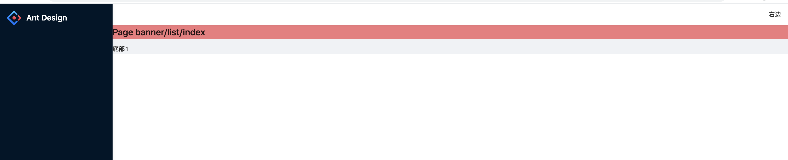
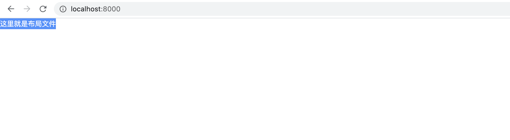
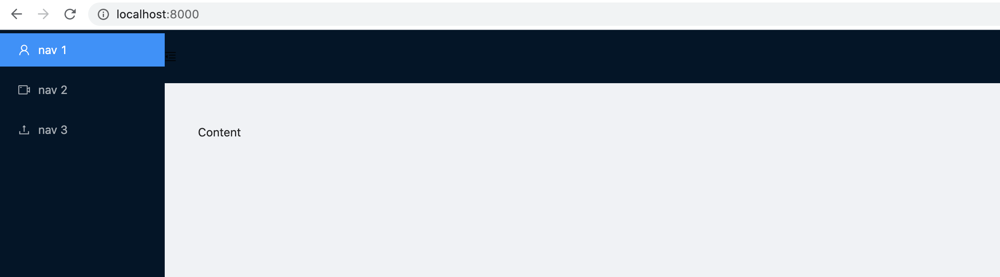
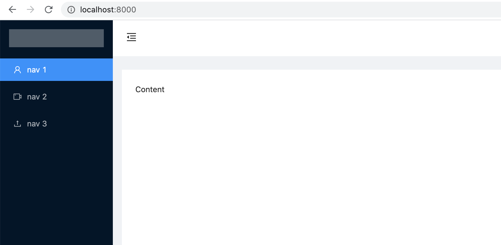
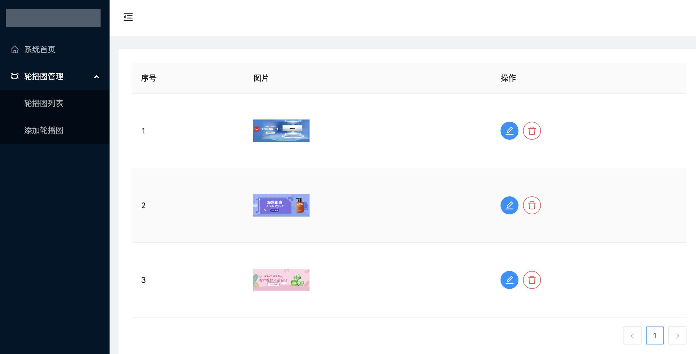

# 1.创建项目

```
mkdir umipro

cd umipro

yarn create @umijs/umi-app

yarn

yarn start
```


## 1.1 配置布局

只需要在 umi.ts 中添加 layout的配置即可

```js
import { defineConfig } from 'umi';

export default defineConfig({
  nodeModulesTransform: {
    type: 'none',
  },
  layout: {},
  routes: [
    { path: '/', component: '@/pages/index' },
  ],
});

```

## 1.2 打包

```
yarn build

/**
dist
*/
```

## 1.3 本地验证

```
yarn global add serve

serve ./dist


dist目录传到服务器
```

# 2.创建页面并且配置路由

```
npx umi g page banner/index --typescript --less
npx umi g page product/index --typescript --less
npx umi g page product/add/index --typescript --less
npx umi g page user/index --typescript --less
```

Umi.ts

```js
import { defineConfig } from 'umi';

export default defineConfig({
  nodeModulesTransform: {
    type: 'none',
  },
  layout: {},
  routes: [
    { path: '/', exact: true, redirect: '/home' },
    { path: '/home', name: '系统首页', component: '@/pages/index' },
    { path: '/banner', name: '轮播图管理',
      routes: [
        { path:'/banner/list', name: '轮播图列表', component: '@/pages/banner/index'}
      ]
    },
    { path: '/product', name: '产品管理',
      routes: [
        { path:'/product/list', name: '产品列表', component: '@/pages/product/index'},
        { path:'/product/add', name: '添加产品', component: '@/pages/product/add/index'}
      ]
    },
    { path: '/user', name: '用户管理',
      routes: [
        { path:'/user/list', name: '用户列表', component: '@/pages/user/index'}
      ]
    },
  ],
});

```

## 2.1 添加页面的标题以及左侧菜单的图标

https://pro.ant.design/docs/layout-cn

https://procomponents.ant.design/

```js
import { defineConfig } from 'umi';

export default defineConfig({
  nodeModulesTransform: {
    type: 'none',
  },
  layout: { name: '后台管理系统' },
  routes: [
    { path: '/', exact: true, redirect: '/home' },
    { path: '/home', name: '系统首页', icon: 'HomeOutlined', component: '@/pages/index' },
    { path: '/banner', name: '轮播图管理', icon: 'AppstoreOutlined',
      routes: [
        { path:'/banner/list', name: '轮播图列表', component: '@/pages/banner/index'}
      ]
    },
    { path: '/product', name: '产品管理', icon: 'FireOutlined',
      routes: [
        { path:'/product/list', name: '产品列表', component: '@/pages/product/index'},
        { path:'/product/add', name: '添加产品', component: '@/pages/product/add/index'}
      ]
    },
    { path: '/user', name: '用户管理', icon: 'ExperimentOutlined',
      routes: [
        { path:'/user/list', name: '用户列表', component: '@/pages/user/index'}
      ]
    },
  ],
});

```

```text
{
  name: 'dashboard',
  icon: 'dashboard',
  hideInMenu: true,
  hideChildrenInMenu: true,
  hideInBreadcrumb: true,
  authority: ['admin'],
}
```

- `name`: 当前路由在菜单和面包屑中的名称，注意这里是国际化配置的 key，具体展示菜单名可以在 [/src/locales/zh-CN.ts](https://github.com/ant-design/ant-design-pro/blob/v2/src/locales/zh-CN.ts) 进行配置。
- `icon`: 当前路由在菜单下的图标名。
- `hideInMenu`: 当前路由在菜单中不展现，默认 `false`。
- `hideChildrenInMenu`: 当前路由的子级在菜单中不展现，默认 `false`。
- `hideInBreadcrumb`: 当前路由在面包屑中不展现，默认 `false`。
- `authority`: 允许展示的权限，不设则都可见，详见：[权限管理](https://pro.ant.design/docs/authority-management)。

# 3.接入UMI ui

https://umijs.org/zh-CN/docs/use-umi-ui

```
yarn add @umijs/preset-ui -D

yarn start
```


Umi ui 通过 http://localhost:3000 进入项目管理器

通过 http://localhost:8000 查看本项目


## 3.1 使用umi ui创建一个新的项目

在项目管理器中选择新建项目，在新建的项目中安装 umiui

```
yarn add @umijs/preset-ui -D

yarn start

```

打开 网页，选择右下角的 umi的图标。可以选择模版或者 区块加入到项目中，选择要放置的位置，然后可以把代码再次移植到其他地方


对比之后发现两种创建项目出来之后 代码会有差异化，推荐大家使用 脚手架类型的


# 4. 自定义布局文件的局部

默认采用的是 自带的 布局文件，比如自定义头部，发现没有找到可以填写的地方，查看api，如果是配置式路由，没有核实的方案

可以采用插件，https://umijs.org/zh-CN/plugins/plugin-layout，采用 构建时配置和运行时配置

```js
import { defineConfig } from 'umi';
import React from 'react'
export default defineConfig({
  nodeModulesTransform: {
    type: 'none',
  },
  proxy: {
    '/api': {
      'target': 'http://localhost:3001/api',
      'changeOrigin': true,
      'pathRewrite': { '^/api' : '' },
    }
  },
  styles: [
    `body { background-color: #f66 }`
  ],
  layout: { // 使用 插件构建时配置
    name: '后台管理系统',
    locale: true,
    layout: 'side',
    showBreadcrumb: true,
    loading: true
  },
  routes: [
    { path: '/', exact: true, redirect: '/home' },
    { path: '/home', name: '系统首页', icon: 'HomeOutlined', component: '@/pages/index' },
    { path: '/login', menuRender: false, name: '登录', hideInMenu: true,  icon:  'HomeOutlined', component: '@/pages/login/index' },
    { path: '/banner', name: '轮播图管理', icon: 'AppstoreOutlined',
      component: "@/layouts/Banner", // 规定了轮播图管理中的布局文件
      routes: [
        { path:'/banner/list', name: '轮播图列表', component: '@/pages/banner/index'},
        { path:'/banner/detail/:id', hideInMenu: true, name: '轮播图详情', component: '@/pages/banner/detail/index'}
      ]
    },
    { path: '/product', name: '产品管理', icon: 'FireOutlined',
      routes: [
        { path:'/product/list', name: '产品列表', component: '@/pages/product/index'},
        { path:'/product/add', name: '添加产品', component: '@/pages/product/add/index'}
      ]
    },
    { path: '/user', name: '用户管理', icon: 'ExperimentOutlined',
      routes: [
        { path:'/user/list', name: '用户列表', component: '@/pages/user/index'}
      ]
    },
  ],
});

```


src/app.tsx组件

```js
import React from 'react';
import {
  BasicLayoutProps, // 第三行代码
} from '@ant-design/pro-layout';

const RightContent = () => <div>右边</div>
const Footer = () => <div>底部1</div>
export const layout = (): BasicLayoutProps => {
  return {
    rightContentRender: () => <RightContent />,
    footerRender: () => <Footer />,
    loading: false
  };
};
```

可以配置的属性有很多（按住ctrl ，点击 第三行 查看源码中的配置项），如果不懂的话，可以参考文档 https://procomponents.ant.design/components/layout#prolayout 的属性表


# 5.页面间的跳转

```
npx umi g page banner/detail/index --typescript --less
npx umi g page login/index --typescript --less
npx umi g page product/add/index --typescript --less
npx umi g page product/index --typescript --less
npx umi g page user/index --typescript --less
路由的定义查看 第4步
```

首页面使用了 声明式跳转和编程式跳转

```js
import React from 'react';
import styles from './index.less';
import { Prompt } from 'umi';
import { history, Link } from 'umi' // ****************

export default () => {
  const formIsHalfFilledOut = true
  return (
    <div>
      <h1 className={styles.title}>系统首页</h1>
      <button onClick={ () => {
        history.push('/banner/list')
      }}>去轮播图列表</button>
      <Link to="/user/list">去用户列表</Link>
      </div>
    </div>
  );
}

```

定义 动态路由传参 ----- 跟vue和react一样

定义路由时 `{ path:'/banner/detail/:id', hideInMenu: true, name: '轮播图详情', component: '@/pages/banner/detail/index'}`

使用时 banner/index.tsx

```js
import React, { useEffect } from 'react';
import styles from './index.less';
import { history } from 'umi'
export default () => {
  useEffect(() => { // 数据请求
    fetch('/api/banner').then(res => res.json()).then(res => {
      console.log(res)
    })
  }, [])
  return (
    <div>
      <h1 className={styles.title}>Page banner/index</h1>
      <button onClick = { () => {
        history.push('/banner/detail/123')
      }}>去详情</button>
    </div>
  );
}

```

获取参数 banner/detail/index.tsx

```js
import React from 'react';
import styles from './index.less';
interface Props {

}
export default (props: Props) => {
  console.log(props) // props.match.params
  return (
    <div>
      <h1 className={styles.title}>轮播图详情</h1>
    </div>
  );
}

```

# 6.约定式路由

```
mkdir umi-app
cd umi-app
yarn create @umijs/umi-app
yarn
yarn start

```

## 6.1 配置约定式

.umirc.ts文件中删除 routes 的选项,否则约定式路由不生效

```ts
import { defineConfig } from 'umi';

export default defineConfig({
  nodeModulesTransform: {
    type: 'none',
  },
  // routes: [
  //   { path: '/', component: '@/pages/index' },
  // ],
});

```

## 6.2 添加layout的选项，使用默认布局

```ts
import { defineConfig } from 'umi';

export default defineConfig({
  nodeModulesTransform: {
    type: 'none',
  },
  layout: {
    name: 'Ant Design',
    locale: true,
    layout: 'side',
  }
});

```


src/App.tsx

```ts
import React from 'react';
import {
  BasicLayoutProps,
} from '@ant-design/pro-layout';

const RightContent = () => <div>右边</div>
const Footer = () => <div>底部1</div>
export const layout = (): BasicLayoutProps => {
  return {
    rightContentRender: () => <RightContent />,
    footerRender: () => <Footer />,
    loading: false
  };
};
```



## 6.2 约定式布局

删除 src/App.tsx，修改.umirc.ts文件，src/layouts/index.tsx,重启项目（删除src/.umi）

```
import { defineConfig } from 'umi';

export default defineConfig({
  nodeModulesTransform: {
    type: 'none',
  }
});

```

src/layouts/index.tsx

```tsx
import React from 'react'

function BasicLayout () {
  return (
    <div>这里就是布局文件</div>
  )
}

export default BasicLayout
```




## 6.3 引入ant-design 的布局

内置ant-design,无需安装

```tsx
import React, { useState } from 'react'
import { Layout, Menu } from 'antd'
import { 
  UserOutlined,
  VideoCameraOutlined,
  UploadOutlined,
  MenuUnfoldOutlined,
  MenuFoldOutlined
} from '@ant-design/icons';
const { Sider, Header, Content } = Layout
function BasicLayout () {
  const [ collapsed, setCollapsed ] = useState(false)
  const toggle = () => {
    setCollapsed(!collapsed)
  }
  return (
    <Layout className="mylayout">
        <Sider trigger={null} collapsible collapsed={collapsed}>
          <div className="logo" />
          <Menu theme="dark" mode="inline" defaultSelectedKeys={['1']}>
            <Menu.Item key="1" icon={<UserOutlined />}>
              nav 1
            </Menu.Item>
            <Menu.Item key="2" icon={<VideoCameraOutlined />}>
              nav 2
            </Menu.Item>
            <Menu.Item key="3" icon={<UploadOutlined />}>
              nav 3
            </Menu.Item>
          </Menu>
        </Sider>
        <Layout className="site-layout">
          <Header className="site-layout-background" style={{ padding: 0 }}>
            {React.createElement(collapsed ? MenuUnfoldOutlined : MenuFoldOutlined, {
              className: 'trigger',
              onClick: toggle,
            })}
          </Header>
          <Content
            className="site-layout-background"
            style={{
              margin: '24px 16px',
              padding: 24,
              minHeight: 280,
            }}
          >
            Content
          </Content>
        </Layout>
      </Layout>
  )
}

export default BasicLayout
```



需要修改 样式 ，参考文档 https://umijs.org/zh-CN/docs/assets-css#%E5%85%A8%E5%B1%80%E6%A0%B7%E5%BC%8F

src/global.less

```css
.mylayout {
  .trigger {
    font-size: 18px;
    line-height: 64px;
    padding: 0 24px;
    cursor: pointer;
    transition: color 0.3s;

    &:hover {
      color: #1890ff;
    }
  }
  .logo {
    height: 32px;
    background: rgba(255, 255, 255, 0.3);
    margin: 16px;
  }
}

.site-layout{
  .site-layout-background {
    background: #fff;
  }
}

html, body, #root, .ant-layout { height: 100%;}
```



## 6.4 渲染左侧的菜单栏数据

Layouts/routes.ts

```ts
import {
  HomeOutlined,
  GatewayOutlined
} from '@ant-design/icons'
export default [
  {
    path: '/',
    icon: HomeOutlined,
    title: '系统首页'
  },
  {
    path: '/banner',
    title: '轮播图管理',
    icon: GatewayOutlined,
    children: [
      {
        path: '/banner/list',
        title: '轮播图列表'
      },
      {
        path: '/banner/add',
        title: '添加轮播图'
      }
    ]
  }
]
```

Layouts/MyMenu.tsx

```tsx
import React from 'react'
import { Menu } from 'antd';
const { SubMenu } = Menu;
import routes from './routes'
function MyMenu () {
  const renderMenu = (routes: Array<any>) => {
    return routes.map(item => {
      if (item.children) {
        return <SubMenu key={item.path} icon={<item.icon />} title={ item.title }>
          {
            renderMenu(item.children)
          }
        </SubMenu>
      } else {
        return <Menu.Item icon={ item.icon && <item.icon />} key={ item.path }>{ item.title }</Menu.Item>
      }
    })
  }
  return (
    <Menu theme="dark" mode="inline" defaultSelectedKeys={['1']}>
      {
        renderMenu(routes)
      }
    </Menu>
  )
}

export default MyMenu
```

Layouts/index.tsx

```tsx
import MyMenu from './MyMenu'

<Sider trigger={null} collapsible collapsed={collapsed}>
	<div className="logo" />
	<MyMenu />
</Sider>
```

## 6.5 点击左侧菜单跳转路由

无需使用 类似于withRouter这样的高阶组件

```tsx
import React from 'react'
import { Menu } from 'antd';
import { history } from 'umi' // ********************
const { SubMenu } = Menu;
import routes from './routes'

function MyMenu () {
  const renderMenu = (routes: Array<any>) => {
    return routes.map(item => {
      if (item.children) {
        return <SubMenu key={item.path} icon={<item.icon />} title={ item.title }>
          {
            renderMenu(item.children)
          }
        </SubMenu>
      } else {
        return <Menu.Item icon={ item.icon && <item.icon />} key={ item.path }>{ item.title }</Menu.Item>
      }
    })
  }
  const selectRoute = ({key}: any) => {
    // console.log(key, history)
    history.push(key)
  }
  return (
    <Menu theme="dark" mode="inline" onSelect={ selectRoute } defaultSelectedKeys={['1']}>
      {
        renderMenu(routes)
      }
    </Menu>
  )
}

export default MyMenu
```

## 6.6 渲染轮播图列表

`cnpm i axios @types/axios -S`

Utils/request.ts

```ts
import axios from 'axios'

const request = axios.create({
  baseURL: 'http://localhost:3001/api'
})


export default request
```

Api/banner.ts

```ts
import request from '@/utils/request'

export function getBannerlist () {
  return request.get('/banner')
}
```

Pages/banner/list/index.tsx

```tsx
import React, { useState, useEffect } from 'react';
import styles from './index.less';
import { getBannerlist } from '@/api/banner'
import { Table, Space, Button } from 'antd'
import {
  EditOutlined,
  DeleteOutlined
} from '@ant-design/icons'
interface IBanner {
  bannerid: string
  bannerimg: string
  alt: string
  link: string
}
export default () => {
  const [ bannerlist, setBannerlist ] = useState([])
  useEffect(() => {
    async function getData () {
      const res = await getBannerlist()
      console.log(res)
      setBannerlist(res.data.data)
    }
    getData()
  }, [])

  const columns = [
    {
      title: '序号',
      render: (text: string | number | boolean, record: IBanner , index: number) => <span>{ index + 1}</span>
    },
    {
      title: '图片',
      key: 'bannerimg',
      dataIndex: 'bannerimg',
      render: (text: string) => {
        return 
      }
    },
    {
      title: '操作',
      render: () => <Space>
        <Button type="primary" shape="circle" icon={<EditOutlined />} />
        <Button danger shape="circle" icon={<DeleteOutlined />} />
      </Space>
    },
  ]
  return (
    <Table dataSource={ bannerlist } columns={columns} rowKey = { item => item.bannerid }/>
  );
}

```



## 6.7 列表进入详情并且传递参数

`npx umi g page banner/detail/index --typescript --less`

修改pages/banner/detail/index.tsx 文件名为。detail/[bannerid].tsx

此时 umi 就会生成以下路由

```ts
{
        "path": "/banner/detail/:bannerid",
        "exact": true,
        "component": require('@/pages/banner/detail/[bannerid].tsx').default
      },
```

如果参数是可传可不传

修改pages/banner/detail/[bannerid].tsx 文件名为。detail/[bannerid$].tsx

此时 umi 就会生成以下路由

```ts
 {
        "path": "/banner/detail/:bannerid?",
        "exact": true,
        "component": require('@/pages/banner/detail/[bannerid$].tsx').default
      },
```

Pages/banner/list.tsx

```tsx
import React, { useState, useEffect } from 'react';
import styles from './index.less';
import { history } from 'umi' // *****************
import { getBannerlist } from '@/api/banner'
import { Table, Space, Button } from 'antd'
import {
  EditOutlined,
  DeleteOutlined
} from '@ant-design/icons'
interface IBanner {
  bannerid: string
  bannerimg: string
  alt: string
  link: string
}
export default () => {
  const [ bannerlist, setBannerlist ] = useState([])
  useEffect(() => {
    async function getData () {
      const res = await getBannerlist()
      console.log(res)
      setBannerlist(res.data.data)
    }
    getData()
  }, [])

  const columns = [
    {
      title: '序号',
      render: (text: string | number | boolean, record: IBanner , index: number) => <span>{ index + 1}</span>
    },
    {
      title: '图片',
      key: 'bannerimg',
      dataIndex: 'bannerimg',
      render: (text: string) => {
        return 
      }
    },
    {
      title: '操作',
      // ****************************
      render: (text: any, record: IBanner) => <Space>
        <Button type="primary" onClick = {() => {
          history.push('/banner/detail/' + record.bannerid)
        }} shape="circle" icon={<EditOutlined />} />
        <Button danger shape="circle" icon={<DeleteOutlined />} />
      </Space>
    },
  ]
  return (
    <Table dataSource={ bannerlist } columns={columns} rowKey = { item => item.bannerid }/>
  );
}

```

Pages/banner/detail/[bannerid].tsx

```tsx
import React from 'react';
import styles from './index.less';

export default ({ match: { params: {bannerid}} }: any) => {
  return (
    <div>
      <h1 className={styles.title}>Page banner/detail/index - {bannerid}</h1>
    </div>
  );
}

```

## 6.8 如何使用数据的共享 ---- 状态管理器

使用 model 插件 可以实现函数式组件的数据共享 https://umijs.org/zh-CN/plugins/plugin-model#usemodel

Src/models/pro.ts

```ts
import { useState } from 'react';
import { getProlist } from '@/api/pro'
export default function () {
  const [prolist, setProlist] = useState([]);
  const [aa, setAa] = useState(0);

  // 数据请求
  const getProlistFn = async () => {
    const res = await getProlist()
    setProlist(res.data.data)
  }

  return {
    aa,
    prolist,
    getProlistFn
  }
}
```

组件处使用

pages/pro/list/index.tsx

```tsx
import React, { useEffect } from 'react';
import styles from './index.less';
import { useModel } from 'umi' // ***************
import { Table } from 'antd'
export default () => {
  const { prolist, getProlistFn } = useModel('pro') // ******* 第一个参数对应 models文件夹下的 文件名 ********
  useEffect(() => { // ***************
    getProlistFn()
  }, [])
  const columns = [
    {
      title: '序号',
      render: (text: any, record: any, index: number) => <span>{ index + 1 }</span>
    },
    {
      title: '产品名称',
      key: 'proname',
      dataIndex: 'proname'
    }
  ]
  return (
    <Table dataSource = { prolist } columns = { columns } rowKey = { item => item.proid } />
  );
}

```

pages/index.tsx

```tsx
import React, { useEffect } from 'react';
import styles from './index.less';
import { useModel } from 'umi'
import { Table } from 'antd'
export default () => {
  // useModel 的第二个参数 是 model ，可以通过返回 对象 指定当前组件需要的状态，提升性能的关键
  const { prolist } = useModel('pro', (model: any) => {
    console.log(model)
    return {prolist: model.prolist}
  })
  const columns = [
    {
      title: '序号',
      render: (text: any, record: any, index: number) => <span>{ index + 1 }</span>
    },
    {
      title: '产品名称',
      key: 'proname',
      dataIndex: 'proname'
    },
    {
      title: '价格',
      key: 'originprice',
      dataIndex: 'originprice'
    }
  ]
  return (
    <Table dataSource = { prolist } columns = { columns } rowKey = { item => item.proid } />
  );
}

```

model的插件 可以 在函数式组件中很好的 使用状态管理，但是如果目标组件是类组件时，不可以

## 6.9 dva插件

Src/app.tsx.  ---- 可以写 也可以不写（如果写了）

```tsx
import { createLogger } from 'redux-logger';
import { message } from 'antd';
export const dva = {
  config: {
    onAction: createLogger(),
    onError(e: Error) {
      message.error(e.message, 3);
    },
  },
};
```


Src/models/pro.ts

```ts
import { Effect, ImmerReducer, Reducer, Subscription } from 'umi'
import { getProlist } from '@/api/pro'
export interface IPro {
  proid: string;
  proname: string;
  img1: string;
  originprice: number;
}

export interface IProModelState {
  name?: string;
  prolist: Array<IPro>
}
export interface IProModelType {
  namespace: string
  state: IProModelState
  effects: Effect,
  reducers: {
    changeProlist: Reducer<IProModelState>
  },
  subscriptions: { setup: Subscription };
}
const proModel: IProModelType = {
  namespace: 'pro', // 命名空间，如果不设置那么文件名称即为命名空间
  state: { // 初始化状态
    name: '',
    prolist: []
  },
  effects: { // 类似于 vuex 中的 actions，但是不要理解成一样
    * getProlistFn ({ payload }: any, { call, put }: any) {
      console.log(2222222)
      // 异步操作，通过 call 方法 调用异步操作，通过put告诉reducer修改状态
      const res = yield call(getProlist)
      console.log(4444, res)
      yield put({
        type: 'changeProlist',
        payload: res.data.data
      })
    }
  },
  reducers: { // 类似于 vuex 中 mutations 
    changeProlist (state: IProModelState, action: any) {
      console.log(3333333, action)
      return {...state, prolist: action.payload}
    },
  },
  subscriptions: { // 自动运行
    setup({ dispatch, history }: any) {
      console.log(1111111)
      return history.listen(({ pathname }: any) => {
        if (pathname === '/pro/list') { // 产品的 componentDidMount 执行
          console.log(66666)
          dispatch({
            type: 'getProlistFn',
          })
        }
      });
    }
  }
}
export default proModel
```

Src/pages/pro/list/index.tsx

```tsx
import React from 'react';
import { connect } from 'umi'
import { Table } from 'antd'
class Pro extends React.Component {
  columns = [
    {
      title: '序号',
      render: (text: any, record: any, index: number) => <span>{ index + 1 }</span>
    },
    {
      title: '产品名称',
      key: 'proname',
      dataIndex: 'proname'
    }
  ]
  render () {
    return (
      <Table dataSource = { this.props.pro.prolist } columns = { this.columns } rowKey = { item => item.proid } />
    );
  }
}
// const Pro = (props) => {
//   const columns = [
//     {
//       title: '序号',
//       render: (text: any, record: any, index: number) => <span>{ index + 1 }</span>
//     },
//     {
//       title: '产品名称',
//       key: 'proname',
//       dataIndex: 'proname'
//     }
//   ]
//   return (
//     <Table dataSource = { props.pro.prolist } columns = { columns } rowKey = { item => item.proid } />
//   );
// }

export default connect(({ pro }: any) => {
  // console.log(obj)
  return {
    pro
  }
})(Pro)

```


测试 subscriptions 不写，如何做,组件中的写法

```
componentDidMount () {
    console.log(this.props)
    this.props.dispatch({
      type: 'pro/getProlistFn',
    })
  }
```


