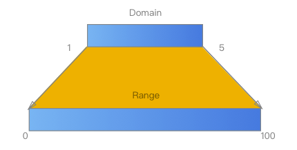
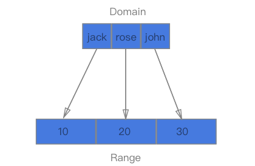
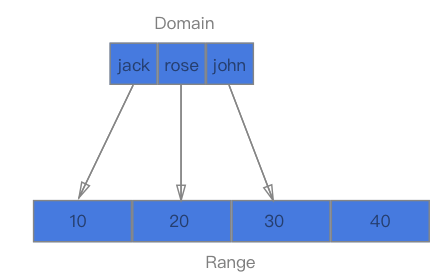
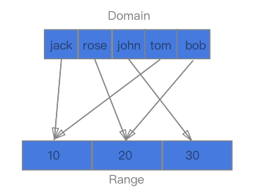
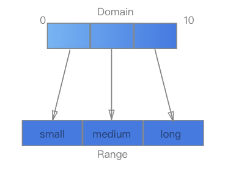

#  1.什么是数据可视化

### 数据可视化

将结果数据的每一个数据项，作为单个图元元素展示，大量的数据集构成数据图像，同时将数据的各个属性以多维度的方式展现，从而提高数据的可读性

### 数据可视化的优点

图形化展示比文字的描述能力更强，降低大数据据阅读门槛，清晰有效地传达与沟通信息。具体做法：是指将大型数据集中的数据以图形图像形式表示。基于几何的技术、面向像素技术、基于图标的技术、基于层次的技术、基于图像的技术和分布式技术等等

```
国内经典案例：
百度统计（https://tongji.baidu.com/）（导航栏demo链接进入）
阿里云 数加（https://data.aliyun.com/）
北京数字冰雹（http://www.uipower.com/）
```

### 数据处理流程

1. 将已经存在的数据管理起来（ 收集、采集 ）

2. 数据清洗 (etl  extract transform load  数据仓库技术 )

3. 数据计算：统计分析(分组、极值、多维度展示)， 结果预测（spark）、python机器学习（分类/聚类算法）

4. 数据可视化

   - echarts：(百度开源项目，国内应用领域十分广泛，apache孵化器，各大领域，入门比较容易、主要是修改配置)
   - highCharts： （学习可以，商用需要授权，09年发布，使用纯js编写的图表库）
   - d3：D3 的全称是（Data-Driven Documents），一个被数据驱动的文档。听名字有点抽象，说简单一点，其实就是一个 JavaScript 的函数库，主要是用来做数据可视化，将强大的可视化组件应用于需求中。

   

### 预备知识

```
HTML：超文本标记语言，用于设定网页的内容
CSS：层叠样式表，用于设定网页的样式
JavaScript：一种直译式脚本语言，用于设定网页的行为
DOM：文档对象模型，用于修改文档的内容和结构
SVG：可缩放矢量图形，用于绘制可视化的图形
```

# 2.ECharts 轻松上手

```
Echarts：一个纯 Javascript 的图表库，而且ECharts 3 开始不再强制使用 AMD 的方式按需引入，
代码里也不再内置 AMD 加载器。只需要像普通的 JavaScript 库一样用 script 标签引入。

js下载： 
http://echarts.baidu.com/download.html 。(可定制)

ui皮肤定制：
https://echarts.baidu.com/theme-builder/
```

## ECharts 起步

```
<script src="./echarts.min.js"></script>
```

```
在绘图前我们需要为 ECharts 准备一个具备高宽的 DOM 容器
```

```
<div id="container"></div>
```

```html
<!DOCTYPE html>
<html lang="en">

<head>
  <meta charset="UTF-8">
  <meta name="viewport" content="width=device-width, initial-scale=1.0">
  <meta http-equiv="X-UA-Compatible" content="ie=edge">
  <title>start</title>
  <script src="./echarts.min.js"></script>
  <style>
    #container {
      width: 600px;
      height: 500px;
    }
  </style>
</head>

<body>
  <div id="container">
  </div>

  <script>
    var myChart = echarts.init(document.getElementById('container'));
    var option = {
      //标题组件，主标题，副标题
      title: {
        text: 'echarts 入门',
        link: 'https://www.baidu.com',
        subtext: 'demo'
      },
      //图例组件
      legend: {
        data: ['销量'],
        show: true,
        right: '20'
      },
      //x坐标轴
      xAxis: {
        data: ["衬衫", "羊毛衫", "雪纺衫", "裤子", "高跟鞋", "袜子"]
      },
      //y坐标轴
      yAxis: {
        show: true
      },
      //通过type指定表的类型
      series: [
        {
          name: '销量',
          type: 'bar',
          data: [10, 30, 25, 5, 40, 35],
          animationDelay: function (idx) {
            return idx * 10;
          }
        }
      ]
    }
    myChart.setOption(option);
  </script>

</body>

</html>
```

## 常用配置介绍

```
参见：https://www.echartsjs.com/zh/option.html
```

# 3.Vue + Echart 项目实战

## 安装脚手架
```
yarn global add @vue/cli
```

## 创建项目
```
vue init vue-echarts
```

## 配置vue.config.js

在根目录下创建 vue.config.js：

```js
module.exports = {
  publicPath: '/',
  outputDir: 'dist',
  configureWebpack: {
    devtool: 'source-map',
    externals: {

    }
  },
  devServer: {
    proxy: {
      '/api': {
        target: 'http://localhost:9000',
        changeOrigin: true,
        pathRewrite: {
          '^/api': ''
        }
      }
    }
  }
}
```

## 安装echarts

```
yarn add echarts
```

## 一些模拟数据

##### 柱状图模拟数据 (bar.json)

```json
{
  "data": {
    "name": [
      "衬衫",
      "羊毛衫",
      "雪纺衫",
      "裤子",
      "高跟鞋",
      "袜子"
    ],
    "sales": [
      10,
      30,
      25,
      5,
      40,
      35
    ],
    "cost": [
      5,
      3,
      6,
      0.5,
      4,
      15
    ]
  }
}
```

##### 饼图模拟数据 （pie.json）

```json
{
  "data": {
    "title": "某站点用户访问来源",
    "list": [
      {
        "value": 335,
        "name": "直接访问"
      },
      {
        "value": 310,
        "name": "邮件营销"
      },
      {
        "value": 234,
        "name": "联盟广告"
      },
      {
        "value": 135,
        "name": "视频广告"
      },
      {
        "value": 1548,
        "name": "搜索引擎"
      }
    ]
  }
}
```

## json-server 模拟接口

##### 安装 json-server

```
yarn global add json-server
```

##### 创建json-server运行环境

在项目根目录下创建mock文件夹，将上述的.json模拟数据放进去。再创建一个mock.js文件：

```js
// /mock/mock.js
module.exports = () => {
  return {
    pie: require('./pie.json'),
    bar: require('./bar.json')
  }
}
```

在 package.json 中的 script 中添加脚本：

```json
"mock": "json-server ./mock/mock.js --watch"
```

## App.vue

```vue
<template>
  <div id="app">
    <Pie/>
  </div>
</template>

<script>
import Pie from "./Pie"

export default {
  name: "app",
  components: {
    Pie
  },
  data() {
    return {}
  }
}
</script>

<style lang="scss">
#app {
  text-align: center;
  color: #2c3e50;
  margin-top: 60px;
  width: 600px;
  height: 500px;
}
</style>

```

## Pie.vue

```vue
<template>
  <div ref="container" style="width:500px;height:500px;">
    111
  </div>
</template>

<script>
import echarts from "echarts"

export default {
  name: "app",
  created() {},
  data() {
    return {
      title: "某站点用户访问来源",
      data: []
    }
  },
  components: {},
  methods: {
    initBar() {
      var myChart = echarts.init(this.$refs.container)
      var option = {
        //标题组件，主标题，副标题
        title: {
          text: "echarts 入门",
          link: "https://www.baidu.com",
          subtext: "demo"
        },
        //图例组件
        legend: {
          data: ["销量"],
          show: true,
          right: "20"
        },
        //x坐标轴
        xAxis: {
          data: this.name,
          show: false
        },
        //y坐标轴
        yAxis: {
          show: true,
        },
        //系列，通过type指定表的类型
        series: [
          {
            name: "销量",
            type: "pie",
            data: this.data,
            radius: "55%",
            center: ["40%", "50%"]
          }
        ]
      }
      myChart.setOption(option)
    }
  },
  mounted() {
    fetch("http://localhost:3000/data")
      .then(res => res.json())
      .then(res => {
        this.title = res.title
        this.data = res.list
        this.initBar()
      })
  }
}
</script>

<style lang="scss">
#app {
  text-align: center;
  color: #2c3e50;
  margin-top: 60px;
  width: 600px;
  height: 500px;
}
</style>

```

## echarts 其它问题

##### 折线图的圆滑展示，和曲线的差异配置, 文本样式设置

```
smooth
```

##### 如何避免折线数据堆叠的问题？ 

```
stack
```

##### 动画：柱状图动画延迟，animationDelay

```js
 series: [
    {
      name: "销量",
      type: "bar",
      data: this.sales,
      animationDelay: function(idx) {
        return idx * 10
      }
    },
    {
      name: "成本",
      type: "bar",
      data: this.cost,
      animationDelay: function(idx) {
        return idx * 500
      }
    }
  ]
```

```js
animationEasing: "elasticOut",
animationDelayUpdate: function(idx) {
  return idx * 50
}
```

##### 外部数据更新

```js
myChart.setOption(option)
```

## 使用vue-echarts

[前往 vue-echarts 官网](https://github.com/ecomfe/vue-echarts/blob/HEAD/README.zh_CN.md)

##### 安装 vue-echarts

```
yarn add echarts@4.9.0 vue-echarts --dev
```

##### 配置 vue.config.js
Vue-ECharts 默认在 webpack 环境下会引入未编译的源码版本，如果你正在使用官方的 Vue CLI 来创建项目，可能会遇到默认配置把 node_modules 中的文件排除在 Babel 转译范围以外的问题。请按如下方法修改配置：

当使用 Vue CLI 3+ 时，需要在 vue.config.js 中的 transpileDependencies 增加 vue-echarts 及 resize-detector，如下：

```js
// vue.config.js
module.exports = {
  transpileDependencies: [
    'vue-echarts',
    'resize-detector'
  ]
}
```

##### 创建 Polar.vue 组件

在 /src/component/Polar.vue

```vue
<template>
  <v-chart :options="polar"/>
</template>

<style>
/**
 * 默认尺寸为 600px×400px，如果想让图表响应尺寸变化，可以像下面这样
 * 把尺寸设为百分比值（同时请记得为容器设置尺寸）。
 */
.echarts {
  width: 100%;
  height: 100%;
}
</style>

<script>
import ECharts from 'vue-echarts'
import 'echarts/lib/chart/line'
import 'echarts/lib/component/polar'

export default {
  components: {
    'v-chart': ECharts
  },
  data () {
    let data = []

    for (let i = 0; i <= 360; i++) {
        let t = i / 180 * Math.PI
        let r = Math.sin(2 * t) * Math.cos(2 * t)
        data.push([r, i])
    }

    return {
      polar: {
        title: {
          text: '极坐标双数值轴'
        },
        legend: {
          data: ['line']
        },
        polar: {
          center: ['50%', '54%']
        },
        tooltip: {
          trigger: 'axis',
          axisPointer: {
            type: 'cross'
          }
        },
        angleAxis: {
          type: 'value',
          startAngle: 0
        },
        radiusAxis: {
          min: 0
        },
        series: [
          {
            coordinateSystem: 'polar',
            name: 'line',
            type: 'line',
            showSymbol: false,
            data: data
          }
        ],
        animationDuration: 2000
      }
    }
  }
}
</script>
```

# 4.React + Echart项目实战

```
yarn add react-app-rewired customize-cra
yarn add echarts@4.9.0 echarts-for-react
```

Package.json

```js
"scripts": {
    "start": "react-app-rewired start",
    "build": "react-app-rewired build",
    "test": "react-app-rewired test",
    "eject": "react-scripts eject"
  },
```

config-overrides.js

```
const path = require('path')
const { override, addWebpackAlias } = require('customize-cra')
module.exports = override(
  addWebpackAlias({
    "@": path.resolve(__dirname, './src/components')
  })
)
```

App.js

```jsx
import React, { Component } from 'react'
import ReactEcharts from 'echarts-for-react'; 
export default class App extends Component {
  getOption () {
    var data = [];

    for (var i = 0; i <= 100; i++) {
        var theta = i / 100 * 360;
        var r = 5 * (1 + Math.sin(theta / 180 * Math.PI));
        data.push([r, theta]);
    }

    const option = {
      title: {
        text: '极坐标双数值轴'
      },
      legend: {
        data: ['line']
      },
      polar: {},
      tooltip: {
        trigger: 'axis',
        axisPointer: {
          type: 'cross'
        }
      },
      angleAxis: {
        type: 'value',
        startAngle: 0
      },
      radiusAxis: {
      },
      series: [{
        coordinateSystem: 'polar',
        name: 'line',
        type: 'line',
        data: data
      }]
    };
    return option
  }
  render() {
    return (
      <ReactEcharts
  option={this.getOption()}
  notMerge={true}
  lazyUpdate={true}/>
    )
  }
}

```

# 5.[D3](http://d3js.org/)快速入门

记得安装 D3.js snippets 插件

##### 安装静态启动运行命令

```
yarn global add browser-sync

browser-sync start -s -f **/* --directory
```


##### D3安装

```html
<script src="https://d3js.org/d3.v5.min.js"></script>
```

##### 选择器

```js
在 D3 中，用于选择元素的函数有两个，这两个函数返回的结果称为选择集。
d3.select()：选择所有指定元素的第一个
d3.selectAll()：选择指定全部元素
例如，选择集的常见用法如下。
```

```js
var body = d3.select("body"); //选择文档中的body元素
var p1 = body.select("p");      //选择body中的第一个p元素
var p = body.selectAll("p");    //选择body中的所有p元素
var svg = body.select("svg");   //选择body中的svg元素
var rects = svg.selectAll("rect");  //选择svg中所有的rect元素
var id = body.select("#id"); //选择body中id元素
var class = body.select(".class");//选择body中class类元素
```

链式操作：

```js
d3.select("#container").text("1000phone").attr("style", "font-size:12px");
```

绑定数据
选择集和绑定数据通常是一起使用的，D3 中是通过以下两个函数来绑定数据的：

1. datum()：绑定一个数据到选择集上
2. data()：绑定一个数组到选择集上，数组的各项值分别与选择集的各元素绑定

假设现在有三个段落元素如下：

```html
<p></p>
<p></p>
<p></p>
```

对于datum():
假设有一字符串 逆战2020，要将此字符串分别与三个段落元素绑定，代码如下：

```js
var data = '千锋好程序员';
var container = d3.select("#app");
container.selectAll('p')
  .datum(data)
  .text(function (d, i) {
    return "第 " + i + " 个元素绑定的数据是： " + d;
  })
```

绑定数据后，使用此数据来修改三个段落元素的内容，其结果如下：

```html
第 0 个元素绑定的数据是： 千锋好程序员

第 1 个元素绑定的数据是： 千锋好程序员

第 2 个元素绑定的数据是： 千锋好程序员
```

对于data():

有一个数组，接下来要分别将数组的各元素绑定到三个段落元素上。


```js
var datalist = [10, 20, 30];
```

调用 data() 绑定数据，并替换三个段落元素的字符串为被绑定的字符串，代码如下：

```js
var datalist = [10, 20, 30];
var container = d3.select("#app");
//更新数据
container.selectAll('p')
  //绑定数据源
  .data(datalist)
  .text(function (data, index) {
    return data;
})
  
```

结果自然是三个段落的文字分别变成了数组的三个字符串。

```
10
20
30
```

前面代码也用到了一个无名函数 function(d, i)，其对应的情况如下：

```
d ------- data    数据
i ------- index   索引
```

当 i == 0 时， d 为 10。
当 i == 1 时， d 为 20。
当 i == 2 时， d 为 30。
此时，三个段落元素与数组 dataset 的三个字符串是一一对应的，在函数 function(d, i) 直接 return d 即可。

### 选择、插入、删除元素

1.选择元素

```html
<p>10</p>
<p>20</p>
<p>30</p>
```

选择第一个元素

```js
d3.select("body").select("p").style("color","red");
```

选择第所有元素

```js
d3.select("body").selectAll("p").style("color","red");
```

选择第二个元素

```js
<p id="second">20</p>
d3.select("#second").style("color","red");
```

选择后两个元素,给后两个元素添加 class，

```js
<p class="myclass">Moon</p>
<p class="myclass">You</p>
```

由于需要选择多个元素，要用 selectAll。

```js
d3.selectAll(".myclass").style("color","red")
```

插入元素
插入元素涉及的函数有两个：

append()：在选择集末尾插入元素
insert()：在选择集前面插入元素
假设有三个段落元素，与上文相同。

append()

```js
d3.select("body").append("p").text("Star");
```

insert

```js
d3.select("body").insert("p","#second").text("20");
```

删除元素

```js
d3.select("#second").remove();
```

### 理解 update()、enter()、exit()

数据绑定的时候可能出现 DOM 元素与数据元素个数不匹配的问题，那么 enter 和 exit 就是用来处理这个问题的。enter 操作用来添加新的 DOM 元素，exit 操作用来移除多余的 DOM 元素

Update、Enter、Exit 是 D3 中三个非常重要的概念，它处理的是当选择集和数据的数量关系不确定的情况。

1. update(), 当对应的元素正好满足时 （ 绑定数据数量 = 对应元素 )，实际上并不存在这样一个函数，只是为了要与之后的 enter 和 exit 一起说明才想象有这样一个函数。但对应元素正好满足时，直接操作即可，后面直接跟 text ，style 等操作即可。
2. enter(), 当对应的元素不足时 （ 绑定数据数量 > 对应元素 ），当对应的元素不足时，通常要添加元素，使之与绑定数据的数量相等。后面通常先跟 append 操作。
3. exit(), 当对应的元素过多时 （ 绑定数据数量 < 对应元素 ），当对应的元素过多时，通常要删除元素，使之与绑定数据的数量相等。后面通常要跟 remove 操作。


如果数组为 [3, 6, 9, 12, 15]，将此数组绑定到三个 p 元素的选择集上。可以想象，会有两个数据没有元素与之对应，这时候 D3 会建立两个空的元素与数据对应，这一部分就称为 Enter。而有元素与数据对应的部分称为 Update。如果数组为 [3]，则会有两个元素没有数据绑定，那么没有数据绑定的部分被称为 Exit。示意图如下所示。


而如下代码的意思是：此时 SVG 里没有 rect 元素，即元素数量为 0。有一数组 dataset，将数组与元素数量为 0 的选择集绑定后，选择其 Enter 部分（请仔细看上图），然后添加（append）元素，也就是添加足够的元素，使得每一个数据都有元素与之对应。

```js
svg.selectAll("rect")   //选择svg内所有的矩形
    .data(dataset)      //绑定数组
    .enter()            //指定选择集的enter部分
    .append("rect")     //添加足够数量的矩形元素
```

##### 1. Update和Enter的使用
当对应的元素不足时 （ 绑定数据数量 > 对应元素 ），需要添加元素（append）。
现在 body 中有三个 p 元素，要绑定一个长度大于 3 的数组到 p 的选择集上，然后分别处理 update 和 enter 两部分。

```js
var dataset = [ 3 , 6 , 9 , 12 , 15 ];

//选择body中的p元素
var p = d3.select("body").selectAll("p");

//获取update部分
var update = p.data(dataset);

//获取enter部分
var enter = update.enter();

//update部分的处理：更新属性值
update.text(function(d){
  return "update " + d;
});

//enter部分的处理：添加元素后赋予属性值
enter.append("p")
  .text(function(d){
      return "enter " + d;
  });
```

页面效果:
```
enter 3
enter 6
enter 9
enter 12
enter 15
```
需要注意的是:

update 部分的处理办法一般是：更新属性值
enter 部分的处理办法一般是：添加元素后，赋予属性值

##### 2. Update和Exit的使用

当对应的元素过多时 （ 绑定数据数量 < 对应元素 ），需要删掉多余的元素。
现在 body 中有三个 p 元素，要绑定一个长度小于 3 的数组到 p 的选择集上，然后分别处理 update 和 exit 两部分。

```js
var dataset = [ 3 ];

//选择body中的p元素
var p = d3.select("body").selectAll("p");

//获取update部分
var update = p.data(dataset);

//获取exit部分
var exit = update.exit();

//update部分的处理：更新属性值
update.text(function(d){
    return "update " + d;
});

//exit部分的处理：修改p元素的属性
exit.text(function(d){
    return "exit";
});

//exit部分的处理通常是删除元素
// exit.remove();
```

需要注意的是:
exit 部分的处理办法一般是：删除元素(remove)

### 过渡

D3 支持动画效果，这种动画效果可以通过对样式属性的过渡实现。其补间插值支持多种方式，比如线性、弹性等。此外 D3 内置了多种插值方式，比如对数值类型、字符类型路径数据以及颜色等。

启动过渡效果，与以下四个方法相关:

//创建一个过渡对象。但是由于每个选择集中都有transition()方法，可用d3.select("rect").transition()的方式来创建过渡，因此一般不直接用d3.transition()。
d3.transition([selection],[name])

//设定延迟的时间。过渡会经过一定时间后才开始发生。单位是毫秒。
transition.delay([delay])

//设定过渡的持续时间(不包括延迟时间)，单位是毫秒。如:duration(2000),是持续2000ms。
transition.duration([duration])

//设定过渡样式，例如线性过渡、在目标处弹跳几次等方式。
transition.ease(vlaue[,arguments])

接下来制作一个过渡效果:

```js
var width = 600;
var height = 400;

var svg = d3.select("#body")
            .append("svg")
            .attr("width",width)
            .attr("height",height)

svg.append("rect")
    .attr("fill","yellow")
    .attr("x",100)
    .attr("y",100)
    .attr("width",100)
    .attr("height",30)
    .transition()
    .duration(750)
    .delay(function(d, i) { return i * 10; })
    .attr("width",300)
    .attr("height",300)
```

除了 D3 提供的过渡之外，你也可以通过 CSS 动画来实现对元素的过渡效果。

### 做一个简单的图表

```html
<!DOCTYPE html>
<html lang="en">

<head>
  <meta charset="UTF-8">
  <meta name="viewport" content="width=device-width, initial-scale=1.0">
  <meta http-equiv="X-UA-Compatible" content="ie=edge">
  <title>Document</title>
  <script src="./d3.v5.min.js"></script>
  <style>
    #app {
      margin: 0 auto;
      width: 500px;
      height: 400px;
      background: #efefef;
      position: relative;
    }

    .bar {
      width: 30px;
      /* height: 50px; */
      background: green;
      position: absolute;
      bottom: 100px;
    }

    .bar span {
      display: block;
      text-align: center;
    }
  </style>
</head>

<body>
  <div id="app">
    <!-- <div class="bar"></div> -->
  </div>

  <script>

    var datalist = [10, 20, 30, 40, 50];
    var container = d3.select("#app");

    container.selectAll('div')
      .data(datalist)
      .enter()
      .append('div')
      .classed('bar', true)
      .style('height', function (d, i) {
        return d * 5 + 'px';
      })
      .style('left', function (d, i) {
        return i * 35 + 'px';
      })
      .append('span')
      .text(function (d) {
        return d;
      })
      .style('color', function (d) {
        if (d > 30) {
          return 'red';
        }
      })
  </script>

</body>

</html>

```

### svg基础

https://developer.mozilla.org/zh-CN/docs/Web/SVG
https://www.d3js.org.cn/svg/get_start/

#### 常用标签

```js
Rect   矩形
Ellipse   椭圆  
Line    画线
Circle  圆
polygon   多边形
polyline  折线
path 路径
Text   文本
defs   定义
g    分组
use  使用
Animate 动画

```

```html
<svg width="500" height="500" style="background: #efefef;">
    
    <!-- <rect x="50" y="100" width="100" height="50" fill="red" style="" stroke="blue" stroke-width="5" /> -->
    <!-- 
			cx 属性定义一个中心点的 x 轴坐标。
			cy 属性定义一个中心点的 y 轴坐标。
			rx 属性用于定义水平轴向的圆角半径尺寸。
			ry 属性用于定义垂直轴向的圆角半径尺寸。
		-->
    <!-- <ellipse cx="200" cy="200" rx="50" ry="100" style="fill:orange; stroke: orangered; stroke-width: 5px;" /> -->

    <!-- <line x1="50" y1="50" x2="450" y2="450" stroke="red" stroke-width="3" /> -->


    <!-- <circle cx="225" cy="225" r="100" style="fill:peru;" /> -->

    <!-- <polygon points="50,20 150,60  120,200  100,200" style="fill:pink;" fill="none" stroke="red" stroke-width="5" /> -->

    <!-- <!-- <polyline points="10,20 50,60  120,200  200,300" fill="blue" stroke="red" stroke-width="5"></polyline> -->
    -->

    <!-- <path d="M30,30 L200,200  L230,260" fill="none" stroke="green" stroke-width="5" />

   -->

    <!-- <defs>

      <g id="group">
        <rect x="50" y="100" width="100" height="50" style="fill:green;" stroke="blue" stroke-width="5">

          <animate attributeName="opacity" from="1" to="0" dur="5s" repeatCount="indefinite" />
        </rect>
        <circle cx="225" cy="225" r="100" style="fill:peru;">

          <animate attributeName="cx" from="225" to="100" dur="5s" repeatCount="indefinite" />
        </circle>
      </g>

    </defs> -->

    <!-- <use xlink:href="#group" x="30" y="30" />
    <use xlink:href="#group" x="130" y="130" /> -->

    <!-- <text x="200" y="200" style="fill: none; stroke: red; stroke-width: 1; font-size: 45px;">SZGP04</text> -->


    <clipPath id="myClipPath">
      <rect width="200" height="100" x="200" y="200"></rect>
    </clipPath>

    <circle cx="260" clip-path="url(#myClipPath)" cy="260" r="100" style="" />

  </svg>
```

### 将图表标签更换成svg

```html
<!DOCTYPE html>
<html lang="en">

<head>
  <meta charset="UTF-8">
  <meta name="viewport" content="width=device-width, initial-scale=1.0">
  <meta http-equiv="X-UA-Compatible" content="ie=edge">
  <title>Document</title>
  <script src="./d3.v5.min.js"></script>
  <style>
    #app {
      margin: 0 auto;
      width: 500px;
      height: 400px;
      background: #efefef;
      position: relative;
    }

    .bar {
      width: 30px;
      /* height: 50px; */
      fill: green;
      position: absolute;
      bottom: 100px;
    }

    .bar span {
      display: block;
      text-align: center;
    }
  </style>
</head>

<body>
  <svg id="app" style="width: 500px; height:400;">
    <!-- <div class="bar"></div> -->
  </svg>

  <script>

    var datalist = [10, 20, 30, 40, 50];
    var container = d3.select("#app");

    container.selectAll('rect')
      .data(datalist)
      .enter()
      .append('rect')
      .classed('bar', true)
    	.classed('width', 35)
      .style('height', function (d, i) {
        return d * 5 + 'px';
      })
      .attr('x', function (d, i) {
        return i * 35 + (i*15)+'px';
      })
      .attr('y', function (d, i) {
        return 400 - d * 5 + 110 + 'px';
      })
      .style('fill', function (d) {
        if (d > 30) {
          return 'red';
        }
      })


    container.selectAll('text')
      .data(datalist)
      .enter()
      .append('text')
      .attr('text-anchor', 'middle')
      .text(function (d) {
        return d;
      })
      .attr('x', function (d, i) {
        return i * 35 + (i*15) 'px';
      })
      .attr('y', function (d, i) {
        return 400 - d * 5 - 20 + 'px';
      })
      .style('color', function (d) {
        if (d > 30) {
          return 'red';
        }
      })

  </script>

</body>

</html>
```

# 6.D3进阶

### 加载外部数据

加载csv数据，可以通过d3.csv(data,function) 进行操作
加载json数据，跟上面是一样的，只需要将csv改为json就行

```
 d3.csv('./data.csv').then((result) => {
    var container = d3.select("#app");
    container.selectAll('h1')
      .data(result.columns)
      .enter()
      .append('h1')
      .text(function (d) {
        return d;
      })
 })
    
```

data.csv

```
10,20,30,40,50,60
```

[更多请参考](https://github.com/d3/d3/wiki/%E8%AF%B7%E6%B1%82#get)


### 比例尺的使用

D3中有个重要的概念就是比例尺。比例尺就是把一组输入域映射到输出域的函数。映射就是两个数据集之间元素相互对应的关系。比如输入是1，输出是100，输入是5，输出是10000，那么这其中的映射关系就是你所定义的比例尺。

D3中有各种比例尺函数，有连续性的，有非连续性的，本文对于常用比例尺进行一一介绍。

##### 1. d3.scaleLinear() 线性比例尺

使用d3.scaleLinear()创造一个线性比例尺，而domain()是输入域，range()是输出域，相当于将domain中的数据集映射到range的数据集中。

```js
let scale = d3.scaleLinear().domain([1,5]).range([0,100])
```

映射关系：



接下来，我们来研究这个比例尺的输入和输出。

```js
scale(1) // 输出:0
scale(4) // 输出:75
scale(5) // 输出:100
```

刚才的输入都是使用了domain区域里的数据，那么使用区域外的数据会得出什么结果呢？

```js
scale(-1) // 输出:-50
scale(10) // 输出:225
```

所以这只是定义了一个映射规则，映射的输入值并不局限于domain()中的输入域。

##### 2. d3.scaleBand() 不连续线性比例尺

d3.scaleBand()并不是一个连续性的比例尺，domain()中使用一个数组，不过range()需要是一个连续域。

```js
let scale = d3.scaleBand().domain([1,2,3,4]).range([0,100])
```

映射关系：


看一下输入与输出：

```js
scale(1) // 输出:0
scale(2) // 输出:25
scale(4) // 输出:75
```

当输入不是domain()中的数据集时：

```js
scale(0)  // 输出:undefined
scale(10) // 输出:undefined
```

由此可见，d3.scaleBand()只针对domain()中的数据集映射相应的值。

##### 3. d3.scaleOrdinal() 序数比例尺

d3.scaleOrdinal()的输入域和输出域都使用离散的数据。

````js
let scale = d3.scaleOrdinal().domain(['jack', 'rose', 'john']).range([10, 20, 30])
````

映射关系：



输入与输出：

```js
scale('jack') // 输出:10
scale('rose') // 输出:20
scale('john') // 输出:30
```

当输入不是domain()中的数据集时：

```js
scale('tom') // 输出:10
scale('trump') // 输出:20
```

输入不相关的数据依然可以输出值。所以在使用时，要注意输入数据的正确性。

我们从上面的映射关系中可以看出，domain()和range()的数据是一一对应的，如果两边的值不一样呢？下面两张图说明这个问题：





domain()的值按照顺序循环依次对应range()的值。

##### 4. d3.scaleQuantize() 量化比例尺

d3.scaleQuantize()也属于连续性比例尺。定义域是连续的，而输出域是离散的。

```js
let scale = d3.scaleQuantize().domain([0, 10]).range(['small', 'medium', 'long'])
```
映射关系：



输入与输出：

```js
scale(1) // 输出:small
scale(5.5) // 输出:medium
scale(8) // 输出:long  
```

而对于domain()域外的情况：

```js
scale(-10) // 输出：small
scale(10) // 输出：long
```
大概就是对于domain()域的两侧的延展。

##### 5. d3.scaleTime() 时间比例尺

d3.scaleTime()类似于d3.scaleLinear()线性比例尺，只不过输入域变成了一个时间轴。

```js
let scale = d3.scaleTime()
              .domain([new Date(2020, 2, 20, 0), new Date(2020, 2, 20, 2)])
              .range([0,100])
```

输入与输出：

```js
scale(new Date(2020, 2, 20, 0)) // 输出:0
scale(new Date(2020, 2, 20, 1)) // 输出:50
```

时间比例尺较多用在根据时间顺序变化的数据上。另外有一个d3.scaleUtc()是依据世界标准时间(UTC)来计算的。

##### 6. 颜色比例尺

D3提供了一些颜色比例尺，10就是10种颜色，20就是20种：

```js
d3.schemeCategory10
d3.schemeCategory20
d3.schemeCategory20b
d3.schemeCategory20c
```

// 定义一个序数颜色比例尺

```
let color = d3.scaleOrdinal(d3.schemeCategory10)
```

##### 7. 其他比例尺

另外有一些函数比例尺的功能，从名称上就可见一斑。

```js
d3.scaleIdentity() // 恒等比例尺
d3.scaleSqrt() // 乘方比例尺
d3.scalePow() // 类似scaleSqrt的乘方比例尺
d3.scaleLog() // 对数比例尺
d3.scaleQuantile() // 分位数比例尺
```

##### 8. invert()与invertExtent()方法

上述的各种使用比例尺的例子都相当于一个正序的过程，从domain的数据集映射到range数据集中，那么有没有逆序的过程呢？D3中提供了invert()以及invertExtent()方法可以实现这个过程。

```js
let scale = d3.scaleLinear().domain([1,5]).range([0,100])
scale.invert(50) // 输出:3
```

```js
let scale2 = d3.scaleQuantize().domain([0,10]).range(['small', 'big'])
scale2.invertExtent('small') // 输出:[0,5]
```

不过，值得注意的是，这两种方法只针对连续性比例尺有效，即domain()域为连续性数据集的比例尺。那么非连续性的比例尺就没有invert()方法了吗？

##### 收尾
到此，对于D3V4版本中的常见比例尺的映射关系都进行了介绍，而各个比例尺还提供了许多其他功能，比如在绘制坐标轴中用到的ticks()，tickFormat()等功能，具体API可以参见此处。关于第8点最后提出的问题，请听下回分解。

#### 给柱形图添加比例尺

```html
<script>
    var datalist = [10, 20, 30, 40, 50];

    const linear = d3.scaleLinear()
      .domain([0, d3.max(datalist)])
      .range([0, 400]);

    var container = d3.select("#app");

    container.selectAll('rect')
      .data(datalist)
      .enter()
      .append('rect')
      .classed('bar', true)
      .style('height', function (d, i) {
        return linear(d) - 10 + 'px';
      })
      .attr('x', function (d, i) {
        return i * 35 + 'px';
      })
      .attr('width', function (d, i) {
        return 30 + 'px';
      })
      .attr('y', function (d, i) {
        return 400 - linear(d) + 5 + 'px';
      })
      .append('text')
      .text(function (d) {
        return d;
      })
      .style('color', function (d) {
        if (d > 30) {
          return 'red';
        }
      })
  </script>
```

进一步完善，添加序数比例尺：

```html
<script>

    var datalist = [5, 10, 20, 30, 40, 50];
    //线性比例尺
    const linear = d3.scaleLinear()
      .domain([2, d3.max(datalist)])
      .range([2, 398]);

    //序数比例尺
    const scaleBand = d3.scaleBand()
      .domain(d3.range(0, datalist.length))
      .range([2, 498])
      .paddingInner(0.05);

    var container = d3.select("#app");

    container.selectAll('rect')
      .data(datalist)
      .enter()
      .append('rect')
      .classed('bar', true)
      .style('height', function (d, i) {
        return linear(d) - 10 + 'px';
      })
      .attr('x', function (d, i) {
        return scaleBand(i) + 'px';
      })
      .attr('width', function (d, i) {
        return scaleBand.bandwidth() + 'px';
      })
      .attr('y', function (d, i) {
        return 400 - linear(d) + 5 + 'px';
      })
      .append('text')
      .text(function (d) {
        return d;
      })
      .style('color', function (d) {
        if (d > 30) {
          return 'red';
        }
      })
  </script>
```

### 坐标轴

坐标轴，是可视化图表中经常出现的一种图形，由一些列线段和刻度组成。坐标轴在 SVG 中是没有现成的图形元素的，需要用其他的元素组合构成。D3 提供了坐标轴的组件，如此在 SVG 画布中绘制坐标轴变得像添加一个普通元素一样简单。

#### 坐标轴由什么构成

坐标轴在可视化图形中是很重要的一部分，很多图表的展示都需要使用坐标轴，例如：柱形图、折线图。

D3中的坐标轴：

SVG 画布的预定义元素里，有六种基本图形：

* 矩形
* 圆形
* 椭圆
* 线段
* 折线
* 多边形

还有一种比较特殊的存在，也是最强的元素：

* 路径

所以说，在D3种是没有现成的坐标轴组件的，需要我们使用别的方式使用坐标轴。

我们可以使用类似下面的方式：

```html
<g>
  <!-- 第一个刻度 -->
  <g>
    <line></line>   <!-- 第一个刻度的直线 -->
    <text></text>   <!-- 第一个刻度的文字 -->
  </g>
  <!-- 第二个刻度 -->
  <g>
    <line></line>   <!-- 第二个刻度的直线 -->
    <text></text>   <!-- 第二个刻度的文字 -->
  </g> 
  ...
  <!-- 坐标轴的轴线 -->
  <path></path>
</g>
```

分组元素 ，是 SVG 画布中的元素，意思是 group。此元素是将其他元素进行组合的容器，在这里是用于将坐标轴的其他元素分组存放。

如果需要手动添加这些元素就太麻烦了，为此，D3 提供了一个组件：d3.axisBottom(xScale)。它为我们完成了以上工作。

#### 使用坐标轴

##### 定义坐标轴

坐标轴通常需要和比例尺一起使用：

```js
// 为坐标轴定义一个线性比例尺
var xScale = d3.scaleLinear()
    .domain([0, d3.max(dataset)])
    .range([0, 250]);
// 定义一个坐标轴
var xAxis = d3.axisBottom(xScale) //定义一个axis，由bottom可知，是朝下的
    .ticks(7); //设置刻度数目
```

定义坐标轴相关的函数：

* d3.svgAxis()：D3 中坐标轴的组件，能够在 SVG 中生成组成坐标轴的元素。
* scale()：指定比例尺。
* orient()：指定刻度的朝向，bottom 表示在坐标轴的下方显示。
* ticks()：指定刻度的数量。

##### 添加坐标轴

上面我们定义好了坐标轴，接下来就是将其添加到画布中去。

```js
svg.append("g")
   .call(axis);
```

上面有一个 call() 函数，其参数是前面定义的坐标轴 axis。

##### 设定坐标轴的样式和位置

默认的坐标轴样式不太美观，下面提供一个常见的样式：

```css
<style>
.axis path,
.axis line{
    fill: none;
    stroke: black;
    shape-rendering: crispEdges;
}

.axis text {
    font-family: sans-serif;
    font-size: 11px;
}
</style>
```

分别定义了类 axis 下的 path、line、text 元素的样式。接下来，只需要将坐标轴的类设定为 axis 即可。
坐标轴的位置，可以通过 transform 属性来设定。
通常在添加元素的时候就一并设定，写成如下形式：

```js
svg.append("g")
  .attr("class","axis")
  .attr("transform","translate(20,130)")
  .call(axis)
```

##### 完整的实例

```html
<!DOCTYPE html>
<html>

<head>
    <title>比例尺与坐标轴</title>

    <script type="text/javascript" src="http://d3js.org/d3.v5.min.js">
    </script>

    <meta name="keywords" content="keyword1,keyword2,keyword3">
    <meta name="description" content="this is my page">
    <meta name="content-type" content="text/html; charset=UTF-8">

    <style>
        .axis path,
        .axis line {
            fill: none;
            stroke: black;
            shape-rendering: crispEdges;
        }

        .axis text {
            font-family: sans-serif;
            font-size: 11px;
        }
    </style>

</head>

<body>

  <svg width="960" height="600"></svg>
    <script>
        // 2、定义画布位置
        var marge = { top: 60, bottom: 60, left: 60, right: 60 }

        // 4、定义比例尺，才能绘制彩条
        // 定义线性比例尺
        var dataset = [2.5, 2.1, 1.7, 1.3, 0.9];
        var scaleLinear = d3.scaleLinear()
            .domain([0, d3.max(dataset)])
            .range([0, 250]);

        // 定义序列比例尺
        var index = [0, 1, 2, 3, 4];
        var color = ["red", "blue", "green", "yellow", "black"];

        var ordinal = d3.scaleOrdinal()
            .domain(index)
            .range(color);

        ordinal(0); //返回 red
        ordinal(2); //返回 green
        ordinal(4); //返回 black

        // 1、线绘制画布
        var svg = d3.select("svg");
        var g = svg.append("g")
            .attr("transform", "translate(" + marge.top + "," + marge.left + ")");// 设置画布的位置

        // 3、定义矩形条的高度
        var rectHeight = 30;

        g.selectAll("rect")
          .data(dataset)
          .enter()
          .append("rect")
          .attr("x", 20)
          .attr("y", function (d, i) {
              return i * rectHeight;
          })
          .attr("width", function (d) {
              return scaleLinear(d);
          })
          .attr("height", rectHeight - 5)
          .attr("fill", function (d) {
              return ordinal(d);  // 这里使用比例尺，来为每个矩形填充颜色
          });

        // 5、定义坐标轴
        // 为坐标轴定义一个线性比例尺
        var xScale = d3.scaleLinear()
          .domain([0, d3.max(dataset)])
          .range([0, 250])

        // 定义一个坐标轴
        var xAxis = d3.axisBottom(xScale)//定义一个axis，由bottom可知，是朝下的
          .ticks(7)//设置刻度数目

         
    </script>
</body>
</html>
```

### 完整的柱形图

```html
<!DOCTYPE html>
<html lang="en">

<head>
  <meta charset="UTF-8">
  <meta name="viewport" content="width=device-width, initial-scale=1.0">
  <meta http-equiv="X-UA-Compatible" content="ie=edge">
  <title>Document</title>
  <script src="http://d3js.org/d3.v5.min.js"></script>
  <style>
    #app {
      margin: 0 auto;
      width: 500px;
      height: 400px;
      background: #efefef;
      position: relative;
    }

    .bar {
      /* width: 30px; */
      /* height: 50px; */
      fill: green;
      position: absolute;
      bottom: 100px;
    }

    .bar span {
      display: block;
      text-align: center;
    }
  </style>
</head>

<body>
  <svg id="app" style="width: 500px; height:400;"></svg>

  <script>

    const SVG_HEIGHT = 400;
    const SVG_WIDTH = 500;
    const MARGIN = { TOP: 30, RIGHT: 30, BOTTOM: 30, LEFT: 30 }

    //模拟数据
    var datalist = [20, 30, 40, 50, 15]

    //容器（画布）
    var container = d3.select("#app")

    //线性比例尺
    const yScale = d3.scaleLinear()
      .domain([0, d3.max(datalist)])
      .range([SVG_HEIGHT - MARGIN.TOP - MARGIN.BOTTOM, 0])

    var axisLeft = d3.axisLeft(yScale)

    //序数比例尺
    var xScale = d3.scaleBand()
      .domain(d3.range(datalist.length))
      .range([0, SVG_WIDTH - MARGIN.LEFT - MARGIN.RIGHT])
      .paddingInner(0.1)

    //x轴比例尺展示无意义
    var axisBottom = d3.axisBottom(xScale)

    axisBottom(
      container.append('g')
        .attr('transform', `translate(${MARGIN.LEFT},${SVG_HEIGHT - MARGIN.TOP})`))

    axisLeft(
      container
        .append('g')
        .attr('transform', 'translate(30,30)')
    )

    container.selectAll('rect')
      .data(datalist)
      .enter()
      .append('rect')
      .classed('bar', true)

      .attr('x', function (d, i) {
        return xScale(i) + MARGIN.LEFT + 'px';
      })
      .attr('width', function (d, i) {
        return xScale.bandwidth() + 'px';
      })
      .attr('y', function (d, i) {
        return SVG_HEIGHT - MARGIN.TOP + 'px';
      })
      .attr('height', function () {
        return 0
      })
      .transition()
      .duration(1000)
      .delay(function (d, i) {
        return i * 200
      })
      .attr('y', function (d, i) {
        return yScale(d) + MARGIN.TOP + 'px';
      })
      .style('height', function (d, i) {
        return SVG_HEIGHT - MARGIN.TOP - MARGIN.BOTTOM - yScale(d) + 'px';
      })

    container.append('g').attr('class', 'textGrop')

    d3.select('.textGrop')
      .selectAll('text')
      .data(datalist)
      .enter()
      .append('text')
      .attr('text-anchor', 'middle')
      .text(function (d, i) {
        return d
      })
      .attr('x', function (d, i) {
        return xScale(i) + MARGIN.LEFT + xScale.bandwidth() / 2 + 'px'
      })
      .attr('y', function (d, i) {
        return SVG_HEIGHT - MARGIN.TOP - 10 + 'px'
      })
      .style('fill', function (d) {
        return 'green'
      })
      .transition()
      .duration(1000)
      .delay(function (d, i) {
        return i * 200
      })
      .attr('y', function (d, i) {
        return yScale(d) + MARGIN.TOP - 10 + 'px'
      })

  </script>
</body>
</html>

```

### 交互式操作

```html
<!DOCTYPE html>
<html lang="en">

<head>
  <meta charset="UTF-8">
  <meta name="viewport" content="width=device-width, initial-scale=1.0">
  <meta http-equiv="X-UA-Compatible" content="ie=edge">
  <title>Document</title>
  <script src="https://d3js.org/d3.v5.min.js"></script>
  <style>
    #app {
      margin: 0 auto;
      width: 600px;
      height: 400px;
      background: #efefef;
      position: relative;
      margin: auto 0;
    }

    #tooltip {
      display: none;
      background: #666;
      color: white;
      border-radius: 6px;
      height: 50px;
      width: 80px;
      position: absolute;
      left: 0px;
      top: 0px;
      z-index: 1;
      transition: all 100ms;
    }

    .bar {
      fill: rgb(104, 152, 241);
      position: absolute;
      bottom: 100px;
    }

    .bar span {
      display: block;
      text-align: center;
    }

    .tool {
      text-align: center;
    }
  </style>
</head>

<body>
  <div id="tooltip">

  </div>
  <div style="text-align: center;">
    <svg id="app" style="width: 600px; height:400;"></svg>
  </div>
  <hr>
  <div class="tool">
    <button id="btn-sort">排序</button>
    <button id="btn-add">添加</button>
    <button id="btn-update">更新</button>
  </div>
  <script>

    const SVG_HEIGHT = 400;
    const SVG_WIDTH = 600;
    const MARGIN = { TOP: 30, RIGHT: 30, BOTTOM: 30, LEFT: 30 };

    //排序标记
    var sort_flag = false;

    //模拟数据
    var datalist = [20, 30, 40, 50, 15];

    //容器（画布）
    var container = d3.select("#app");

    //y轴线性比例尺
    var yScale = d3.scaleLinear()
      .domain([0, d3.max(datalist)])
      .range([SVG_HEIGHT - MARGIN.TOP - MARGIN.BOTTOM, 0]);
    var axisLeft = d3.axisLeft(yScale);

    //x轴，序数比例尺
    var xScale = d3.scaleBand()
      .domain(d3.range(datalist.length))
      .range([0, SVG_WIDTH - MARGIN.LEFT - MARGIN.RIGHT])
      .paddingInner(0.1);

    //x轴比例尺展示无意义
    var axisBottom = d3.axisBottom(xScale);
    axisBottom(
      container.append('g')
        .attr('transform', `translate(${MARGIN.LEFT},${SVG_HEIGHT - MARGIN.TOP})`))

    //添加左侧坐标轴
    axisLeft(
      container
        .append('g')
        .attr('transform', 'translate(30,30)')
    )


    function renderRect() {

      //添加新的rect
      container.selectAll('rect')
        .data(datalist)
        .enter()
        .append('rect')
        .classed('bar', true)
        .on('click', function (d) {
          let x = d3.event.pageX;
          let y = d3.event.pageY;
          d3.select("#tooltip")
            .style('display', 'block')
            .style('left', x + 'px')
            .style('top', y + 'px')
            .text(function () {
              return d;
            })
        })

      //更新样式
      container.selectAll('rect')
        .attr('x', function (d, i) {
          return xScale(i) + MARGIN.LEFT + 'px';
        })
        .attr('width', function (d, i) {
          return xScale.bandwidth() + 'px';
        })
        .style('height', function () {
          return '0px';
        })
        .attr('y', function (d, i) {
          return SVG_HEIGHT - MARGIN.TOP + 'px';
        })
        .on('mouseover', function () {
          d3.select(this).style('fill', 'orange');
        })
        .on('mouseout', function () {
          d3.select(this).style('fill', 'rgb(104, 152, 241)');
        })
        .transition()
        .duration(200)
        .delay(function (d, i) {
          return i * 100
        })
        .attr('y', function (d, i) {
          return yScale(d) + MARGIN.TOP + 'px';
        })
        .style('height', function (d, i) {
          return SVG_HEIGHT - MARGIN.TOP - MARGIN.BOTTOM - yScale(d) + 'px';
        })

    }

    function renderText() {

      container.append('g')
        .attr('class', 'textGrop');

      d3.select('.textGrop')
        .selectAll('text')
        .data(datalist)
        .enter()
        .append('text')
        .attr('text-anchor', 'middle')
        .text(function (d, i) {
          return d;
        });

      d3.select('.textGrop')
        .selectAll('text')
        .attr('x', function (d, i) {
          return xScale(i) + MARGIN.LEFT + xScale.bandwidth() / 2 + 'px';
        })
        .attr('y', function (d, i) {
          return SVG_HEIGHT - MARGIN.TOP - MARGIN.BOTTOM - 5 + 'px';
        })
        // .style('fill', function (d) {
        //   return 'red';
        // })
        .transition()
        .duration(200)
        .delay(function (d, i) {
          return i * 100;
        })
        .attr('y', function (d, i) {
          return yScale(d) + MARGIN.TOP - 5 + 'px';
        })
    }

    //刷新比例尺（当数据有变化时需要执行）
    function refreshScale() {
      yScale.domain([0, d3.max(datalist)]);
      xScale.domain(d3.range(datalist.length))
    }

    function sort() {
      container.selectAll('rect').sort((a, b) => {
        return sort_flag ? d3.descending(a, b) : d3.ascending(a, b);
      })
        .transition()
        .duration(500)
        .attr('x', (d, i) => {
          return xScale(i) + MARGIN.LEFT + 'px';
        })


      container.select('.textGrop')
        .selectAll('text').sort((a, b) => {
          return sort_flag ? d3.descending(a, b) : d3.ascending(a, b);
        })
        .text(function (d, i) {
          return d;
        })
        .transition()
        .duration(500)
        .attr('x', (d, i) => {
          return xScale(i) + MARGIN.LEFT + xScale.bandwidth() / 2 + 'px';
        })

      sort_flag = !sort_flag;

    }

    function initEvent() {
      d3.select("#btn-sort").on('click', () => {
        sort();
      })

      d3.select("#btn-add").on('click', () => {
        let num = Math.ceil(Math.random() * 100);
        datalist.push(num);
        refreshScale();
        renderRect();
        renderText();
      })


      d3.select("#btn-update").on('click', () => {
        mockData();
        refreshScale();
        renderRect();
        renderText();
      })
    }

    function mockData() {
      datalist = [];
      for (let i = 0; i < 10; i++) {
        let num = Math.ceil(Math.random() * 100);
        this.datalist.push(num);
      }
    }

    renderRect();
    renderText();
    initEvent();

  </script>

</body>

</html>
```

### 饼状图

模拟数据 data.csv

```js
education,population
大专以及以上,11964
高中和中专,18799
初中,51966
小学,35876
文盲人口,5466

```

```html
<!DOCTYPE html>
<html lang="en">

<head>
  <meta charset="UTF-8">
  <meta name="viewport" content="width=device-width, initial-scale=1.0">
  <meta http-equiv="X-UA-Compatible" content="ie=edge">
  <title>Document</title>
  <script src="./d3.v5.min.js"></script>
</head>

<body>
  <div id="container"></div>

  <script>
    d3.csv("data.csv", function (d) {
      return {
        education: d.education,
        population: +d.population,
      }
    }).then(data => {
      console.log(data);
      var sum = d3.sum(data.map(function (d) {
        return d.population
      }))

      for (i in data) {
        data[i].Percentage = (data[i].population / sum * 100).toFixed(0) + "%";
      }
      console.log(data);

      var width = 800,
        height = 800,
        margin = { "left": 30, "top": 30, "right": 30, "bottom": 30 },
        svg_width = width + margin.left + margin.right,
        svg_height = height + margin.top + margin.bottom,
        font_size = 15;

      var svg = d3.select("#container")
        .append("svg")
        .attr("width", width)
        .attr("height", height)


      var Pie = svg.append("g")
        .attr("transform", "translate(" + width / 2 + "," + height / 2 + ")")

      var arc_generator = d3.arc()
        .innerRadius(width / 8)
        .outerRadius(width / 4)
      // .startAngle(0)
      // .endAngle(120*Math.PI/180);

      var angle_data = d3.pie()
        .value(function (d) {
          return d.population;
        })
      console.log(angle_data(data));

      var color = d3.schemeCategory10;
      console.log(color)

      //生成内部圆环
      Pie.selectAll("path")
        .data(angle_data(data))
        .enter()
        .append("path")
        .attr("d", arc_generator)
        .style("fill", function (d, i) {
          return color[i];
        })
        .attr("class", ".path")

      //标注
      var arc_label = d3.arc()
        .innerRadius(width / 4)
        .outerRadius(width / 2)

      Pie.selectAll(".arc_label")
        .data(angle_data(data))
        .enter()
        .append("path")
        .attr("d", arc_label)
        .attr("class", ".arc_label")
        .style("fill", "none")

      //画标注线
      function line_label(angle_data) {
        var str = ""
        var i = -0;
        for (d in angle_data) {
          str = "M" + arc_generator.centroid(angle_data[d])[0] + "," + arc_generator.centroid(angle_data[d])[1];
          str = str + "L" + arc_label.centroid(angle_data[d])[0] + "," + arc_label.centroid(angle_data[d])[1]
          // console.log(str);
          Pie.append("path")
            .attr("d", str)
            .attr("stroke", color[i])
            .attr("stroke-width", 2)
          i++;
          if (i > 10) i = 0;
        }
      }

      line_label(angle_data(data));

      var text = Pie.selectAll("text")
        .data(angle_data(data))
        .enter()
        .append("text")
        .attr("transform", function (d) {
          return "translate(" + arc_label.centroid(d) + ")"
        })
        .attr("text-anchor", function (d) {
          var x = arc_label.centroid(d)[0];
          return x <= 0 ? "end" : "start";
        })
        .attr("font-size", font_size)
        .style("fill", function (d, i) {
          return color[i];
        })
        .style("text-decoration", "underline")
        .text(function (d) {
          return d.data.education + d.data.Percentage;
        })
    })
  </script>
</body>

</html>
```

### 散点图

```html
<!DOCTYPE html>
<html lang="en">

<head>
  <meta charset="UTF-8">
  <meta name="viewport" content="width=device-width, initial-scale=1.0">
  <meta http-equiv="X-UA-Compatible" content="ie=edge">
  <title>Document</title>
  <script src="./d3.v5.min.js"></script>
</head>

<body>
  <div id="app">


  </div>
  <hr>
  <button id="btn-update">update</button>


  <script>

    const svg_width = 600;
    const svg_height = 450;
    const padding = 30;
    const colors = d3.schemeCategory10;

    var container = d3.select("#app");
    //生成画布
    var svg = container.append('svg')
      .attr('width', svg_width)
      .attr('height', svg_height)
      .style('background', '#efefef');


    //生成模拟数据
    var dataset = [];
    function mockData() {
      dataset = [];
      for (let i = 0; i < 10; i++) {
        let x = Math.ceil(Math.random() * 400);
        let y = Math.ceil(Math.random() * 400);
        dataset.push({
          x,
          y
        })
      }
    }
    mockData();


    //添加散点
    function addCircle() {
      svg
        .append('g')
        .attr('class', 'grop_circle')
        .attr('clip-path', 'url(#rect-clip-path)')
        .selectAll('circle')
        .data(dataset)
        .enter()
        .append('circle')
        .attr('r', 15)
        .attr('cx', (d, i) => {
          return d.x;
        })
        .attr('cy', (d, i) => {
          return d.y;
        })
        .attr('fill', (d, i) => {
          return colors[i]
        })
      // .
      // on('click', function (d) {
      //   alert(d.x);
      // })

    }
    addCircle();


    //添加坐标轴
    function addAxis() {
      //x轴的线性比例尺
      this.x_scale = d3.scaleLinear()
        .domain([0, d3.max(dataset, (d) => {
          return d.x;
        })])
        .range([0, svg_width - padding * 2]);

      //y轴的线性比例尺
      this.y_scale = d3.scaleLinear()
        .domain([0, d3.max(dataset, (d) => {
          return d.y;
        })])
        .range([svg_height - padding * 2, 0]);

      //x方向坐标轴
      this.x_axis = d3.axisBottom(x_scale)
      svg.append('g')
        .attr('id', 'x_axis')
        .call(this.x_axis)
        .attr('transform', `translate(${padding},${svg_height - padding})`);

      //y方向坐标轴
      this.y_axis = d3.axisLeft(y_scale)
      svg.append('g')
        .attr('id', 'y_axis')
        .call(y_axis)
        .attr('transform', `translate(${padding},${padding})`);

    }
    addAxis();

    //添加裁切路径
    function addClipPath() {
      svg.
        append('clipPath')
        .attr('id', 'rect-clip-path')
        .append('rect')
        .attr('x', padding)
        .attr('y', padding)
        .attr('width', svg_width - padding * 2)
        .attr('height', svg_height - padding * 2);

    }
    addClipPath();

    //数据更新
    d3.select("#btn-update").on('click', () => {
      mockData();

      //更新坐标轴
      x_scale.domain([0, d3.max(dataset, (d) => {
        return d.x;
      })])

      y_scale.domain([0, d3.max(dataset, (d) => {
        return d.y;
      })])

      this.x_axis = d3.axisBottom(x_scale)
      svg.select("#x_axis")
        .transition()
        .duration(500)
        .call(this.x_axis);
      svg.select("#y_axis")
        .transition()
        .duration(500)
        .call(this.y_axis);


      svg.select('.grop_circle')
        .selectAll('circle')
        .data(dataset)
        .transition()
        .duration(500)
        .attr('cx', (d, i) => {
          return d.x;
        })
        .attr('cy', (d, i) => {
          return d.y;
        })
        .attr('fill', (d, i) => {
          return colors[i]
        })
    })


  </script>
</body>
</html>
```

### 地图可视化

在数据可视化中，地图是很重要的一部分。很多情况会与地图有关联，如中国各省的人口多少，GDP多少等，都可以和地图联系在一起。

D3地图绘制
制作地图需要 JSON 文件，将 JSON 的格式应用于地理上的文件，叫做 GeoJSON 文件。

投影函数

```js
var projection = d3.geo.mercator()//投影函数
        .center([107, 31])//设定地图的中心位置--经度和纬度
        .scale(850)//设定放大的比例
        .translate([width/2, height/2]);//设定平移
```

由于 GeoJSON 文件中的地图数据，都是经度和纬度的信息。它们都是三维的，而要在网页上显示的是二维的，所以要设定一个投影函数来转换经度纬度。如上所示，使用 d3.geo.mercator() 的投影方式。

地理路径生成器
为了根据地图的地理数据生成 SVG 中 path 元素的路径值，需要用到 d3.geo.path()，称为地理路径生成器。

```js
var path = d3.geo.path()
    .projection(projection);
```

projection() 是设定生成器的投影函数，把上面定义的投影传入即可。

#### 案例

##### index.html

```html
<!DOCTYPE html>
<html lang="en">

<head>
  <meta charset="UTF-8">
  <meta name="viewport" content="width=device-width, initial-scale=1.0">
  <meta http-equiv="X-UA-Compatible" content="ie=edge">
  <title>Document</title>
  <script src="http://d3js.org/d3.v5.min.js"></script>
  <script src="./map.js"></script>
  <style>
    #tooltip {
      text-align: center;
      padding: 20px;
      margin: 10px;
      font: 12px sans-serif;
      background: lightsteelblue;
      border: 1px;
      border-radius: 2px;
      pointer-events: none;
      position: absolute;
      left: -20px;
      top: -20px;
      z-index: 1;
      border: 1px solid grey;
      border-radius: 5px;
      font-size: 12px;
      width: auto;
      padding: 4px;
      color: white;
    }

    #tooltip h4 {
      margin: 0;
      font-size: 14px;
    }

    #tooltip table {
      table-layout: fixed;
    }

    #tooltip tr td {
      padding: 0;
      margin: 0;
    }

    #tooltip tr td:nth-child(1) {
      width: 50px;
    }

    #tooltip tr td:nth-child(2) {
      text-align: center;
    }
  </style>
</head>

<body>
  <div id="tooltip"></div>
  <div id="container"></div>
  <script>

    function tooltipHtml(d) {
      return "<h4>" + d.properties.name + "</h4><table>" +
        "<tr><td>Low</td><td>" + (d.properties.adcode) + "</td></tr>" +
        "<tr><td>Average</td><td>" + (d.properties.center) + "</td></tr>" +
        "<tr><td>High</td><td>" + (d.properties.centroid) + "</td></tr>" +
        "</table>"
    }

    d3.json('./china.json').then((result) => {
      // console.log(result);
      map('#container', result, function (d) {
        d3.select("#tooltip").html(
          tooltipHtml(d, event)
        )
        .style("left", (d3.event.pageX) + "px")
        .style("top", (d3.event.pageY - 28) + "px")
      })
    })
  </script>
</body>

</html>
```

##### map.js

```js
function map(id, data, clickCbk) {
  const width = 1000;
  const height = 1000;

  // 画布
  const svg = d3
    .select(id)
    .append('svg')
    .attr('width', width)
    .attr('height', height)

  //投影方式。
  const projection = d3
    //投影函数，地理投影，可将经纬度转成平面坐标系
    .geoMercator()
    //设定地图的中心位置--经度和纬度
    .center([107, 31])
    //设定放大的比例
    .scale(800)
    //设定平移
    .translate([width / 2, height / 2]);

  const path = d3.geoPath().projection(projection);
  const color = d3.schemeCategory10;

  svg
    .selectAll('g')
    .data(data.features)
    .enter()
    .append('g')
    .append('path')
    .attr('d', path)
    .attr('stroke', '#000')
    .attr('stroke-width', 1)
    .attr('opacity', 0.6)
    .attr('fill', function (d, i) {
      return color[i % 10]
    })
    .on('click', function (d, i) {
      console.log(d);
      clickCbk(d, d3.event);
    })
    .on('mouseover', function () {
      d3.select(this).attr('opacity', 1);
    })
    .on('mouseout', function () {
      d3.select(this).attr('opacity', 0.6);
    });

  // 添加坐标
  svg
    .selectAll('g')
    .append('text')
    .attr('font-size', 12)
    .attr('text-anchor', 'middle')
    .attr('x', d => {
      const position = projection(d.properties.centroid || [0, 0]);
      return position[0];
    })
    .attr('y', d => {
      const position = projection(d.properties.centroid || [0, 0]);
      return position[1];
    })
    .attr('dy', d => {
      //这里为什么这么写呢，因为澳门和香港重合了，挤到一起了。
      if (d.properties.name === '澳门') {
        return 15;
      }
    })
    .text(d => d.properties.name);
}
```

##### china.json
[china.json 获取地址](https://github.com/lurongtao/felixbooks-data-visualization/blob/master/basics/images/china.json)

```json
{
  "type": "FeatureCollection",
  "features": [{
    "type": "Feature",
    "properties": {
      "adcode": 110000,
      "name": "北京市",
      "center": [116.405285, 39.904989],
      "centroid": [116.41989, 40.189913],
      "childrenNum": 16,
      "level": "province",
      "subFeatureIndex": 0,
      "acroutes": [100000],
      "parent": {
        "adcode": 100000
      }
    },
    "geometry": {
      "type": "MultiPolygon",
      "coordinates": [
        [
          [
            [117.210024, 40.082262],
            [117.105315, 40.074479],
            [117.105315, 40.074479],
            [117.102851, 40.073563],
            [117.102235, 40.073105],
            [117.102235, 40.073105],
            [117.102851, 40.073563],
            [116.999989, 40.030053],
            [116.927924, 40.054788],
            [116.783794, 40.035093],
            [116.757925, 39.968176],
            [116.786874, 39.886963],
            [116.926076, 39.835524],
            [116.949482, 39.778529],
            [116.902055, 39.763813],
            [116.90575, 39.687883],
            [116.812128, 39.616018],
            [116.717273, 39.603572],
            [116.717273, 39.603572],
            [116.720969, 39.599884],
            [116.720969, 39.599884],
            [116.726512, 39.595274],
            [116.726512, 39.595274],
            [116.703106, 39.588819],
            [116.703106, 39.588819],
            [116.607636, 39.619705],
            [116.524484, 39.596657],
            [116.440716, 39.527466],
            [116.433325, 39.44296],
            [116.332927, 39.457744],
            [116.245464, 39.515466],
            [116.204196, 39.588819],
            [116.10195, 39.576368],
            [116.10195, 39.576368],
            [115.957204, 39.561147],
            [115.910393, 39.600345],
            [115.910393, 39.600345],
            [115.855574, 39.554689],
            [115.855574, 39.554689],
            [115.846951, 39.550999],
            [115.846951, 39.550999],
            [115.821081, 39.517312],
            [115.821081, 39.517312],
            [115.752712, 39.512696],
            [115.752712, 39.512696],
            [115.738545, 39.539464],
            [115.738545, 39.539925],
            [115.738545, 39.539464],
            [115.738545, 39.539925],
            [115.737314, 39.544078],
            [115.737314, 39.544078],
            [115.723763, 39.544539],
            [115.723763, 39.544539],
            [115.721299, 39.543617],
            [115.721299, 39.543617],
            [115.721299, 39.55146],
            [115.721299, 39.55146],
            [115.716988, 39.560225],
            [115.716988, 39.560225],
            [115.699125, 39.577751],
            [115.698509, 39.577751],
            [115.698509, 39.577751],
            [115.699125, 39.577751],
            [115.698509, 39.577751],
            [115.69543, 39.579135],
            [115.69543, 39.579135],
            [115.586408, 39.58928],
            [115.478619, 39.650578],
            [115.478619, 39.650578],
            [115.498945, 39.69617],
            [115.498945, 39.69617],
            [115.443511, 39.785426],
            [115.443511, 39.785426],
            [115.567314, 39.816224],
            [115.514344, 39.837821],
            [115.522967, 39.898898],
            [115.426264, 39.95029],
            [115.454597, 40.029595],
            [115.599343, 40.11979],
            [115.73485, 40.129398],
            [115.773038, 40.176044],
            [115.85311, 40.148609],
            [115.89869, 40.234536],
            [115.968907, 40.264219],
            [115.9184, 40.354103],
            [115.861733, 40.364589],
            [115.861733, 40.364589],
            [115.779197, 40.442501],
            [115.755792, 40.540333],
            [115.907929, 40.617133],
            [116.005247, 40.58397],
            [116.088399, 40.62667],
            [116.22021, 40.744181],
            [116.247311, 40.791762],
            [116.464738, 40.771827],
            [116.334159, 40.90446],
            [116.473977, 40.895867],
            [116.455499, 40.98084],
            [116.519557, 40.981292],
            [116.519557, 40.981292],
            [116.599013, 40.974516],
            [116.615643, 41.053072],
            [116.688324, 41.044499],
            [116.677853, 40.970902],
            [116.730208, 40.897676],
            [116.858323, 40.833423],
            [116.964881, 40.70972],
            [117.110858, 40.70836],
            [117.286401, 40.660719],
            [117.386799, 40.684317],
            [117.49582, 40.674334],
            [117.389879, 40.5617],
            [117.344299, 40.582152],
            [117.213104, 40.512136],
            [117.225423, 40.369148],
            [117.309191, 40.279284],
            [117.309807, 40.279284],
            [117.309191, 40.279284],
            [117.309807, 40.279284],
            [117.389879, 40.228141],
            [117.367089, 40.172387],
            [117.367089, 40.172844],
            [117.367089, 40.173301],
            [117.367089, 40.173301],
            [117.367089, 40.172844],
            [117.367089, 40.172387],
            [117.344299, 40.13443],
            [117.210024, 40.082262]
          ]
        ]
      ]
    }
  }
  //...
]}
```

# 7.公安警情可视化

本项目应用 Vue.js 和 D3.js 开发的一套公安警情可视化系统。

## 环境搭建

将结果数据的每一个数据项，作为单个图元元素展示，大量的数据集构成数据图像，同时将数据的各个属性以多维度的方式展现，从而提高数据的可读性

```
vue create d3-project
yarn add d3 mockjs axios jquery -S
```

# 8.搭建页面结构

##### 1、修改 main.js
```js
// /main.js
import Vue from 'vue'
import App from './App.vue'

import './assets/css/reset.css'
import './assets/css/common.css'

import zoom from './assets/scripts/tool/zoom'
zoom()
window.addEventListener('resize', zoom)

Vue.config.productionTip = false

new Vue({
  render: h => h(App),
}).$mount('#app')

```

##### 2、添加基本样式
```css
/* /src/assets/css/reset.css */
html,
body,
div,
span,
applet,
object,
iframe,
h1,
h2,
h3,
h4,
h5,
h6,
p,
blockquote,
pre,
a,
abbr,
acronym,
address,
big,
cite,
code,
del,
dfn,
em,
img,
ins,
kbd,
q,
s,
samp,
small,
strike,
strong,
sub,
sup,
tt,
var,
b,
u,
i,
center,
dl,
dt,
dd,
ol,
ul,
li,
fieldset,
form,
label,
legend,
table,
caption,
tbody,
tfoot,
thead,
tr,
th,
td,
article,
aside,
canvas,
details,
embed,
figure,
figcaption,
footer,
header,
hgroup,
menu,
nav,
output,
ruby,
section,
summary,
time,
mark,
audio,
video {
  margin: 0;
  padding: 0;
  border: 0;
  font-size: 100%;
  font: inherit;
  vertical-align: baseline;
}

article,
aside,
details,
figcaption,
figure,
footer,
header,
hgroup,
menu,
nav,
section {
  display: block;
}

body {
  line-height: 1;
}

li,
ol,
ul {
  list-style: none;
}

blockquote,
q {
  quotes: none;
}

blockquote:before,
blockquote:after,
q:before,
q:after {
  content: '';
  content: none;
}

table {
  border-collapse: collapse;
  border-spacing: 0;
}

a{
  text-decoration: none;
}
```

```css
/* /src/assets/css/common.css */
body {
  display: flex;
  transform-origin: 0px 0px 0px;
  overflow: hidden;
  position: relative;
  font-family: "微软雅黑";
}

.text-white-shadow {
  text-shadow: 0 0 5px #fbfbfb, 0 0 10px #fbfbfb, 0 0 20px #228DFF, 0 0 35px #228DFF, 0 0 75px #228DFF;
}

.text-green-shadow {
  text-shadow: 0 0 5px #68fff3, 0 0 10px #68fff3, 0 0 20px #228DFF, 0 0 35px #228DFF, 0 0 75px #228DFF;
}

.chart-title {
  font-size: 52px;
  color: #fff;
  position: absolute;
  top: 10px;
  left: 50px;
}

.auto-tooltip {
  box-sizing: border-box;
  position: absolute;
  padding: 10px 15px;
  background: rgba(59, 57, 54, 0.8);
  border-radius: 5px;
  border: 1px solid #928a82;
  color: #fff;
  font-size: 30px;
  z-index: 9999;
  white-space: nowrap;
  display: none;
}

.axis path,
.axis line {
  fill: none;
  stroke: none;
  shape-rendering: optimizeSpeed;
}

.axis text {
  font-size: 28px;
  font-family: sans-serif;
  fill: #a4d5ff;
}

.legend-hide {
  color: #8da5e4 !important;
}

.map-chart .xingzheng {
  transform: translate(0px, 8px);
}

.map-chart .xingshi .circleMain {
  fill: #0084ff;
}

.map-chart .xingzheng .circleMain {
  fill: #fff;
}

.map-chart .xingshi .circleOuter1,
.xingshi .circleOuter2 {
  stroke: #0084ff;
  fill: none;
}

.map-chart .xingzheng .circleOuter1,
.xingzheng .circleOuter2 {
  stroke: #fff;
  fill: none;
}

.circleOuter2 {
  animation: cri 1s infinite;
}

@keyframes cri {
  0%,
  100%,
  20%,
  40%,
  60%,
  80% {
    -webkit-transition-timing-function: cubic-bezier(0.215, .61, .355, 1);
    transition-timing-function: cubic-bezier(0.215, .61, .355, 1)
  }
  0% {
    transform: scale(1);
  }
  100% {
    transform: scale(1.5);
    opacity: 0;
  }
}

@-webkit-keyframes cri {
  0%,
  100%,
  20%,
  40%,
  60%,
  80% {
    -webkit-transition-timing-function: cubic-bezier(0.215, .61, .355, 1);
    transition-timing-function: cubic-bezier(0.215, .61, .355, 1)
  }
  0% {
    -webkit-transform: scale(1);
  }
  100% {
    -webkit-transform: scale(1.5);
    -webkit-opacity: 0;
  }
}

/* 添加页面背景图 */
.side-r-wrap {
  flex: 1;
  height: 100%;
  background: url(../../assets/images/common/page-bg.jpg) no-repeat;
  background-size: 100% 100%;
  position: relative;
  overflow: hidden;
}
```

##### 3、实现页面自动缩放

```js
// /main.js
import zoom from './assets/scripts/tool/zoom'
zoom()
window.addEventListener('resize', zoom)
```

```js
// /src/assets/scripts/tool/zoom.js
import config from './config'

export default () => {
  const {
    pageWidth,
    pageHeight
  } = config

  const body = document.querySelector('body')
  
  body.style.width = `${pageWidth}px`
  body.style.height = `${pageHeight}px`
  const x = window.innerWidth / pageWidth
  const y = window.innerHeight / pageHeight
  body.style.transform = `scale(${x}, ${y})`
}
```

```js
// /src/assets/scripts/tool/config.js
export default {
  pageWidth: 3360,
  pageHeight: 1890
}
```

# 9.实现顶部信息展示

#### 1、App 组件 修改
/App.vue

```vue
<template>
  <div class="castle side-r-wrap">
    <TopSide :title="title"></TopSide>
    <TopMid></TopMid>
  </div>
</template>

<script>
import TopSide from '@/components/TopSide'
import TopMid from '@/components/TopMid'

export default {
  name: 'Castle',
  data () {
    return {
      title: '公安警情可视化'
    }
  },
  components: {
    TopSide,
    TopMid
  }
}
</script>
<style scoped>
</style>
```

#### 2、构建TopSide.vue

/src/components/TopSide.vue

Mock模块已经安装

```vue
<template>
  <div class="top-side">
    <div class="title">{{title}}</div>
    <div class="time">{{yyyyMMdd}}
      <strong>{{HHmm}}</strong>
    </div>
  </div>
</template>
<script>
  import Mock from 'mockjs'
  export default {
    props: ['title'],
    name: 'topSide',
    data () {
      return {
        yyyyMMdd: '',
        HHmm: ''
      }
    },
    mounted () {
      const date = Mock.Random.now('yyyyMMddHHmm')
      const year = date.substring(0, 4)
      const month = date.substring(4, 6)
      const day = date.substring(6, 8)
      const hour = date.substring(8, 10)
      const minute = date.substring(10, 12)
      this.yyyyMMdd = `${year}.${month}.${day}`
      this.HHmm = `${hour}:${minute}`
    }
  }
</script>
<style>
  .top-side {
    position: absolute;
    top: 0;
    left: 0;
    width: 100%;
  }

  .title {
    font-size: 58px;
    color: #fdfeff;
    position: absolute;
    left: 62px;
    top: 30px;
    text-shadow: 0 0 5px #fbfbfb, 0 0 10px #fbfbfb, 0 0 20px #228DFF, 0 0 35px #228DFF, 0 0 75px #228DFF;
  }

  .time {
    position: absolute;
    top: 30px;
    right: 55px;
    color: #fdfeff;
    font-size: 36px;
    text-shadow: 0 0 5px #fbfbfb, 0 0 10px #fbfbfb, 0 0 20px #228DFF, 0 0 35px #228DFF, 0 0 75px #228DFF;
  }

  .time strong {
    font-size: 60px;
  }

</style>
```

#### 3、构建 TopMid.vue

/src/components/TopSide.vue

```vue
<template>
  <div class="top-mid">
    <div class="item" v-for="item in dataset" :key="item.id">
      <span class="name">{{item.name}}
        <strong>{{item.value}}</strong>
      </span>
      <span class="huanbi">环比
        <strong :data-state="item.state">{{item.huanbi}}
          <em>%</em>
        </strong>
      </span>
    </div>
  </div>
</template>
<script>
  import axios from 'axios'
  import api from '../assets/scripts/tool/api'
  import Data from '../data/fantasy/castle/top'
  Data()
  export default {
    name: 'topMid',
    data () {
      return {
        dataset: []
      }
    },
    mounted () {
      const self = this
      axios.get(api.castleTop)
        .then(response => {
          const data = response.data.result.top
          data.map(item => {
            let state
            let huanbi
            if (item.huanbi > 0) {
              state = 'up'
              huanbi = item.huanbi
            } else if (item.huanbi === 0) {
              state = 'level'
              huanbi = item.huanbi
            } else if (item.huanbi < 0) {
              state = 'down'
              huanbi = Math.abs(item.huanbi)
            }
            self.dataset.push({
              name: item.name,
              value: item.value,
              huanbi: huanbi,
              state: state
            })
          })
        })
        .catch(error => {
          console.error(error)
        })
    }
  }
</script>
<style>
  .top-mid {
    position: absolute;
    left: 50%;
    top: 30px;
    width: 1650px;
    display: flex;
    justify-content: space-around;
    box-sizing: border-box;
    padding: 24px 20px 0;
    background: url(../assets/images/common/top-center-bg.png) no-repeat top center;
    background-size: 100% 100%;
    transform: translate(-50%, 0);
    margin-left: -20px;
  }

  .item {
    max-width: 33.33%;
    overflow: hidden;
    white-space: nowrap;
  }

  .name {
    font-size: 40px;
    color: #b4c7f9;
  }

  .name strong {
    font-size: 50px;
    color: #ff8244;
    font-weight: normal;
    margin: 0 10px;
  }

  .huanbi {
    font-size: 30px;
    color: #b4c7f9;
  }

  .huanbi strong {
    font-size: 40px;
    margin: 0 10px 0 36px;
    position: relative;
    display: inline-block;
  }

  .huanbi em {
    font-size: 30px;
  }

  .huanbi strong[data-state]:after {
    content: "";
    display: inline-block;
    position: absolute;
    width: 25px;
    height: 26px;
    top: 14px;
    left: -30px;
  }

  .huanbi strong[data-state="up"] {
    color: #ff4444;
  }

  .huanbi strong[data-state="level"] {
    color: #b4c7f9;
  }

  .huanbi strong[data-state="down"] {
    color: #44ff86;
  }

  .huanbi strong[data-state="up"]:after {
    background: url(../assets/images/common/huanbi-up.png) no-repeat;
  }

  .huanbi strong[data-state="down"]:after {
    background: url(../assets/images/common/huanbi-down.png) no-repeat;
  }

</style>

```

##### /src/assets/scripts/tool/api

```js
const isOnline = false
const onlineApiHost = isOnline ? 'http://88.888.88.88:8888/project/' : 'http://localhost:8080/'

export default {
  castleTop: onlineApiHost + 'fantasy/castle/top',
  iotalarm: onlineApiHost + 'iot/overview/alarm',
  iottop5: onlineApiHost + 'iot/overview/top5',
  iottrend: onlineApiHost + 'iot/overview/trend',
  district: onlineApiHost + 'stride/fireworks/city',
  list: onlineApiHost + 'stride/fireworks/list',
  dotemap: onlineApiHost + 'fantasy/castle/dotemap'
}
```

##### /src/data/fantasy/castle/top

```js
import {
  urlReg
} from '../../../assets/scripts/tool/utils'

import Mock from 'mockjs'

const data = () => {
  Mock.mock(urlReg('fantasy/castle/top'), {
    'code': 1,
    'msg': 'success',
    'result': {
      'top|3': [{
        'name|+1': ['本周', '本月', '本年'],
        'value': '@natural(100,10000)',
        'huanbi': '@integer(-100,100)'
      }]
    }
  })
}

export default data

```

##### /src/assets/scripts/tool/utils

```js
import $ from 'jquery'

export const urlReg = (name) => {
  const protocols = '((https?|s?ftp|irc[6s]?|git|afp|telnet|smb):\\/\\/)?'
  const userInfo = '([a-z0-9]\\w*(\\:[\\S]+)?\\@)?'
  const domain = '([a-z0-9]([\\w]*[a-z0-9])*\\.)?[a-z0-9]\\w*\\.[a-z]{2,}(\\.[a-z]{2,})?'
  const port = '(:\\d{1,5})?'
  const ip = '\\d{1,3}\\.\\d{1,3}\\.\\d{1,3}\\.\\d{1,3}'
  const address = '(\\/\\S*)?'
  const domainType = [protocols, userInfo, domain, port, address, name, address]
  const ipType = [protocols, userInfo, ip, port, address, name, address]
  return new RegExp('^' + domainType.join('') + '$', 'i') || new RegExp('^' + ipType.join('') + '$', 'i')
}

export const tooltip = (option) => {
  const el = option.el
  let location = option.location
  const data = option.data
  const length = data.length
  let text = ''
  for (let i = 0; i < length; i++) {
    if (data[i].color) {
      text += `<span style="color:${data[i].color}">${data[i].name} : ${data[i].value}</span><br>`
    } else {
      text += `<span>${data[i].name} : ${data[i].value}</span><br>`
    }
  }
  $(el).html(text)
  const globalWidth = $('body').outerWidth()
  const elWidth = $(el).outerWidth()
  const elHeight = $(el).outerHeight()
  location.x = location.x - elWidth / 2
  location.y = location.y - elHeight - 10
  if (location.x + elWidth / 2 > globalWidth) {
    location.x = globalWidth - elWidth
  }
  $(el).css({
    left: location.x,
    top: location.y
  })
  return $(el)
}
```

# 10.构建左侧信息展示

#### 1、App 组件 修改
/App.vue

```vue
<template>
  <div class="castle side-r-wrap">
    <TopSide :title="title"></TopSide>
    <TopMid></TopMid>
    <Left></Left>
  </div>
</template>

<script>
import TopSide from '@/components/TopSide'
import TopMid from '@/components/TopMid'
import Left from '@/components/Left'

export default {
  name: 'Castle',
  data () {
    return {
      title: '公安警情可视化'
    }
  },
  components: {
    TopSide,
    TopMid,
    Left
  }
}
</script>
<style scoped>
</style>
```

##### 2、构建 Left.vue

/src/components/Left.vue

```vue
<template>
  <div class="left">
    <div class="diandongche">
      <h2 class="chart-title">年度刑事案件数
      </h2>
      <ul class="alarm-list">
        <li>
          <p class="alarm-list-name">
            <span>今年</span>
          </p>
          <p class="alarm-list-value">{{thisyear}}</p>
        </li>
        <li>
          <p class="alarm-list-name">
            <span>环比</span>
          </p>
          <p class="alarm-list-value" :data-state="hbstate">{{huanbi}}</p>
        </li>
        <li>
          <p class="alarm-list-name">
            <span>去年</span>
          </p>
          <p class="alarm-list-value">{{lastyear}}</p>
        </li>
      </ul>
    </div>
    <div class="caseResolved">
      <h2 class="chart-title">年度出警数</h2>
      <div class="case-resolved-chart" id="caseResolvedChart"></div>
    </div>
  </div>
</template>
<script>
  import axios from 'axios'
  import api from '../assets/scripts/tool/api'
  import Data from '../data/fantasy/castle/left'
  import MultiPie from '../assets/scripts/charts/multiPie'
  Data()

  export default {
    name: 'left',
    data () {
      return {
        thisyear: '',
        hbstate: '',
        huanbi: '',
        lastyear: ''
      }
    },
    mounted () {
      const self = this
      axios.get(api.iotalarm)
        .then(response => {
          const data = response.data.result
          self.dealDDC(data.diandongche)
          self.dealCase(data.caseResolved)
        })
        .catch(error => {
          console.error(error)
        })
    },
    methods: {
      dealDDC (data) {
        let hbstate
        let hbValue = data.huanbi
        if (hbValue < 0) {
          hbstate = 'down'
          hbValue = Math.abs(hbValue)
        } else if (hbValue === 0) {
          hbstate = 'level'
          hbValue = '- 0'
        } else if (hbValue > 0) {
          hbstate = 'up'
          hbValue = Math.abs(hbValue)
        }
        this.thisyear = data.thisyear
        this.hbstate = hbstate
        this.huanbi = hbValue
        this.lastyear = data.lastyear
      },
      dealCase (data) {
        const config = {}
        const multiPie = new MultiPie('.case-resolved-chart', config)
        multiPie.render(data)
      }
    }
  }
</script>
<style scoped>
  .diandongche {
    position: absolute;
    top: 220px;
    left: 60px;
    width: 680px;
    height: 600px;
    background: url(../assets/images/common/tip-title-bg.png) no-repeat top left;
  }

  .alarm-list {
    position: absolute;
    top: 120px;
    left: 0px;
    width: 100%;
    height: 100%;
    font-size: 0;
  }

  .alarm-list li {
    width: 50%;
    height: 190px;
    overflow: hidden;
    display: inline-block;
    margin-bottom: 10px;
  }

  .alarm-list-name span {
    font-size: 50px;
    color: #b4c7f9;
    position: relative;
    display: inline-block;
  }

  .alarm-list-name span:after {
    content: "件";
    display: inline-block;
    position: absolute;
    top: 4px;
    right: -80px;
    text-align: center;
    font-size: 30px;
    line-height: 46px;
    color: #8da5e4;
    height: 46px;
    width: 60px;
    background: #0c3f87;
    border: 1px solid #443cba;
  }

  .alarm-list li:nth-child(2) .alarm-list-name span:after {
    display: none;
  }

  .alarm-list-value {
    font-size: 60px;
    color: #1aac4e;
    position: relative;
    display: inline-block;
    margin-top:20px;
  }

  .alarm-list li:first-child .alarm-list-value {
    font-size: 90px;
    color: #44ff86;
  }

  .alarm-list li:nth-child(2) .alarm-list-value {
    margin-top: 34px;
    text-indent: 40px;
  }

  .alarm-list li:nth-child(2) .alarm-list-value[data-state="up"] {
    color: #ff4444;
  }

  .alarm-list li:nth-child(2) .alarm-list-value[data-state="level"] {
    color: #b4c7f9;
  }

  .alarm-list li:nth-child(2) .alarm-list-value[data-state="down"] {
    color: #44ff86;
  }

  .alarm-list li:nth-child(2) .alarm-list-value:after {
    content: "%";
    display: inline-block;
    position: absolute;
    bottom: 4px;
    right: -24px;
    font-size: 30px;
  }

  .alarm-list li:nth-child(2) .alarm-list-value[data-state]:before {
    content: "";
    display: inline-block;
    position: absolute;
    width: 25px;
    height: 26px;
    top: 26px;
    left: 0px;
  }

  .alarm-list li:nth-child(2) .alarm-list-value[data-state="up"]:before {
    background: url(../assets/images/common/huanbi-up.png) no-repeat;
  }

  .alarm-list li:nth-child(2) .alarm-list-value[data-state="down"]:before {
    background: url(../assets/images/common/huanbi-down.png) no-repeat;
  }

  .caseResolved {
    position: absolute;
    top: 830px;
    left: 60px;
    background: url(../assets/images/common/tip-title-bg.png) no-repeat top left;
  }

  .case-resolved-chart {
    width: 900px;
    height: 270px;
    margin-top: 130px;
  }
</style>
```

##### /src/data/fantasy/castle/left.js

```js
import {
  urlReg
} from '../../../assets/scripts/tool/utils'

import Mock from 'mockjs'

const data = () => {
  Mock.mock(urlReg('/iot/overview/alarm'), {
    'code': 1,
    'msg': 'success',
    'result': {
      'diandongche': {
        'lastyear': '@natural(1,2000)',
        'thisyear': '@natural(1,2000)',
        'huanbi': '@integer(-100,100)'
      },
      'caseResolved|3': [{
        'name|+1': ['部门一', '部门二', '部门三'],
        'value': '@natural(1,2000)'
      }]
    }
  })
}
export default data

```

##### /src/assets/scripts/charts/multiPie.js

```js
import * as d3 from 'd3'

export default class MultiPie {
  /**
   *  默认配置项
   *  @return   {[Object]}  [默认配置项]
   */
  defaultSetting() {
    return {
      width: 900,
      height: 270,
      radius: [50, 66], // [innerRadius,outerRadius]
      gap: 100, // 相邻两个图形的间距
      margin: { // 多个图形布局：从左往右，竖直方向按容器高度居中放置，故只设置左侧距离left即可
        left: 10
      },
      label: { // 名称文本样式
        normal: {
          fontSize: 32,
          color: '#46aaff',
          anchor: 'middle',
          cursor: 'pointer',
          top: 46 // 名称文本距离图案顶部的距离
        },
        emphasis: {
          fontSize: 32,
          color: '#74ffd3',
          anchor: 'middle',
          cursor: 'pointer',
          top: 46 // 名称文本距离图案顶部的距离
        }
      },
      itemStyle: {
        label: { // value值文本样式
          fontSize: 32,
          color: '#46aaff',
          anchor: 'middle',
          cursor: 'pointer',
          top: 10 // value值文本距离容器中线的偏移距离，默认放在饼图正中间
        },
        color: [ // 饼图填充色
          ['#4a8ce5', 'black'],
          ['#44ff86', 'black'],
          ['#dccc5c', 'black']
        ]
      }
    }
  }
  /**
   *  初始化，创建容器
   *  @param    {String}  selector 图表容器，支持class或id
   *  @param    {Object}  option   配置项，控制图形样式
   *  @return   {[type]}  [description]
   */
  constructor(selector, option = {}) {
    const defaultSetting = this.defaultSetting()
    this.config = Object.assign(defaultSetting, option)
    const {
      width,
      height
    } = this.config
    // 创建svg
    this.svg = d3.select(selector)
      .append('svg')
      .attr('width', width)
      .attr('height', height)
  }
  /**
   *  处理原始数据，获取pie布局转换后的数据
   *  @param    {Array}  data    原始数据
   *  @return   {Array}  dataset 转换后的数据
   */
  getDataset(data) {
    let dataset = []
    const clockwisePie = d3.pie() // 顺时针，针对数据类型:[small,bigger]
    const anticlockwisePie = d3.pie() // 逆时针,针对数据类型：[bigger,small]
      .startAngle(0)
      .endAngle(-2 * Math.PI)
    // 求取总数：sum
    let sum = 0
    data.map(d => {
      sum += parseInt(d.value, 10)
    })
    data.map((d) => {
      let value = d.value
      let rate = Math.max(Math.floor(value * 100 / sum), 1)
      let rateData = [rate, 100 - rate]
      let dealData = rate >= 50 ? clockwisePie(rateData) : anticlockwisePie(rateData)
      dataset.push(dealData)
    })
    return dataset
  }
  /**
   *  绘制图案底部的名称文本
   *  @param    {Object}  chart 包裹文本的外层g容器
   *  @param    {Object}  info  单组原始数据，包括name和value
   *  @return   {[type]}  [description]
   */
  renderName(chart, info) {
    const {
      radius: [, outerRadius],
      label: {
        normal: {
          fontSize: fontSizeNor,
          color: colorNor,
          anchor: anchorNor,
          top: topNor,
          cursor: cursorNor
        },
        emphasis: {
          fontSize: fontSizeEmp,
          color: colorEmp,
          anchor: anchorEmp,
          top: topEmp,
          cursor: cursorEmp
        }
      }
    } = this.config
    chart.select('.pie-name')
      .attr('font-size', fontSizeNor)
      .attr('fill', colorNor)
      .attr('text-anchor', anchorNor)
      .attr('transform', `translate(0, ${outerRadius + topNor})`)
      .attr('cursor', cursorNor)
      .text(info.name)
      .on('mouseover', function () {
        d3.select(this)
          .attr('font-size', fontSizeEmp)
          .attr('fill', colorEmp)
          .attr('text-anchor', anchorEmp)
          .attr('transform', `translate(0, ${outerRadius + topEmp})`)
          .attr('cursor', cursorEmp)
      })
      .on('mouseout', function () {
        d3.select(this)
          .attr('font-size', fontSizeNor)
          .attr('fill', colorNor)
          .attr('text-anchor', anchorNor)
          .attr('transform', `translate(0, ${outerRadius + topNor})`)
          .attr('cursor', cursorNor)
      })
  }
  /**
   *  绘制图案中间的value值文本
   *  @param    {Object}  chart 包裹文本的外层g容器
   *  @param    {[type]}  info  单组原始数据，包括name和value
   *  @return   {[type]}  [description]
   */
  renderValue(chart, info) {
    const {
      itemStyle: {
        label: {
          fontSize,
          color,
          anchor,
          cursor,
          top
        }
      }
    } = this.config
    chart.select('.pie-value')
      .attr('font-size', fontSize)
      .attr('fill', color)
      .attr('text-anchor', anchor)
      .attr('transform', `translate(0,${top})`)
      .attr('cursor', cursor)
      .text(info.value)
  }
  /**
   *  绘制单个Pie图案
   *  @param    {Objec}  chartName  单个图案的外层g容器
   *  @param    {Array}   pieData   绘制饼图的数据（已经过布局处理）
   *  @param    {Object}  info      该图案的原始数据，包括name和value
   *  @param    {Array}   color     填充饼图的两个颜色值
   *  @return   {[type]}  [description]
   */
  creatPie(chartName, pieData, info, color) {
    const {
      radius: [innerRadius, outerRadius]
    } = this.config
    const arc = d3.arc()
      .innerRadius(innerRadius)
      .outerRadius(outerRadius)
    const chart = this.svg.select(chartName)
    const update = chart.selectAll('path').data(pieData)
    const enter = update.enter()
    update.exit().remove()
    // 绘制饼图图案
    enter.append('path')
    chart.selectAll('path').data(pieData)
      .attr('fill', (d, i) => {
        return color[i]
      })
      .attr('d', d => {
        return arc(d)
      })
    // 绘制名称--name
    enter.append('text').attr('class', 'pie-name')
    this.renderName(chart, info)

    // 绘制value值
    enter.append('text').attr('class', 'pie-value')
    this.renderValue(chart, info)
  }
  render(data) {
    let dataset = this.getDataset(data)
    const update = this.svg.selectAll('.item')
      .data(dataset)
    update.enter().append('g').attr('class', 'item')
    update.exit().remove()
    // 多个图形布局：从左往右，相邻图形间隔为配置项----config.gap
    const {
      height,
      radius: [, R],
      gap,
      margin: {
        left
      },
      itemStyle: {
        color
      }
    } = this.config
    this.svg.selectAll('.item').data(dataset)
      .attr('transform', (d, i) => {
        return `translate(${R + left + 2 * R * i + i * gap},${height / 2})`
      })
      .attr('class', (d, i) => {
        return `item${i} item`
      })
    // 逐个绘制饼图
    dataset.map((d, i) => {
      this.creatPie(`.item${i}`, d, data[i], color[i])
    })
  }
}
```

# 11. 绘制环状图

利用D3按照部门构造环状图，构建年底出警数可视化。

### 1、修改 Left.vue

##### 模板

```html
<div class="caseResolved">
  <h2 class="chart-title">年度出警数</h2>
  <div class="case-resolved-chart" id="caseResolvedChart"></div>
</div>
```

##### 逻辑

```js
mounted() {
  axios.get(api.castleLeft)
    .then(result => {
      // ...

      // 1、在mounted里添加：
      this.dealCase(data.caseResolved)
    })
},

// 2、在 methods 里添加：
dealCase (data) {
  const config = {}
  const multiPie = new MultiPie('.case-resolved-chart', config)
  multiPie.render(data)
}

// 3、导入模块
import MultiPie from '../assets/scripts/charts/multiPie'
```

### 2、安装 d3.js

```
yarn add d3 -S
```

### 3、构建 D3 环图

在 /src/assets/scripts/charts/ 下创建 multiPie.js 文件：

```js
import * as d3 from 'd3'

export default class MultiPie {
  /**
   *  默认配置项
   *  @return   {[Object]}  [默认配置项]
   */
  defaultSetting() {
    return {
      width: 900,
      height: 270,
      radius: [50, 66], // [innerRadius,outerRadius]
      gap: 100, // 相邻两个图形的间距
      margin: { // 多个图形布局：从左往右，竖直方向按容器高度居中放置，故只设置左侧距离left即可
        left: 10
      },
      label: { // 名称文本样式
        normal: {
          fontSize: 32,
          color: '#46aaff',
          anchor: 'middle',
          cursor: 'pointer',
          top: 46 // 名称文本距离图案顶部的距离
        },
        emphasis: {
          fontSize: 32,
          color: '#74ffd3',
          anchor: 'middle',
          cursor: 'pointer',
          top: 46 // 名称文本距离图案顶部的距离
        }
      },
      itemStyle: {
        label: { // value值文本样式
          fontSize: 32,
          color: '#46aaff',
          anchor: 'middle',
          cursor: 'pointer',
          top: 10 // value值文本距离容器中线的偏移距离，默认放在饼图正中间
        },
        color: [ // 饼图填充色
          ['#4a8ce5', 'black'],
          ['#44ff86', 'black'],
          ['#dccc5c', 'black']
        ]
      }
    }
  }

  /**
   *  初始化，创建容器
   *  @param    {String}  selector 图表容器，支持class或id
   *  @param    {Object}  option   配置项，控制图形样式
   *  @return   {[type]}  [description]
   */
  constructor(selector, option = {}) {
    const defaultSetting = this.defaultSetting()
    this.config = Object.assign(defaultSetting, option)
    const {
      width,
      height
    } = this.config
    // 创建svg
    this.svg = d3.select(selector)
      .append('svg')
      .attr('width', width)
      .attr('height', height)
  }

  /**
   *  处理原始数据，获取pie布局转换后的数据
   *  @param    {Array}  data    原始数据
   *  @return   {Array}  dataset 转换后的数据
   */

  getDataset(data) {
    let dataset = []
    const clockwisePie = d3.pie() // 顺时针，针对数据类型:[small,bigger]
    const anticlockwisePie = d3.pie() // 逆时针,针对数据类型：[bigger,small]
      .startAngle(0)
      .endAngle(-2 * Math.PI)
    // 求取总数：sum
    let sum = 0
    data.map(d => {
      sum += parseInt(d.value, 10)
    })
    data.map((d) => {
      let value = d.value
      let rate = Math.max(Math.floor(value * 100 / sum), 1)
      let rateData = [rate, 100 - rate]
      let dealData = rate >= 50 ? clockwisePie(rateData) : anticlockwisePie(rateData)
      dataset.push(dealData)
    })
    return dataset
  }

  /**
   *  绘制图案底部的名称文本
   *  @param    {Object}  chart 包裹文本的外层g容器
   *  @param    {Object}  info  单组原始数据，包括name和value
   *  @return   {[type]}  [description]
   */
  renderName(chart, info) {
    const {
      radius: [, outerRadius],
      label: {
        normal: {
          fontSize: fontSizeNor,
          color: colorNor,
          anchor: anchorNor,
          top: topNor,
          cursor: cursorNor
        },
        emphasis: {
          fontSize: fontSizeEmp,
          color: colorEmp,
          anchor: anchorEmp,
          top: topEmp,
          cursor: cursorEmp
        }
      }
    } = this.config
    chart.select('.pie-name')
      .attr('font-size', fontSizeNor)
      .attr('fill', colorNor)
      .attr('text-anchor', anchorNor)
      .attr('transform', `translate(0, ${outerRadius + topNor})`)
      .attr('cursor', cursorNor)
      .text(info.name)
      .on('mouseover', function () {
        d3.select(this)
          .attr('font-size', fontSizeEmp)
          .attr('fill', colorEmp)
          .attr('text-anchor', anchorEmp)
          .attr('transform', `translate(0, ${outerRadius + topEmp})`)
          .attr('cursor', cursorEmp)
      })
      .on('mouseout', function () {
        d3.select(this)
          .attr('font-size', fontSizeNor)
          .attr('fill', colorNor)
          .attr('text-anchor', anchorNor)
          .attr('transform', `translate(0, ${outerRadius + topNor})`)
          .attr('cursor', cursorNor)
      })
  }

  /**
   *  绘制图案中间的value值文本
   *  @param    {Object}  chart 包裹文本的外层g容器
   *  @param    {[type]}  info  单组原始数据，包括name和value
   *  @return   {[type]}  [description]
   */
  renderValue(chart, info) {
    const {
      itemStyle: {
        label: {
          fontSize,
          color,
          anchor,
          cursor,
          top
        }
      }
    } = this.config
    chart.select('.pie-value')
      .attr('font-size', fontSize)
      .attr('fill', color)
      .attr('text-anchor', anchor)
      .attr('transform', `translate(0,${top})`)
      .attr('cursor', cursor)
      .text(info.value)
  }
  
  /**
   *  绘制单个Pie图案
   *  @param    {Objec}  chartName  单个图案的外层g容器
   *  @param    {Array}   pieData   绘制饼图的数据（已经过布局处理）
   *  @param    {Object}  info      该图案的原始数据，包括name和value
   *  @param    {Array}   color     填充饼图的两个颜色值
   *  @return   {[type]}  [description]
   */
  creatPie(chartName, pieData, info, color) {
    const {
      radius: [innerRadius, outerRadius]
    } = this.config
    const arc = d3.arc()
      .innerRadius(innerRadius)
      .outerRadius(outerRadius)
    const chart = this.svg.select(chartName)
    const update = chart.selectAll('path').data(pieData)
    const enter = update.enter()
    update.exit().remove()
    // 绘制饼图图案
    enter.append('path')
    chart.selectAll('path').data(pieData)
      .attr('fill', (d, i) => {
        return color[i]
      })
      .attr('d', d => {
        return arc(d)
      })
    // 绘制名称--name
    enter.append('text').attr('class', 'pie-name')
    this.renderName(chart, info)

    // 绘制value值
    enter.append('text').attr('class', 'pie-value')
    this.renderValue(chart, info)
  }
  
  render(data) {
    let dataset = this.getDataset(data)
    const update = this.svg.selectAll('.item')
      .data(dataset)
    update.enter().append('g').attr('class', 'item')
    update.exit().remove()
    // 多个图形布局：从左往右，相邻图形间隔为配置项----config.gap
    const {
      height,
      radius: [, R],
      gap,
      margin: {
        left
      },
      itemStyle: {
        color
      }
    } = this.config
    this.svg.selectAll('.item').data(dataset)
      .attr('transform', (d, i) => {
        return `translate(${R + left + 2 * R * i + i * gap},${height / 2})`
      })
      .attr('class', (d, i) => {
        return `item${i} item`
      })
    // 逐个绘制饼图
    dataset.map((d, i) => {
      this.creatPie(`.item${i}`, d, data[i], color[i])
    })
  }
}
```

# 12.绘制水泡图

D3绘制右侧水泡图。

### 1、修改 App.vue

添加 Right 组件。

```vue
<template>
  <div class="side-r-wrap">
    // ...
    <Right></Right>
  </div>
</template>

<script>
// ...
import Right from '@/components/Right'

export default {
  // ...

  components: {
    // ...
    Right
  }
}
</script>
```

### 2、构建 Right 组件

在 /src/components/ 创建 Right.vue：

```vue
<template>
  <div class="right">
    <div class="people-sex">
      <h2 class="chart-title">男女干警比例</h2>
      <div class="sex-chart" id="sexChart">
        <svg>
          <defs>
            <linearGradient id="outline" x1="0%" y1="0%" x2="0%" y2="100%">
              <stop offset="0%" style="stop-color: rgb(6, 124, 255); stop-opacity: 1;"></stop>
              <stop offset="100%" style="stop-color: rgb(160, 60, 218);stop-opacity: 1;"></stop>
            </linearGradient>
            <linearGradient id="innerBall" x1="0%" y1="0%" x2="0%" y2="100%">
              <stop offset="0%" style="stop-color: rgb(6, 124, 255); stop-opacity: 1;"></stop>
              <stop offset="100%" style="stop-color: rgb(160, 60, 218);stop-opacity: 1;"></stop>
            </linearGradient>
          </defs>
        </svg>
      </div>
      <div class="sex-legend">
        <p class="male">男性
          <span>{{male}}</span>
          <em>%</em>
        </p>
        <p class="female">女性
          <span>{{100 - male}}</span>
          <em>%</em>
        </p>
      </div>
    </div>
  </div>
</template>
<script>
  import * as d3 from 'd3'
  import axios from 'axios'
  import WaterBall from '../assets/scripts/charts/waterBall'
  import api from '../assets/scripts/tool/api'
  import Data from '../data/bandTop'
  Data()
  export default {
    name: 'right',
    data () {
      return {
        male: 0
      }
    },
    mounted () {
      const self = this
      axios.get(api.iottop5)
        .then(response => {
          const data = response.data.result
          self.deal(data.sex)
        })
        .catch(error => {
          console.error(error)
        })
    },
    methods: {
      deal (data) {
        this.male = data.male
        const config = {}
        const waterBall = new WaterBall('#sexChart', config)
        waterBall.drawCharts(data)
      }
    }
  }
</script>
<style scoped>
  .people-sex {
    position: absolute;
    top: 220px;
    right: 70px;
    width: 540px;
    height: 516px;
    background: url(../assets/images/common/tip-title-bg.png) no-repeat top left;
  }

  .sex-chart {
    margin-top:70px;
  }

  .sex-legend {
    position: absolute;
    top: 50%;
    right: 4%;
    transform: translateY(-50%);
  }

  .sex-legend p {
    font-size: 38px;
    color: #fff;
    padding-left: 40px;
    line-height: 1.5;
  }

  .sex-legend p span {
    color: #44ff86;
    font-size: 40px;
    margin: 0 12px 0 8px;
  }

  .sex-legend p em {
    color: #44ff86;
    font-size: 28px;
  }

  .sex-legend .male {
    background: url(../assets/images/fantasy/castle/male-legend.png) no-repeat left center;
  }

  .sex-legend .female {
    background: url(../assets/images/fantasy/castle/female-legend.png) no-repeat left center;
  }

  .jizhan {
    position: absolute;
    top: 743px;
    right: 70px;
    width: 540px;
    height: 690px;
    background: url(../assets/images/common/tip-title-bg.png) no-repeat top left;
  }

  .jizhan-list {
    margin-top: 136px;
  }

  .jizhan-item {
    width: 100%;
    height: 100px;
    margin-top: 10px;
    background: url(../assets/images/fantasy/castle/top-item-bg.png) 0% 0% / 100% 100% no-repeat;
  }

  .jizhan-item-index {
    float: left;
    height: 100%;
    line-height: 100px;
    width: 82px;
    text-align: center;
    color: #14c7fb;
    font-size: 36px;
  }

  .jizhan-item-container {
    float: left;
    box-sizing: border-box;
    height: 100%;
    padding: 20px 0px 20px 10px;
  }

  .jizhan-bar-container {
    width: 445px;
    height: 25px;
    line-height: 25px;
  }

  .jizhan-back-bar {
    position: relative;
    float: left;
    width: 360px;
    height: 24px;
    margin-right: 10px;
    background: url(../assets/images/fantasy/castle/top-progress-bg.png) 0% 0% / 100% 100% no-repeat;
  }

  .jizhan-outer-bar {
    position: absolute;
    top: 0;
    left: 0;
    height: 24px;
    background: linear-gradient(to right, #1963a7 0%, #bec374 100%)
  }

  .jizhan-value {
    float: left;
    color: #3da3ff;
    font-size: 30px;
  }

  .jizhan-item-name {
    font-size: 30px;
    color: #b0caf9;
  }

</style>
```

### 3、构建 api

修改 /src/assets/scripts/tool/api.js：

```js
export default {
  // ...
  iottop5: onlineApiHost + 'iot/overview/top5'
}
```

### 4、制作模拟数据

在 /src/data 下创建 bandTop.js 文件：

```js
import {
  urlReg
} from '../assets/scripts/tool/utils'

import Mock from 'mockjs'

const data = () => {
  Mock.mock(urlReg('/iot/overview/top5'), {
    'code': 1,
    'msg': 'success',
    'result': {
      'sex': {
        'male': '@natural(20,80)',
        'female': '@natural(20,80)'
      }
    }
  })
}
export default data
```

### 5、利用D3制作水泡图

在 /assets/scripts/charts/ 创建 waterBall.js 文件：

```js
// /assets/scripts/charts/waterBall.js

/*
 * @Description: 水球图
 */
import * as d3 from 'd3'
export default class WaterBall {
  defaultSetting () {
    return {
      width: 400,
      height: 400,
      radius: 120,
      fillOuterLine: 'url(#outline)', // 外圈圆
      innerBall: 'url(#innerBall)' // 100% 实心圆填充
    }
  }

  constructor (selector, option) {
    const defaultSetting = this.defaultSetting()
    this.config = Object.assign(defaultSetting, option)
    const {
      width,
      height
    } = this.config

    // 创建svg
    this.svg = d3.select(selector).select('svg')
      .attr('width', width)
      .attr('height', height)
    this.defs = this.svg.select('defs')
  }

  drawCharts (data) {
    const {
      width,
      height,
      radius,
      innerBall,
      fillOuterLine
    } = this.config

    let rate = data.male
    const dataset = [
      [rate, 100 - rate]
    ]

    // 设置布局
    const clockwisePie = d3.pie() // 顺时针，针对数据类型:[small,bigger]
      .startAngle(Math.PI)
      .endAngle(3 * Math.PI)

    const anticlockwisePie = d3.pie() // 逆时针,针对数据类型：[bigger,small]
      .startAngle(Math.PI)
      .endAngle(-Math.PI)

    // 绘制男性
    const maleArc = d3.arc()
      .innerRadius(radius - 8)
      .outerRadius(radius + 8)

    // 绘制女性
    const femaleArc = d3.arc()
      .innerRadius(radius - 30)
      .outerRadius(radius - 14)

    // 处理好结构
    const ballUpdate = this.svg.selectAll('.ball')
      .data(dataset)

    const ballEnter = ballUpdate.enter().append('g').attr('class', 'ball')
    ballUpdate.exit().remove()

    const ballGroup = this.svg.selectAll('.ball').data(dataset)
      .attr('transform', `translate(${width / 2 - 50},${height / 2})`)

    // 绘制内部实心圆
    ballEnter.append('circle').attr('class', 'innerCircle')
    ballGroup.select('.innerCircle')
      .attr('r', radius - 14)
      .attr('fill', 'rgba(79,35,129,0.6)')

    // 绘制100%的实心圆
    ballEnter.append('circle').attr('class', 'fillCircle')
    ballGroup.select('.fillCircle')
      .attr('r', radius - 14)
      .attr('fill', innerBall)
      .attr('clip-path', 'url(#areaWave)')

    // 绘制外圈渐变填充圆
    ballEnter.append('circle').attr('class', 'outLine')
    ballGroup.select('.outLine')
      .attr('r', radius)
      .attr('fill', 'none')
      .attr('stroke', fillOuterLine)
      .attr('stroke-width', 4)
      
    // 绘制外圈纯色填充圆 -- 男性占比
    ballEnter.append('path').attr('class', 'maleCircle')
    ballGroup.select('.maleCircle')
      .attr('fill', '#01e2fa')
      .attr('d', d => {
        return d[0] >= d[1] ? maleArc(clockwisePie(d)[0]) : maleArc(anticlockwisePie(d)[0])
      })

    // 绘制外圈纯色填充圆 -- 女性占比
    ballEnter.append('path').attr('class', 'femaleCircle')
    ballGroup.select('.femaleCircle')
      .attr('fill', '#ff03b9')
      .attr('d', d => {
        const femaleData = [
          [d[1], d[0]]
        ]
        if (femaleData[0][0] >= femaleData[0][1]) {
          return femaleArc(clockwisePie(femaleData[0])[0])
        } else {
          return femaleArc(anticlockwisePie(femaleData[0])[0])
        }
      })

    // 制作波浪纹 - clipPath
    const clipPathUpdate = this.defs.selectAll('clipPath').data(d3.range(1))
    clipPathUpdate.enter().append('clipPath').append('path')
    clipPathUpdate.exit().remove()

    const waveClipCount = 2
    const waveClipWidth = radius * 4
    const waveHeight = 10.26
    const waveOffset = 0
    const waveCount = 1

    let wavaData = []
    for (let i = 0; i <= 40 * waveClipCount; i++) {
      wavaData.push({
        x: i / (40 * waveClipCount),
        y: (i / (40))
      })
    }

    const waveScaleX = d3.scaleLinear()
      .range([0, waveClipWidth])
      .domain([0, 1])
    const waveScaleY = d3.scaleLinear()
      .range([0, waveHeight])
      .domain([0, 1])

    // translateY为radius 对应 0%
    // translateY为-radius 对应 100%
    const wavePercentScale = d3.scaleLinear()
      .domain([0, 100])
      .range([radius, -radius])

    const clipArea = d3.area()
      .x(d => {
        return waveScaleX(d.x)
      })
      .y0(d => {
        return waveScaleY(Math.sin(Math.PI * 2 * waveOffset * -1 + Math.PI * 2 * (1 - waveCount) + d.y * 2 * Math.PI))
      })
      .y1(2 * radius)

    let clipPath = this.defs.selectAll('clipPath')
      .attr('id', 'areaWave')
      .select('path')
        .datum(wavaData)
        .attr('d', clipArea)
        .attr('fill', 'yellow')

    clipPath.transition()
      .duration(2000)
      .attr('transform', `translate(${-3 * radius},${wavePercentScale(rate)})`)
      .on('start', () => {
        clipPath.attr('transform', `translate(${-3 * radius},${radius})`)
      })

    // 绘制图表名字
    ballEnter.append('text').attr('class', 'chart-name')
    ballGroup.select('.chart-name')
      .attr('y', -radius / 4)
      .attr('text-anchor', 'middle')
      .attr('fill', '#f4f8fc')
      .attr('font-weight', 'bold')
      .attr('font-size', 30)
      .text('男性占比')

    // 绘制百分占比数值 -- 严格的绘制顺序决定层级
    ballEnter.append('text').attr('class', 'valueText')
    ballGroup.select('.valueText')
      .attr('y', radius / 4 + 20)
      .attr('text-anchor', 'middle')
      .attr('fill', '#f4f8fc')
      .attr('font-size', 70)
      .text(0)
      .transition()
      .duration(3000)
      .on('start', function () {
        d3.active(this)
          .tween('text', function (d) {
            const that = d3.select(this)
            return function (t) {
              that.text(Math.floor(t * d[0]))
            }
          })
      })
      
    // 绘制value值百分比符号
    ballEnter.append('text').attr('class', 'percentText')
    ballGroup.select('.percentText')
      .attr('y', 40)
      .attr('x', 70)
      .attr('text-anchor', 'middle')
      .attr('fill', '#fff')
      .attr('font-size', 40)
      .text('%')

    // 用定时器做波浪动画
    setTimeout(function () {
      let distance = -3 * radius
      d3.timer(() => {
        distance++
        if (distance > -radius) {
          distance = -3 * radius
        }
        clipPath.attr('transform', `translate(${distance},${wavePercentScale(rate)})`)
      })
    }, 2000)
  }
}
```