最近总有人在面试的时候谈到混合开发就会谈之色变，不清楚原理，我记得特别清楚，之前问一个面试候选人，他给我的答案是：各种js混合起来的开发被称之为是混合开发。这个大乌龙搞的我有点。。。。

接下来给大家介绍一下混合开发的模式吧，本文章以android 原生为主展开描述

# 1.混合开发

原生语言 + js的开发模式


## 1.原生语言

* android： java  /  kotlin.  ---  开源。    --------    安装包后缀名   .apk
* ios: c++ / swift。     ----  以前的iOS 闭源。 swift 是半开半闭.  ------- 安装包后缀名  .ipa
* windows phone ： c#


## 1.2 常用术语

混合开发：hybrid app

原生开发：native app.   ----  兼容问题大

js开发： webapp。 ------  无法调用系统功能

# 2.android + js的开发模式

## 2.1准备工作

* 下载并且安装 java 的jdk，配置环境变量
* 下载并且安装 android studio
* 安装 android sdk，也需要配置环境变量
* 创建android 模拟器或者是准备一台android手机

## 2.2 创建项目

FIle -> new Project -> Empty Activity 

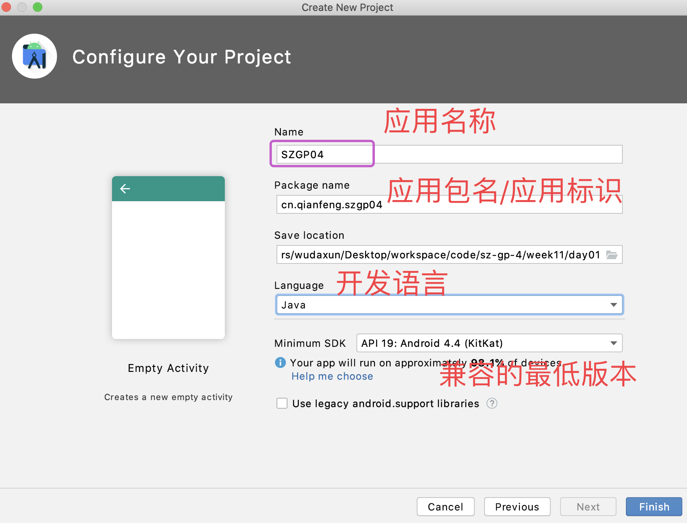

## 2.3 package name

应用的包名/应用的标识

每个应用都有一个唯一的 标识。 就是 package name

应用升级的依据（如果看似两个不同的项目，如果包名相同，后来的那个会替换掉前面的）

推送的依据（美团外卖，不可能推送到饿了么）


## 2.4 android项目的目录结构

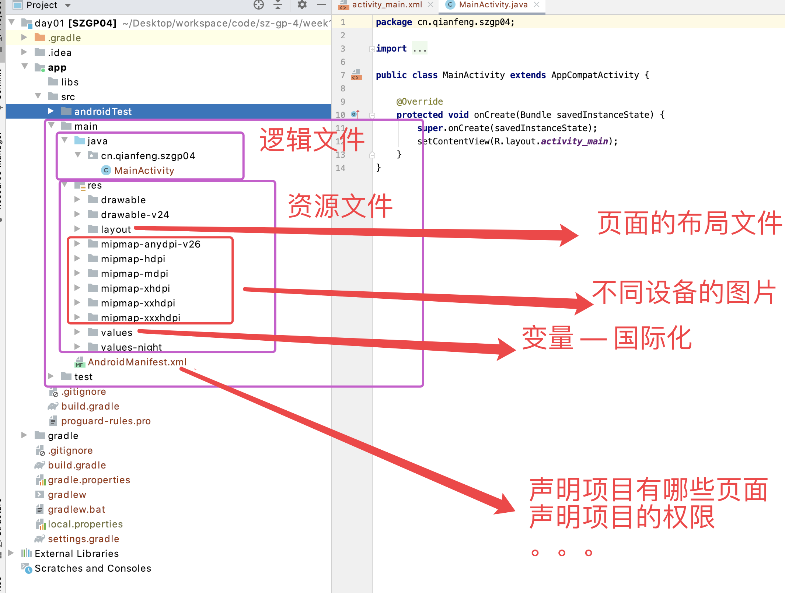


## 2.5 熟悉布局文件

Res/layout/activity_main.xml 主页面的布局文件

```xml
<?xml version="1.0" encoding="utf-8"?>
<androidx.constraintlayout.widget.ConstraintLayout xmlns:android="http://schemas.android.com/apk/res/android"
    xmlns:app="http://schemas.android.com/apk/res-auto"
    xmlns:tools="http://schemas.android.com/tools"
    android:layout_width="match_parent"
    android:layout_height="match_parent"
    tools:context=".MainActivity">

    <!--  android 线性布局  - 类似于弹性盒布局  -->
    <!--  match_parent   填充满父元素的宽高
          wrap_content   元素自身的包裹的宽高
          orientation
            horizontal  水平方向  默认
            vertical    垂直方向
          id             当前控件的id
      -->
    <LinearLayout
        android:orientation="vertical"
        android:layout_width="match_parent"
        android:layout_height="match_parent">

        <TextView
            android:layout_width="match_parent"
            android:layout_height="wrap_content"
            android:text="@string/app_test"></TextView>

        <Button
            android:id="@+id/testbtn"
            android:layout_width="match_parent"
            android:layout_height="wrap_content"
            android:text="@string/app_test_btn"></Button>
    </LinearLayout>
</androidx.constraintlayout.widget.ConstraintLayout>
```

## 2.6 给按钮添加一个点击事件

Src/main/java/cn.qianfeng.szgp04/MainActivity.java

```java
package cn.qianfeng.szgp04;

import androidx.appcompat.app.AppCompatActivity;

import android.os.Bundle;
import android.view.View;
import android.widget.Button;
import android.widget.Toast;

public class MainActivity extends AppCompatActivity {

    // 定义变量
    Button testbtn; // js  var testbtn;

    //  @Override  onCreate 方法重写了父类的方法
    @Override
    protected void onCreate(Bundle savedInstanceState) {
        super.onCreate(savedInstanceState); // 调用父类的 onCteate 方法
        // anrdroid 会将一些布局文件，以及 控件的id属性都 封装，封装到 R的对象
        // 如果是布局  R.layout
        // 如果是id   R.id
        setContentView(R.layout.activity_main); // 当前的这个文件对应的是哪一个布局文件

        // 拿到 按钮的节点   -------  获取DOM节点  testbtn = document.getElementById('testbtn')
        testbtn = (Button) findViewById(R.id.testbtn);

        // 按钮点击事件   -------   testbtn.addEventListener('click', () => {}, false)
        testbtn.setOnClickListener(new View.OnClickListener() {
            @Override
            public void onClick(View v) {
                Toast.makeText(MainActivity.this, "测试1111", Toast.LENGTH_SHORT).show();
            }
        });


    }
}

```

## 2.7 设计webview

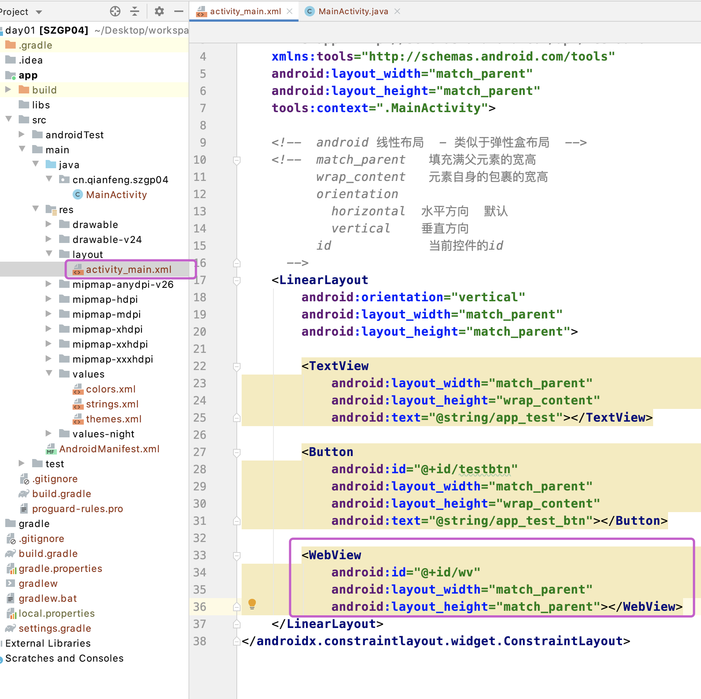

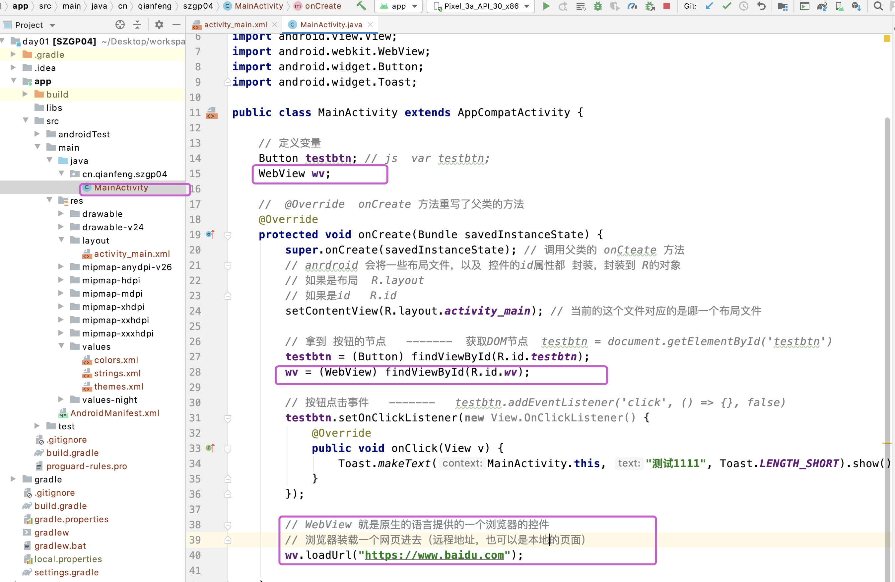

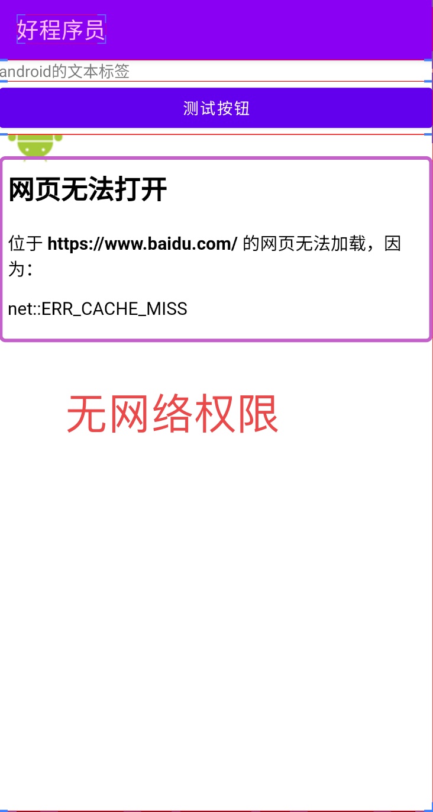

这是因为android默认没有网络权限，AndroidManifest.xml 文件中添加网络权限

```xml
<?xml version="1.0" encoding="utf-8"?>
<manifest xmlns:android="http://schemas.android.com/apk/res/android"
    package="cn.qianfeng.szgp04">

    <!--    添加网络访问的权限   -->
    <uses-permission android:name="android.permission.INTERNET"></uses-permission>

    <application
        android:allowBackup="true"
        android:icon="@mipmap/ic_launcher"
        android:label="@string/app_name"
        android:roundIcon="@mipmap/ic_launcher_round"
        android:supportsRtl="true"
        android:theme="@style/Theme.SZGP04">
        <activity android:name=".MainActivity">
            <intent-filter>
                <action android:name="android.intent.action.MAIN" />

                <category android:name="android.intent.category.LAUNCHER" />
            </intent-filter>
        </activity>
    </application>

</manifest>
```

再次运行，不会再报没有网络的错误，但是不一定能看到结果

## 2.8 配置webview

```java
package cn.qianfeng.szgp04;

import androidx.appcompat.app.AppCompatActivity;

import android.os.Bundle;
import android.view.View;
import android.webkit.WebView;
import android.widget.Button;
import android.widget.Toast;

public class MainActivity extends AppCompatActivity {

    // 定义变量
    Button testbtn; // js  var testbtn;
    WebView wv;

    //  @Override  onCreate 方法重写了父类的方法
    @Override
    protected void onCreate(Bundle savedInstanceState) {
        super.onCreate(savedInstanceState); // 调用父类的 onCteate 方法
        // anrdroid 会将一些布局文件，以及 控件的id属性都 封装，封装到 R的对象
        // 如果是布局  R.layout
        // 如果是id   R.id
        setContentView(R.layout.activity_main); // 当前的这个文件对应的是哪一个布局文件

        // 拿到 按钮的节点   -------  获取DOM节点  testbtn = document.getElementById('testbtn')
        testbtn = (Button) findViewById(R.id.testbtn);
        wv = (WebView) findViewById(R.id.wv);

        // 按钮点击事件   -------   testbtn.addEventListener('click', () => {}, false)
        testbtn.setOnClickListener(new View.OnClickListener() {
            @Override
            public void onClick(View v) {
                Toast.makeText(MainActivity.this, "测试1111", Toast.LENGTH_SHORT).show();
            }
        });

        // 配置webview
        // webview 就是浏览器，但是这个浏览器默认不支持js
        wv.getSettings().setJavaScriptEnabled(true);
        /* 设置为true时表示支持使用js打开新的窗口 */
        wv.getSettings().setJavaScriptCanOpenWindowsAutomatically(true);
        /* 当网页需要保存数时据,设置下面属性 */
        wv.getSettings().setDomStorageEnabled(true);
        /* 设置为使用webview推荐的窗口，主要是为了配合下一个属性 */
        wv.getSettings().setUseWideViewPort(true);
        /* 设置网页自适应屏幕大小，该属性必须和上一属性配合使用 */
        wv.getSettings().setLoadWithOverviewMode(true);
        /* 启用H5的地理定位服务 */
        wv.getSettings().setGeolocationEnabled(true);
        /* 设置是否允许webview使用缩放的功能 */
        wv.getSettings().setBuiltInZoomControls(false);
        /* 设置是否显示水平滚动条 */
        wv.setHorizontalScrollBarEnabled(false);
        /* 设置垂直滚动条是否有叠加样式 */
        wv.setVerticalScrollbarOverlay(true);
        /* 设置滚动条的样式 */
        wv.setScrollBarStyle(WebView.SCROLLBARS_OUTSIDE_OVERLAY);

        // WebView 就是原生的语言提供的一个浏览器的控件
        // 浏览器装载一个网页进去（远程地址，也可以是本地的页面）
        wv.loadUrl("https://m.jd.com");

    }
}
```

## 2.9 设置WebViewClient

// src/main/java/cn.qianfeng.szgp04/MWebViewClient.java

```java
package cn.qianfeng.szgp04;

import android.content.Context;
import android.graphics.Bitmap;
import android.net.http.SslError;
import android.webkit.SslErrorHandler;
import android.webkit.WebResourceRequest;
import android.webkit.WebView;
import android.webkit.WebViewClient;

public class MWebViewClient extends WebViewClient {

    private WebView webView;
    private Context context;
    // 重载  
    public MWebViewClient(WebView webView) {
        super();
        this.webView = webView;
    }

    public MWebViewClient(WebView webView, Context context) {
        super();
        this.webView = webView;
        this.context = context;
    }

    @Override
    public boolean shouldOverrideUrlLoading(WebView view, WebResourceRequest request) {
        return super.shouldOverrideUrlLoading(view, request);
    }

    @Override
    public void onPageStarted(WebView view, String url, Bitmap favicon) {
        super.onPageStarted(view, url, favicon);
    }

    @Override
    public void onPageFinished(WebView view, String url) {
        super.onPageFinished(view, url);
    }

    @Override
    public void onLoadResource(WebView view, String url) {
        super.onLoadResource(view, url);
    }

    @Override
    public void onReceivedSslError(WebView view, SslErrorHandler handler, SslError error) {
        super.onReceivedSslError(view, handler, error);
    }

}

```

MainActivity.java

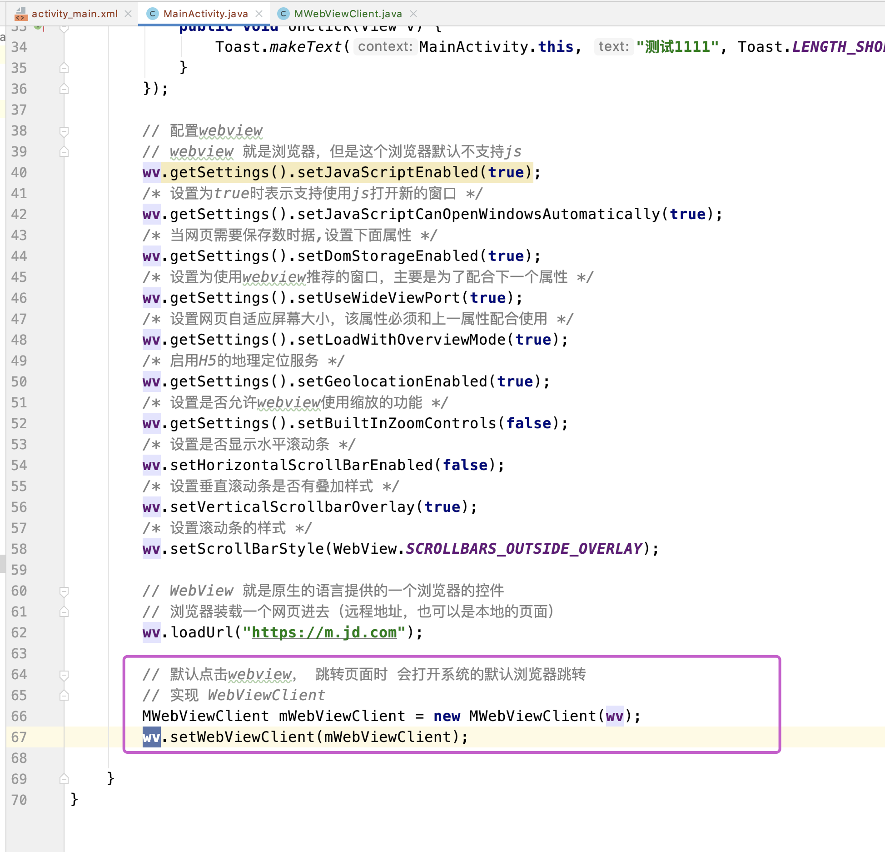

# 3.加载本地的网页

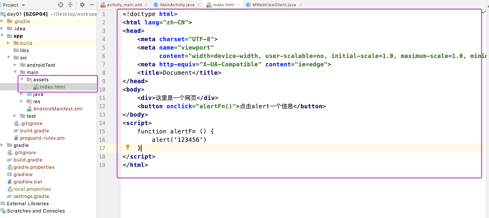

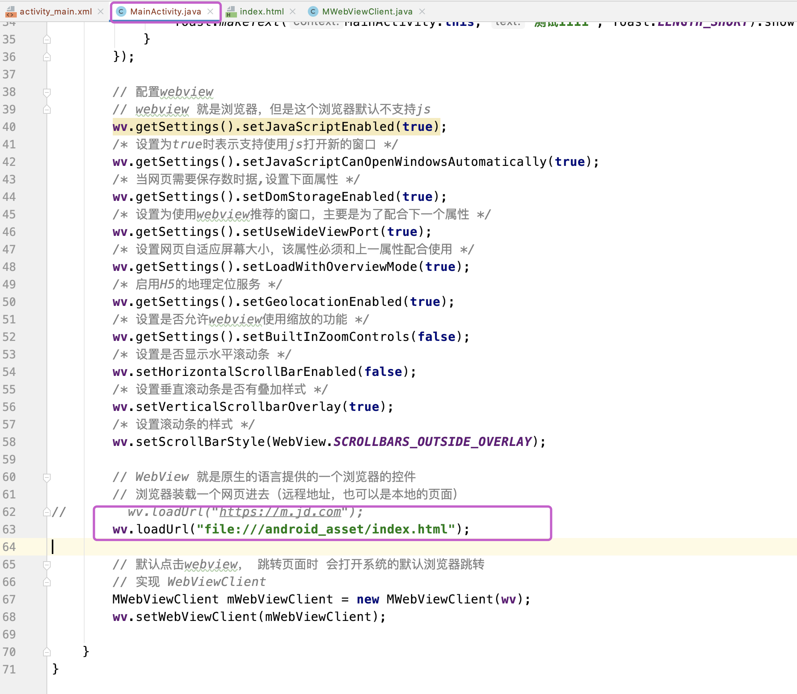

此时运行代码发现，点击按钮时alert无法生效

Src/main/java/cn.qianfeng.szgp04/MWebViewChromeClient.java

```java
package cn.qianfeng.szgp04;

import android.content.Context;
import android.graphics.Bitmap;
import android.webkit.JsPromptResult;
import android.webkit.JsResult;
import android.webkit.WebChromeClient;
import android.webkit.WebView;

public class MWebViewChromeClient extends WebChromeClient {
    private Context context;
    public MWebViewChromeClient(Context context) {
        super();
        this.context = context;
    }

    @Override
    public void onProgressChanged(WebView view, int newProgress) {
        super.onProgressChanged(view, newProgress);
    }

    @Override
    public void onReceivedTitle(WebView view, String title) {
        super.onReceivedTitle(view, title);
    }

    @Override
    public void onReceivedIcon(WebView view, Bitmap icon) {
        super.onReceivedIcon(view, icon);
    }

    @Override
    public boolean onJsAlert(WebView view, String url, String message, JsResult result) {
        return super.onJsAlert(view, url, message, result);
    }

    @Override
    public boolean onJsConfirm(WebView view, String url, String message, JsResult result) {
        return super.onJsConfirm(view, url, message, result);
    }

    @Override
    public boolean onJsPrompt(WebView view, String url, String message, String defaultValue, JsPromptResult result) {
        return super.onJsPrompt(view, url, message, defaultValue, result);
    }
}

```

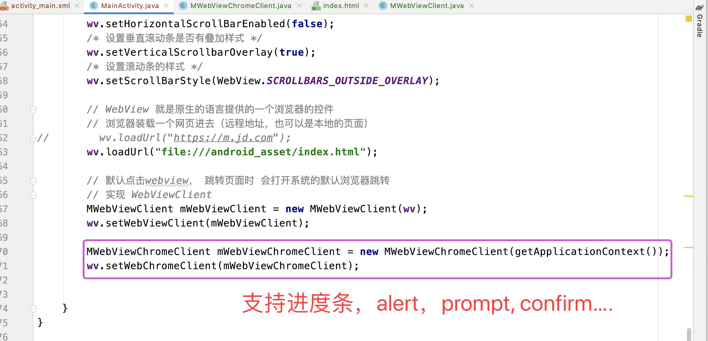

此时再次点击按钮，可以alert信息了

# 4.android设计接口供js调用

```java
package cn.qianfeng.szgp04;

import androidx.appcompat.app.AppCompatActivity;

import android.annotation.SuppressLint;
import android.content.Context;
import android.os.Bundle;
import android.view.View;
import android.webkit.JavascriptInterface;
import android.webkit.WebView;
import android.widget.Button;
import android.widget.Toast;

public class MainActivity extends AppCompatActivity {

    // 定义变量
    Button testbtn; // js  var testbtn;
    WebView wv;

    //  @Override  onCreate 方法重写了父类的方法
    @Override
    protected void onCreate(Bundle savedInstanceState) {
        super.onCreate(savedInstanceState); // 调用父类的 onCteate 方法
        // anrdroid 会将一些布局文件，以及 控件的id属性都 封装，封装到 R的对象
        // 如果是布局  R.layout
        // 如果是id   R.id
        setContentView(R.layout.activity_main); // 当前的这个文件对应的是哪一个布局文件

        // 拿到 按钮的节点   -------  获取DOM节点  testbtn = document.getElementById('testbtn')
        testbtn = (Button) findViewById(R.id.testbtn);
        wv = (WebView) findViewById(R.id.wv);

        // 按钮点击事件   -------   testbtn.addEventListener('click', () => {}, false)
        testbtn.setOnClickListener(new View.OnClickListener() {
            @Override
            public void onClick(View v) {
                Toast.makeText(MainActivity.this, "测试1111", Toast.LENGTH_SHORT).show();
            }
        });

        // 配置webview
        // webview 就是浏览器，但是这个浏览器默认不支持js
        wv.getSettings().setJavaScriptEnabled(true);
        /* 设置为true时表示支持使用js打开新的窗口 */
        wv.getSettings().setJavaScriptCanOpenWindowsAutomatically(true);
        /* 当网页需要保存数时据,设置下面属性 */
        wv.getSettings().setDomStorageEnabled(true);
        /* 设置为使用webview推荐的窗口，主要是为了配合下一个属性 */
        wv.getSettings().setUseWideViewPort(true);
        /* 设置网页自适应屏幕大小，该属性必须和上一属性配合使用 */
        wv.getSettings().setLoadWithOverviewMode(true);
        /* 启用H5的地理定位服务 */
        wv.getSettings().setGeolocationEnabled(true);
        /* 设置是否允许webview使用缩放的功能 */
        wv.getSettings().setBuiltInZoomControls(false);
        /* 设置是否显示水平滚动条 */
        wv.setHorizontalScrollBarEnabled(false);
        /* 设置垂直滚动条是否有叠加样式 */
        wv.setVerticalScrollbarOverlay(true);
        /* 设置滚动条的样式 */
        wv.setScrollBarStyle(WebView.SCROLLBARS_OUTSIDE_OVERLAY);

        // WebView 就是原生的语言提供的一个浏览器的控件
        // 浏览器装载一个网页进去（远程地址，也可以是本地的页面）
//        wv.loadUrl("https://m.jd.com");
        wv.loadUrl("file:///android_asset/index.html");

        // 默认点击webview， 跳转页面时 会打开系统的默认浏览器跳转
        // 实现 WebViewClient
        MWebViewClient mWebViewClient = new MWebViewClient(wv);
        wv.setWebViewClient(mWebViewClient);

        MWebViewChromeClient mWebViewChromeClient = new MWebViewChromeClient(getApplicationContext());
        wv.setWebChromeClient(mWebViewChromeClient);

        // 因为js无法调用系统的功能，由android 定义好，js调用
        wv.addJavascriptInterface(new MyInterface(getApplicationContext()), "wx");

    }
		// 自定义的android接口
    private class MyInterface {
        private Context context;
        public MyInterface(Context context) {
            super();
            this.context = context;
        }
        @JavascriptInterface
        public void toast (String str) {
            Toast.makeText(MainActivity.this, str, Toast.LENGTH_SHORT).show();
        }

        @JavascriptInterface
        public void takePhoto () {
            // 拍照的业务逻辑
            Toast.makeText(MainActivity.this, "拍照", Toast.LENGTH_SHORT).show();
        }
    }
}
```

```html
<!doctype html>
<html lang="zh-CN">
<head>
    <meta charset="UTF-8">
    <meta name="viewport"
          content="width=device-width, user-scalable=no, initial-scale=1.0, maximum-scale=1.0, minimum-scale=1.0">
    <meta http-equiv="X-UA-Compatible" content="ie=edge">
    <title>Document</title>
</head>
<body>
    <div>这里是一个网页</div>
    <button onclick="alertFn()">点击alert一个信息</button>
    <button onclick="useAndroidfn()">调用android的方法</button>
    <button onclick="useTakePhoto()">拍照</button>
</body>
<script>
    function alertFn () {
        alert('123456')
    }
    function useAndroidfn () {
        window.wx.toast('这里是js的打印')
    }
    function useTakePhoto () {
        window.wx.takePhoto()
    }
</script>
</html>
```

# 5.js提供接口供android使用

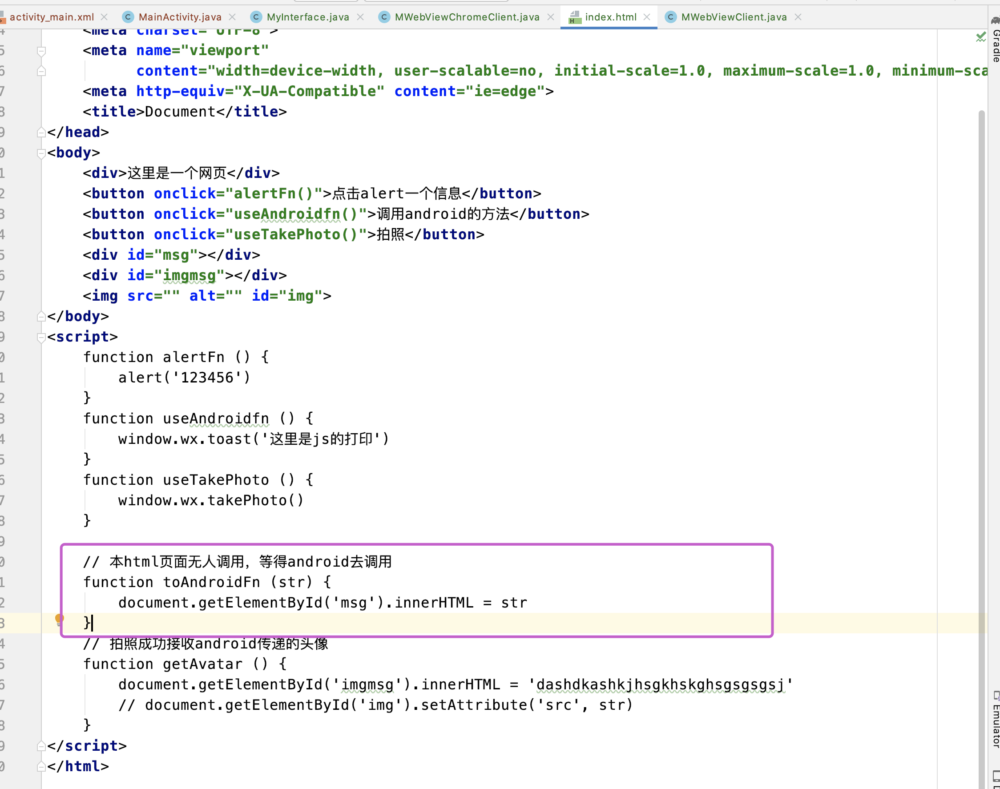

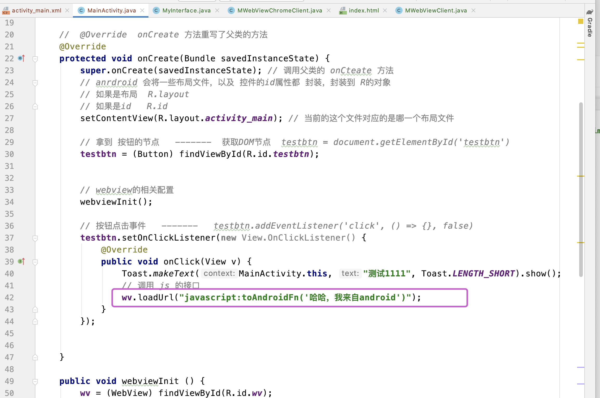


# 6.总结 jsBridage

webview  --- android、ios的组件 ---- js运行的环境

​     进行配置

​         --- 支持js

​         --- 链接本组件内跳转

根据需求先写页面，假设你的一个按钮需要调用系统的功能，在你的按钮事件中调用由android工程师提供的相对应的对象和其方法即可，同时前端也会定义一些方法，但是前端自己不调用，android会根据webview的loadUrl方法进行调用，并且传参（根据需求看）


如果将使用的对象和方法经过二次封装，依托于某些平台，那么就可以不需要写android或者ios，平台会包含这些底层代码，我们只需要在调用时，通过回调函数的形式即可拿到想要的数据

-----rn  拍照。 ---- 回调。---- 图片的地址。 --- 依托于。rn

----minpro 头像 --- wx.chooseImage  ---- 回调。--- 图片地址 --- 依托于 小程序


# 7.代码优化

```java
package cn.qianfeng.szgp04;

import androidx.appcompat.app.AppCompatActivity;

import android.annotation.SuppressLint;
import android.content.Context;
import android.os.Bundle;
import android.view.View;
import android.webkit.JavascriptInterface;
import android.webkit.WebView;
import android.widget.Button;
import android.widget.Toast;

public class MainActivity extends AppCompatActivity {

    // 定义变量
    Button testbtn; // js  var testbtn;
    WebView wv;

    //  @Override  onCreate 方法重写了父类的方法
    @Override
    protected void onCreate(Bundle savedInstanceState) {
        super.onCreate(savedInstanceState); // 调用父类的 onCteate 方法
        // anrdroid 会将一些布局文件，以及 控件的id属性都 封装，封装到 R的对象
        // 如果是布局  R.layout
        // 如果是id   R.id
        setContentView(R.layout.activity_main); // 当前的这个文件对应的是哪一个布局文件

        // 拿到 按钮的节点   -------  获取DOM节点  testbtn = document.getElementById('testbtn')
        testbtn = (Button) findViewById(R.id.testbtn);


        // webview的相关配置
        webviewInit();

        // 按钮点击事件   -------   testbtn.addEventListener('click', () => {}, false)
        testbtn.setOnClickListener(new View.OnClickListener() {
            @Override
            public void onClick(View v) {
                Toast.makeText(MainActivity.this, "测试1111", Toast.LENGTH_SHORT).show();
                // 调用 js 的接口
                wv.loadUrl("javascript:toAndroidFn('哈哈，我来自android')");
            }
        });


    }

    public void webviewInit () {
        wv = (WebView) findViewById(R.id.wv);
        // 配置webview
        // webview 就是浏览器，但是这个浏览器默认不支持js
        wv.getSettings().setJavaScriptEnabled(true);
        /* 设置为true时表示支持使用js打开新的窗口 */
        wv.getSettings().setJavaScriptCanOpenWindowsAutomatically(true);
        /* 当网页需要保存数时据,设置下面属性 */
        wv.getSettings().setDomStorageEnabled(true);
        /* 设置为使用webview推荐的窗口，主要是为了配合下一个属性 */
        wv.getSettings().setUseWideViewPort(true);
        /* 设置网页自适应屏幕大小，该属性必须和上一属性配合使用 */
        wv.getSettings().setLoadWithOverviewMode(true);
        /* 启用H5的地理定位服务 */
        wv.getSettings().setGeolocationEnabled(true);
        /* 设置是否允许webview使用缩放的功能 */
        wv.getSettings().setBuiltInZoomControls(false);
        /* 设置是否显示水平滚动条 */
        wv.setHorizontalScrollBarEnabled(false);
        /* 设置垂直滚动条是否有叠加样式 */
        wv.setVerticalScrollbarOverlay(true);
        /* 设置滚动条的样式 */
        wv.setScrollBarStyle(WebView.SCROLLBARS_OUTSIDE_OVERLAY);

        // WebView 就是原生的语言提供的一个浏览器的控件
        // 浏览器装载一个网页进去（远程地址，也可以是本地的页面）
//        wv.loadUrl("https://m.jd.com");
        wv.loadUrl("file:///android_asset/index.html");

        // 默认点击webview， 跳转页面时 会打开系统的默认浏览器跳转
        // 实现 WebViewClient
        MWebViewClient mWebViewClient = new MWebViewClient(wv);
        wv.setWebViewClient(mWebViewClient);

        MWebViewChromeClient mWebViewChromeClient = new MWebViewChromeClient(getApplicationContext());
        wv.setWebChromeClient(mWebViewChromeClient);

        // 因为js无法调用系统的功能，由android 定义好，js调用
        wv.addJavascriptInterface(new MyInterface(wv, getApplicationContext()), "wx");
    }


}
```

```java
package cn.qianfeng.szgp04;

import android.content.Context;
import android.webkit.JavascriptInterface;
import android.webkit.WebView;
import android.widget.Toast;

import android.content.Context;
import android.webkit.JavascriptInterface;
import android.webkit.WebView;
import android.widget.Toast;

import java.util.logging.Handler;

public class MyInterface {
    private Context context;
    private WebView wv;

    public MyInterface(WebView wv, Context context) {
        this.context = context;
        this.wv = wv;
    }

    @JavascriptInterface
    public void toast(String str) {
        Toast.makeText(context, str, Toast.LENGTH_SHORT).show();
    }

    @JavascriptInterface
    public void takePhoto() {
        // 拍照的业务逻辑
//        Toast.makeText(context, "拍照", Toast.LENGTH_SHORT).show();
//        wv.loadUrl("javascript:getAvatar()");
        wv.post(new Runnable() {
            @Override
            public void run() {
                Toast.makeText(context, "拍照", Toast.LENGTH_SHORT).show();
                wv.loadUrl("javascript:getAvatar()");
            }
        });


    }
}


```

